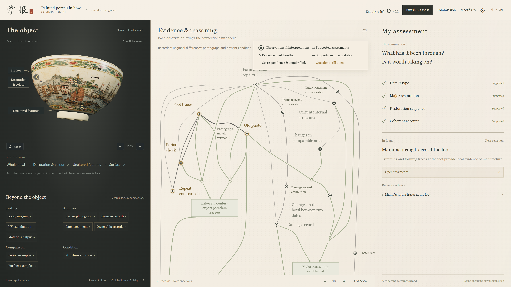

# 掌眼 · Zhangyan

**An antique appraisal game about building an account from incomplete evidence.**

Rotate a porcelain bowl, investigate its materials and records, and follow the connections that emerge between what you know. Decide when you have enough evidence to stop.

Individual internship project · Game systems, interaction design and visual direction · AI-assisted implementation and visual exploration

[中文说明](README.zh-CN.md) · [Selected portfolio evidence](docs/portfolio/README.md) · [Source and repository guide](docs/REPOSITORY-GUIDE.md)

*A late-session view of the running prototype. Selecting evidence highlights its relationships while the map retains its spatial structure.*

## Experience the prototype

The current V3 is a **desktop browser prototype in Chinese and English**. Product development closed on 14 September 2026 at checkpoint [`3fe5704`](https://github.com/NomuTsuki/zhangyan/commit/3fe5704dd3724ba547311976281865e5467068fb); portfolio presentation is the next phase.

- **Play locally:** download the [self-contained game file](docs/project/evidence/v3-design/validation/workbench-hifi-v0/prototype.html?raw=1) and open it in desktop Edge or Chrome. No Node.js or local server is needed. Switch language with **中 / EN**.
- **Explore the design:** start with the [curated images and short process clips](docs/portfolio/README.md).
- **Understand the controls:** see the [short playing guide](README.zh-CN.md#如何试玩). Opening an HTML file on GitHub displays repository content; it is not the hosted game.

A public playable URL and an edited project film have not been published. The proposed presentation is a short English film with an optional desktop play link.

## The design question

How can a game help players hold a long investigation in mind without turning it into a checklist of answers?

Zhangyan separates the object's fixed history from the player's gradually revealed knowledge. An observation can be acquired before its relevance becomes clear. A later verification may connect it to an existing explanation; acquiring something and knowing what it supports are separate events.

Three choices shape the experience:

- **Inspect the object directly.** Rotate the bowl to reveal investigation points; use archives, comparisons and tests beyond the object.
- **Build spatial memory.** Known information keeps its position. Questions extend from known places, and subsequent evidence connects along those roads.
- **Retain the decision to stop.** Four assessment areas summarise the current evidence. The player can review the basis for a judgment and finish with some questions unresolved.

An investigation travels from its chosen action to the map. The camera approaches the new information, then pulls back as its relationships connect. This feedback shows both where the discovery arrived and how it changes the larger account.

## Scope and authorship

The playable case includes one fictional export-porcelain bowl, 22 investigation methods, evidence review, map navigation, investigation history and manual assessment. React, TypeScript and Three.js run in a self-contained HTML file, with rule computation in an inline Worker.

V3 does not include the earlier visitor negotiation loop, a completed market/economy, or a mobile layout. V1 and V2 remain preserved as historical prototypes.

The author directed the game and interaction design and evaluated successive prototypes. Implementation used AI coding assistance. The bowl's painted texture was generated with GPT Image; historical images and testing views are synthetic game materials. [Material provenance](docs/project/evidence/v3-design/validation/workbench-hifi-v0/src/assets/README.md) records their source.

## Evidence and development

The final checkpoint has recorded rule, interaction, bilingual and map-rendering checks. These establish the covered implementation behaviour; they do not constitute a general first-time-player study or expert validation of antique-appraisal knowledge.

- [Final map revision and verification scope](docs/project/evidence/v3-design/validation/workbench-hifi-v0/VERIFICATION-NODE-LABELS-2026-09-13.md)
- [Map source, build commands and historical versions](docs/REPOSITORY-GUIDE.md)
- [Project state and author decisions](docs/project/02-CURRENT-STATE.md)

The longer V1/V2 overview is preserved in the [previous README at checkpoint 3fe5704](https://github.com/NomuTsuki/zhangyan/blob/3fe5704dd3724ba547311976281865e5467068fb/README.md).
