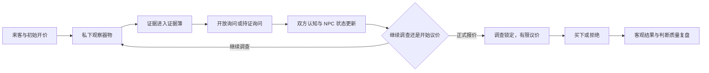
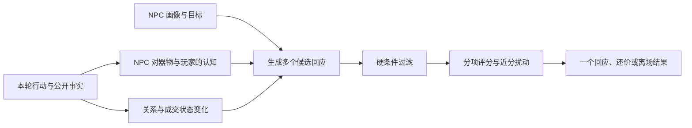

# 《掌眼》V1/V2 项目说明与仓库入口

《掌眼》是一款面向手机竖屏的古玩鉴定与交易决策游戏。玩家在有限调查资源与信息不对称中观察器物、询问来客、选择是否公开证据、进行有限议价，并在交易结束后同时复盘客观经营结果和判断过程。

本仓库已封存 **V1 教师演示版**，并在独立 V2 工作树中生成了不含教师/开发表面的 **V2 玩家试玩版**。V2 的产品范围到此结束：冻结批次完成后由 `v2.0.0-player-prototype-freeze` 标记这个可运行、可回放的玩家试玩底座；标签是否已经创建以 Git 现场为准。真正的物品真相拓扑与玩家推断进入独立 V3 设计阶段。低保真单文件只保留作历史与调试对照，数值实验台只用于参数实验。

## 从哪里开始

| 目的 | 入口 |
|---|---|
| 我想用几分钟理解项目现在在做什么（推荐） | [`docs/project/overview/00-START-HERE.md`](docs/project/overview/00-START-HERE.md) |
| 给老师阅读和演示 | [`docs/teacher/00_请先看.txt`](docs/teacher/00_请先看.txt) |
| 直接打开正式游戏演示 | [`掌眼_高保真教师演示.html`](掌眼_Codex启动包_v2/掌眼_Codex启动包_v2/prototype/public/掌眼_高保真教师演示.html) |
| 直接试玩 V2 玩家版 | [`掌眼_V2_玩家试玩版.html`](掌眼_Codex启动包_v2/掌眼_Codex启动包_v2/prototype/public/掌眼_V2_玩家试玩版.html) |
| 查看 V2 首案开发诊断面 | [`掌眼_V2_高保真演示.html`](掌眼_Codex启动包_v2/掌眼_Codex启动包_v2/prototype/public/掌眼_V2_高保真演示.html) |
| 查看项目当前事实 | [`docs/project/02-CURRENT-STATE.md`](docs/project/02-CURRENT-STATE.md) |
| 查看 V2 冻结边界与 V3 交接 | [`docs/project/03-NEXT-ACTIONS.md`](docs/project/03-NEXT-ACTIONS.md) |
| 查看正式交付白名单 | [`release/v1-teacher-handoff.json`](release/v1-teacher-handoff.json) |

正式演示 HTML 已将样式、脚本与插画全部内联，解压后可直接用现代浏览器打开，无需联网、安装 Node.js 或运行服务器。

## 项目要解决的问题

《掌眼》不是“看表情猜真假”，也不是一次真假二选一。它希望让玩家体验：

- 局部证据只能支持局部判断，结论需要由多条信息逐步收敛；
- 玩家与 NPC 都可能因知识、记忆和信息范围而真诚地判断错误；
- 玩家可以选择不公开私有信息，但一旦拿具体证据询问，证据会成为双方共享事实；
- 公开证据既可能补全关键链条，也可能让 NPC 重新估值，因而是一项有代价的承诺；
- 最终结果既看是否赚到钱、压下多少价格，也看玩家在当时可见信息下的判断是否合理。

当前优先级依次是：**玩法完整度 → 视觉效果 → 技术实现 → 文化内容**。V1 用一个低级场教学案验证完整闭环，不声称已经完成长期数值平衡或大规模内容生产。

## 核心循环



调查与询问交叉进行，共享同一调查行动点；正式报价开始后，调查被锁定，转入独立的议价容量。即使两种资源耗尽，买下或拒绝仍然可达，不会出现无法结束一局的死锁。

## 四层信息边界

| 信息层 | 谁能读取 | 作用 |
|---|---|---|
| 物品客观真相 | 规则核心；局末才向玩家解锁 | 决定真实价值、客观观察结果和最终经营得失 |
| 玩家私有证据与器物后验 | 玩家与规则核心 | 支撑玩家的器物判断与估值；不会自动改变 NPC 的器物认知 |
| NPC 私有器物认知与器物后验 | NPC 决策系统与局末调试 | 决定初始开价、解释倾向和重估；NPC 不能偷看物品真相 |
| 共享证据 | 玩家、NPC 与规则核心 | 由持证询问或共同检测产生，允许双方重新解释同一事实 |

这张表只描述双方如何接触**器物信息**，不是完整的人物模型。玩家还会根据 NPC 表现形成对人物的判断；NPC 也只能根据玩家已经表现出来的提问、证据使用和报价形成可能出错的临时判断。

NPC 可以真诚地误记或误判。DEC-014 仅批准未来在受控 NPC 情境中加入可审计的选择性披露或潜在误导，不允许任意说谎或读取隐藏真相。玩家也无需把所有私有证据都告诉 NPC；选择公开哪条真实证据，本身就会同时影响器物认知和双方对彼此的理解。

## 五个开发责任区怎样相连

这些责任区按因果分账，但不是互不相干的五套程序；它们可以共用证据、概率、回放和审计工具。

### 调查行动点

用于观察、询问和检测。它迫使玩家在“扩大搜索范围”和“补全已有证据链”之间选择。重复观察会消耗资源，但不会复制证据。

### 证据与器物后验判断

证据不是自动判真的答案，而是对不同器物真相假设提供强弱不一的支持。规则分别维护玩家侧与 NPC 侧的器物后验，且重复来源只计权一次；双方共用计算方法，不共用证据账本或答案。

### 双向人物认知

玩家根据 NPC 的主张、动作和停顿形成自己的判断，并在关键节点明确提交；系统不替真人玩家定义内心。NPC 则根据玩家已经表现的证据使用、提问、报价和履约行为，判断其专业度、成交认真度和沟通策略。这些人物判断不能直接改写器物真相。

### NPC 画像、局内状态与纺锤决策

NPC 画像描述相对稳定的能力、目标和风险态度；信任、压力、成交意愿和控制感描述当前局势。小型状态机管理交谈、戒备、议价和离场等宏观阶段；纺锤在当前阶段生成候选回应、硬过滤、分项评分并收敛为一个可复现的动作或回复。



这种“先发散、再收敛”的结构允许剧情有变化，又避免系统无限生成不可控分支。精确公式和候选记录只在桌面开发栏与局末调试中展示，不塞进手机玩家界面。

### 价格与议价

NPC 初始开价只是一个带偏差的信息源，不是唯一价格锚点。NPC 也承担信息不对称风险：不同专业程度、性格和私有认知可能造成高估、低估或无法稳定开价。公开证据可跨越重估门槛并触发可解释的正式改价；微小情绪变化不会让价格每一步无故抖动。

正式报价消耗独立议价容量。NPC 可以接受、还价、拒绝或离场；玩家始终可以接受当前价格或拒绝交易。V1 规则核心保留特定条件下的风险转移行为，但正式高保真主流程没有把它设为常驻主按钮。

### 多维复盘

V1 不再使用“任何盈利成交都可能满分”的旧 0—100 客观分。结算分别展示：

- 器物品质：隐藏真相对应的客观品质；
- 净收益：真实价值减成交价与本局已发生成本；
- 议价表现：实际成交条件相对独立经营基准的表现；
- 判断质量：只根据玩家当时可见信息评价推理质量，并受证据覆盖上限约束；
- 综合等级：将上述维度汇总为 `D—SSS`，但保留分项解释，避免一个总分掩盖原因。

单条强证据不再因为“碰巧命中”直接获得 `SSS`。固定真相决定客观结果，随机种子只改变规则允许的局部变化和幸运证据，不会改写隐藏真相。

## V1 教师演示包含什么

首案为“漆木首饰盒”，默认演示路径包含：

1. 接下器物并观察接口；
2. 取得并收录“现代胶痕”；
3. 用该证据询问修复历史；
4. 观察 NPC 因共享事实将要价从 `80` 重估为 `65`；
5. 进入交易并报价 `50`；
6. 观察 NPC 还价 `58`；
7. 买下或拒绝，查看多维复盘；
8. 局末展开开发栏查看精确数值、公式与因果轨迹。

`80 → 65 → 58` 是一条便于讲解机制的演示路径，不是数值已经平衡的证明。偏离推荐路线会得到不同信息、状态和结果。

## 视觉与交互边界

- 玩家区域按手机竖屏设计，桌面宽屏额外提供教师说明和可收起开发栏；移动端隐藏这些开发内容；
- 器物采用“当代雅集式”二维插画建立位置、材质和氛围；
- 微观胶痕、细纹、标记、锁扣等鉴定事实由文字证据承担，不强迫玩家从像素猜结论；
- 精品、珍品未来可在结算后增加写实风格器物讲解图；V1 的低价值教学案不为此投入正式美术成本；
- 证据簿是只读信息仓库，不在其中提供推进交易的行动按钮。

## 技术与交付路线

最终载体已经确认是通过微信聊天或公众号链接打开的普通响应式 Web/H5，不是需要 AppID 和小游戏审核的“微信小游戏”。V1 使用 TypeScript、React 和标准 Web 构建工具；Unity/团结引擎不是必经步骤。

当前 V1 交付是离线自包含 HTML。它证明核心交互可在浏览器运行，但不等同于已经完成 HTTPS 托管、微信内置浏览器实机、登录、存档、生产 API 或线上运营。

## 五份可运行 HTML 的权威等级

| 文件 | 身份 | 当前关注级别 |
|---|---|---|
| `掌眼_V2_玩家试玩版.html` | V2 独立玩家入口，三案例、稳定局号与双轨复盘 | 玩家产品首要关注 |
| `掌眼_V2_高保真演示.html` | V2 非公开首案开发／诊断运行时；当前文件来自较早构建检查点 | 技术诊断参考；不能替代当前玩家版 |
| `掌眼_高保真教师演示.html` | V1 唯一 canonical 正式演示 | 冻结参考；不进入当前数值决策 |
| `掌眼_低保真交互原型.html` | 历史规则定位与调试快照，部分语义已落后 | 历史回看，当前可忽略 |
| `掌眼_数值实验台.html` | V1 时期隔离批量实验模型，结论仍属工作假设 | 旧假设参考；不是当前生产数值 |

V1 机器可读边界见 [`release/v1-teacher-handoff.json`](release/v1-teacher-handoff.json)，V2 开发运行时身份见 [`release/v2-development.json`](release/v2-development.json)，当前盘点见 [`EXP-024`](docs/project/evidence/EXP-024-current-checkpoint-and-public-html-inventory.md)。正式教师包采用严格五文件白名单；完整源码另从冻结标签导出，不与演示包混装。

## 仓库结构

```text
docs/project/                         项目方向、当前状态、决定、挑战与验证证据
docs/teacher/                         面向老师的项目说明与演示说明源文件
docs/superpowers/                     本次收口的设计规格和执行计划
release/v1-teacher-handoff.json       V1 正式发布白名单与权威边界
掌眼_Codex启动包_v2/掌眼_Codex启动包_v2/
  prototype/
    content/                          首案配置
    game/                             TypeScript 规则核心、议价与结算
    hifi/                             正式高保真界面源文件
    player/                           V2 独立玩家界面源文件
    public/                           可直接打开的自包含 HTML
    tests/                            规则、生成物、流程、呈现与无障碍回归
```

内层启动包中的早期文档保留了项目形成过程，部分内容已过时；当前事实以根目录本说明、`docs/project/` 与发布清单为准。

## 本地开发与验证

开发命令在原型目录执行：

```powershell
cd 掌眼_Codex启动包_v2/掌眼_Codex启动包_v2/prototype
npm.cmd ci
npm.cmd test
npx.cmd tsc --noEmit
npm.cmd run lint
```

常用入口：

```powershell
npm.cmd run dev:hifi
npm.cmd run build:hifi
npm.cmd run build:player
```

自动化回归验证的是代码对已写明规则的遵守、构建产物的自包含性、关键流程的可达性、呈现契约和基础无障碍。它不自动证明参数“好玩”、概率分布合理、文化内容准确或一般玩家能够无讲解理解；这些需要批量模拟、专家校订和分层真人试玩分别验证。

## V1/V2 已知边界

V1 有意保留以下边界：

- 只有一个偏简单的低级场教学案；
- 数值阈值、NPC 权重、费用和概率尚未经过足量玩家验证；
- 低保真、实验台、生产规则和生成物仍存在多处数值定义来源；
- 公开托管、微信内置浏览器、Safari、极窄屏、软键盘和真实设备 safe-area 尚待验证；
- 当前插画不是最终量产美术，文化与器物知识尚需专家校订。

V2 已从明确的 V1 冻结点启动，并完成统一数值权威、三案例玩家试玩版与能力／客观结果双轨结算。V2 不再承担新的产品主线；它没有实现物品真相拓扑、完整玩家推断工作台、双方人物认知、D20 或长期平衡。上述方向只有进入 V3 后被新 Decision 明确采用，才成为当前规格。现有完成状态也不代表文化准确、一般玩家趣味、视觉完成或正式发布已经验证。

更细的已实现/已验证/尚未验证区分见 [`docs/project/02-CURRENT-STATE.md`](docs/project/02-CURRENT-STATE.md)。
