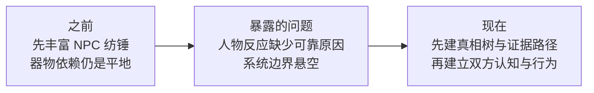

# V2 过程候选：从 NPC 纺锤到共同现实与双向认知

日期：2026-08-13

状态：私有、轻量、待策展的作品集过程候选；不是最终 PDF 页面，也不是产品完成证明。

## 为什么记录

这次讨论真正改变的不是增加了多少功能，而是找到了正确依赖顺序：复杂 NPC 必须建立在可解释的器物真相、证据路径和信息可见性之上。否则再丰富的信任、说谎、议价和状态变化也只是作者随手调数。

## 原先怎样

- 设计注意力主要集中在 NPC 纺锤如何发散候选、评分并收敛成回应；
- 器物侧仍是“三种真相＋平铺线索”，没有明确证据前置、并行替代、断链或可见性；
- 玩家对 NPC、NPC 对玩家的理解，以及关系和成交意愿，容易被压成一条“好感度”式因果。

## 现在怎样

- 先建立双方共同面对的客观真相与证据拓扑；
- 玩家和 NPC 各保留“怎样理解器物、怎样理解对方”两张地图；
- 器物估值、人物认知、关系状态与成交意愿分账；
- NPC 行为采用“小型阶段状态机＋连续状态＋信念／人物模型＋纺锤仲裁＋条件故事片段”的混合结构；
- 开发仍按五个责任区推进，不增加两套孤立引擎。

## 什么没有完成

- 漆器证据拓扑尚未进入产品实现；
- NPC 对玩家的认知账本、完整画像、连续对话、D20 和程序化生成均未实现；
- 尚未证明文化准确性、数值平衡或真人趣味。

## 未来怎么用于作品集

- 最终 PDF 最多使用为一个“设计转折”节点，不展示连续开发切片；
- 只保留上面的前后变化、一个关键因果例子和一张简图；
- 必须与后续真实可玩成果、最终界面截图或验证结果配对，不能单独呈现为半成品；
- 在“两部分游戏”范围确定、首个真相／证据切片落地后再判断是否采用，不提前制作正式页面。

完整讨论原文、来源哈希与架构依据见 [EXP-027](../../project/evidence/EXP-027-bidirectional-cognition-design-turning-point.md)。
