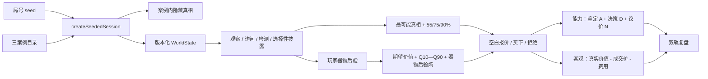
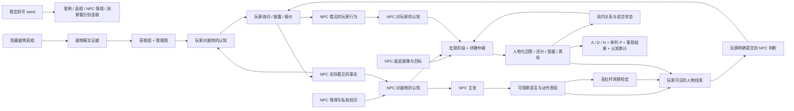
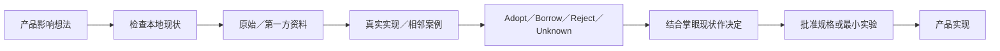

# System Map

> 描述项目当前的整体理解、职责边界和关键流动，不展开逐文件施工细节。

最后复查：2026-08-14（V2 as-built）

## 版本边界

本图只描述 V2 冻结时实际存在的系统。它不是 V3 目标架构：凡标为“尚未实现”或来自 DEC-014 的内容，都只是交接候选，必须在 V3 重新采用后才能进入实现。

## 主要组成部分

| 组成部分 | 职责 | 当前状态 |
|---|---|---|
| 玩家 UI | 手机竖屏调查、案卷、NPC 交流、鉴定承诺、交易与双轨复盘 | 独立玩家 HTML 可运行；首批共享展示外壳已让漆器调查／议价保持器物、NPC 占位立绘和人物气泡同屏，并接入行动模式与只读案卷。当前仍是占位美术，视觉待用户确认，证据图和完整人物内容尚未实现 |
| 游戏规则核心 | `WorldState`、合法行动、调查预算、双方器物认知、双向人物认知、NPC、动态定价、交易与结算 | 确定性规则核、版本化 replay 与构建 provenance 已实现；依赖感知证据图、NPC 知识账本、玩家人物提交、NPC 对玩家模型和洞察检定尚未实现 |
| 案件内容 | 隐藏物品真相、NPC 认知、观察点、对话与证据路径 | 现行目录含漆器、瓷器、书画三案和三个本地真相，但检查点较少且证据为平铺覆盖；真正的证据拓扑转交 V3 重新设计，文化内容仍待专家校订 |
| NPC 角色与行为决策 | 底层画像、双方认知输入、局内关系／成交状态、宏观阶段、纺锤候选仲裁与 Storylet 回应 | 四状态、薄阶段状态机与确定性候选只是既有局部机制，不代表人物模型完成；画像仍混装且部分参数未生效，NPC 对玩家认知、可观察表现、命题知识、连续台词和受控误导尚未实现 |
| 调试与可解释性 | 双方精确器物后验、证据可见性、四状态、回合公式、定价分项、局末状态图与双层评分 | 宽屏侧栏完整显示；手机玩家界面只显示公开因果；定价秘密仅局末解锁 |
| 构建与交付 | 生成可离线演示并最终可通过微信内网址打开的普通 H5 | 教师与玩家自包含 HTML 分开生成；V1 冻结产物不参与 V2 玩家入口；公开托管与微信内实机仍待后续验证 |

## V1 权威边界与已知偏差

当前 TypeScript 规则核心和 canonical 高保真界面已经对齐已批准的 V1 方向：正式报价使用独立议价容量；调查在首个正式报价后锁定；玩家公开的是所选具体证据；结算使用多维 `D—SSS` 等级，不再显示旧 0—100 客观分。

仍需明确区分三类资产：

- `掌眼_高保真教师演示.html` 是 V1 唯一正式演示；
- `掌眼_低保真交互原型.html` 是历史/调试快照，保留基础自包含 smoke，但不要求复刻当前全部规则；
- `掌眼_数值实验台.html` 是参数实验工具，其输出是工作假设，不是生产平衡结论。

现有参数仍未证明平衡或有趣；V2 已把生产数值与规则结算迁到单一、可回放且带版本的确定性权威核。实验台、历史单文件与 V1 教师演示仍是隔离资产，不得重新成为生产权威。这一 V2 工程不混入 V1 教师封存。

## 当前已实现的关键流程或信息流（含已知偏差）



能力轨只在鉴定校准时核对局末真相；决策分只用当时玩家估值，议价分仍使用现行公开信息模型，但玩家过程中不再看到接受概率。客观轨读取真实价值但不得反向修改能力等级。

上图描述 V2 冻结实现。DEC-014 曾记录取消接受概率显示、察人分 `P` 等后续方向；除已落地的界面边界外，其余已随该决定归档为 V3 候选，不得当作 V2 已实现能力。

```text
CaseDefinition + ruleset version + 固定物品真相 + 玩家初始器物先验 + 独立 NPC 器物私有认知 + seed
→ 玩家在共享预算内私下观察 / 开放询问 / 带证据询问 / 共同检测 / 报价
→ 私有证据只更新玩家；被公开或共同检测的证据进入共享集合
→ `game/ruleset/` 计算双方器物后验、NPC 四状态、事件驱动重估、合法交易与结算
→ 版本化 action envelope / replay 生成同一 `WorldState + Settlement + audit trace`
→ 玩家投影只读取应知信息；开发投影读取精确状态与 trace；构建器嵌入 ruleset/case/source provenance
→ 高保真 UI 与 V2 单文件消费投影；V1 canonical 保持冻结、不参与 V2 权威链
```

证据簿是只读信息仓库；进入证据簿不会提供行动入口，返回原页面后再由玩家决定下一步。

## V2 只部分实现的目标流（其余转交 V3 候选）



该目标流有六条硬边界：NPC 不读取隐藏器物真相；NPC 不读取玩家未表现的内心；真人玩家的人物判断以其明确提交为准；核心器物线索不由随机失败阻断；表现或洞察不能直接输出真假；人物认知、关系状态和成交意愿都不能直接改写器物真相。当前只实现了手机同屏展示外壳、占位人物回复、只读案卷、器物双后验、四状态和纺锤候选；证据图、双方人物认知、人物知识、洞察和双重提交仍未实现。详细决定与证据见 [DEC-014](decisions/DEC-014-human-object-dual-appraisal.md)、[EXP-022](evidence/EXP-022-human-object-player-trial-audit.md) 和 [EXP-023](evidence/EXP-023-first-mobile-human-object-slice.md)。

## 产品决定进入实现前的研究门

这条门属于项目治理，不属于玩家运行时。已经批准的规格可以直接实施；只有新想法会改变玩家选择、规则因果、系统边界、依赖或作品集创新主张时，才先做调查。



掌眼最低采用“三角证据包”：本地现状＋一个原始／第一方来源＋一个真实实现／相邻案例。核心架构、底层数值、经济、文化准确性或难逆依赖自动升级；达到证据饱和就停止。每次在对话中给简短结论，只有改变重大决定、风险、下一行动或作品集叙事时才建立长期记录。详细协议见 [EXP-028](evidence/EXP-028-project-co-leader-research-before-decision-gate.md)。

## 边界与依赖

- 物品客观真相决定观察结果和最终真实价值；NPC 回应与底价只读取独立认知档案和当前状态，不能偷看物品真相；
- 五个开发责任区按因果依赖分别设计和验证，但不要求五套孤立引擎；双方可以共用证据格式、更新工具、置信表达、回放和审计，不能共用可见账本或结论；
- 玩家认知包含对器物和 NPC 的判断；NPC 认知包含对器物和玩家的判断。玩家侧不自动定义真人内心，NPC 侧只根据自己实际看见的玩家行为更新；
- 器物估值、人物认知、局内关系状态和成交意愿必须分账，允许它们在同一行动后朝不同方向变化；
- 判断质量只读取玩家可见物证、检测和陈述信号；客观得失才读取隐藏真相；
- 同一次 NPC 回应生成的结构化信号与展示用陈述卡只计权一次；
- V2 玩家局号 seed 以稳定键确定性选择案例和案例内隐藏真相，并控制允许的幸运证据与近分候选扰动；相同 seed 必须复现同一局。seed 不改变固定成本或公式；
- 最终入口已经确认为通过微信聊天或公众号链接打开的普通网页 H5，不是微信小游戏；标准 Web 是当前批准路线，Unity/团结引擎不是必经步骤。
- 器物视觉使用二维插画建立位置与氛围，细纹、标记、锁扣等鉴定事实以文字证据为准；当前低价值首案不制作结算后的写实讲解图。

### 已接入玩家规则核心的双边信息边界

- 现有真相隔离已经扩展为物品真相、玩家私有证据／器物后验、NPC 私有器物认知／器物后验和共享证据四层，见 [DEC-007](decisions/DEC-007-dual-belief-and-strategic-disclosure.md)、[EXP-007](evidence/EXP-007-dual-posterior-disclosure-lab.md) 与 [EXP-008](evidence/EXP-008-dual-posterior-player-loop.md)；
- 玩家私有证据只有在用于质询、对峙或共同检测后才进入共享信息；共享后双方按各自专业度重新解释；
- 当前实现只允许真诚误记或误判，不能故意生成与自身已知信息相反的事实陈述；DEC-014 已批准未来仅在受控 NPC 情境中局部放宽，产品尚未实现；
- 共享证据负责更新 NPC 主观估值，四状态主要负责改变谈判档位、让步和接受条件；
- 初始开价不再承担唯一价格锚点职责；玩家只看到后验期望、Q10—Q90 与不确定性并自行报价，NPC 定价只读取 NPC 可见信息与人物参数；
- 普通报价使用动态接受线；无条件买断使用独立买断线，并在接受或拒绝后终局，以交换“更低确定价”和“不能继续附加条件”的风险归属；
- 正式重估由共享证据、后验跨档或谈判档位变化触发，不能由 UI 直接指定；当前参数是否健康仍由 [HYP-004](hypotheses/HYP-004-dual-posterior-disclosure.md) 验证。

## 关键接口或交接点

- `PlayerAction` 是 UI 与规则核心之间的唯一行动输入，覆盖观察、询问、具体证据公开、共同检测、普通报价、特定风险转移行为和拒绝；
- `createInitialWorldState → resolveTurn / replayActions → WorldState + Settlement` 支持无 UI 测试和完整回放；
- 案件内容通过 `CaseDefinition` 配置进入规则层；
- 玩家 UI 与开发调试表面分离：手机画布只显示玩家应知信息，精确系统过程位于桌面侧栏；
- 买下与拒绝是不消耗调查行动点的终局动作，保证调查或议价资源耗尽后仍能完成一局。

DEC-014 计划在同一规则权威内新增 `EvidenceCondition`、证据／对话图定义、`NpcScenarioDefinition`、`NpcKnowledgeLedger`、`NpcUtterance`、`PerformanceCue`、`InsightCheckRecord`、`NpcAppraisalAction` 与 `NpcPlayerModel`。这些是批准接口方向，不是当前已存在类型。

## 容易耦合或失控的区域

- 将 NPC 回应直接绑定隐藏真相，会造成“NPC 全知”和判断评分泄题；
- 在 UI 中重新增加结果特判，会破坏纯规则回放和 React/独立 HTML 一致性；
- 免费或无机会成本的送检会成为支配策略；
- 把披露文案直接写成正负概率修改会混淆“事实改变后验”和“表达方式改变关系”两个通道；
- 让动态开价跟随每个微小状态 delta 连续抖动，会削弱玩家对证据因果的理解；正式重估必须保留事件门槛和原因；
- 把实际成交价纳入完全知情最优基准会让任何盈利成交自动满分，结算基准必须独立于玩家本次出价；
- 把当前路径动态形成的最低成交线当作全局最优，也会把“这条路径没有后悔”误写成“整局经营满分”；
- 把 NPC 行为模板的作者真相似然直接乘入器物后验，会制造缺少因果依据的“猜反应鉴定”；新模型必须先经过人物可信度／披露意图；
- 把信任、NPC 对玩家的认识、器物估值和成交意愿压成同一轴，会强迫人物出现“越信任就必须越愿意低价卖”的假因果；
- 把真相、NPC 知识、人物画像、双向人物认知、局内状态和对话历史全部独立随机排列，会产生无法作者化、无法验证的组合爆炸；首轮必须使用少数完整人物包并限制为一阶人物认知；
- 用中文表现文案中的“急／谨慎／戒备”等字样驱动议价评分，会让显示文案成为隐藏规则输入；下一版必须改为结构化、可审计且只来自玩家已见信息的基准；
- 把已经被否定的规则继续保存在回归测试中，会让测试稳定地保护错误假设；
- 在三案尚未校订和试玩前扩展第四案件、真实市场数据库或正式美术，会掩盖当前平衡和理解度未知；
- TypeScript 主规则与独立 HTML 客户端目前仍是两份实现，后续必须保留差分测试或统一规则源。
- 若让插画像素承担微观鉴定事实，玩家会被迫猜图；高保真必须把插画定位与权威文字观察分开。

## 当前未知

- 玩家和老师能否清楚理解“客观结果”与“判断质量”共同构成的胜负；
- `D—SSS` 等级阈值、品质上限与三个分项之间如何平衡；
- 独立议价容量如何由 NPC 人物、演绎结果和当前状态共同计算；
- 选择具体证据披露后，不同人物的反馈是否足够清楚；
- 玩家能否清楚区分私有证据、共享证据、NPC 真诚记忆和 NPC 主观判断；
- 玩家能否把 NPC 表现理解为多义观察，而不是系统给出的真假暗号；
- 8 AP 下纯器物路径与混合路径能否都在 12—18 分钟内成立，且没有单一支配路线；
- `+2`、DC 10／12／14、每案 3—5 次高杠杆洞察是否形成合适频率；
- 现行 6 点预算、送检 `2 AP + 10`、玩家估值区间、局末议价评分模型与 NPC 动态接受线是否平衡；玩家过程已停止显示接受概率，但这些规则参数仍将在 DEC-014 的 8 AP 与新议价方案落地时被明确迁移或取代；
- `80 → 65 → 58` 这类事件驱动重估与还价是否被理解为双方认知和交易条件变化，而不是系统任意改价；
- 无条件买断是否只在急售、风险规避和高不确定性组合下占优，而不是更便宜的普通报价；
- 线索的温和导向是否足够，是否仍存在唯一最优路线或支配策略；
- 普通网页 H5 在最终 HTTPS 托管和微信内浏览器中的兼容、启动与分享表现；
- 后续精品、珍品案件的写实结算讲解图由谁制作、如何进行文化与器物知识校订；
- 首案真实文化内容、器物知识和数值是否需要专家校订。
