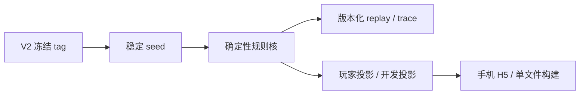
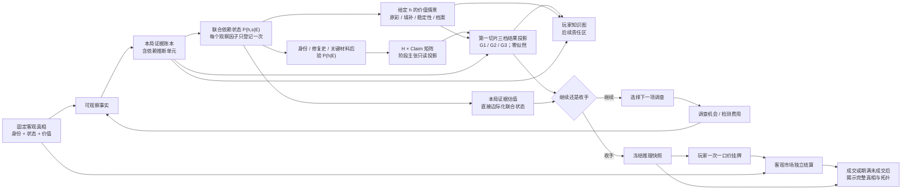

# System Map

> 描述 V3 当前设计理解、继承边界和关键依赖；凡标为 Candidate／Unknown 的内容都不是已实现产品。

最后复查：2026-08-23（DEC-026 已固定渐进显影玩家地图的核心语义；新版低保真表达尚未开始）

## 主要组成部分

| 组成部分 | 职责 | 当前状态 |
|---|---|---|
| V2 冻结底座 | seed、确定性 reducer／replay、行动日志、玩家／开发投影、单文件构建 | **Inherited / Verified baseline**；来源 tag `v2.0.0-player-prototype-freeze`，产品代码尚未在 V3 修改 |
| 第一器物内容 | 给第一张完整纸面规格提供固定文化／物理真相、可检查域、修复价值分叉与素材边界 | **Active decision / Truth package specified**；DEC-021 已固定客观真相，DEC-022 已固定第一切片“开放证据网＋三档结论门”的体验结构；没有共同批准的完整拓扑、演算、数值或实现 |
| 作者真相模型 | 固定器物历史、状态、定性身份与定量价值，决定可成立事实和客观结果 | **Active design / Not implemented**；按身份／制造、空间材料图、损伤／修复时间线、装饰／补绘、稳定性、provenance、保护档案与固定市场情景分账；不采用单一修复分或比例 |
| 作者证明／依赖图 | 表达事实、证据组、互斥历史解释、鉴定主张、覆盖摘要、AND／OR、替代路径、汇合和恢复 | **v0.3 Independent structural/deterministic Pass**；v0.2 的 12 包与通用不变量继续继承，v0.3 新增档案三关系状态、G2 软转折及领域能力收窄；首轮复核发现五槽争议漏项后，负责人补齐 T2／T3 六槽冲突优先与三阶段时间冲突，同一复核者最终独立重放 35 条声明顺序、档案当前／跨时点印证、纯物证路线和既有攻击探针并给出 Pass |
| 第一切片阶段结果投影 | 把已成立主张、局部 Finding 与明确未知组合成 G1／G2／G3 综合表述；不产生似然、不回灌证据、不锁行动 | **v0.3 Independent Pass / User author-spec approved**；DEC-024 批准它成为玩家微循环输入。三档核心语义由 DEC-022 固定，任一关系槽争议优先阻断对应系统主张，时间冲突只使三阶段 G3 回到 G2；这仍不证明阶段节奏、成本或玩家体验 |
| 玩家知识图 | 用地点、两态道路、地标、足迹和罗盘显示本局已知事实、可辩护关系、竞争解释、调查历史与注意力焦点，承担外部记忆 | **Core semantics approved / No replacement prototype yet**；DEC-025 的玩家责任与 DEC-026 的地图语义共同有效。纯黑只表示尚无信息；任何实际调查都会留下不可逆的覆盖痕迹，而解释可信度可升降、分叉或被排除。作者完整图、隐藏槽和真实边权不进入局中地图 |
| 概率与行动层 | 真相包后验、阶段主张、价值分布、信息价值、调查机会／检测费用、继续与停止，以及按当前信念排序可用调查 | **Design / Experimental**；DEC-026 已批准最强按需层点名当前最优调查，并把原则限定为扣除机会／费用的预期净决策价值；具体阈值、摘要、权重、焦点作用域与并列规则仍是 DEC-018 及后续模拟的待验证默认／Unknown |
| 玩家知识地图交互 | 让玩家看见自己点亮了什么、证据怎样连接或冲突、哪里仍黑、哪些探索前沿因本局信息自然显现；文字只作就地解释，不替代空间主结构 | **Semantic contract Active / Visual expression Unknown**；问题级前沿常驻，行动类别按需展开，玩家主动请求最强帮助时才点名当前最优调查。旧文字／面板分支已否决并删除；新版布局、移动端交互、动效、概率组件与玩家理解尚未设计或验证 |
| 第一切片经济终局 | 冻结本局推理，接收玩家一次挂牌，并由客观市场独立结算 | **Active decision / Not implemented**；见 DEC-017 |
| 自动校验与作者辅助 | 检查 schema／引用、证据依赖、可达、反证／恢复、回放、概率／价值不变量、策略漏洞与覆盖 | **v0.3 Independently replayed / Pre-product only**；Node `v24.15.0` 下负责人和只读复核者均为 `40/40`，覆盖 24 个场景 × 324 个状态单元，即 `7,776` 个场景 golden cells 和 35 条已声明合法顺序。软件仍只是审稿人，该结果不证明领域、成本／路线非支配、玩家、趣味、平衡、UI、正式数值、架构或产品代码 |
| 程序化真相／拓扑生成 | 从既有内容语法产生器物真相、证据语义或完整关卡 | **Unknown / Later gate**；首切片明确不做；只有不同手工案例与玩家证据证明可复用语法后才可提出受约束实验 |
| 限定领域复核 | 检查材料、检测能力、修复关系、保护状态与价值因果是否可能、越权或严重误导 | **Conditional Pass / Author mapping repair complete**；`DR-B01—05` 已映射为 v0.3 关系与能力接口，仍不等于具名专家、实物可达性或玩法 Pass |
| 无答案玩家复核 | 检查理解、能动性、节奏／停手张力与趣味 | **Required / Contract not approved**；作者规格门已通过，当前须先对齐渐进知识地图语义并形成新低保真表达，再单独批准无答案真人测试合同 |

## 继承到 V3 的实际底座

这条链已经存在并经 V2 验证，但其案件语义、概率公式、评分和经济结果不是 V3 自动继承的产品答案。

## V3 当前目标信息流

这里的“下山”只表示玩家不确定性通常下降；证据有效性不依赖固定取得顺序，较优顺序通过信息价值和成本产生优势，而不是让错序证据失效。`Result` 只检查作者系统当前能否承担某种综合结论；继续调查的回路始终由玩家从当前状态选择，不经过结果门的行动许可。

## 边界与依赖

- **真相先于证据：** 先定义器物可能的完整事实与价值差异，才能判断证据支持什么；
- **真相按维度而非总分保存：** 原片、损伤、修复阶段、装饰／补绘、稳定性、所有权来源、保护档案与市场情景不能压成一个“修复程度”；
- **游戏性选择器物细节：** 现实可信约束材料、检测与价值因果；在多个可信设定之间，以能否改变调查、停手或价值解释决定进入机制还是只作氛围，不把非游戏性个性逐项上交用户；
- **深挖必须非单调：** 同一客观真相同时包含关键原片／原彩保存的正向发现、填补／跨原彩补绘／旧胶风险的负向发现，以及只改变下一步问题的转向发现；
- **证据先于玩家图：** 玩家图只投影已经发现和允许知道的内容，不能反向决定作者真相；
- **覆盖与解释分离：** 纯黑只表示尚无信息；调查覆盖单调增加，重复／阴性／不可读／未决结果也留痕，解释可信度则可升降、分叉或退出当前层；
- **第一切片阶段节奏已经固定：** 第一陶瓷切片采用开放证据网汇合成三档结果；G1／G2／G3 不拥有后验、不限制行动，局部成果可以换序或提前取得。“五种拓扑”仍不能先批量生产，第一张图必须先把三档映射回诚实的主张与假设空间；
- **经济闭环已经固定：** 信息价值应面向手动停手、一次挂牌和独立市场结果计算，不能只追求熵下降；
- **证据门先于正式代码：** v0.2 的作者结构与确定性场景曾分别独立 Pass；限定领域复核随后给出 Conditional Pass，触发 v0.3 档案关系与领域能力修订。v0.3 在首轮独立 Fail 修复后取得独立重放 Pass，并由用户通过 DEC-024 批准为玩家微循环输入。DEC-025 与旧三分支只把首轮玩家责任落到可运行线路；用户随后否决并删除该原型，因此必须先重新对齐并验证渐进知识地图，再进入无答案真人测试、数值模拟、整局原型与再次盲测，最后完成 V2 继承／技术审查和明确开工批准；隔离验证工具不自动成为生产架构；
- **首切片不依赖角色系统：** 器物事实、调查、停手、挂牌与市场结果必须在没有 NPC 认知、对话或议价逻辑时形成完整一局；
- **作者图与玩家图分离：** 玩家看见事实、可争辩关系和由已知信息产生的探索前沿，不看完整隐藏槽位、真实 AND／OR 门和边权；最强按需提示的当前最优调查只按本局信念计算，不是作者真相路线；
- **随机不锁真相：** 随机可以改变效率或附加信息，但首切片不改变器物品相；核心理解必须有稳定获取／恢复路径；
- **自动化先做校验：** 首案的文化语义、证据因果、路线意图与停手张力由作者手工固定；当前 v0.3 独立 Pass 只证明冻结夹具按作者合同产生预期结构后果。软件可拒绝结构错误，但不能认证领域正确、路线非支配、深度、趣味、平衡、UI、正式数值、生产架构或产品实现。

统一词义见 [领域语境](../../CONTEXT.md)。原始构思与研究见 [V3 设计证据包](evidence/v3-design/README.md)，当前产品语义见 [DEC-017](decisions/DEC-017-v3-stage-claims-stopping-and-fixed-price-listing.md)，暂定数值政策见 [DEC-018](decisions/DEC-018-v3-provisional-claim-thresholds-and-valuation-projection.md)，第一器物继承边界、对象结构决定、作者真相包和三档作者结果分别见 [DEC-019](decisions/DEC-019-v3-evidence-rich-first-object-and-legacy-npc-exclusion.md)、[DEC-020](decisions/DEC-020-v3-first-ceramic-object-and-core-dispute.md)、[DEC-021](decisions/DEC-021-v3-first-ceramic-objective-truth-package-and-gameplay-first-authorship.md)与 [DEC-022](decisions/DEC-022-v3-first-ceramic-three-result-gates-over-branching-evidence.md)；[DEC-023](decisions/DEC-023-v3-pre-product-validation-and-player-projection-boundary.md)固定正式产品代码前的验证顺序和玩家侧首轮投影方向，[DEC-024](decisions/DEC-024-v3-first-ceramic-author-spec-approval-and-player-microcycle-entry.md)记录作者规格批准与阶段入口，[DEC-025](decisions/DEC-025-v3-player-workbench-snapshots-focus-and-final-judgment.md)固定快照、焦点与最终判断责任，[DEC-026](decisions/DEC-026-v3-progressive-player-knowledge-map-and-current-best-hint.md)固定渐进显影地图、探索前沿和最强按需提示；已删除原型的失败结论见[微循环三分支 v0](evidence/v3-design/2026-08-21-player-knowledge-workbench-microcycle-branches-v0.md)。当前冻结规格见 [三档作者模型 v0.3](evidence/v3-design/2026-08-21-first-ceramic-three-result-author-model-v0-3.md)；[v0.2](evidence/v3-design/2026-08-17-first-ceramic-three-result-author-model-v0-2.md)保留为历史已验证基线，[v0.1 覆盖层](evidence/v3-design/2026-08-16-first-ceramic-three-result-gate-author-overlay-v0.md)保留为方向纠偏记录，更早的 v0.1 阶段解释只作为[结构底稿](evidence/v3-design/2026-08-15-first-ceramic-paper-evidence-topology-v0.md)保留。

## 当前最大耦合风险

- 把一个编号同时当成证据、真相、玩家位置与价格；
- 为了“明显联动”让已知事实概率化，或把未发现事实自动当成已发现；
- 只按熵下降推荐行动，忽略价格、调查机会、检测费用与决策相关性；
- 把相关证据朴素相乘，或把系统证据估值、玩家挂牌价和客观市场结果接成同一数值轴；
- 用单条连续价格带跨过多峰分布的低概率空谷，或让玩家无条件追逐高值尾部；
- 用完整空槽图制造填空题，或用“下一步提醒”变成唯一任务清单；
- 自报高价值直接获得高价格，形成无条件高估策略；
- 因 V2 已有素材而继承漆木盒或人物逻辑，或同时实现五种拓扑和正式美术，牺牲第一器物完整度。
- 为了未来程序化生成，把手工首案提前压成固定槽位、通用修复分或只有表面差异的等价路线。
- 用真实年代、工匠或事故细节堆出考据量，却不改变玩家观察、调查、停手或价值解释；或反过来以“游戏性”为名让仪器能力、材料组合与价值因果失真。
