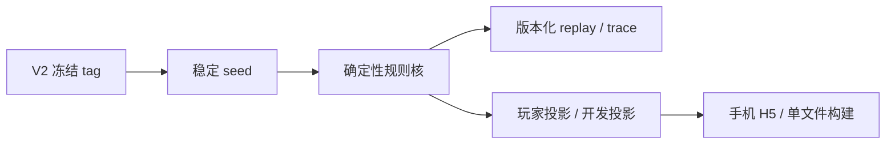
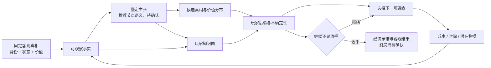

# System Map

> 描述 V3 当前设计理解、继承边界和关键依赖；凡标为 Candidate／Unknown 的内容都不是已实现产品。

最后复查：2026-08-14

## 主要组成部分

| 组成部分 | 职责 | 当前状态 |
|---|---|---|
| V2 冻结底座 | seed、确定性 reducer／replay、行动日志、玩家／开发投影、单文件构建 | **Inherited / Verified baseline**；来源 tag `v2.0.0-player-prototype-freeze`，产品代码尚未在 V3 修改 |
| 作者真相模型 | 固定器物历史、状态、定性身份与定量价值，决定可成立事实和客观结果 | **Design**；旧三离散真相只作基线，V3 结构未定 |
| 作者证明／依赖图 | 表达事实、证据组、鉴定主张、AND／OR、替代路径、汇合和恢复 | **Design**；尚无第一张批准拓扑 |
| 玩家知识图 | 显示已发现事实、允许知道的关系、当前判断与开放问题，承担外部记忆 | **Research / Unknown**；自动、手动或混合仍待原型比较 |
| 概率与行动层 | 后验、价值分布、信息价值、成本／物损、继续调查与停止 | **Research / Unknown**；不直接继承 V2 平铺似然与固定价格 |
| 玩家推理工作台 | 自然语言表达“事实—意味着什么—还可验证什么”，可按需展开数字 | **Research / Unknown**；不泄露真实边权、答案轮廓或唯一最优动作 |
| 第一切片经济终局 | 让玩家为判断承担结果，定义调查何时值得 | **Decision needed**；“持有器物后选渠道出售”只是候选 |
| 自动化与盲测 | 验证可达、回放、概率／价值不变量、策略漏洞、移动边界与玩家理解 | **Not started**；启动批次只保存验证要求 |
| NPC 深层系统 | NPC 器物／玩家认知、画像、连续行为、D20、议价 | **Parked**；不进入当前物品侧设计批次 |

## 继承到 V3 的实际底座

这条链已经存在并经 V2 验证，但其案件语义、概率公式、评分和经济结果不是 V3 自动继承的产品答案。

## V3 当前目标信息流

这里的“下山”只表示玩家不确定性通常下降；证据有效性不依赖固定取得顺序，较优顺序通过信息价值和成本产生优势，而不是让错序证据失效。

## 边界与依赖

- **真相先于证据：** 先定义器物可能的完整事实与价值差异，才能判断证据支持什么；
- **证据先于玩家图：** 玩家图只投影已经发现和允许知道的内容，不能反向决定作者真相；
- **节点语义先于拓扑数量：** 未定义节点时，“五种拓扑”没有可比较含义；
- **经济终局先于信息价值：** 不知道玩家最后要做什么，就无法判断调查是否值得；
- **纸面闭环先于代码：** 第一种简单拓扑必须先证明完整一局、替代／恢复和后期停止张力，再选择实现结构；
- **物品侧先于 NPC 侧：** 当前不让 NPC 对话、说谎或议价替未完成的器物结构作决定；
- **作者图与玩家图分离：** 玩家看见事实与可争辩关系，不看完整隐藏槽位、真实 AND／OR 门和边权；
- **随机不锁真相：** 随机可以改变效率、附加信息或损伤，但核心理解必须有稳定获取／恢复路径。

统一词义见 [领域语境](../../CONTEXT.md)。原始构思与研究见 [V3 设计证据包](evidence/v3-design/README.md)，当前授权见 [DEC-016](decisions/DEC-016-v3-design-stage-bootstrap.md)。

## 当前最大耦合风险

- 把一个编号同时当成证据、真相、玩家位置与价格；
- 为了“明显联动”让已知事实概率化，或把未发现事实自动当成已发现；
- 只按熵下降推荐行动，忽略价格、物损、机会成本与决策相关性；
- 用完整空槽图制造填空题，或用“下一步提醒”变成唯一任务清单；
- 自报高价值直接获得高价格，形成无条件高估策略；
- 在第一切片同时实现五种拓扑、复杂 NPC 和正式美术，牺牲完整度。
