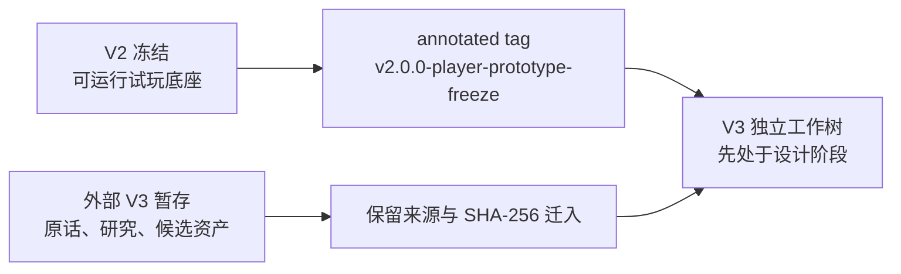

# Next Actions

> 这是 V2 冻结分支的终态入口。V3 的活动计划必须写在 V3 自己的项目记录中。

更新时间：2026-08-14

## 结论

V2 没有新的产品工程。完成冻结验证、提交与 annotated tag 后，这条开发线只保留为历史查看、复验和必要的阻断性维护基线。

V2 的终点不是“完整游戏已经完成”，而是：

- 确定性、可回放、单一数值权威的玩家试玩底座已存在；
- 三案例、稳定局号、后验估值、鉴定提交和能力／客观结果双轨已存在；
- 漆器第一批手机人物／器物同屏外壳已存在；
- 真正的物品真相拓扑、玩家推理工作台、双方人物认知、连续 NPC、D20、长期平衡与文化校订仍未实现。

详细证据见 [EXP-029](evidence/EXP-029-v2-player-prototype-freeze.md)，版本决定见 [DEC-015](decisions/DEC-015-v2-freeze-and-v3-bootstrap.md)。

## 推荐主路径

V3 启动时只做以下事情：

1. 建立独立分支／worktree 与新的 Compass、Current State、Next Actions；
2. 把原始构思、研究、候选作品集过程卡和用户批注图片作为 `Draft / Evidence` 迁入；
3. 先定义节点语义、定性／定量真相和局末经济承诺，再决定第一种最简单拓扑；
4. 对 V2 决定逐项 `Adopt / Borrow / Reject / Unknown`，不默认为继承。

以下仍未因“启动 V3”自动批准：五种拓扑的最终数量与内容、显式拓扑图细节、行动点和物损参数、高估惩罚、第一案经济终局、`2026-08-26` 的精确完成定义，以及任何产品代码实现。

## 完成标准

- V2 冻结提交只含批准的治理、文档、证据与轻量作品集记录；
- 新鲜自动回归、类型、lint、项目记忆、链接、围栏、Mermaid 静态结构和哈希检查达到 [EXP-029](evidence/EXP-029-v2-player-prototype-freeze.md) 的门槛；
- annotated tag 精确指向干净 V2 冻结提交；
- V3 从该标签建立独立工作树，迁入证据保留来源与 SHA-256，首个提交相对标签的产品 diff 为 `0`；
- 不 push、deploy 或把 Draft 误写成 Approved／Implemented／Verified。

## V2 只在什么情况下重开

- 冻结 tag、V1 canonical 或 V2 玩家入口出现字节漂移；
- 复验发现阻断性回归，使冻结版无法运行或无法回放；
- 用户明确要求一项只针对 V2 的历史修复。

即使重开，也应从标签建立维护分支，不移动或复用冻结标签。

## 继续停放

- 不 push、merge、deploy 或创建公开 release；
- 不在 V2 中写入 V3 具体拓扑、数值或产品实现；
- 不把自动回归外推为数值平衡、文化准确性、真人趣味或视觉批准；
- 不修改或移动 V1 tag、V1 worktree、原工作区与作品集证据 capsule。

人类可读终态见 [Start Here](overview/00-START-HERE.md) 与 [路线图](overview/01-ROADMAP.md)。
