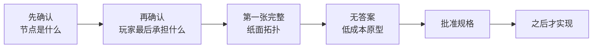

# Next Actions

> 当前只推进能减少最大依赖未知的设计动作；V3 仍处于 Design，不提前写产品代码。

更新时间：2026-08-14

## 当前检查点

V2 冻结和 V3 证据迁入已经把“版本在哪里、我们此前想了什么、外部实践怎样修正它”分开保存。现在不缺更多相邻游戏例子，缺的是把第一局的两个根问题说清。

## 推荐主路径

1. **确认中间节点语义。** 用一个漆器例子解释“原始事实 → 鉴定主张 → 候选真相／价值”，确认图上的中间节点是否就是可被支持或反驳的鉴定主张；
2. **确认第一切片经济终局。** 决定玩家最后拥有／出售什么、怎样兑现判断，以及低估、高估、合理冒险和继续调查分别付出什么；
3. **写第一种简单拓扑纸面规格。** 只做一件完整器物问题，明确固定真相、事实、主张、AND／OR／替代或恢复路径、行动成本、后期收手和玩家可见图；
4. **做无答案低成本原型比较。** 在自动图、玩家构图、混合图三者中只比较最小必要差异，观察记忆、泄题、方向感和“系统替我推理”风险；
5. **规格获批后再计划实现。** 届时才决定复用 V2 哪些类型、概率工具、reducer／replay 与 UI，并建立实现验证合同；
6. 第一拓扑完成、可回放、可理解后，再决定如何扩展到至少五种拓扑和正式美术；不把数量当启动条件。

## 完成标准

V3 当前设计门完成，需要同时满足：

- 用户能用自己的话说明原始事实、鉴定主张、候选真相和玩家相信程度的区别；这不是考试，而是确认系统没有偷换词义；
- 第一切片终局明确到可以判断一项调查何时有价值、何时应该收手；
- 第一纸面拓扑能走完一局，至少有一条替代／恢复路径，核心理解不被随机永久锁死；
- 玩家可见图明确显示什么、隐藏什么、如何温和提示而不提供唯一答案；
- 高估、低估、无限调查和只追熵下降都没有明显无条件优势；
- 文化事实、数值、UI、自动化、盲测和美术分别列出验证责任；
- 用户批准书面规格后才进入产品实施计划。

## 停放区

- **NPC 深层系统：** 物品侧完整成果完成且用户决定重开后再讨论；
- **D20／洞察：** NPC 知识、主张、表现与玩家推断链稳定后再讨论；
- **议价与人物评分：** 第一切片经济终局和物品价值机制稳定后再决定是否继承；
- **五种拓扑批量内容：** 第一拓扑通过纸面、自动与无答案玩家检查后扩展；
- **正式美术与最终 PDF：** 核心交互与信息架构稳定后制作；过程资产最多保留一个转折节点；
- **公开发布：** 依赖安全升级、真实移动端／微信内验证和授权后再处理。

## 当前证据入口

- [一分钟入口](overview/00-START-HERE.md)
- [V3 路线图](overview/01-ROADMAP.md)
- [V3 心智模型](overview/02-MENTAL-MODEL.md)
- [V3 设计证据包](evidence/v3-design/README.md)
- [V3 启动决定](decisions/DEC-016-v3-design-stage-bootstrap.md)
