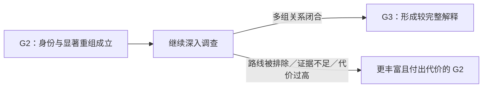

# DEC-027：第一陶瓷切片把 G2 作为稳定里程碑，后段失败以“更丰富的 G2”收手

Status: Active

日期：2026-08-23

## 当前决定

第一陶瓷切片不把永久性的 `G2 → G1` 设计成客观真相一致的正常可达内容。

作者真相是从开局固定的完整器物世界；G1／G2／G3 是系统依据本局证据愿意负责到什么程度的认知成果，不是客观真相自身的三个等级。本案作者真相同时蕴含“18 世纪末中国外销瓷”和“存在显著重组／补绘”两个 G2 核心命题。因此，在可靠且与固定真相一致的首案内容中，玩家一旦通过充分前置证据建立 G2，继续调查可以改变局部解释、档案关系、状态、价值和 G3 可达性，但不再用决定性证据永久撤销 G2 核心。

首案的正常后段流向是：

这里的“回到 G2 收手”表示 **G3 从未充分形成**，不是先获得 G3 再被扣回 G2，也不是撤销已经可靠建立的 G2。调查机会和检测费用仍然消耗；玩家获得的是更多被点亮的区域、局部正负发现、被排除的路线和更清楚的剩余未知。

## 首案允许发生的后段变化

- **强化或闭合：** 新证据与旧证据交叉互证，形成新的局部 Finding，最终可能汇合为 G3；
- **局部坏消息或好消息：** 表面、稳定性、关键材料、修复程度或价值情景变化，但 G2 核心保留；
- **候选关系被排除：** 某份档案不属于现器、某个事件缺少物证印证、某条三阶段修复路线不能成立；受影响的是这条关系、局部解释或 G3 路线，不是已经独立建立的 G2；
- **没有足够区分力：** 重复、不可读、阴性未决、能力不足或只有微弱更新；调查仍留下足迹与局部信息，但不授予 G3；
- **玩家停止追加投入：** 玩家可在任意时刻接受当前更丰富的 G2，冻结判断并承担已经付出的成本与仍存不确定性。

候选档案在 G2 建立前被排除而使当前结果仍是 G1，不属于“G2 降级”；因为该局面从未建立 G2。

## 玩家地图责任

本决定把 DEC-026 的“覆盖单调、解释可逆”进一步限定到首案：

- G2 一旦由首案充分证据建立，就作为稳定的全局地标留在当前地图；
- G2 周围的局部地标、道路和候选解释仍可增强、受质疑、改道或被排除；
- 被排除的路线退出当前解释层，但调查地点、事实与足迹保留，玩家仍能看见自己为什么走到这里；
- G3 只在所需关系真正汇合时形成。若关系没有闭合，地图显示更大的已探索覆盖和仍未闭合的前沿，而不是把 G2 擦除；
- 这是一项状态与信息架构合同，不批准具体图形、颜色、动画、布局或文案。

| 依据 | 玩家侧后果 | 本决定不声称 |
|---|---|---|
| DEC-021 的固定客观真相蕴含 G2 核心 | 首案不生成永久推翻 G2 核心的正常可靠证据 | 玩家永远不会误判或所有未来案件都稳定在 G2 |
| DEC-022 的手动停手与成本不退 | 继续调查失败的代价由资源与未形成 G3 承担 | 每次调查都必须正向推进 |
| DEC-026 的覆盖单调、解释可逆 | 地点与足迹保留，局部关系可以失效 | 地图必须采用某种具体视觉样式 |

## 通用系统能力与首案内容分离

通用主张系统仍应能够防御“直接身份反证”“直接重大重组反证”和“硬逻辑反驳”：未来若某个案件的客观真相并不蕴含其已建立主张，或作者／数据输入出现矛盾，系统不能因为玩家曾获得里程碑就永远维持错误结论。

因此，DEC-018 的通用 `contested／exit／re-enter` Experimental 语义继续保留，但它在第一切片中只作为**通用引擎防御、未来案件能力和对抗性验证**，不作为首案正常内容承诺。通用的有历史状态“争议—降级—恢复”生命周期尚未设计和验证；当前静态求解器也不能证明该生命周期。

## 验证合同重分类

[确定性作者场景夹具 v1](../evidence/v3-design/validation/first-ceramic-author-scenarios-v0/README.md) 的六个已独立复核文件及其哈希保持不变，历史 `40/40` Pass 不被改写。以下三个既有场景的求解结果仍证明静态求解器面对冲突输入时会防御性退出 G2，但其**产品含义**改为通用对抗性测试：

- `g2-hard-counter-downgrade`；
- `g2-logical-counter-downgrade`；
- `g2-identity-hard-counter-downgrade`。

它们不得再被引用为“第一器物正常游玩会永久 G2→G1”的证据。新的追加式分类覆盖层负责机器检查分类互斥、穷尽、预期阶段以及旧六文件哈希；原场景名称、输出和失败史继续作为历史证据保留。

## 证据门分类

- **Adopt：** 首案继续调查未形成 G3 时，以更多局部成果、更多成本和更多剩余未知停在 G2；局部路线与档案关系可以被排除；
- **Borrow：** 通用系统保留真正阶段降级能力，供未来真相不同的案件、矛盾输入和对抗性验证使用；
- **Reject：** 把永久 G2→G1 写成第一陶瓷切片的普通后段内容，或用里程碑被没收制造继续／停手张力；
- **Unknown：** 通用有历史状态的争议、降级、恢复生命周期，以及未来是否有案件需要把它变成正常玩家体验。

## 选择理由

- 第一器物的固定真相已经跨过 G2 核心；可靠证据若被作者安排为直接否定它，会让最源头的真相—观察因果自相矛盾；
- 调查费用、机会消耗、局部坏消息和 G3 未形成已经能制造继续／停手张力，不需要再没收 G2；
- 若深入调查可能永久夺走一个本来可靠的阶段成果，理性玩家会把“少知道一点”当成保住胜利的策略，削弱调查游戏的核心动机；
- 保留通用防御性降级能力，可以防止稳定里程碑被错误扩张成“系统永远不能纠错”。

## 影响范围

- 收窄 DEC-022 中“直接 G2 反证可令其回退”在第一切片的适用范围：它保留为通用主张系统能力，不再授权首案正常内容；
- 不改变 DEC-021 的客观真相、v0.3 冻结作者文件、12 个核心候选包、G1—G3 基本含义、纯物证 G2、开放调查、手动停手、三轨经济或局末揭示；
- 不改变 DEC-018 的 Experimental 数值，只澄清其通用退出线不等于首案内容必须覆盖 G2 降级；
- 把玩家地图下一问题收窄为：稳定 G2 地标出现后，周围局部成果、失败路线和 G3 前沿怎样汇合与重排；
- 不授权产品代码、正式 UI、数值模拟、真人测试、Git 提交／推送、部署或发布。

## 当前信心

高：首案固定真相、G2 稳定性、后段未升级收手和局部路线可逆的边界已经由用户明确批准。中等：追加分类覆盖层能保护现有验证解释不再漂移。Unknown：未来通用降级生命周期及其玩家价值。

## 重新讨论触发条件

- 首案后来明确采用会产生可靠但直接否定 G2 核心的证据来源；
- 低保真或无答案测试表明稳定 G2 让玩家把后段调查理解成无意义清图；
- 调查成本和 G3 未形成不足以产生继续／停手张力；
- 第二个手工案件的固定真相确实需要正常阶段降级；
- 通用求解器准备进入产品实现，必须定义有历史状态的争议、退出与恢复合同。

## 相关证据与记录

- 2026-08-23 用户确认：首案把“回退”收窄为 G3 未形成而以更丰富的 G2 收手；永久 G2→G1 只保留为通用防御与未来案件能力；
- [DEC-018：暂定阶段阈值与估值投影](DEC-018-v3-provisional-claim-thresholds-and-valuation-projection.md)
- [DEC-021：第一器物客观真相包](DEC-021-v3-first-ceramic-objective-truth-package-and-gameplay-first-authorship.md)
- [DEC-022：开放证据网与三档结论门](DEC-022-v3-first-ceramic-three-result-gates-over-branching-evidence.md)
- [DEC-026：渐进玩家知识地图](DEC-026-v3-progressive-player-knowledge-map-and-current-best-hint.md)
- [确定性作者侧场景演算 v1](../evidence/v3-design/2026-08-21-first-ceramic-deterministic-author-scenarios-v1.md)
- [G2 稳定性与场景范围重分类 v0](../evidence/v3-design/2026-08-23-first-ceramic-g2-stability-and-scenario-scope-reclassification-v0.md)
