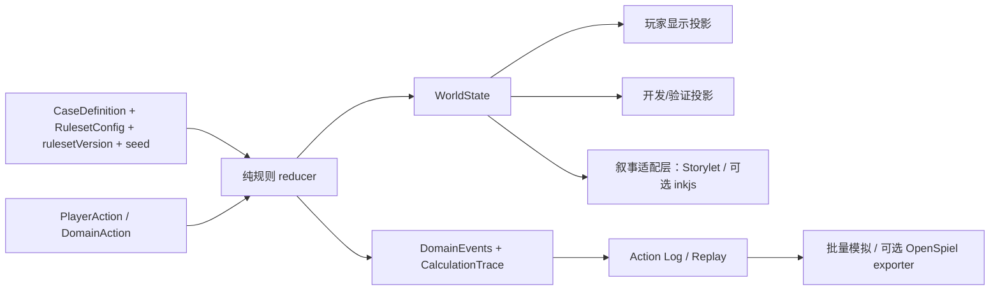

# EXP-019：V2 同类框架与社区方案只读调研

日期：2026-08-10

状态：Executed（只读研究完成；未安装依赖、未复制外部代码、未修改产品）

## 授权、问题与停止条件

用户批准 `V2-RESEARCH-001`，目的是在“统一数值权威源”的架构选择和产品实施计划之前，检查现有游戏框架、官方文档、源码、测试、许可证与相关研究，避免闭门造轮子。

本轮回答：

1. 是否存在一个适合《掌眼》H5、能同时覆盖不完全信息、信念更新、有限议价、NPC 候选决策、Storylet、数值平衡和确定性回放的成熟框架；
2. 哪些方案值得直接采用、局部借鉴或明确拒绝；
3. 玩家“选择披露真实证据但引导解释方向”应如何进入 NPC 判断而不破坏真相、信念、状态和陈述分层；
4. 调研结论应怎样约束后续统一数值权威源计划。

停止条件是 2—4 个强候选已经覆盖核心未知并能按许可证、维护信号、测试深度、Web 适配和集成成本比较。本轮在四个互补候选上满足该条件，没有继续无限搜索。

## 本地基线

- 当前生产依赖只有 Next/React/Drizzle 等 Web 基础设施，没有游戏 AI、叙事或概率框架依赖；
- `PlayerAction → resolveTurn / replayActions → WorldState`、固定 `seed`、回合记录、候选行为轨迹和玩家显示投影已经存在；
- `resolve-action.ts` 约 1906 行，同时承载后验、NPC、定价、Storylet、议价、随机和结算；`types.ts` 约 425 行，说明当前主要问题是职责与权威边界集中，不是缺少另一个总控引擎；
- 产品子目录的嵌套 `AGENTS.md` 仍声明“低保真 UI 阶段”，低保真生成路径仍有历史字段风险；这些继续是产品改动前的 Phase 0 门。

## 候选矩阵

| 候选 | 直接覆盖 | 许可证 | 维护与测试证据（截至 2026-08-10） | Web / H5 适配 | 集成成本 | 结论 |
|---|---|---|---|---|---|---|
| [boardgame.io](https://github.com/boardgameio/boardgame.io) | 纯 move、可序列化状态、阶段、日志/时间旅行、测试入口 | MIT | npm `0.50.2` 已约 4 年未发布；主分支仍有现代化工具链和 Jest/coverage/integration 脚本，但 2026 年公开 issue 出现维护者接棒讨论，发布与维护连续性不稳 | 高 | 中高；会与现有 `resolveTurn/replayActions` 重叠 | **拒绝作为依赖；借鉴状态机与回放原则** |
| [ink + inkjs](https://github.com/inkle/ink) | 条件选择、knots/stitches、标签、叙事重组、保存/加载、外部函数适配 | MIT | ink `1.2.1` 于 2026-05 发布；inkjs `2.4.0` 近期发布，测试覆盖 TypeScript、构建产物和 legacy JavaScript，且运行时面向浏览器 | 高 | 中；需要防止 ink 变量成为第二数值权威 | **保留为后续叙事适配候选；当前只借鉴，不立即安装** |
| [Yuka](https://github.com/Mugen87/yuka) | GoalEvaluator、Think/仲裁、状态/目标驱动、模糊逻辑、JSON 序列化 | MIT | 有 Mocha/nyc 单元测试和官方示例；npm `0.7.8` 已约 4 年未发布，文档仍显示 `0.7.7`，维护信号偏弱 | 高 | 中高；大量导航、感知和 3D 游戏 AI 表面与本项目无关 | **拒绝作为依赖；借鉴候选评估器与硬过滤/效用仲裁结构** |
| [OpenSpiel](https://github.com/google-deepmind/open_spiel) | 不完全信息、information state、chance node、轨迹、bargaining、signaling、trade、CFR/评估工具 | Apache-2.0 | 2026 年已有 `2.0/2.0.1` 发布；官方对游戏和算法标注 thorough/light/known-issue 级别，测试与研究证据最强 | 低；核心是 C++/Python，Windows 支持有限，不适合嵌入 H5 | 高 | **采用为离线建模/验证参考，不进入浏览器运行时；需要时再做隔离 exporter/spike** |

### 主要官方证据

- boardgame.io 官方说明要求 move 不依赖外部状态、无副作用，并提供日志时间旅行；其 [package.json](https://github.com/boardgameio/boardgame.io/blob/main/package.json) 明示 Jest、coverage、integration 与 MIT，而 [npm 发布记录](https://www.npmjs.com/package/boardgame.io?activeTab=versions) 显示最新正式版已约四年；
- ink 官方建议用 wrapper 包装 Story，并支持 tags、变量观察与 external functions；纯函数可用于查询游戏状态，见 [Running your ink](https://github.com/inkle/ink/blob/master/Documentation/RunningYourInk.md)。[inkjs package.json](https://github.com/y-lohse/inkjs/blob/master/package.json) 明示浏览器构建与多层测试；
- Yuka 官方列出 GoalEvaluator、Think、FuzzyModule 和目标驱动示例，见 [文档](https://mugen87.github.io/yuka/docs/) 与 [示例](https://mugen87.github.io/yuka/examples/)；[npm 记录](https://www.npmjs.com/package/yuka) 显示发布停滞；
- OpenSpiel 把真实状态、各方 observation/information state、行动、chance node 和 trajectory 分开，见 [概念文档](https://github.com/google-deepmind/open_spiel/blob/master/docs/concepts.md)。其 [游戏目录](https://github.com/google-deepmind/open_spiel/blob/master/docs/games.md) 包含隐藏估值 bargaining、Lewis signaling、Leduc poker、trade communication 等相邻问题，并明确标注测试成熟度；
- “选择公开什么真实信息会改变接收者后验与行动”可由 [Bayesian Persuasion](https://www.aeaweb.org/articles?id=10.1257%2Faer.101.6.2590) 提供理论视角；Storylet 的前置条件、效果、重复与选择结构可参考 Emily Short 的 [Storylets Play Together](https://emshort.blog/2019/12/03/storylets-play-together/) 和 ink 的 [条件选择](https://github.com/inkle/ink/blob/master/Documentation/WritingWithInk.md)。

## 问题—方案结论

| 《掌眼》问题 | 应借用的成熟原则 | 不应照搬的部分 |
|---|---|---|
| 玩家与 NPC 分别更新后验 | OpenSpiel 的真实状态 / information state / observation 分离；证据似然表、先验与归一化更新必须是显式领域规则 | 不把 CFR、RL 或 C++/Python 运行时直接塞进 H5，也不假装当前单案已经需要求均衡 |
| 玩家选择性披露真实证据 | 披露必须是合法行动，只能引用玩家实际持有的证据；“选哪条真证据”决定 NPC 收到哪个 signal，从而改变后验 | 语气或文案不能直接改写物品真相、证据似然或 NPC 的隐藏知识 |
| NPC 纺锤候选发散/收敛 | Yuka 式 evaluator/arbiter：候选生成 → 硬过滤 → 分项效用 → 可解释仲裁；当前实现已经接近，不需引入整库 | 模糊集合不能代替概率后验；关系状态也不能冒充证据可信度 |
| Storylet 与叙事变体 | Storylet 明示前置条件、效果、重复策略和内容引用；ink 的 knot/tag/条件选择适合作为未来作者工具 | ink 变量不能拥有价格、后验、AP、结算等生产数值；叙事层不成为第二规则引擎 |
| 确定性 seed 与回放 | boardgame.io 的纯 move、JSON 状态、action log/time travel；OpenSpiel 的 trajectory/chance node | 不为已有 `resolveTurn/replayActions` 再套一个重型总控框架 |
| 批量平衡与策略审查 | 生产规则保持无 UI、可批量运行；必要时把简化后的规则导出到 OpenSpiel 或专用模拟器 | 不把算法收敛、回归通过或单一最优策略直接等同于“好玩” |

## 选择性披露与 NPC 后验的实现语义

建议把一次披露拆成四条可审计通道：

1. `EvidencePayload`：不可改写的证据身份、来源、可核验事实和对各真相变体的似然；
2. `DisclosureSelection`：玩家从自己持有的证据中选择公开哪一条。这是“说真话但选择真话方向”的主要策略空间；
3. `Framing`：玩家选择询问、陈述或对峙方式。它可以影响 NPC 的注意、关系、可信度判断或下一行为候选，但必须作为独立的解释/关系效果记录；
4. `NpcObservation → NpcPosterior → NpcDecision`：NPC 只根据其原有认知、共享证据与来源可靠度更新后验；再由后验、人物偏好、四状态、交易条件和硬约束生成候选行为。

因此，玩家影响 NPC 判断有两种合法方式：**选择让 NPC 看见哪条真实证据**，以及**影响 NPC 如何重视或回应这条证据**。两者都不能直接指定 NPC 结论，也不能让 NPC 读取未披露的物品真相。

## 对统一数值权威源的架构输入

本轮没有找到适合整体替换现有规则核心的单一框架。推荐采用“内部确定性规则核 + 可替换适配层”，第一阶段不增加游戏/叙事依赖：

计划应把现有单体职责拆成明确边界，但不在本证据记录中预先固定最终文件名：

- belief：证据似然、先验、玩家/NPC 后验、熵/分位数/期望值；
- npc-decision：候选生成、硬过滤、效用分项、确定性近分裁决；
- disclosure/storylet：披露合法性、解释效果、前置条件、效果与重复规则；
- negotiation：调查/议价资源、定价、接受线、买断与交易条件；
- settlement：客观收益与判断质量分离；
- replay/versioning：seed、行动日志、规则版本与生成物溯源；
- presentation：只读投影，不反向成为数值权威。

## 采用、借鉴、拒绝

- **现在采用**：纯行动/纯 reducer、可序列化状态、显式 information state、规则版本、确定性回放、候选 evaluator/trace、Storylet 前置条件/效果/重复契约；
- **现在局部借鉴**：boardgame.io、Yuka、OpenSpiel、ink 的上述结构原则；不复制其源码；
- **现在拒绝**：整体引入 boardgame.io 或 Yuka；把 OpenSpiel 嵌入 H5；让 ink/inkjs 持有生产数值；在统一数值源前扩第二案；
- **以后可选 spike**：统一数值源稳定后，用 inkjs 做一条只读叙事适配；需要策略/平衡研究时，把缩小后的游戏模型导出到 OpenSpiel。两者都必须隔离、可删除、不得成为生产权威。

## 局限与风险

- 本轮只读检查外部源码、文档、测试声明、发布与许可证，没有安装或运行候选框架，因此不能声称本机兼容性已经验证；
- OpenSpiel 的相邻游戏只是建模参考，不是《掌眼》玩法已经获得平衡证明；其 bargaining 条目标为 lightly tested；
- boardgame.io 主分支活动与 npm 发布停滞并存，维护状态属于不确定，而不是简单“活跃”或“死亡”；
- inkjs 可以降低叙事组合成本，也可能制造第二状态机，必须等生产规则接口稳定后才值得做 spike；
- 选择性披露的框架能保证信息边界和可解释性，不能替代真人体验验证。

## 对项目方向的影响

- `V2-RESEARCH-001` 的证据门已完成；没有证据要求撤销已批准的“统一数值权威源”；
- 下一步不应购买或引入总框架，而应编写统一数值权威源的实施计划；
- 该计划先处理嵌套旧 `AGENTS.md`、危险低保真生成路径和类型化资产边界，再按可回滚阶段拆分规则内核；
- “客观收益与结算评分关系”仍在统一数值源和结算模型稳定之后作为 Critical 平衡验证，不被本轮框架研究提前执行。
