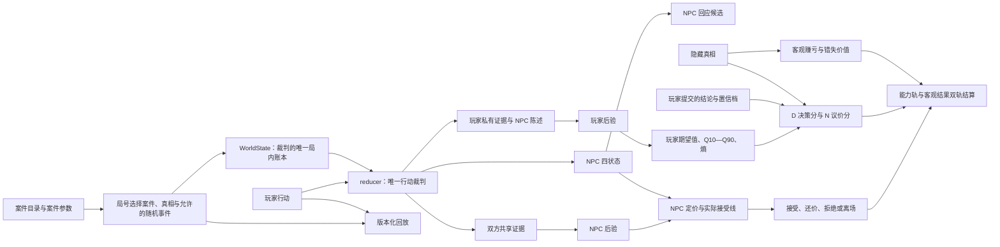

# EXP-026：现行 V2 数值系统自然语言地图

日期：2026-08-11

状态：只读架构梳理；不是平衡验收，也没有修改任何产品代码或数值

## 先说结论

现行 V2 已经形成一条基本清楚的单向权威链：

- `content/` 定义案件、真相、价值、证据、NPC 初始参数与费用；
- `game/` 是唯一负责局号、状态、后验、NPC 决策、议价、估值、评分、结算和回放的计算层；
- React 页面与五个 HTML 只是显示或构建快照；
- 测试、fixture 和旧数值实验台只能验证或保存某个结果，不能反过来定义现行规则。

当前最需要打磨的不是再造一个公式总表，而是先消除几处“玩家看到的解释模型”与“NPC 实际交易模型”不一致的问题，再讨论平衡参数。

## 一张图理解整局

隐藏真相只在该知道它的地方出现：生成与呈现真实观察结果、终局校准鉴定以及计算客观结果。NPC 的定价和接受判断应基于 NPC 自己的认知与状态，不应偷看隐藏真相。

## 不会读代码时，可以这样理解

- **案件文件像关卡数据表。** 它写着三个可能真相、每个真相的客观价值、各观察点可能给出什么、NPC 初始状态、开价、检测费用等。
- **`WorldState` 像裁判手中的唯一记分簿。** 它记录行动点、费用、发现过什么、公开过什么、双方各自相信什么、NPC 当前状态、价格和完整行动历史。
- **玩家每按一次按钮，只提交一个行动。** `reducer` 是唯一裁判，决定这次行动是否合法、花掉什么、又改变什么。
- **玩家与 NPC 各有一套后验。** 玩家根据自己看到的器物证据和 NPC 表现更新判断；NPC 只能根据自己的记忆以及玩家实际披露或共同检测的证据更新判断。
- **局末分成两条轨道。** A／D／N 描述玩家的鉴定、决策和议价能力；客观轨描述真实赚亏与错失机会。赚到钱不应自动提高能力等级，亏钱也不应自动推翻一个当时合理的判断。

## 各行动实际改变什么

| 玩家行动 | 直接获得或改变 | 对价格最直接的影响 |
|---|---|---|
| 细看器物 | 读取该真相对应的观察结果，加入玩家私有证据 | 通常不直接改变 NPC 后验或四状态 |
| 开放询问 | 获得 NPC 陈述信号，并改变压力、信任、成交意愿、控制感 | 即使 NPC 后验不变，也可能因为关系／立场变化触发改价 |
| 带证据询问 | 同时产生回应，并把玩家点名的器物证据写入共享账本 | 会更新 NPC 后验，因此可能改变其估值和报价 |
| 共同检测 | 消耗行动点和检测费用，结果同时对双方可见 | 更新双方认知并强制检查是否重估 |
| 正式报价 | 不再产生器物证据 | NPC 按自己的后验、风险厌恶、急迫度、外部选项、四状态和当前价格决定接受、还价、拒绝或离场 |
| 提交鉴定 | 锁定调查；记录最可能真相和 55%／75%／90% 置信档 | 终局才读取真相计算校准和客观结果 |

所以用户此前的感觉基本成立：现行“细看”主要负责补器物证据；“询问”虽然也会给玩家一条较弱的陈述证据，但它更直接、更频繁地操纵 NPC 状态和价格。这不是天然错误，却意味着后续设计必须明确：询问到底是在发现人物信息、改变人物状态，还是同时承担压价工具，三者各占多大权重。

## 最少需要关注的权威文件

| 领域 | 当前权威入口 |
|---|---|
| 案件、真相、价值、证据、NPC 参数 | `prototype/content/case-catalog.ts`、三个案件文件、`prototype/content/create-player-case.ts` |
| 局号与随机扰动 | `prototype/game/random.ts`、`prototype/content/case-catalog.ts` |
| 数据契约与规则版本 | `prototype/game/types.ts`、`prototype/game/ruleset.ts` |
| 行动合法性与整局流转 | `prototype/game/reducer.ts`；`prototype/game/resolve-action.ts` 是对外入口 |
| 玩家／NPC 后验 | `prototype/game/belief.ts` |
| 披露、NPC 四状态与回应 | `prototype/game/disclosure.ts`、`prototype/game/npc-decision.ts`、`prototype/game/storylets.ts` |
| NPC 实际定价、接受线、买断线与议价容量 | `prototype/game/negotiation.ts` |
| 玩家估值 | `prototype/game/player-valuation.ts` |
| A／D／N 能力分 | `prototype/game/ability-scoring.ts` |
| 双轨结算 | `prototype/game/settlement.ts` |
| 可复现回放 | `prototype/game/replay.ts` |

`prototype/game/judgment-quality.ts` 与 `prototype/game/outcome-grades.ts` 仍被结算调用，属于尚未完全退出的旧评分兼容层。解释当前玩家评级时，不能把它们与新的 A／D／N 混成同一套规则。

## 哪些东西不是数值权威

- `掌眼_V2_玩家试玩版.html` 是当前玩家入口，但只是 `content/ + game/ + player/` 的构建快照；
- `掌眼_V2_高保真演示.html` 是较早的 V2 教师／开发诊断生成物；
- `掌眼_高保真教师演示.html` 是 V1 冻结演示；
- `掌眼_低保真交互原型.html` 是历史低保真／调试快照；
- `掌眼_数值实验台.html` 是 V1 时期的隔离实验模型；
- 测试是护栏与例证，fixture 是漂移快照。它们可以发现规则改变，但不能替代规则本身，更不能证明平衡、有趣或文化准确。

## 本次只读审查已发现的优先风险

以下是当前工作树的实现风险，不是已经批准的修复方案；本批次没有改代码。

1. **N 分的“公开接受概率”与 NPC 实际接受线是两套模型。** 实际成交读取 NPC 后验和状态，N 分却使用一条独立 Logistic 曲线；同一报价可能在两套模型中得到相反倾向。
2. **N 分用中文表现文案驱动逻辑，并已出现否定词误判。** 当前实现用是否包含“急”判断急售，因此书画案的“**不急出售**”也会被当成急售。在相同 `报价=60、当前要价=100` 的最小复现中，公开接受概率从无急售标签时的约 `0.2689` 被抬到 `0.5`。
3. **部分正式报价没有进入 N 分。** 第一口无条件买断无论成交或被拒，N 都会显示“未评估”；触发卖家离场的当次报价也可能漏记。买断被拒还可能被 D 当成“玩家选择拒绝”，而不是“玩家试图购买但 NPC 拒绝”。
4. **新旧评分仍在同时运行。** 玩家版显示新的 `ability.finalGrade`，但部分局末标题或教师面仍消费旧 judgment／outcome 兼容逻辑，可能出现叙事、能力等级和客观结果不同步。
5. **旧 Q20 参考报价仍未完全退出仓库。** 当前玩家版已不再自动填入“谨慎报价”，但教师／开发表面仍调用 `getPlayerReferenceOffer`。它只能被解释为兼容遗留，不能再称为玩家现行决策规则。
6. **NPC 表现与器物真相之间存在较弱的因果桥梁。** NPC 行为主要由四状态、询问方式和 seed 选择，却随后被赋予器物真假的似然进入玩家后验；若没有更清楚的人物知识与说谎机制，可能退化成“猜 NPC 反应来鉴定器物”。
7. **证据默认按条件独立相乘。** 同一观察位置的基础／幸运证据、同一问话主题的多个回应，可能因不同 ID 被重复计权。
8. **部分 NPC 档案参数没有真正参与决策。** `honestySensitivity`、`openness` 尚未进入生产决策；人物差异更多来自初始状态和价格参数，而非完整认知／表达机制。
9. **瓷器与书画仍较接近同一数值模板的换皮。** 相同 AP、观察点／问话数量、证据强度模板和部分定价参数尚未经过文化校订与路线差异验证。
10. **价格档位不完全一致。** `priceTick=5` 约束重估与接受／买断线，但普通还价没有走同一取整规则，已经能够出现 `100 → 86` 的还价。
11. **三档离散真值会造成分位数与价格跳变。** Q10、Q25、Q50、Q75 只能落在三个真值档位上，后验略过阈值时可能突然跨档。
12. **当前自动测试证明确定性与边界，不证明平衡。** 尚无证据证明没有支配策略、各路线成本合理、长期经济健康或真人觉得有趣。

### 四项可重复缺口的代码锚点

以下行号以 `掌眼_Codex启动包_v2/掌眼_Codex启动包_v2/prototype` 为根；复现均通过 Node 标准输入读取现有 TypeScript 模块，没有生成或改写文件。

| 缺口 | 静态证据 | 最小复现结果 |
|---|---|---|
| N 曲线与 NPC 实际接受线分离 | `game/negotiation.ts:153-221`、`game/reducer.ts:818-820,863-900` 对比 `game/ability-scoring.ts:131-146,162-180` | 改变 NPC 后验与四状态后，实际接受线从 `80` 变为 `100`，同一公开输入的 N 曲线仍为 `0.5` |
| “不急”被识别为“急” | `content/calligraphy.ts:13`；`game/ability-scoring.ts:137,141-146` | `报价=60、要价=100` 时，“不急出售”为 `0.5`，无标签为 `0.2689414213699951` |
| 买断／离场报价漏出 N，D 改写玩家意图 | `game/ability-scoring.ts:224-244`、`game/settlement.ts:98-101,158-173`、`game/reducer.ts:926-968,1036-1067` | 买断低于／达到买断线，以及报价触发离场，三者的 `N` 均为 `null`；示例 `D` 均为 `100` |
| 普通还价绕过 `priceTick` | `game/ruleset.ts:22-26`、`game/numeric.ts:11-20`、`game/negotiation.ts:177-198` 对比 `game/reducer.ts:918-924` | `priceTick=5`、要价 `100`、接受线 `80`、玩家报 `72` 时，NPC 还价为 `86` |

上述函数级输入用于证明结构分离或漏记确实存在；手工构造的 NPC 状态不代表该精确组合在自然游玩中的发生频率。频率与体验影响仍需后续批量回放和真人测试。

## 用来验收“仓库解释工具”的自然语言问题

不建议只问“介绍一下仓库”。候选工具至少应可靠回答：

1. 从一个局号开始，案件与真相怎样被选中？
2. 细看、开放询问、带证据询问、检测和报价分别读写哪些状态？
3. 哪些路径能读取 `truthVariantId`；NPC 定价是否可能偷看真相？
4. 给定局号和行动序列，为什么玩家后验、NPC 后验、四状态和价格会逐回合变化？
5. NPC 实际接受线与 N 分的公开接受概率在什么情况下会矛盾？
6. 哪些数字由中文文案或字符串关键词驱动，否定词是否会被误判？
7. 每次正式报价是否真的进入 N 分；D 分评价的是玩家意图还是最终成交结果？
8. 新 A／D／N 与旧 judgment／overallGrade 各被哪些界面消费？
9. 所有硬编码数字分别属于规则参数、案件参数、显示文本、测试例子还是实验假设？
10. 同一来源的相关证据是否被重复相乘？
11. `NPCProfile` 哪些字段真正参与计算，哪些只展示或完全未使用？
12. 代码、测试与文档关于 seed、AP、Q20、接受概率和评分是否矛盾？
13. 若某参数改变 10%，哪些计算、界面与测试会受影响？
14. 五个 HTML 各来自哪些源码和构建脚本？
15. 现有测试能证明什么、不能证明什么？

## 工具选型的硬边界

审查时，当前玩家版与多份关键数值文件仍位于未提交／未跟踪工作树中，仓库也没有可供当前工具等价读取的 GitHub 远端。因此只读 GitHub 远端的工具会解释旧版本或解释不到当前版本。候选工具必须安全读取本地工作树，或者必须等我们先形成一个经过明确授权的精确快照。

## 建议的数值打磨顺序

1. 先用本地图谱和上述验收题，把“现行规则、兼容遗留、显示投影、测试假设”彻底分开；
2. 优先统一 NPC 实际议价与 N 分的可见解释模型，并清除字符串驱动的数值语义；
3. 补齐所有正式报价路径的 N／D 记账语义；
4. 决定并退役旧评分与 Q20 的残余消费面；
5. 再审计证据独立性、NPC 参数有效性与三案件差异；
6. 最后才进入批量种子、策略支配性、客观收益与能力评分关系以及真人试玩平衡。

这份顺序只是一份基于现状的审查建议。任何数值语义、评分规则或 NPC 行为的改变，都需要用户另行批准书面规格后再实施。
