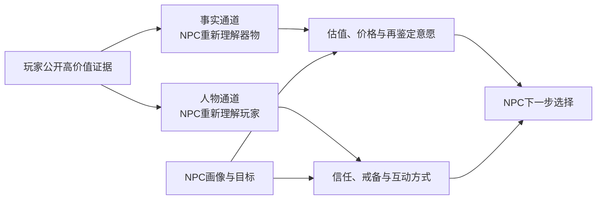

# EXP-027：双向认知边界与 NPC 混合行为架构转折

日期：2026-08-13

状态：Executed（历史原文已从会话源恢复并校验；领域边界已获用户认可；产品能力尚未据此实现）

## 测试了什么

本记录回答三个问题：

1. 能否从本地会话源精确恢复用户点名的两段关键回答，而不是依赖压缩后的上下文记忆；
2. 两段回答究竟改变了什么领域边界，哪些只是架构建议，哪些已经成为当前批准方向；
3. “小型状态机＋信念／关系状态＋纺锤效用仲裁”的分类是否有本地实现和外部先例，而不是偶发灵感。

## 方法

- 从本地会话源 `C:\Users\ASUS\.codex\sessions\2026\08\04\rollout-2026-08-04T11-28-48-019fcad1-1640-7a20-a277-16b74a96f238.jsonl` 恢复两条 `event_msg / agent_message`；
- 对每条 `payload.message` 分别计算字符数、UTF-8 字节数和 SHA-256，并在本文件附录中原样保存；
- 复核当前 `DEC-014`、系统图、宏观驾驶舱与现行 `npc-decision.ts`、`reducer.ts`、`disclosure.ts`，区分“已有局部机制”和“尚未实现的人物模型”；
- 用 Epic 官方 StateTree 文档复核“状态／转移和效用候选选择可以组成混合结构”的架构分类；只借鉴分类，不采用 Unreal 或新增生产依赖。

## 来源完整性

| 回答 | JSONL 行 | 时间戳 | 字符 | UTF-8 字节 | `payload.message` SHA-256 |
|---|---:|---|---:|---:|---|
| 回答一：双向人物认知与 NPC 混合行为架构 | 16429 | `2026-08-12T15:04:20.394Z` | 4347 | 9497 | `753069331abb01dfed56e9a54a62644db32a0a8196be52dc84ab504ebad381cb` |
| 回答二：分账开发、合流运行 | 16465 | `2026-08-13T01:25:51.148Z` | 1699 | 4103 | `ee04bf66be9c1b0e9b8d5d3ca36dee4a9b3a67478ef4865d4749750a0df94697` |

附录中的本地文件行号链接属于当时回答的一部分，保留用于历史原貌；行号可能随以后代码变化而漂移，不能替代本记录的当前复核。

## 观察结果

### 这次真正厘清的边界

- 原先的“五项系统”应改称五个按依赖排列的**开发责任区**，不是五套孤立引擎；
- 玩家与 NPC 都各有两张认知地图：怎样理解器物，以及怎样理解对方；但真人玩家的内心不由系统自动建模，玩家人物侧只保存可见线索和明确提交；
- “双后验”的历史简称在当前语境下应明确为**器物双后验**；双向人物认知是另一组分开的信息账本，不要求四台复杂概率机器；
- 器物估值、对对方的认识、关系状态与成交意愿必须分账，允许它们在同一行动后朝不同方向变化；
- NPC 纺锤不是完整状态机。现行代码已有候选生成、合法性过滤、分数排序和阶段状态，但仍缺 NPC 对玩家的认知账本、稳定画像分层和完整人物因果；
- 当前阶段没有因此换线：仍先建立漆器客观真相、证据拓扑与信息可见性，只为以后人物认知预留接口。

### 外部架构分类复核

- Epic 将 StateTree 描述为把层级状态机中的状态／转移与行为树式选择器结合的结构；这支持“宏观阶段由状态机管理，具体回应再由候选选择器决定”的分类，而不证明《掌眼》应采用 Unreal。[Epic StateTree 概览](https://dev.epicgames.com/documentation/en-us/unreal-engine/overview-of-state-tree-in-unreal-engine)
- Epic 的效用选择器会在满足进入条件的子状态中选择效用最高者；这与现行 `eligible → score → stable tie-break → selected` 的纺锤局部结构相邻。[Epic StateTree Selectors](https://dev.epicgames.com/documentation/en-us/unreal-engine/state-tree-selectors-overview)
- 结论为 **Borrow**：借鉴“状态／转移＋条件过滤＋效用选择”的架构语言；拒绝因此引入 Unreal、复制其实现或把所有人物变量展开成巨大状态机。

## 对决定或假设的影响

- [DEC-014](../decisions/DEC-014-human-object-dual-appraisal.md) 继续是当前批准决定；本记录提供完整来源与证据，不另建第二套权威设计；
- 现有 `DEC-005`、`DEC-007`、`HYP-004` 等历史记录中的 NPC 认知／双后验保留当时原文，只通过范围说明明确它们主要指 NPC 对器物的认知；
- 当前开发顺序保持“客观真相与证据 → 玩家认知 → NPC 认知 → NPC 画像与目标 → NPC 局内状态与行为”；D20、程序化 NPC 与评分调参继续停放；
- 该转折进入轻量 V2 作品集候选，但只能作为一个设计演进节点，未来必须与最终可玩成果和关键截图配对。

## 结论的局限

- 保存原文与架构分类不等于人物系统已经实现；
- Epic 资料只证明存在相邻的混合结构，不证明《掌眼》的具体状态、权重、台词或乐趣有效；
- 当前人物模型、D20、程序化生成、文化准确性、数值平衡和真人体验均未验证；
- 两段回答是历史设计讨论原文；后续获批边界以 DEC-014 和权威项目记录为准。

## 下一步

先讨论怎样把完整游戏收敛为两个可完成部分；在该范围决定前，不自动开始漆器证据拓扑或人物系统产品实现。

## 附录 A：回答一完整原文

<!-- verbatim-response-1:start -->
哈哈，收到。刚才那个理解门确实有点像考试填空题了。以后我会更偏向“路标式确认”：告诉你我们在哪、为什么来这里、下一步通向哪里。你说先运行一段时间再调整，所以这次不再修改 Skill。

你的理解是对的：漆器切片先建立一个双方共同面对的现实。比如“发现了修补痕迹”究竟证明什么、谁看见了、是否告诉了NPC，都必须先确定。否则后面的信任、说谎、涨价只是作者随手加减数字，没有可靠原因。

## 我的核心判断

1. 确实缺少“双方如何理解对方”。
2. 但不建议造两个互不相干的新引擎，而是增加一个有两个方向的“**双向人物认知层**”。
3. 纺锤不是传统状态机；完整NPC应当是“信念＋画像＋关系状态＋小型状态机＋行为仲裁”的混合结构。

### 从五层变成“两个人、各有两张地图”

| 谁 | 对器物的地图 | 对对方的地图 |
|---|---|---|
| 玩家 | 这件东西到底是什么 | NPC知道多少、想要什么、是否坦率 |
| NPC | 这件东西到底是什么 | 玩家懂不懂行、是否真想买、在采用什么沟通策略 |

这就是你说的“**双重双后验**”。作为设计语言，它非常准确。

不过到了工程实现，四张地图不必全部变成复杂的概率机器：

- 玩家真实怎么想，存在玩家脑中。系统只能提供人物线索，并记录玩家最后提交的判断，不能假装读取玩家内心。
- NPC是模拟角色，所以它对玩家的认识需要由系统真正保存和更新。
- NPC性格不是后验；它是相对稳定的价值偏好和反应方式。
- 信任、压力、成交意愿不是信念；它们是当前关系和局势的结果。

玩家侧的人物判断其实已经在 [DEC-014](</D:/实习工作/掌眼/.worktrees/v2-bootstrap/docs/project/decisions/DEC-014-human-object-dual-appraisal.md:33>) 中获批：判断NPC知道多少、如何披露以及自己的置信度，只是还没实现。真正新缺失的是“**NPC如何理解玩家**”。当前代码只有信任、压力、成交意愿和控制感，没有记录“NPC认为玩家是新手、行家、真想成交还是在策略引导”。[当前数值审查](</D:/实习工作/掌眼/.worktrees/v2-bootstrap/docs/project/evidence/EXP-026-current-numeric-system-atlas.md:110>)也已经发现这个缺口。

## 你的两个NPC例子为什么成立

假设玩家礼貌地公开了一条证明器物可能很值钱的证据。



对于诚恳、急需变现的继承人：

- 他可能认为玩家懂行且愿意坦诚；
- 信任上升；
- 器物估值也上升；
- 成交意愿可能仍然较高，但价格会合理上调。

对于精明的二道贩子：

- 他同样可能更信任玩家的专业判断；
- 但也意识到玩家很想买，器物可能比预期值钱；
- 信任上升不妨碍价格大幅上涨；
- “我要不要再找个人看看”的念头增强，成交意愿反而下降。

所以最重要的一条是：

> 信任玩家、相信器物值钱、现在愿不愿卖，是三件不同的事。

现行代码虽然已经把 `trust` 和 `dealIntent` 分成了两个数值，但主要还是根据语气、证据和报价直接加减，[disclosure.ts](</D:/实习工作/掌眼/.worktrees/v2-bootstrap/掌眼_Codex启动包_v2/掌眼_Codex启动包_v2/prototype/game/disclosure.ts:94>)中间缺少“NPC为什么这样理解玩家”这一层。

## NPC对玩家，第一版只判断什么

我建议先限制为三个行动相关维度：

- **专业度判断：** 新手、知情者、行家；
- **成交认真度：** 随口试探、认真考虑、准备成交；
- **沟通策略：** 相对坦率、选择性引导、强势操纵。

这些只是NPC根据玩家已表现行为作出的临时判断，而且NPC可以判断错误。

暂时不要建立“玩家真实人格”“善恶值”或“诚实度73”。否则系统会开始替真人玩家定义人格，也会让角色扮演变成隐藏道德评分。

一次玩家行为则可以同时经过三条互不混淆的通道：

- 证据内容改变NPC对器物的理解；
- 公开或隐藏这条证据，改变NPC对玩家策略的理解；
- 说话方式改变当前关系状态。

同一证据不能通过NPC反应再次回流成一条新的器物证据，否则会形成“NPC因为证据惊讶，所以这件东西更可能是真的”的循环自证。当前仓库正存在这种因果捷径，需要后续拆掉。[EXP-022](</D:/实习工作/掌眼/.worktrees/v2-bootstrap/docs/project/evidence/EXP-022-human-object-player-trial-audit.md:105>)

## NPC画像怎样设计和程序化生成

不建议把几十个滑块任意排列，然后让每种排列直接指向一个动作。那会出现组合爆炸，也很难判断生成的人是否像人。

更稳妥的结构是：

- **稳定画像：** 专业能力、风险态度、互惠观念、面子敏感度；
- **目标排序：** 快速变现、价格最大化、维护名声、查清真相、保留纪念；
- **局内处境：** 是否急需钱、是否有其他买家、是否方便再鉴定；
- **两张动态地图：** NPC对器物、对玩家的当前判断；
- **关系状态：** 信任、压力、成交意愿、控制感；
- **行为选择：** 综合上述因素决定回答、搪塞、还价、暂缓、找人再看或离场。

第一阶段应先写少数几个完整、逻辑自洽的人物包，而不是完全随机：

1. 用同一漆器证据，制作两个反应不同但都讲得通的NPC；
2. 验证玩家能否从表现理解差异；
3. 再把画像拆成允许组合的模块；
4. 最后才做程序化生成和批量测试。

现有 `NPCProfile` 已经混合了认知、性格和经济参数，而且 `honestySensitivity`、`openness` 目前甚至没有真正参与生产决策，[EXP-026](</D:/实习工作/掌眼/.worktrees/v2-bootstrap/docs/project/evidence/EXP-026-current-numeric-system-atlas.md:112>)。所以现在继续堆参数，只会得到“看上去很复杂”的假人物。

## 纺锤是不是状态机

严格来说：**不是。**

可以把两者这样理解：

- 状态机决定NPC现在“在哪个房间”：正常交谈、谨慎、防御、议价、暂缓交易、已经离场。
- 纺锤决定NPC在这个房间里“接下来具体做什么”：补充说明、搪塞、部分承认、反向质疑、还价或离场。

当前代码正是：

```text
当前信息与状态
→ 发散多个候选回应
→ 删除不合法候选
→ 分别打分
→ 选出最高分回应
→ 收敛成台词和行为
```

候选生成与最高分选择在 [npc-decision.ts](</D:/实习工作/掌眼/.worktrees/v2-bootstrap/掌眼_Codex启动包_v2/掌眼_Codex启动包_v2/prototype/game/npc-decision.ts:88>)；真正的小型状态机则是 `relaxed / cautious / pressured / negotiating / exited`，[reducer.ts](</D:/实习工作/掌眼/.worktrees/v2-bootstrap/掌眼_Codex启动包_v2/掌眼_Codex启动包_v2/prototype/game/reducer.ts:221>)。

因此完整结构应当是混合式的：

- 小型状态机负责硬阶段和不可逆边界；
- 连续数值表达细微关系变化；
- 双方信念表达各自怎样理解世界和对方；
- 纺锤负责选择当轮行为；
- Storylet负责有前置条件的特殊台词和情节。

这种“状态／转移＋效用候选选择”的混合并非闭门自创。Unreal官方的StateTree也明确把层级状态机与选择器结合，并支持从满足条件的候选中选择最高效用者；这只帮助我们确认架构分类，并不意味着需要引入Unreal或新依赖。[StateTree概览](https://dev.epicgames.com/documentation/en-us/unreal-engine/state-tree-in-unreal-engine)、[效用选择器](https://dev.epicgames.com/documentation/en-us/unreal-engine/state-tree-selectors-overview)

## 什么时候加入

我的建议是：

- **现在：** 仍然画漆器真相与证据图，但为每条信息补上“谁能看见、能否共享、公开它会向对方暴露什么”。暂不计算人物后验。
- **双方器物信念明确后：** 正式定义双向人物认知层。
- **NPC画像和局内行为阶段：** 让人物画像决定如何解释同一玩家行为，再让人物认知影响信任、报价和纺锤候选。
- **最后：** 才加入D20、人物评分和程序化NPC生成。

所以它不会替换当前主线，而是修正了当前主线必须预留的接口。若这一层不预留，后面证据公开只能机械地“信任+5、成交-3”；预留后，它才能表达真正的相互试探。

下一步只需要确认一个设计边界，我的建议是同意：

> NPC不拥有一份系统定义的“玩家真实人格”；它只能根据玩家已经表现出来的行动，形成可能出错的临时判断——玩家是否懂行、是否认真成交、采用什么沟通策略。这些判断可以影响信任和行为，但不能证明玩家善恶，也不能直接改写器物真相。

你是否同意这个边界？如果同意，我们再讨论NPC究竟应该观察玩家的哪些具体行为。


<!-- verbatim-response-1:end -->

## 附录 B：回答二完整原文

<!-- verbatim-response-2:start -->
是的，仍然需要分开开发；但应当是“**分账开发、合流运行**”，不是把每个概念都做成一套庞大的独立系统。

你觉得边界模糊，是因为“系统”这个词同时被拿来表示了三件不同的事：

| 层次 | 它回答的问题 |
|---|---|
| 概念划分 | 游戏世界里有哪些不同的东西？ |
| 开发阶段 | 我们先解决什么、后解决什么？ |
| 代码模块 | 哪些功能共用一套计算工具？ |

这三者不需要一一对应。

## 修正后的五阶段路线

新发现的两个方向，不需要额外插入“第六、第七阶段”，而是补进原来的玩家侧和NPC侧。


所以实际开发仍然按五阶段推进：

1. **物品真相与证据拓扑**

   规定真正发生了什么、线索证明什么、谁能看见、能否公开。这是现在所处的位置。

2. **玩家认知**

   包含两页：

   - 玩家怎样理解器物；
   - 玩家怎样理解NPC。

   但系统不能替真人玩家下结论。它只保存玩家看见的人物表现，并记录玩家主动提交的判断。

3. **NPC认知**

   同样包含两页：

   - NPC怎样理解器物；
   - NPC怎样理解玩家。

   因为NPC是模拟角色，所以第二页必须由程序实际更新。

4. **NPC画像与目标**

   决定同一件事对不同NPC意味着什么。例如有人重视坦诚，有人更重视利润，有人害怕风险。

5. **局内状态与行为**

   信任、压力、成交意愿、控制感属于当前局势；状态机管理“正常交谈、戒备、议价、离场”等阶段；纺锤在当前阶段选择具体回应。

## 哪些必须严格分开

下面四条必须分别记账：

- 对器物的估值；
- 对玩家或NPC的认识；
- 当前信任和关系状态；
- 当前成交意愿。

这样才能出现你举出的合理情况：

> NPC认为玩家很专业、也比较真诚，所以信任上升；与此同时，他意识到器物可能很值钱，于是要价上涨，并降低立即成交的意愿。

如果把这些压成一个“好感度”，系统就只能得到：

```text
信任上升 → 更愿意卖 → 更便宜
```

这显然塑造不出复杂人物。

正确的计算方向应是：

```text
玩家公开高价值证据
├─ 器物通道：NPC重新估值 → 价格可能上涨
├─ 人物通道：NPC认为玩家懂行／坦率 → 信任可能上涨
└─ 决策通道：结合NPC目标与处境 → 继续卖、暂缓、找人再看或抬价
```

## 哪些可以共用

玩家与NPC都在形成认知，所以可以共用：

- 证据记录格式；
- 信息可见性规则；
- 概率更新工具；
- 置信度表达；
- 回放和审计机制。

但他们的“账本”必须分开。共用计算器，不等于共用答案。

## 当前阶段会不会因此改变

不会换线，只会给第一阶段增加一个很小但重要的预留：

画漆器证据图时，每条信息除了写“它证明什么”，还要标记：

- 谁最初能看见；
- 能不能向对方公开；
- 公开后，对方获得了什么事实；
- 这个行为是否也暴露了行动者的专业度或意图。

现在只标注这些接口，不计算信任、不设计完整人物后验，也不开始程序化NPC。

因此更准确的说法是：

> 原来的五项不是五个孤立程序，而是五个依赖有序的开发责任区。新发现的“互相理解”分别归入玩家认知和NPC认知，不另造两套游戏引擎。

如果你认可这个澄清，我建议下一步把路线图中的“玩家信念／NPC信念”正式改称为“玩家认知／NPC认知”，并在两者下面各画出“辨物＋识人”两页。这样边界会直观很多。
<!-- verbatim-response-2:end -->
