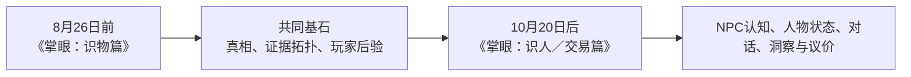

# V3 前置设计暂存：识物篇范围与物品真相拓扑构思

日期：2026-08-13

状态：V3 创建前的忠实会话保全；不是 V2 项目记录，不是批准规格，不是实现授权。

工作流：`V3-OBJECT-TRUTH-TOPOLOGY-INTAKE-001`

## 边界说明

- 本文件位于 V2 仓库之外，目的是在上下文压缩前保存当前讨论；
- V2 当前工作树、产品代码、项目文档和 Git 历史不因本文件改变；
- 尚未创建 V3 分支或 worktree；正式冻结 V2、创建 V3、迁入权威设计记录均需后续单独执行与验证；
- 以下“识物篇”“2026-08-26”“冻结 NPC”等仍处于范围讨论，不能冒充已批准实施规格；
- 调查结论将另存为同目录研究文件，并与用户原始构思分开，避免把 Agent 解释伪装成用户原话。

配套记录：

- [物品真相拓扑、玩家知识图与不确定性下降](./2026-08-13-object-truth-topology-research.md)
- [玩家引导、认知脚手架与不剧透的贝叶斯表达](./2026-08-13-player-guidance-and-cognitive-scaffolding-research.md)
- [重点作品集过程资产候选](./2026-08-13-object-truth-topology-portfolio-process-asset.md)

## 这轮讨论前的范围判断（完整原文）

来源：`2026-08-13T06:38:44.965Z`，本地会话 JSONL 第 18156 行，角色 assistant，2009 字符／4033 UTF-8 bytes，SHA-256 `23f6a93a3477853367bada0ef7ae2f3137c6b66b0ed28cc4460db9fd49ab9153`。

<!-- verbatim-assistant:start -->
我基本同意，而且这可能是目前最合理的拆分方式：

这不是把完整游戏砍掉一半，而是把第一部重新定义成一款能够独立结束的推理游戏：

> 玩家在有限行动中检查器物，逐步建立证据结构、更新判断，最终提交真相与置信度，再由局末复盘解释其推理质量。

Unity 对 vertical slice 的定义也支持这种“小而完整”：作品可以只有 5—20 分钟，但应同时具备主要机制、视觉语言和最终打磨，而不是展示很多尚未闭环的功能。[Unity Vertical Slice](https://learn.unity.com/course/practical-game-accessibility/unit/welcome-to-the-course/tutorial/explore-out-of-circulation)

## 我赞成，但需要收紧三个边界

1. “不碰 NPC”应指玩家版彻底不出现 NPC、卖家陈述、议价和交易残肢；仓库里的旧 NPC 与交易代码则冻结保留，不在截止日前花时间彻底拆除。

2. 8 月 26 日版本应以“一件完成度很高的漆器主案”为核心。现有局号、后验、置信提交、Brier 校准、移动端外壳、五个漆器热点、21 条物证和三视图 SVG 都能复用。当前真正缺少的是证据图引擎、纯识物界面和经过盲测的谜题内容。

3. 完整真相图和玩家图必须分开：

   - 作者／自动化：看完整真相依赖图；
   - 玩家游玩中：只看已发现节点、关系和必要的未知占位；
   - 局末复盘／作品集：显示完整拓扑，并叠加玩家实际走过的路径。

如果游玩时直接展示完整精确真相图，拓扑可能反过来替玩家解题。

## 8 月 26 日的建议完成线

必须完成：

- 一个简短入口和一个约 10—20 分钟的漆器主案；
- 有限行动检查、证据解锁、后验变化、真相＋置信提交；
- 完整结算：真实答案、校准分、证据链闭合程度、遗漏和误判；
- 一套统一的漆器美术、热点细看、拓扑视觉和手机 UI；
- 图引用、可达性、路径闭合、后验归一、种子复现和单文件构建自动测试；
- 至少一轮无答案玩家盲测，并留出最后数天只修问题和打磨，不再加机制。

Golden Idol 的设计者特别强调：推理题作者因为已经知道答案，很难自行判断谜题是否合理；自动测试能证明图可达，却不能证明玩家会产生“这是我推出来的”体验。[Golden Idol 设计访谈](https://www.gamedeveloper.com/design/case-of-the-golden-idol)、[测试访谈](https://www.gamedeveloper.com/business/-the-case-of-the-golden-idol-i-used-frequent-testing-to-improve-its-mystery-solving)

明确延期：

- NPC 对器物与玩家的认知；
- NPC persona、关系状态和行为纺锤；
- 对话、说谎、D20 洞察；
- 价格、议价、交易和经济结果；
- 瓷器、书画的正式内容与美术。

目前粗略估计是 11—16 个集中工作日。13 个自然日并非不可能，但只适用于“一套图引擎＋一个完整漆器主案＋一套美术”；若把五种拓扑理解成五个完整案件，完成度风险会非常高。

现在只需要先确认一个最关键的意思：

你所说的“至少五种拓扑”，是否是指在同一个漆器主案里，由同一套图引擎承载五种证据结构形态，而不是五个独立案件？我推荐按前一种理解继续讨论。

本轮只是调查和范围讨论，没有修改仓库文件。

<oai-mem-citation>
<citation_entries>
MEMORY.md:147-147|note=[used outcome-first and selective process portfolio preference]
MEMORY.md:163-163|note=[used distinction between final portfolio and private evidence store]
</citation_entries>
<rollout_ids>
019fcad1-1640-7a20-a277-16b74a96f238
</rollout_ids>
</oai-mem-citation>
<!-- verbatim-assistant:end -->

## 用户关于物品真相拓扑的构思（完整原文）

来源：`2026-08-13T07:31:08.220Z`，本地会话 JSONL 第 18163 行，角色 user，1479 字符／4365 UTF-8 bytes，SHA-256 `4b36ebda5f1fe6c19c6b1ce2b040eb366e57a13e2d965a05e1ba1e7b2a73b5ef`。

<!-- verbatim-user:start -->
你记录一下我们现在对话的内容。因为我后续需要你帮助我再次干净冻结这个版本以及更新文档之类的。因为这两轮上下文窗口快用完了。那么我就仔细跟你聊一下 我是怎么在脑子中理解这个拓扑结构的。以及为什么我认为需要一个在玩家侧稍微可读的相对显式、辅助玩家理解和记忆的拓扑图。当然，这个拓扑图并完全是填空题，但是也需要起到非常重要的辅助理解、辅助记忆的功能。至于你说的三个边界，第一个边界我同意。至于第二和第三个边界。你阅读一下我的构思就可能自然进行调整了。尤其是五个热点设计，可能就不满足我设计的深度。以及21条物证是什么？21这个数值是在干什么。

我对物品真相的理解和设计是，这是一个完全结构化的拓扑结构。有点类似于机器学习中的那种三维的梯度下降的示意图，但是存在明显的互相验证的东西，逐渐从混沌下降到清晰，是一个“下山路径”的选择。但是很自然的，不能完全让玩家掉进局部最优的小山谷中出不来，这种非常实际的东西是需要避免的。那么我开始描述：最上方是完全不知道的混沌，最下方是完全理解物品真相的清晰。有不同的路径可以从混沌下降到清晰，有全局最优，也有局部最优。全局最优可能需要运气，局部最优只需要根据已经检查出来的存在的证据找到最优或是较优的下一步动作。物品有不同的内在组织方式，可以是最简单的严格串联的，比方说自上而下需要有三个证据需要找到，我们只需要寻找这三个证据，不分前后（不分前后这一点我不知道到底怎么表达，也不知道到底是否需要设计成时序的，我觉得不需要完全设计成时序的，只是有可能有一个时序最优，因为时序最优有可能更好地指向玩家下一步的决策，但是不能妨碍证据因为时序问题连不成一条完整证据链，因为我前面叙述的“下山路径”跟这个的描述冲突）（证据可以是检查出来的，也可以是NPC说的实话，不过当然，NPC我们计划暂时冻结），都找到了那就完美通关。如果证据链断裂或者牵强，那么就有多少概率指向物品客观真相，有多少概率指向其他有概率成立的真相。这可能需要我们在设计物品“真相拓扑结构”的时候提前构思好这个物品到底有多少种可能性。接着前面的说，也可以是并联的，有两条路径可以下降，这两条路径都可以导向物品真相。路径A是一个小概率找到但是下降很快的点，但是需要补一个大概率找到但是下降较慢的点。两点需要互相印证才可以补全证据链。路径B是两个下降速度相当的两个点，都有着中等的概率被找到。我来假设一种情况，就是玩家运气好在没有背景的情况下凭直觉拿到了那个小概率拿到的下降很快的点，这时候玩家最优策略则应该是找那个下降较慢但是大概率找到的点补全证据链。当然，两条路径可以并不是严格并行的两条路，可以有更复杂的拓扑结构。甚至AB两条路都没有走通，最终导向的结果（当然不是真相，是有概率的指向）也可能是不同的，比如A路径中玩家拿到了那个小概率但是下降很多的证据，最终导向的可能是一个高风险高回报的结果，A路径玩家拿到了那个大概率但是下降少的证据最终导向的就更有可能是高风险低回报的结果；B路径则更为平均。当然，不同的证据链条即便是不完整也可以相互印证，毕竟是在不断下降的。你需要按照agent职责去搜集相关游戏和设计和我类似的设计思路。然后后续我们再设计更多更复杂的拓扑方案。这里的拓普图我建议做成相对显式的。因为如果做成隐式的会极速上升玩家的理解和记忆能力，也很难理解游戏的设计思路。第一个最简单的切片可以先把拓扑结构设计简单点。

等我们把这个边界搞清楚了就彻底再次冻结V2。升级为V3进行实际开发，不过我建议把现在的实际讨论的对物品真相的设计放在v3，不在v2中留下。

<!-- verbatim-user:end -->

## 用户关于温和引导与全局推断体验的后续构思（完整原文）

来源：`2026-08-13T09:52:04.458Z`，本地会话 JSONL 第 18517 行，角色 user，828 字符／2430 UTF-8 bytes，SHA-256 `6e59b896d69570692b456e372415b77de576f90897bacadb84ff9f12e45bb8a3`。

<!-- verbatim-user-guidance:start -->
这一轮的调研和构思非常有价值，我可以遇见如果这个游戏可以做出来的话将会是非常有潜力非常新颖的。尤其是你写的相关游戏与设计研究的部分。可以作为重点作品集过程资产。你先落实一下。然后我想问你一下你提到的那一层中间判断到底是什么意思，我有点没读懂你想表达什么。你可以再稍微解释一下我怕我理解偏了。还有一点我刚刚想到的，我阅读了Ron Gilbert的设计理念。我们当然不是拿钥匙开门，我们的游戏是建立在“古董”主题+自然语言+系统辅助上的贝叶斯判断，而不是玩家拿个计算器在后台咔咔计算，也不是缺钥匙就找钥匙的“任务清单”。玩家是否真的能读懂他们到底需要做什么？我们是否或者说如何在玩家侧进行温和导向和至少抹平信息差的前提下又不增加过多认知负担，让玩家尽可能沉浸在我们设计的推断的过程中而又不会过分增加游戏难度？我觉得可能至少需要一个温和数值面板和下一步可以怎么做的提醒在玩家旁边供玩家理解和记忆，而不是我们一开始设计的那样把跟物品相关的背景信息都一口气列出来，当然，我们一开始的那个设计面对现在这个系统也过于单薄了，而且与玩家的实际决策过程联系不那么紧密。每一次进行探测的背后都会对一个物体不同方面比如证据链AND组的某一个节点产生不同的信息增益，比如一个完全线性的无序闭合（最简单的那种），存在几个节点需要探测，探测一个节点可以温和提高另一个节点成立或是不成立的概率，有点类似于经典游戏扫雷的设计思想，当然，不同选择，不同顺序的探测对某一个节点的增益不同，比方说存在一个最完美的时序和选择能够显著提高增益，但是不那么绝对完美的时序和选择依旧能够完成一局游戏。系统需要在后台计算后验概率，让不同节点联系紧密，需要营造出一种统领全局的感受，而且比较深刻地融入GUMSHOE强调的关键线索不能因为随机失败永久消失的观念。这也是我最近玩博德之门3的感受，想要达成一个目标可以有多种解。

其实我感觉我说的这些对你来说可能有点胡言乱语我也没有完全知道我到底想表达什么。
<!-- verbatim-user-guidance:end -->

## 当前仅作导航的忠实提炼

这些条目只用于防止下一轮丢失语义，后续仍要由用户确认：

1. 用户同意近期玩家表面完全冻结 NPC 方向，但旧 NPC／交易实现如何保留到 V2 冻结点仍待后续处理；
2. 用户设想的不是“若干平铺热点”，而是一张完全结构化、允许串联、并联、汇合、交叉验证和不完整路径的物品真相结构；
3. 玩家从高不确定状态出发，依据已发现证据选择下一步，逐渐收敛到对多个候选真相的不同后验概率；
4. 稀有但信息量大的证据，与常见但信息量较小的补证，可以形成风险和效率不同的调查路线；
5. 证据获得顺序可以影响下一步策略是否高效，但不应仅因顺序不同就让已经取得的充分证据无法组成有效证明；
6. 玩家侧需要一张相对显式但不泄露答案的拓扑图，承担外部记忆、关系理解、下一步规划和局末复盘，而不是把游戏退化成填空题；
7. 首个切片可以简单，但“五个热点／21 条物证”不是已获用户接受的深度目标；
8. 只有在边界讨论完成后，才干净冻结 V2，并为 V3 创建正式开发载体；本轮设计不写回 V2。
9. 玩家体验目标不是找钥匙式任务清单，也不是要求玩家手算后验，而是在自然语言与轻量系统辅助下形成、修正并验证判断；
10. 玩家侧需要随调查逐步出现的记忆与方向支架，而不是开局一次性倾倒全部背景知识；
11. 不同检查顺序可以有不同效率，但非最优路线仍应允许玩家完成一局；核心线索不得因随机失败永久消失；
12. “温和数值面板”“下一步方向提示”“节点之间是否相互影响”均是待调查与原型验证的设计问题，尚未批准为具体 UI 或算法。

## 当前决策前沿

后续按依赖顺序继续澄清：

1. “拓扑”的节点究竟分别代表观察动作、原始证据、中间推论、候选真相还是其中多层；
2. 玩家可见图显示完整骨架、未知槽位，还是只显示已发现节点与已确认关系；
3. “下山”应怎样与不依赖获取顺序的证据有效性共存；
4. 局部最优是允许存在但可恢复，还是设计上必须保证任意合理路线都不会被永久锁死；
5. 发现概率、行动成本、信息增益和最终价值／风险怎样分账；
6. 第一张简单拓扑用什么完整器物问题来证明玩法，而不是只证明图引擎。

## 近期非目标

- 不修改 V2 产品代码或项目文档；
- 不提前创建 V3 worktree、分支、版本号或正式规格；
- 不启动 NPC 认知、NPC 状态、D20、议价或交易实现；
- 不把“梯度下降”“全局最优”“局部最优”等比喻直接当成最终数学模型；
- 不把现有 5 个观察热点或 21 个 evidence 记录当作 V3 内容数量指标。

## 用户关于定量真相、风险收益与停止决策的后续构思（完整原文）

来源：`2026-08-14T02:08:53.972Z`，本地会话 JSONL 第 18789 行，角色 user，883 字符／2579 UTF-8 bytes，SHA-256 `5339d0a3f2be1cfb6912d904d790669eb7fbfc249860fba05427567a772dac91`。

关联图片：[`assets/2026-08-14-ron-gilbert-topology-user-annotated.png`](./assets/2026-08-14-ron-gilbert-topology-user-annotated.png)，1343×300，101361 bytes，SHA-256 `add6d0b2302c5f2abe60b2b654e340aaacc46e49993240b7e66069971454bdfb`。这是用户提供、带编号批注的研究参考图；仅作私有设计证据，未来公开作品集应重新绘制并核对引用与使用权。

<!-- verbatim-user-value-stopping:start -->
我同意。而且我非常同意玩家面前是可争辩的问题这个主题。但是我认为最好不要把倾向自始至终都写得那么硬，我认为古董不仅要定性还要定量。定性指的是真的还是假的还是真的重修过的。定量则指的是更为精准和细致的划分客观价值。也就说古董有很多种可能的真相（当然只有一种客观真相），玩家选择相信什么会引导玩家决定下一步为了补足证据而采取的具体行动。当然最好是把每一项的证据都拿个七七八八而不是拿全。我把Ron Gilbert博客中的图拿过来说清楚我到底想表达什么。你看这张图，也是所谓纺锤形的，推理会走上不同的线路，又会在特定状态走向一致的结论，最终还有可能停留在靠近右侧的任意一个位置。然后我们假设左侧是高度不确定性的，右侧是高度确定性的。玩家更愿意相信什么或是说更愿意下一步做什么会引导下一步玩家的行动。假如玩家现在已经走到了这张图上2的位置，系统告诉玩家在2的先验下有多大概率证明4成立。我们假设4的客观价值为500，2的客观价值为200，那么玩家是否会愿意相信4成立去补齐最下面那条证据链而采取下一步行动呢？因为如果玩家主观认为物品是2，不太有可能是4，但是客观真相却的的确确是4，那么需要适当惩罚玩家，我认为就是如果玩家认为这是一个2，那么就必须拿2的价格区间出售最终只能拿到2的受益。也就是说，在一局游戏后期，玩家从先验证据中更愿意相信什么，愿意采取多大的风险策略，也在一定程度上决定了玩家的风险收益方差的大小。假如玩家认为这是个好东西，就必须耗费行动点数，这个行动点数甚至可以是游戏货币，还甚至需要做出可能会损伤古董的检定行为才可能继续下探到3，到4，5，甚至到6。当然，甚至是在一局游戏的前中期就发现一个证据微弱指向或者满足5的必要不充分条件等等，这样让玩家顺着让不确定性下降最多的一般逻辑推下去，同时埋一个伏笔之类的。也就是说一局游戏应当是从前期的高度不确定，到中期系统和玩家一直按照待判断的问题和当前倾向去相对时序地做下一件事，到后期系统证据不足，需要玩家自行理解“我有什么”，按照自己的风险收益策略决策“相信什么”和游戏后期的下一步是继续做下去还是就此收手。
<!-- verbatim-user-value-stopping:end -->

## 当前导航补充：本轮新增但尚未批准实现的设计含义

1. 器物真相不只包含“真／假／重修”等定性类别，也可能包含更细的品质、状态与客观价值差异；
2. 玩家不是沿着客观真相从“2 变成 4”，而是在固定的候选真相之间更新自己的相信程度；这一语义仍需用户确认；
3. 调查从单纯收集证据扩展为有成本、有潜在损伤、有机会成本的连续决策；
4. 玩家可在多个认识位置主动停止，最终风险收益取决于当时的证据、判断与尚未排除的高价值可能；
5. “相信什么”不能单独凭声明决定可实现价格，否则会产生无条件高报的优势策略；价值实现机制仍需调查与共同设计；
6. 关键线索不得因随机失败永久消失；高风险检查更适合改变效率、精度或器物状态，而不是成为唯一真相入口；
7. 原 Ron Gilbert 图的依赖节点、候选真相／价值状态、玩家信念位置和停止决策属于不同语义层，暂不合并成一张后台数据图；
8. 以上内容属于 V3 设计暂存，不写回 V2，不等于已批准规格或已实现功能。

## 用户对后期节奏与版本阶段的修正（完整原文）

来源：`2026-08-14T02:37:07.021Z`，本地会话 JSONL 第 19190 行，角色 user，255 字符／755 UTF-8 bytes，SHA-256 `78fd184e4b32d74848e5cf8e932ea0cc84c2fa1c6087423f4282d1199a844b7c`。

<!-- verbatim-user-pacing-freeze:start -->
我觉得我可以稍微修正一点，我认为并不是一个连续检定游戏的玩法转折，而是一个建立在我们前面的基础上的游戏叙事的升级，或者和你说的一样我们前面提到的更偏向前中期，而我这个更偏向一局游戏后期，我可能补充了一些叙事节奏之类的。前面我们讨论的玩家和系统一同下降可能更偏向游戏中期高歌猛进，到了游戏后期则自然而然转向需要承担风险从而小步迈进。而且高估当然有代价，这个我们后续再细说。你可以继续做你下一步要做的事情。不过想再询问你一下，既然我们从前面的开发边界和顺序的讨论转为具体设计，是否我们应该封存V2正式启动V3了？
<!-- verbatim-user-pacing-freeze:end -->

## 当前导航补充：叙事节奏修正与阶段问题

1. 本轮不是用“连续检定游戏”替换此前的证据拓扑与共同下降，而是在既有核心玩法上补齐一局后期的叙事和决策节奏；
2. 前中期仍强调玩家与系统共同降低不确定性、较快取得进展；后期随着容易取得的证据减少，玩家开始以更小步幅承担成本和风险；
3. 信息价值、损伤和继续／收手主要用于解释后期节奏，不应被写成整局唯一玩法定义；
4. 用户已明确高估存在代价，但具体代价与结算机制留待后续讨论，不在本轮代填；
5. 用户提出“是否封存 V2、正式启动 V3”的阶段问题；这授权继续审查与给出建议，不自动授权 Git commit、tag、branch、worktree 或 V2 权威记录改写。
