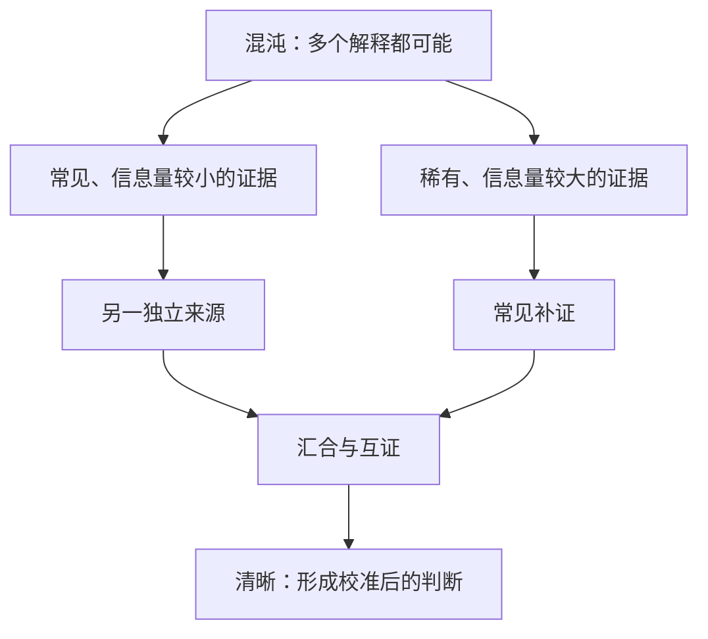
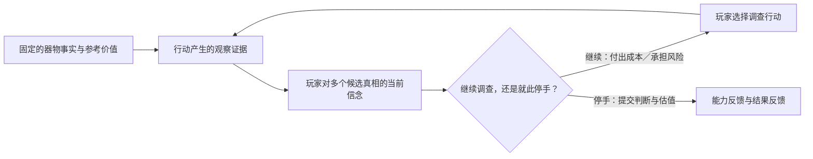
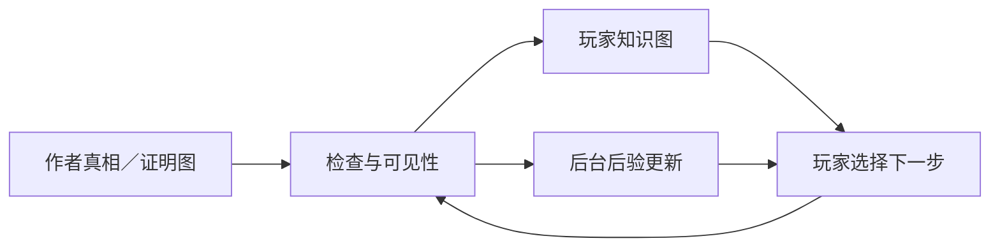

# 重点作品集过程资产候选：从平铺线索到可行走的真相地形

> **V3 前置候选，不属于 V2，不是最终作品集页面。**  
> 这张卡保存一个高价值设计转折。未来只有在拓扑玩法真正实现并经过无答案试玩后，才能与最终成果截图配对进入申请作品集。

日期：2026-08-13；续记：2026-08-14  
优先级：重点过程资产候选  
状态：研究与概念综合完成；产品规格、交互形式、数值和平衡尚未批准或验证

## 一句话故事

项目不再把鉴定理解为“点击若干部位、收集若干线索”，而开始探索一种古董主题的自然语言贝叶斯推理：玩家沿多条可恢复的证据路径形成判断，并在信息成本、器物风险和高价值可能之间决定继续调查还是停手。

## 原先的问题

- 旧切片以五个检查热点和平铺证据表为主，证据之间没有可行走的依赖、汇合或互证结构；
- 背景知识与证据更像静态说明，尚未与玩家当下的下一步决策紧密相连；
- 系统能在后台更新概率，却没有把“我为什么更相信某个解释、现在还缺什么”转译成玩家容易理解的体验；
- 早期设计过度围绕 NPC 行为展开，承载双方认知的器物真相结构没有先建立。

## 关键构思

用户提出“从混沌下山到清晰”的真相地形：不同路线具有不同发现难度和信息价值；证据可以串联、并联、汇合和跨链互证；不完整路径只改变候选真相的相对可信度，不直接宣布唯一答案；合理但非最优的路线仍然可以完成一局。

## 后期叙事节奏补充：从高歌猛进到小步承担风险

用户用带编号的 Ron Gilbert 依赖图进一步补齐一局的后期节奏。它不替换此前的证据拓扑与共同下降：前中期仍是玩家与系统一同降低不确定性、沿较有把握的路径快速推进；到了后期，容易取得的证据逐渐减少，玩家开始为更小幅的进展承担行动、货币和潜在损伤，并可能带着尚未消除的不确定性主动停手。因此“七七八八的证据是否已经足够”成为后期张力，而不是要求玩家清空全部节点。

这是一项建立在既有核心玩法上的叙事与决策节奏升级，不是另起一套“连续检定游戏”。它同时暴露出必须分开的四层语义：

这里最关键的设计修正是：如果客观真相是高价值状态，它从开局起就是那个状态；真正沿图移动的是玩家掌握的证据和相信程度。原图的分叉与汇合可以借来组织调查，但不能把“客观真相”“调查步骤”“玩家认识位置”和“出售结果”悄悄画成同一种节点。

## 调查带来的修正

| 相邻实践 | 借到掌眼的原则 | 明确不照搬的部分 |
|---|---|---|
| Ron Gilbert 的谜题依赖图 | 作者从结论反向画依赖、分叉与汇合，检查瓶颈 | 不把古董鉴定做成拿钥匙开门，也不把作者答案图直接给玩家 |
| Golden Idol 的 thought path 与盲测 | 先写玩家必须想通的推断，再用不知道答案的玩家验证 | 不用任务列表替玩家完成推理 |
| Outer Wilds 的 Rumor Mode | 用玩家知识图承担回忆、重返问题和温和方向感 | 不显示玩家尚未知晓的事实或隐藏权重 |
| GUMSHOE 的核心线索原则 | 推理可以困难，但完成主案所需的关键线索不能因随机失败永久丢失 | 不让一次失败掷骰直接封死唯一通路 |
| 贝叶斯实验设计的信息增益 | 用当前信念衡量一次调查预计能减少多少不确定性 | 不要求玩家拿计算器，也不自动标出唯一最佳行动 |
| 信息价值与顺序决策 | 后期不只问“能减少多少不确定”，还问“值不值得付出行动、金钱与损伤继续查” | 不把精确最优解直接告诉玩家 |
| 估值与文保实践 | 区分器物事实、品相、参考价值与实际成交；先用非侵入手段，再谨慎选择取样 | 不把损伤检查做成无后果的普通按钮或唯一真相入口 |

## 项目形成的四层结构

1. **作者真相与证明图**：保存隐藏事实、候选真相、AND／OR、互证与逃生路径；
2. **玩家知识图**：只整理玩家已经发现的事实和允许看见的关系；
3. **后台后验**：计算各候选真相当前有多可信，但不把数学负担交给玩家；
4. **行动支架**：用自然语言说明当前争议、证据缺口和可选调查方向，不发布“标准答案式下一步”。

## 新颖性应怎样诚实表达

目前可以主张的是：掌眼尝试把古董题材、自然语言证据、贝叶斯信念更新、玩家可见知识图和多路径调查组织成一套项目特定体验。

目前不能主张“前所未有”或“已经证明有效”。各组成原则都有相邻先例；真正需要作品证明的是，它们组合后是否让非专家玩家产生“这是我判断出来的”，而不是“系统替我算出来的”。

## 最终作品集只保留什么

如果 V3 完成，这一过程节点最多使用一页或一个跨页，并优先展示：

1. 一张“旧平铺线索 → 四层推理系统”的前后对照图；
2. 一张最终玩家知识图界面，与同局作者真相图的小比例对照；
3. 一条真实试玩路径：玩家看到什么、判断如何变化、为什么选择下一步；
4. 一项盲测证据，说明温和引导是否既防卡死又没有泄题。

不建议把所有中间草图、长篇研究笔记和失败切片塞进最终 PDF。完整原始材料继续保留在私有证据中，最终页面以完成后的玩家画面和验证结果为主。

## 仍未完成与验证

- 第一张简单拓扑的节点、边和候选真相尚未确定；
- “中间判断”是否独立显示、玩家图由系统生成还是由玩家参与构图，仍待讨论；
- 温和数值面板、方向提示和精确后验的显示强度尚未原型比较；
- 依赖证据不能继续无条件平铺连乘，实际概率模型尚未选择；
- 图中编号究竟是互斥真相、包含关系下的粗细判断，还是纯知识位置，仍需先与用户确认；
- 低估、过度高估和合理冒险怎样得到对称后果，尚未确定；本轮没有批准完整市场模拟；
- 文化与器物知识、手机可读性、理解难度、趣味和平衡均未验证。

## 原始依据

- [用户原始构思与续谈](./2026-08-13-object-truth-topology-intake.md)
- [相邻游戏、谜题结构与概率方法研究](./2026-08-13-object-truth-topology-research.md)
- [玩家引导、认知脚手架与不剧透的贝叶斯表达](./2026-08-13-player-guidance-and-cognitive-scaffolding-research.md)
- [定量真相、信息价值、损伤与收手决策研究](./2026-08-14-quantitative-truth-value-of-information-and-stopping-research.md)
- [用户批注的 Ron Gilbert 图（私有研究参考，公开前需重绘并核对使用权）](./assets/2026-08-14-ron-gilbert-topology-user-annotated.png)
