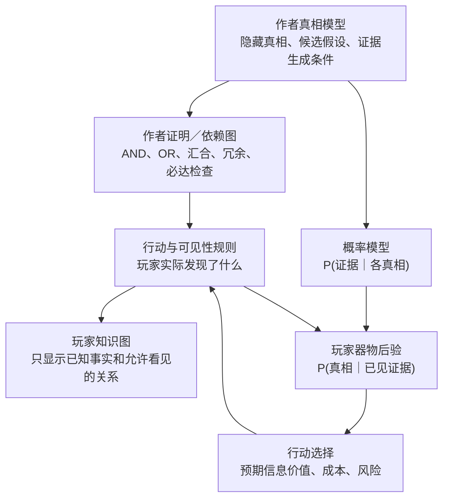

# V3 前置研究：物品真相拓扑、玩家知识图与不确定性下降

> **非 V2 记录。非批准规格。V3 创建后待迁入。**  
> 本文件只保存 2026-08-13 讨论触发的外部研究、概念澄清和候选方向；它不改变 V2 的产品边界，也不授权产品实现。

## 先说结论

1. 用户描述的方向有成熟的相邻实践，但没有一个现成游戏把它完整做成同一套系统。最接近的组合是：Ron Gilbert 的作者侧谜题依赖图、Golden Idol 的作者侧 thought path、Outer Wilds 的玩家侧知识图、GUMSHOE 的防卡死证据结构，以及 Bayesian experimental design 的后验与信息增益。
2. “从混沌下山到清晰”适合作为玩家体验和视觉隐喻，但不宜直接实现为机器学习意义上的梯度下降。掌眼真正需要的是离散的 `真相假设 + 证据似然 + AND/OR 依赖 + 后验更新 + 行动成本/信息价值`。
3. 最关键的设计边界是分开四样东西：作者真相图、玩家已知图、概率信念和下一步行动。它们可以共享数据来源，却不能画成同一张泄露答案的图。

## 本次决策问题

如何把“多条证据路径从混沌走向清晰”的构思变成可设计、可计算、可测试且可由玩家理解的系统，同时避免：

- 完整拓扑直接泄露答案；
- 稀有证据随机缺失导致无法通关；
- 玩家被错误假设困在所谓“局部最优”；
- 图替玩家完成推理；
- 作者知道答案后误判谜题难度。

本次只形成 V3 的研究底稿，不决定第一案的正式拓扑、UI 交互或具体数值。

## 先澄清 V2 的“5 个热点／21 条物证”

这两个数字描述的是旧内容表的规模，不是 V3 的玩法目标，也不是拓扑深度：

- `5 个热点`只是漆面、底部、接口、锁扣、内腔五个点击入口；
- `21 条 evidence` 是跨三种隐藏真相保存的候选记录：15 条基础观察（5 个位置 × 3 种真相）、3 条同真相随机 bonus、1 条 NPC 陈述证据、2 条专项检测结果；
- 一局不会看到 21 条。每个位置只取当前隐藏真相对应的 1 条；当前 6 点行动预算下，只读回放核到的最高值是 7 张证据卡；
- 现行后验把可计权证据的似然平铺相乘。虽有来源组、证据维度和关键维度覆盖标签，但没有父子边、AND/OR、前置解锁、汇合、断链或中间推论。

因此，V2 当前有的是“按位置分类的似然表”，还没有用户所说的“可行走、可互证、可显示的物品真相拓扑”。V3 的深度应以后续确定的节点、关系、替代路径、汇合、断链后验和恢复路径衡量，不能用数据库行数衡量。

本节来自对 V2 当前实现的只读核查；它只作为迁移背景，不把新的 V3 设计写回 V2。

## 对“下山”的更精确翻译

用户现在的隐喻可以保留，但底层需要拆成三种不同关系。这个拆分是本次资料交叉比较后的项目特定综合，不是任何一个外部游戏的原样方案。

### 1. 逻辑依赖：什么证据组合才足以支持结论

例如 `E1、E2、E3 都成立才构成强证据链`。这里不要求先后顺序，只要求集合完整。最合适的表达是 **AND 前提组**，不是时间序列。

### 2. 获取依赖：玩家现在能不能检查到这条证据

有些检查可以开局直接做，有些检查必须先发现位置、工具或上一级事实。这才是真正的前置解锁关系。Ron Gilbert 特别区分了“依赖图”和“流程图”：边表示某一步依赖什么，而不是玩家实际按什么顺序走；并行分支可以在汇合点共同成为后续条件。[Ron Gilbert：Puzzle Dependency Charts](https://grumpygamer.com/puzzle_dependency_charts/)

### 3. 策略排序：在当前信念与成本下，下一步查什么最划算

这不是固定的拓扑边，而是随玩家已知证据变化的动态排序。Bayesian experimental design 通常用“预期信息增益”衡量一次观测预计会让先验与后验相差多少，即预计减少多少不确定性；它为“下降快的证据”提供了比视觉高度更准确的数学含义。[Bayesian inference、information gain 与 experimental design 综述](https://pmc.ncbi.nlm.nih.gov/articles/PMC7514425/)

因此，“三个证据不分前后，但可能存在最优时序”并不冲突：

- **不分前后**属于逻辑依赖；
- **某个顺序更划算**属于策略排序；
- 只有确实存在工具、位置或知识门槛时，才进入获取依赖。

## 四层模型：四张账，不能混成一张图

| 层 | 谁使用 | 节点／边是什么 | 不应该承担什么 |
|---|---|---|---|
| 作者真相模型 | 作者、规则核、自动化 | 隐藏真相、事实因果、证据出现条件 | 不直接给玩家看 |
| 作者证明／依赖图 | 作者、关卡检查器 | 结论所需的 AND/OR 证据组、可达路径、冗余与汇合 | 不等同于概率，也不等同于玩家游玩顺序 |
| 玩家知识图 | 玩家 | 已发现证据、公开关系、尚待互证的缺口 | 不显示隐藏节点全貌、正确答案轮廓或真实边权 |
| 概率与行动层 | 规则核；部分结果可投影给玩家 | 后验、熵、候选行动的预期信息价值与成本 | 不应自动替玩家点击“系统认为最优”的行动 |

## 相邻实践逐项核对

### Ron Gilbert：Puzzle Dependency Charts

**外部事实。** Gilbert 把节点定义为谜题及其解决步骤，把连线定义为依赖；他从谜题链终点向后设计，用并行分支和汇合检查非线性、瓶颈与死路。他明确说这不是流程图，并把完整图定位为设计者工具，而不是玩家解题界面。[原始设计文章](https://grumpygamer.com/puzzle_dependency_charts/) 在 Thimbleweed Park 的制作记录中，这类图还被用来标记可选支线、未完成节点以及 A/B/C 范围优先级。[Thimbleweed Park 制作记录](https://blog.thimbleweedpark.com/final_puzzles.html)

**对掌眼的判断：Borrow。** 借用“从结论反向构造、分叉—汇合、检查瓶颈”的作者方法；不能原样采用，因为掌眼的核心节点是证据、隐藏事实与假设，而不只是“拿钥匙—开门”式动作。

**Reject：** 不把完整作者依赖图直接复制给玩家。Gilbert 自己也把 dependency chart 定位为设计图；完整节点和连线会接近攻略。

### The Case of the Golden Idol：thought path、结论输入与盲测

**外部事实。** 设计者 Andrejs Klavins 用 thought path 列出玩家为了理解谜题需要想通的部分；同一谜题里有些推理必须串行，有些可以并行。如果测试者凭一条线索跳过大量本应有意义的步骤，团队会移除或修改那条线索，因为它让其他内容失去作用。[Golden Idol 设计者访谈](https://www.gamedeveloper.com/business/-the-case-of-the-golden-idol-i-used-frequent-testing-to-improve-its-mystery-solving)

**外部事实。** 团队尝试过自由句子输入，但测试后选择了受限词组与填入位置的方式，在“自由文本难被系统理解”和“多选题替玩家推理”之间取折中；它只给接近解的有限反馈。团队还删减纯粹增加记忆负担的信息，只保留解题所需信息与有意义的误导，并尽量提供多条得出同一结论的路径。[Golden Idol 早期设计访谈](https://www.gamedeveloper.com/design/case-of-the-golden-idol)

**外部事实。** 因为作者已经知道答案，团队尽早使用低保真原型与占位美术测试；常用四五名测试者观察其行动和口述，再访谈其想法，而不是只看量化完成率。每个场景通常反复测试，设计者也承认 thought path 并没有变成一个可靠的通用谜题生成框架。[频繁测试访谈](https://www.gamedeveloper.com/business/-the-case-of-the-golden-idol-i-used-frequent-testing-to-improve-its-mystery-solving)、[“Aha”设计访谈](https://www.gamedeveloper.com/design/case-of-the-golden-idol)

**对掌眼的判断：Adopt。** 作者侧必须先画 thought path，并用无答案玩家的实际思路验证；不能用“图在数学上可达”替代盲测。

**Borrow。** 局末结论输入应在自由表达与选择题之间寻找受控但需要真正组织证据的形式。具体是填槽、连线、短论证还是混合形式，目前仍是 `Unknown`，需要 UI 原型比较。

### Outer Wilds：Rumor Mode 是玩家知识图，不是真相图

**外部事实。** Kelsey Beachum 在 GDC 分享中把 Outer Wilds 的核心目标描述为：不用显式任务指派，而由叙事激发好奇，让玩家以自己决定的顺序解开非线性故事。[GDC 2021 设计演讲](https://www.gdcvault.com/play/1027368/Independent-Games-Summit-Sparking-Curiosity)

**外部事实。** 创意总监 Alex Beachum 回顾说，Ship Log 的目的之一是不强迫玩家另拿纸笔；一次效果不佳的测试后，团队把内部用连线表示信息的设计文档转成 Rumor Mode。它把内容组织成数个 mystery/curiosity webs，但团队刻意让日志不告诉玩家任何其技术上尚未知道的事实。[Alex Beachum 访谈转录](https://www.listennotes.com/podcasts/the-fourth-curtain/outer-wilds-alex-beachums-SI6GdyaUxkm/) 官方平台提示甚至允许想完全自己解谜的玩家关闭 Rumor Mode，说明它被视为记忆与方向辅助，而不是唯一正确的推理方式。[Xbox Wire：Outer Wilds tips](https://news.xbox.com/en-us/2019/05/30/outer-wilds-available-today-xbox-game-pass/?ver=3.7.1)

**对掌眼的判断：Adopt。** 玩家图只投影“已经发现的事实”和允许公开的关系；它首先帮助回忆和重新进入问题。

**Borrow。** 可以让关系图明显可读并帮助选择下一调查方向，但要保留关闭、折叠或降低提示强度的可能。

**Reject。** Rumor Mode 没有表示证据似然、后验概率或 AND/OR 证明条件，不能把它误称为完整的掌眼真相拓扑实现。

### Her Story：玩家用假设决定下一次检索

**外部事实。** Her Story 给玩家一个警方录像数据库；玩家输入关键词，系统只返回说出该词的访谈片段。下一条证据从哪里来，取决于玩家根据当前理解想到什么搜索词。[Her Story 官方说明](https://www.herstorygame.com/about/)

**对掌眼的判断：Borrow。** 它很好地证明了“当前假设 → 选择下一行动 → 得到新证据 → 改写假设”本身可以成为核心循环。

**Reject。** 它几乎不提供显式拓扑和结构化记忆支持，因此不是本项目玩家知识图的直接模板；掌眼若照搬，会把用户担心的记忆负担重新交还给玩家。

### Return of the Obra Dinn：结构化档案不是答案图

**外部事实。** Lucas Pope 在自己的开发日志中解释，书册界面用于收集和组织大量信息：建立事件时间顺序、记录每起死亡细节并容纳身份线索；他在简短日志、可导航时间轴等方案之间，最终选择了更自然易懂的“故事书”隐喻。[Lucas Pope 开发日志](https://dukope.com/devlogs/obra-dinn/tig-37/)

**对掌眼的判断：Borrow。** 借用“证据卡／对象档案／时间或部位索引”的信息组织方式，尤其适合手机端回看。

**Reject。** 档案册解决的是信息收纳与提交，不提供证据拓扑的精确表示，不能替代玩家知识图或后验系统。

### Heaven's Vault：错误理解可以暂存，后续证据再校正

**外部事实。** Heaven's Vault 让玩家猜测古文字含义，错误翻译可能把玩家带向错误方向；语言由可复用的组成部分构成，后续发现可以帮助玩家重新理解既有符号。[inkle 官方页面](https://www.inklestudios.com/heavensvault/) Inkle 还让系统跟踪玩家已有的翻译和词典进度，并选择与进度相称的铭文；团队通过大量测试平衡“太简单”和“无法理解”。[Inkle 设计访谈](https://www.gamedeveloper.com/design/how-inkle-developed-its-own-ancient-language-for-i-heaven-s-vault-i-)

**对掌眼的判断：Borrow。** 允许“当前最可信解释”暂时存在，不必每发现一条证据就立即判对错；新证据应能确认、削弱或重解释旧证据。它很接近玩家后验逐步更新的体验目标。

**Reject for first slice。** Heaven's Vault 的程序化内容选择、长程叙事响应和语言生成复杂度远超第一个物品真相切片，不应在 V3 第一版一起采用。

### GUMSHOE：让推理困难，不让必要证据随机消失

**外部事实。** GUMSHOE SRD 规定：玩家到达相关场景、拥有合适能力并声明使用时，必要信息不依赖掷骰而自动获得；每个场景有推进调查所需的 core clue，若玩家提出其他合理方法，也应提供该信息。[GUMSHOE SRD，第 31—33 页](https://pelgranepress.com/gumshoe/files/GUMSHOE%20SRD%20CC%20version.pdf)

**外部事实。** SRD 同时区分了多种作者结构：floating core clue 可从多个场景获得；leveraged clue 需要将已有证据用于新的交涉；pipe clue 先出现、以后才显出意义；alternate scene 可以从另一条路径提供同类信息或排除误导。它还要求避免只能严格按唯一顺序推进的 core clues，并建议画场景图检查玩家选择是否真实存在。[GUMSHOE SRD，第 55—60 页](https://pelgranepress.com/gumshoe/files/GUMSHOE%20SRD%20CC%20version.pdf)

**对掌眼的判断：Adopt。** 任何完成主案必需的核心物证都不能只由低概率随机事件决定；随机性可以影响成本、捷径、细节或发现顺序，但必须存在至少一条可复现、可理解的逃生路径。

**Borrow。** 将 floating、leveraged、pipe、alternate clues 改写为器物检查中的可配置证据结构。

**Reject。** 不把“掷骰失败导致关键物证永远拿不到”引入纯识物切片；这会把推理失败变成运气失败。

## 对“局部最优”的判断

“局部最优小山谷”非常适合形容玩家体验，但它目前不是严格数学定义。玩家更可能遭遇的是 **错误假设吸引子**：一组早期证据让某个错误真相暂时占优，玩家又不断选择只会确认它的行动。

V3 作者工具可以用以下规则防止无法逃脱；这些是基于 Golden Idol 的盲测、Gilbert 的防瓶颈图、GUMSHOE 的 core clue 原则以及信息增益方法形成的项目建议，尚非批准规格：

1. 每个高概率错误假设都必须至少有一条可获取的反证或区分证据；
2. 必需的逃生证据不能只靠随机命中；
3. 任一不完整证据链只能提高或降低概率，不能提前把错误真相锁死为 0%/100%；
4. 稀有高信息证据可以形成捷径，但不得单独构成不可质疑的终局答案；
5. 作者自动化应检查“是否可达”和“是否存在区分证据”，盲测再检查玩家能否意识到应该寻找它；
6. 系统可提示“仍需互证”或“存在冲突”，但不直接指出最优动作。

## 可供 V3 后续讨论的六种拓扑词汇

以下只是共同语言，不是已批准的“五种正式拓扑”。

| 候选结构 | 简单解释 | 与用户构思的对应 | 主要风险 |
|---|---|---|---|
| 无序串联／AND 组 | 三项都要有，但顺序任意 | “三个证据都找到即完整” | UI 容易误画成固定流程 |
| 替代并联／OR 路径 | A 链或 B 链任一完整即可支持结论 | 两条不同下山路 | 某一路太便宜会让另一条失去意义 |
| 分叉—汇合菱形 | 前置发现打开数条调查，之后在共同结论汇合 | Gilbert 式小菱形 | 分支只是重复劳动而非不同推理 |
| 非对称互证 | 稀有高信息证据 + 常见低信息补证共同闭合 | “小概率下降快 + 大概率下降慢” | 稀有证据若成为唯一入口会卡死 |
| 交叉桥接 | 两条本可独立的链共享一个能互相重解释的中间事实 | 不完整链之间也能互证 | 图过密，玩家难以阅读 |
| 延迟回响／pipe clue | 早期证据先入库，后续证据出现后意义才清楚 | 先见到但当时无法完全理解 | 玩家忘记旧证据，需要知识图提醒 |

## 玩家侧相对显式拓扑图：建议边界

### 建议显示

- 已发现的证据节点；
- 玩家已被允许知道的来源、部位或时间关系；
- `支持`、`反驳`、`可能相关`、`仍需互证`等不等同于答案的关系；
- 证据链中的已知断点，例如“该判断还缺一个独立来源”，但不显示隐藏证据的具体名称和位置；
- 玩家自己提交的当前真相判断和置信度，以及它随新证据发生的变化。

### 暂不建议显示

- 完整隐藏节点数量和准确轮廓；
- 作者图中的真实 AND/OR 门；
- 每条证据的真实 Bayes factor、隐藏似然或系统认定的“最佳下一步”；
- 尚未发现但已经用名称标出的证据槽；
- 直接变绿、自动认证正确的玩家连线。

### 仍需最小实验决定

玩家图究竟采用哪种交互仍是 `Unknown`：

1. **自动知识图**：系统自动整理已知事实，玩家只阅读；
2. **玩家构图**：玩家自己连线和标注；
3. **混合图**：事实节点自动入图，关系与当前假设由玩家表达。

建议用同一个极简漆器谜题做三份纸面或 HTML 低保真原型，分别观察：玩家能否回忆证据、是否被图泄题、是否感觉图替自己推理、下一行动是否有依据。Golden Idol 的经验表明，这类问题不能由知道答案的作者独自判断，必须让无答案玩家实际操作。[Golden Idol 盲测访谈](https://www.gamedeveloper.com/business/-the-case-of-the-golden-idol-i-used-frequent-testing-to-improve-its-mystery-solving)

## 研究分类汇总

### Adopt

- 作者图与玩家图严格分层；
- 先从终局结论反向画作者 thought path；
- 核心证据不因随机失败永久丢失；
- 玩家图只记录玩家已经知道的事实；
- 无答案盲测是谜题是否成立的必要证据。

### Borrow

- Gilbert 的分叉—汇合依赖图；
- Golden Idol 的受控结论输入和 thought path；
- Outer Wilds 的可回看知识网络；
- Obra Dinn 的档案册信息组织；
- Heaven's Vault 的暂存解释与后续互证；
- GUMSHOE 的 floating、leveraged、pipe、alternate clue；
- Bayesian expected information gain 作为作者调参与自动化指标。

### Reject

- 把完整作者真相图直接展示给玩家；
- 把“高度”直接当作概率或把美术距离当作证据权重；
- 让关键物证因随机失败永久不可得；
- 让系统自动指出唯一最佳调查动作；
- 第一切片同时引入 Heaven's Vault 级程序化叙事复杂度。

### Unknown

- 玩家知识图是自动生成、玩家手绘还是混合；
- 是否向玩家公开精确后验数字、区间、趋势或只显示相对强弱；
- “稀有高信息证据”的稀有性来自可见选择成本、隐藏位置还是允许的 seed 变化；
- 第一案正式采用哪五种拓扑，以及它们是同案内组合还是不同小题；
- 行动推荐是否只用于作者自动化，还是以弱提示形式进入玩家界面。

## 为什么在这里停止调查

资料已经覆盖四个不同层次：

- 作者结构：Gilbert、Golden Idol、GUMSHOE；
- 玩家记忆与表达：Outer Wilds、Obra Dinn、Golden Idol；
- 玩家自主找证：Her Story、Heaven's Vault；
- 概率与行动选择：Bayesian posterior 与 expected information gain。

新增同类游戏大概率只会增加例子，不会改变“分四层、核心证据必达、玩家图不泄露作者图、谜题必须盲测”这一当前结论，因此已达到本轮证据饱和点。下一步不应继续堆案例，而应由用户完整讲完第一种简单拓扑，再据此决定最小原型的节点、边和可见性。
