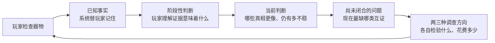
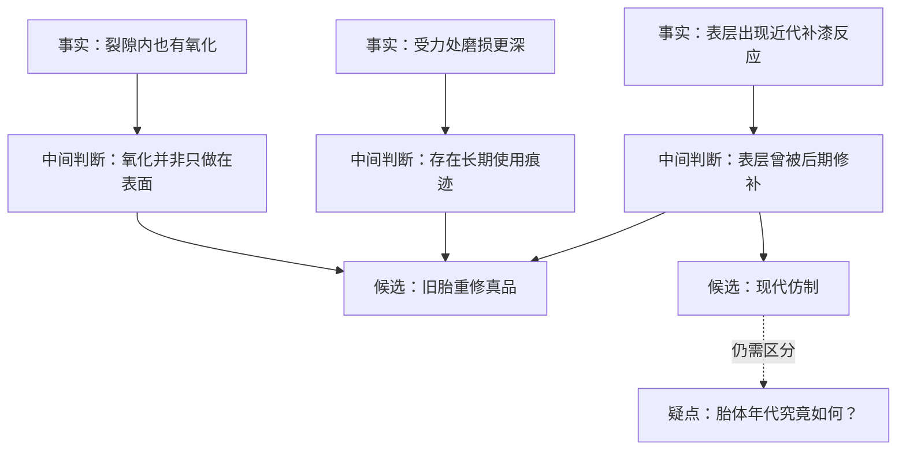

# V3 前置研究：玩家引导、认知脚手架与不剧透的贝叶斯表达

> **非 V2 记录。非批准规格。V3 创建后待迁入。**  
> 本文是 2026-08-13 讨论触发的决策前调查，只保存外部证据、对掌眼的推论和仍待验证的设计分支。它不修改 V2，不授权产品实现，也不代表界面方案已经获批。

配套记录：[物品真相拓扑、玩家知识图与不确定性下降](./2026-08-13-object-truth-topology-research.md)

## 决策问题

在一款以古董鉴定、自然语言证据、贝叶斯判断和多路径求证为核心的游戏里，怎样让非专家玩家：

1. 知道自己已经掌握了什么；
2. 知道当前真正不确定的是什么；
3. 能判断下一步有哪些值得尝试的方向；

同时又不把游戏退化成隐藏任务清单、答案填空题、概率计算器或系统代替玩家推理的“自动驾驶”。

## 先说结论

1. **玩家需要的是“推理工作台”，不是“任务清单”。** 工作台应持续外置玩家已经见过的事实、由事实支持的阶段性判断和仍未闭合的问题，但不能列出隐藏证据名称、完整答案骨架或唯一最优动作。
2. **下一步引导应描述调查目的，而不是直接给答案。** 比如“目前只有表层迹象，胎体年代仍缺独立验证”，优于“下一步去点底部”。玩家可以看到两三种可能检验该问题的行动及其代价，但不应看到精确的信息增益排行榜。
3. **后台可以精确计算，前台应分层表达。** 默认用自然语言趋势、相对强弱和“为什么变化”帮助判断；需要时再展开约数或范围。只用“可能／很可能”等词会被不同玩家解释成不同数字，只显示精确小数又会制造虚假的科学精度。

这张循环里，系统负责整理和解释边界，玩家仍负责选择行动、接受或质疑阶段性判断，并承担最终判断。

## 外部证据：真实游戏怎样帮助玩家“自己推出来”

### 1. Outer Wilds：只整理玩家已经知道的东西

**来源事实。** 创意总监 Alex Beachum 解释，飞船日志从一开始就是为了避免玩家必须另外拿纸笔记笔记；他刻意让日志不告诉玩家任何“技术上还不知道”的信息。早期只有按星球整理的地图模式，一次效果很差的试玩后，团队增加了把已知关系画成侦探板的 Rumor Mode，才让玩家更容易理解这款游戏究竟要求自己做什么。Beachum 还说明，看似复杂的整张关系网，底层被拆成四组相对独立的谜团，每组有少量核心规则，所以可以允许玩家以不同顺序探索。[Alex Beachum 开发者访谈](https://www.listennotes.com/podcasts/the-fourth-curtain/outer-wilds-alex-beachums-SI6GdyaUxkm/)

**来源事实。** Mobius Digital 的早期开发记录指出，非线性游戏不能在开头一次性把所有机制扔给玩家并期待其记住，因此教学必须分布在游戏进程中；团队把第二层教学放在测试者自然会早期前往、相对安全的月球区域。[Mobius Digital：Separating the Signal from the Noise](https://www.mobiusdigitalgames.com/news/separating-the-signal-from-the-noise)

**对掌眼的推论。** 可以借用“只画已知关系”的原则，而不是复制 Outer Wilds 的地点网络：

- 自动记录玩家已经实际观察到的现象；
- 显示这些现象已经建立的支持、冲突或互证关系；
- 用“还有疑点”“这条判断只有一个来源”等状态提示缺口；
- 不显示隐藏证据的名称、数量和准确位置。

### 2. Golden Idol：给玩家中间落脚点，而不是只判最终答案

**来源事实。** Golden Idol 设计师 Andrejs Klavins 说，复杂场景若只在最后告诉玩家整题对错，玩家会因为不知道自己哪一部分判断成立而沮丧。团队加入人物识别、场景子谜题以及“只剩两个以内错误”的粗粒度反馈，使玩家能感觉自己正在前进。他们还用 `thought path` 列出玩家必须逐步理解的子问题，并在许多场景中允许不同线索导向同一结论。开发者同时承认，这并没有形成一套可以机械复制的万能谜题框架，盲测仍然不可替代。[Golden Idol 设计师访谈](https://www.gamedeveloper.com/design/case-of-the-golden-idol)

**来源事实。** 同一团队的复盘举出一条 thought path：座位在哪里、摄入了什么、物质储存在哪里、谁能接触它、哪位人物符合条件；其中一些环节有先后依赖，另一些可以并行理解。测试者若凭一条过强线索跳过大量必要推理，设计师会削弱或移除该线索。[Golden Idol 测试复盘](https://www.gamedeveloper.com/business/-the-case-of-the-golden-idol-i-used-frequent-testing-to-improve-its-mystery-solving)

**对掌眼的推论。** “中间判断”不是额外事实，也不是老师替玩家讲答案，而是原始观察与最终真相之间、玩家可以暂时站稳的一层意思。例如：

- 原始事实：底胎氧化深入细小裂隙；接缝磨损集中在长期受力位置；表层检测显示近代补漆。
- 中间判断 A：胎体经历过较长时间的真实使用，不太像一次性整体做旧。
- 中间判断 B：现在看到的漆面并非全部原始表层。
- 最终假设：`旧胎重修真品` 比 `现代仿制` 更能同时解释 A 与 B。

没有中间判断时，玩家只面对三张互不相干的证据卡和一个骤然变化的百分比；有了中间判断，玩家能用自然语言解释“为什么这些证据放在一起有意义”。

### 3. Return of the Obra Dinn：把大量信息装进一个属于世界的工具

**来源事实。** Lucas Pope 说明，Obra Dinn 的书本界面用于收集和组织游戏向玩家抛出的“大量信息”，包括事件顺序、死亡详情和身份线索；他曾考虑更短的日志或时间线，最后选择书本，是因为这个隐喻对玩家具有更直接的用途。[Lucas Pope 开发日志](https://dukope.com/devlogs/obra-dinn/tig-37/)

**对掌眼的推论。** 玩家工作台不必看起来像开发者的数据仪表盘。它可以是鉴定笺、案头札记、拓片夹或逐渐成形的“器物脉络图”，把外部记忆工具融入古董主题。美术隐喻不能改变概率，但能减少玩家在“我为什么会看到这个面板”上的割裂感。

### 4. GUMSHOE：失败可以有代价，但不能永久抹掉关键理解

**来源事实。** GUMSHOE SRD 要求核心场景包含推进调查所必需的核心线索，明确建议避免只能按唯一顺序相接的核心线索；设计者构造的是至少一条可行路径，不应排除其他场景顺序。它还允许替代场景用另一种方式提供同一信息或排除红鲱鱼。[GUMSHOE SRD：Scene Types](https://gumshoesrd.opengamingnetwork.com/rules/)

**来源事实。** 当检定失败会令关键线索永久消失时，只要玩家提出可信的调查行动，GUMSHOE 倾向于让核心信息自动获得；挑战可以影响附加信息、速度、代价或优势，而不是让调查彻底停摆。[GUMSHOE SRD：Having the Right Ability](https://gumshoesrd.opengamingnetwork.com/rules/)

**对掌眼的推论。** V3 可以把随机性和操作优劣放在“信息质量与代价”上，而不是“有没有资格继续游戏”上：

- 合理检查至少得到核心观察；
- 更好的工具、次序或技能得到更清楚的细节、较低费用或额外互证；
- 一条路径错过关键补充时，另一种检查仍能支持同一个必要中间判断；
- 玩家暂时陷入错误假设时，仍有可发现的冲突或独立验证出口。

## 外部证据：为什么不能只靠玩家记忆或只给一句“很可能”

### 外部图应减轻计算，而不是替玩家计算

**来源事实。** Scaife 与 Rogers 将图形的认知价值拆成三类：把脑内计算卸载到外部、用更适合的形式重新表达同一结构，以及利用图形关系限制不合理解释。它们也特别提醒，图形并不会天然改善理解，价值取决于图形结构是否真的对应问题结构。[External cognition: how do graphical representations work?](https://www.sussex.ac.uk/informatics/cogslib/reports/csrp/csrp335.pdf)

**对掌眼的推论。** 拓扑图至少应让三件事可以“看出来”而不必全靠记忆：

1. 哪些事实来自同一种来源，不能冒充两次独立互证；
2. 哪个阶段性判断只有单边支持，哪里已有支持与冲突；
3. 哪个候选真相能同时解释更多已知事实。

但它不应把隐藏节点空位、正确连线或答案权重直接画出来，否则“图形约束”会从帮助理解变成泄露解法。

### 自然频率有帮助，但不能伪装成真实古董统计

**来源事实。** 贝叶斯推理研究发现，把概率重写成自然频率，并配合频率树或频率格，往往比只给标准化百分比更利于非专家推理；但研究者也明确限定，这种优势最适用于概率或风险本身有已知参照的情境。[Natural frequencies improve Bayesian reasoning in simple and complex inference tasks](https://pmc.ncbi.nlm.nih.gov/articles/PMC4604268/)

**来源事实。** 仅用“可能”“很可能”等词也不可靠。Budescu、Por 与 Broomell 的实验发现，不同读者对概率词的解释差异很大；把文字和数字范围放在一起，比只给词或把换算表放在别处更一致。[Effective communication of uncertainty in the IPCC reports](https://doi.org/10.1007/s10584-011-0330-3)

**对掌眼的推论。** 推荐采用两层而不是二选一：

- 默认层：`目前更倾向旧胎重修`、`优势轻微／明显`、`判断仍脆弱：年代只有一个来源`；
- 展开层：用约数、范围或十格图表示系统当前信念，例如 `约 6/10`，并明确写成“基于当前线索的系统推断”；
- 每次变化补一句原因：`这次观察主要削弱现代仿制，因为磨损位置与长期受力一致`；
- 不使用 `73.42%` 这类超出内容模型可信度的精确小数，也不声称“十件现实古董里有六件如此”，除非未来真的有可校订的外部数据集。

## 外部证据：提示应该是一架可自选深度的梯子

**来源事实。** Wauck 与 Fu 在一个空间谜题游戏中比较了自动、自适应和按需提示。25 名参与者的结果显示，按需组看提示较少、参与度更高；作者建议先实现按需提示，用玩家何时求助的数据再决定是否加入自动或自适应提示，并提醒单一游戏、单一提示内容的结果不能直接推广到所有类型。[A Data-Driven, Multidimensional Approach to Hint Design in Video Games](https://www.sift.net/sites/default/files/publications/wauck_iui2017hints.pdf)

**对掌眼的推论。** 第一版不应立刻做一个擅自打断玩家的“智能导师”。可以先用以下五层提示阶梯：

| 层级 | 何时出现 | 告诉玩家什么 | 明确不告诉什么 |
|---|---|---|---|
| 常驻脚手架 | 始终存在 | 已知事实、当前倾向、未闭合的判断维度 | 隐藏证据和正确答案 |
| 温和提醒 | 一次行动后或玩家回到工作台 | 这条新信息改变了什么、当前缺哪类独立互证 | 唯一最佳操作 |
| 按需提示 1 | 玩家主动展开 | 一个值得检验的问题，例如“做旧还是自然磨损？” | 具体位置和证据内容 |
| 按需提示 2 | 玩家再次请求或持续卡住 | 两三种可能检验该问题的行动及代价 | 哪个必然成功、最终真相 |
| 救援提示 | 玩家明确要求最强帮助 | 一条可获得核心线索的具体行动 | 其他路径的答案与完整拓扑 |

这里“持续卡住”的自动判断尚未获得验证。第一切片应先实现玩家主动展开，让盲测数据告诉我们是否需要自动触发。

## 推荐的玩家侧三联面板

这不是批准的 UI 规格，而是把现有证据翻译成一个可测试假设。

### A. 我看见了什么：事实与来源

- 自动收录原始观察，用器物语言写，不先给结论；
- 标明来源类别，如肉眼、放大观察、材料检测；
- 同源结果在图上靠近或共用边框，防止玩家把同一种观察误当成两次独立验证；
- 点击事实可回到器物位置和原始描述，减少来回记忆。

### B. 这些意味着什么：中间判断与当前倾向

- 用自然语言表示阶段性判断，如“存在长期使用痕迹”“表层曾被后期处理”；
- 显示哪些事实支持、削弱或尚不能区分该判断；
- 显示候选真相的相对趋势和不确定性来源；
- 区分 `已观察事实` 与 `系统根据当前线索推断`，不得把推断伪装成事实。

### C. 现在可以验证什么：调查方向而非待办事项

- 先写问题：`胎体本身是否足够老？`
- 再列两三种玩家当前知道的行动：`观察底胎`、`检查接缝受力处`、`进行材料检测`；
- 每项说明会检验哪个疑点、花费什么，而不是显示“预计 +18.4% 信息增益”；
- 玩家仍可选择低效但合理的次序，只要核心证据不会因此永久失效。

图中的 `C1/C2/C3` 就是“中间判断”：它们把“我看到了什么”翻译成“这说明了什么”，但仍然没有直接宣判最终真相。

## 关于“扫雷式联动”的澄清

用户提出的扫雷类比并非胡言乱语，它抓住了一个很重要的体验：**一次局部揭示会改变玩家对邻近未知部分的理解和下一步选择。** 但正式模型要区分三件事：

- 已经观察到的原始事实，通常不再是“成立概率上升”，而是已经知道了；若检测本身可能不可靠，应单独显示可靠性；
- 尚未观察的事实可能因为共同原因而更值得怀疑，但不能被相邻节点自动当成已经发现；
- 真正随证据变化的是中间判断与最终候选真相的可信程度。

因此更准确的体验表达是：`检查一个位置 → 获得事实 → 改变若干中间判断 → 暴露新的疑点与行动价值`。后台可以像贝叶斯网络一样让多个节点联动，前台只需要展示玩家能理解的变化原因。

## 采用、借用、拒绝与未知

### Adopt｜建议直接确立为原则

- 玩家知识图只包含玩家已经知道的事实和允许看见的关系；
- 核心理解不能因随机失败或单一路径错过而永久不可得；
- 每次调查后用自然语言解释“改变了什么、为什么”；
- 提示先做按需、分级、可停止的版本，再根据真实玩家数据决定是否自动触发；
- 第一切片通过无答案玩家盲测判断是否读得懂，作者自测和自动可达性不能代替。

### Borrow｜借用原则，但必须为掌眼重做

- 借 Outer Wilds 的外部关系记忆，不借它的地点式 Rumor Map；
- 借 Golden Idol 的 thought path 与阶段反馈，不复制填词判卷；
- 借 Obra Dinn 的世界内笔记隐喻，不复制空白名单带来的收集压力；
- 借自然频率与文字—数字双层表达，不把虚构模型包装成现实古董统计；
- 借 GUMSHOE 的核心线索安全，不取消行动成本、路径效率和证据质量差异。

### Reject｜当前应明确排除

- 将完整作者真相图或隐藏证据槽位展示给玩家；
- 常驻一份“还差 A、B、C”式必做清单；
- 用单个高亮箭头指定系统认定的唯一最优动作；
- 默认显示每项行动的精确信息增益，诱导玩家只比较数字；
- 只显示概率变化而不解释证据为什么支持或削弱某一判断；
- 让关键线索因骰点、随机发现或错误次序永久消失；
- 只用含义不稳定的概率词，或只用带虚假精度的小数。

### Unknown｜必须通过第一切片解决

- 中间判断由系统自动生成、玩家亲自连接，还是系统整理后由玩家确认；
- 默认显示定性趋势、整数百分比、范围还是十格频率图；
- 玩家图显示多少“未知疑点”，才既能引导又不泄露答案轮廓；
- 温和提醒是否会被玩家理解成系统命令，从而形成伪任务清单；
- 哪些行为足以判定玩家卡住，以及自动提示是否真的需要；
- 检查失败应该损失行动点、降低细节质量还是只失去奖励信息。

## 最小验证建议

不要先实现完整美术和复杂拓扑。用同一个 8—12 分钟漆器微型谜题制作两个低保真玩家界面：

- **版本 A：** 事实卡＋候选真相趋势；
- **版本 B：** 在 A 上增加中间判断、未闭合问题和按需提示阶梯。

对无答案玩家观察五件事：

1. 玩家能否用自己的话区分“看到的事实”和“作出的判断”；
2. 玩家能否说出至少两个合理的下一步及各自在检验什么；
3. 两分钟后能否复述主要证据链，而不是只记得最高概率；
4. 玩家是否觉得系统在帮助整理，还是在替自己解题；
5. 卡住时需要第几层提示才能继续，提示是否破坏“这是我推出来的”感受。

**通过含义：** 这只能证明第一张图和提示强度对这批测试者可理解，不证明长期难度、文化准确性、五种拓扑通用性或最终视觉成立。

## 研究停止点

现有证据已经覆盖：玩家外部记忆、非线性教学、阶段性推理、概率表达、提示交付和关键线索防卡死。继续堆同类游戏不会改变当前最重要的结论：**先用一个小案例验证“事实—中间判断—当前倾向—开放问题—调查方向”的循环，再决定图有多显式。** 因此本轮达到证据饱和，停止扩展案例。

## 来源说明

- 调查日期：2026-08-13。
- 优先级：创作者原话／官方规则／同行评审研究，其次为与本项目直接相邻的真实游戏实践。
- 所有“对掌眼的推论”都是本轮综合判断，不是外部来源对掌眼的直接背书，也未经过玩家测试。
