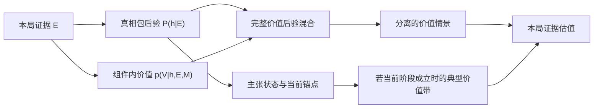

# 掌眼 V3：阶段阈值与估值映射研究

> **状态：`Reviewed / Evidence / Provisional Calibration`（2026-08-14）。** 本文服务于第一张纸模和后续参数校准，不是现实古董鉴定标准，不是已经验证的游戏平衡，也不授权产品代码实现。独立复核已经把会造成阈值闪烁、证据重复计权和多峰区间误导的早期候选剔除。

## 要回答的问题

在玩家不断取得新证据时，系统怎样同时做到：

1. 不用无依据的“后验超过 50%”直接宣布一个阶段成立；
2. 让已取得的阶段成果稳定，但仍能被真正的反证质疑或降级；
3. 允许阶段尚未升级时，微弱证据已经改变同阶段估值或打开更高价值情景；
4. 在阶段跨越时产生清楚的认知跳变，却不额外给价格乘奖励系数；
5. 让玩家明白系统估值只对本局已见证据负责，不是器物真价、市场接受区间或成交保证。

## 当前项目边界

- 客观真相和市场上下文开局固定；本局证据只改变系统对真相与价值的认识；
- 中间节点是可被支持、削弱或反驳的鉴定主张，“节点 2／4”只是此前解释例子；
- 阶段主张成立是可主动停手的阶段成果，不自动结束游戏；
- 首切片没有器物物损，调查机会和专业检测费进入成本账，不进入器物价值；
- 系统形成本局证据估值，玩家另行提交一次挂牌价，市场再按客观真相独立结算；
- 局末成交／未成交后才揭示完整真相、作者拓扑和玩家路线。

## 证据身份

- **[来源事实]**：来源直接支持；
- **[掌眼推论]**：从来源与项目边界推导出的设计选择；
- **[首轮默认]**：为了纸模能够运行而选择的可回退数值；
- **[待验证]**：只能由第一拓扑的场景演算、模拟或无答案玩家测试回答。

## 结论先行

1. **不存在现实行业通用的“75% 即鉴定成立”。** 75% 只作为首轮进入门：它等价于把错误建立主张的损失暂按错误延后建立的 3 倍处理。这个损失比是项目选择，不是古董行业常数。
2. **阶段不是单一阈值。** 首轮采用 `75% 进入／50% 退出` 的迟滞锚点，但进入还必须通过本局证据证明规则；`contested` 由未解决硬反证或必要证明冲突触发，不由 74.9% 这样的数值波动自动触发。
3. **结构门不能补救已经发生的重复计权。** 同源或相关观察必须先在联合似然、共同潜变量或推断单元中处理；同一观察只更新一次。开局先验再高，也不能自动授予阶段。
4. **价值底层使用完整后验预测混合，不设置阶段倍率。** 一般式为 `p(V|E,M)=Σ_h p(V|h,E,M)P(h|E)`；新证据既能改变真相包权重，也能改变同一真相包内部的价值分布。
5. **玩家估值不能被压成一条跨过概率空谷的连续区间。** 首轮显示一个带明确条件的阶段典型带，并把显著的替代价值情景拆开；阶段跨越改变主报告锚点和信息层级，而不改写底层价值。

---

## 一、阶段进入：为何不是固定 50%

### 1.1 阈值来自误判损失

**[来源事实]** 贝叶斯决策选择后验期望损失较小的行动。二元决策只有在两类错误损失对称时才自然得到 50% 阈值；损失不对称时，阈值随损失比改变。[Yihong Wu, *A Modern Introduction to Bayesian Statistical Learning*, Chapter 5](https://www.stat.ucla.edu/~ywu/Bayesian.pdf)

令：

- `p=P(C|E)`：本局证据 `E` 下主张 `C` 的支持度；
- `L_FE`：主张不成立却宣布成立的损失；
- `L_FD`：主张成立却继续延后的损失。

在这个简化的两行动比较中，建立主张的条件为：

`p > L_FE / (L_FE + L_FD)`

**[掌眼推论]** 系统过早给出较硬结论，比要求玩家再调查一步更损害“证据足够才承诺”的核心体验。因此首轮让 `L_FE:L_FD=3:1`，派生 `p_enter=0.75`。

**边界：** 75% 只表示掌眼暂时选择了 3:1 的体验损失比。它不表示现实专家会给出 75% 数字，也不保证这个节奏好玩。主张硬度不能自动按拓扑深度增加；若某主张需要更高门槛，内容作者必须记录具体错误建立代价。

### 1.2 粗主张支持度是所含真相包的概率和

**[掌眼推论]** 若多个细真相包都推出粗主张 `C`：

`P(C|E)=Σ_{h⇒C} P(h|E)`

因此，两个分别为 42% 和 36% 的细真相包可以共同让“旧胎基本成立”获得 78% 支持；不要求任一完整真相包单独超过 50%。

### 1.3 当前局证明规则不可省略

**[来源事实]** RICS 的艺术与古董估值规范要求核查资料、判断可靠性、记录来源和调查限制，并考虑出处、状态、法证检查和专家输入；它没有给出“统一两条证据”之类的行业门槛。[RICS Red Book, VPGA 7](https://www.rics.org/content/dam/ricsglobal/documents/standards/Red-Book-Global-Standards-incorporating-IVS.pdf)

**[掌眼推论]** 每个可建立主张都应有作者配置的 `proofRule`，至少说明：

- 本局必须取得哪些必要证据维度或替代证明组；
- 哪些观察共享来源、痕迹、仪器或推断前提；
- 哪些反证只是削弱，哪些会阻断或逻辑否定主张。

开局先验不能满足 `proofRule`。即使某主张先验为 90%，没有本局取得的必要证明，也只能是候选，不能成为已建立阶段。

**独立复核修正：** “至少两组独立证据”和“领先竞争者 15 个百分点”没有现实统一依据，也不能防止先独立相乘造成的重复确信，故不保留为全局默认。第一拓扑可按文化和物证逻辑配置具体证明组，但不能只填一个全局数量。

### 1.4 证据依赖必须在更新前建模

**[来源事实]** 条件依赖被错误当成独立证据时，后验可被系统性夸大；相关诊断证据研究也显示忽略依赖会造成偏差和覆盖恶化。[BMC Medical Research Methodology, 2023](https://pmc.ncbi.nlm.nih.gov/articles/PMC9999546/)

**[掌眼推论]** V3 至少需要：

- 每个可更新观察有唯一 `observationId`，同一观察只计一次；
- 共享来源或共同痕迹的观察归入同一 `inferenceUnitId`；
- 作者使用联合似然、共同潜变量或证据组级更新表达依赖；
- “来源组数量”只做可解释证明检查，不代替概率依赖模型。

这明确拒绝 V2 的“按 evidence id 去重后将所有似然朴素相乘”作为 V3 数值权威。

---

## 二、阶段状态：借顺序检验的三域，不搬公式

**[来源事实]** Wald 的顺序检验允许每次新观察后接受、拒绝或继续观察；NIST 的实践说明强调阈值与两类错误伤害有关，错误容许越严通常需要更多观察。[Wald, 1945](https://doi.org/10.1214/aoms/1177731118)；[NIST SP 500-256, Appendix C](https://nvlpubs.nist.gov/nistpubs/Legacy/SP/nistspecialpublication500-256.pdf)

**[掌眼推论]** 掌眼 Borrow “成立／未决／反驳”的语义，Reject 二元、独立样本、达到结论即终止的原公式。玩家主动选证据，主张又可重叠和包含，所以阶段必须是派生状态机。

对于已经建立的锚点，首轮另比较两类迟滞损失：`L_FR` 表示主张实际已不成立却继续保留锚点，`L_FX` 表示主张实际仍成立却错误退出。保留锚点的简化条件同样是 `p>L_FR/(L_FR+L_FX)`；首轮暂设 `L_FR:L_FX=1:1`，得到 50% 退出线。这不是现实鉴定常数，也不表示两类体验伤害已经被测量，只是让已取得成果比尚未建立的候选稳定的可回退默认。

### 首轮状态规则

| 状态变化 | 首轮规则 | 不能被解释成 |
|---|---|---|
| `candidate → established` | `support≥0.75`，本局 `proofRule` 通过，且无未解决阻断反证 | 现实鉴定标准；先验自动过线 |
| 保留 `established` 锚点 | 建立后只要 `support≥0.50` 且未被逻辑否定，继续保留当前阶段锚点 | 系统仍保持原有确信度 |
| 叠加 `contested` | 出现未解决硬反证、必要证明组冲突或证明有效性争议 | `support<0.75` 自动闪烁 |
| 退出当前锚点 | `support<0.50`，或作者规则判定为硬逻辑反驳 | 整条证据链坍塌、清空全部认识 |
| 重新进入 | 再次达到 `0.75` 且本局证明和反证门重新通过 | 从 50% 立即弹回已建立 |

退出后落回最近仍成立的父级／粗级主张；这符合“靠右阶段较硬，降级通常不会整体坍塌”的已确认理解。

**关键区分：**

- `hard counterevidence`：尚待解释、但足以让当前锚点受质疑的冲突证据；
- `logical refutation`：按作者已声明关系，使当前主张不可能成立的事实或组合。

因此没有 `contestSupport=0.60` 这条全局线。早期 60% 候选会让受质疑状态由数值边界而非证据语义触发，独立复核后 Reject。

---

## 三、现实估值只给边界，不给游戏常数

**[来源事实]** RICS／IVS 将市场价值视为特定日期、市场、交易前提下的估计金额；艺术与古董在批发、零售、拍卖等渠道可有不同价格，出售方法、出处、状态、信息可靠性和市场条件都会影响结论。[RICS Red Book, VPS 2 与 VPGA 7](https://www.rics.org/content/dam/ricsglobal/documents/standards/Red-Book-Global-Standards-incorporating-IVS.pdf)

**[来源事实]** IVSC 区分估值过程错误与价值本身的不确定性：严谨估值仍可能存在一组可信结果；透明说明不确定性不是失败。[IVSC, *Managing and Communicating Value Uncertainty*](https://ivsc.org/managing-and-communicating-value-uncertainty/)

**[掌眼推论]** 第一切片固定估值用途和市场上下文，但系统估值仍可以错。调查费用只影响净结果，不直接扣减器物价值；玩家报价和市场成交也不能倒推系统当时的推理必然正确或错误。

每个内容价值模型后续应记录：适用真相包、渠道、市场版本／日期、资料来源、假设、分布形状和不确定性来源。首切片不接实时市场数据库。

---

## 四、估值函数：证据能改权重，也能改组件内部

### 4.1 一般式

**[来源事实]** 后验预测把未知状态上的不确定性积分／混合进结果分布；有限混合通常可以多峰。[Stan User’s Guide: Posterior Prediction](https://mc-stan.org/docs/stan-users-guide/posterior-prediction.html)；[Finite Mixtures](https://mc-stan.org/docs/stan-users-guide/finite-mixtures.html)

对固定市场上下文 `M`：

`p(V|E,M)=Σ_h p(V|h,E,M)P(h|E)`

- `h`：完整真相包；
- `E`：经过依赖处理的本局证据；
- `P(h|E)`：真相包后验，是主张支持度的唯一概率权威；
- `p(V|h,E,M)`：在该真相包、当前证据和固定市场下的价值分布。

只有当真相包已穷尽全部价值相关属性，而且给定 `h` 后新证据与价值条件独立，才可简化为：

`p(V|E,M)=Σ_h p(V|h,M)P(h|E)`

这正是用户所说 `f(x)` 的正式落点：阶段未升级时，新证据仍可改变真相包权重，也可在同一真相包内部收窄修复程度、品相或市场可接受性的价值分布。

价值分布只要求**非负**，不要求严格大于零；应允许无市场／零实现价值的点质量或 hurdle 结构。

### 4.2 阶段不进入价值公式

不存在：

`value × stageMultiplier`

也不把调查费从估值中扣除。阶段是对后验的只读摘要；阶段跨越改变系统愿意把哪一项主张作为主要报告锚点，但不奖励价格。

### 4.3 为什么单一分位区间不够

若价值以 50% 概率落在 4,000、50% 概率落在 8,000，中间价格几乎不可能；`Q25–Q75` 却会显示成连续的 `4,000–8,000`。同样，当高值点质量从 9.9% 变成 10.1%，`Q90` 可从 4,000 突然跳到 8,000。这个跳变只是分位数算法悬崖，不是阶段语义或现实规律。

**结论：** Reject 用 Q90 充当“高价值上尾激活器”，也 Reject 把多峰后验压成一条最小—最大连续带。高价值分支应以自己的证据、后验质量和价值情景单独显示。

### 4.4 首轮报告映射

**[首轮默认]**：

1. 后台永久保留完整价值分布，不只保存上下界；
2. 主要报告带使用当前已建立主张条件下的 **50% 最高密度区域**，文案必须是“若当前阶段判断成立时的典型价值带”；多峰时允许返回分离区域；
3. 完整证据分布的 **80% 最高密度区域**只作次级“证据估值区域”，同样允许多段，不能叫市场接受区间或全部可能范围；
4. 有本局直接支持、后验质量至少 **5%** 的独立高价值情景，即使未进入 80% 摘要，也作为单独上探情景显示；5% 只是首轮 UI 降噪值；
5. 玩家界面最多并列 **3 个**价值情景，后台不删除其余分支；超过时按后验质量与价值决策相关性合并或进入展开层；
6. 阶段跨越只切换主要锚点、标题、顺序和强调层级；替代情景及反证仍保留。这允许报告出现清楚跳变，而底层价值函数没有奖励性跳变。

条件典型带必须同时展示当前阶段文字、支持它的本局证据理由和仍未解决的反证。普通玩家默认不见精确后验进度条，作者／调试视图保留完整数值。

`50%／80%／5%／3 个` 都是可回退的首轮信息密度选择，不由 RICS、Stan、IPCC 或英格兰银行证明为“正确游戏数值”。

---

## 五、可理解性研究给出的限制

**[来源事实]** IPCC 使用校准概率语言，但公众对概率词的理解仍有系统偏差；把词语和数值范围共同展示通常比只给词语一致。[IPCC AR6 WGI, Chapter 1](https://www.ipcc.ch/report/ar6/wg1/chapter/chapter-1/)；[Budescu, Por & Broomell, 2012](https://doi.org/10.1007/s10584-011-0330-3)

**[来源事实]** 英格兰银行 2026 年受控研究发现分布式图形有助于同时理解中心和不确定性；但 2024 年对真实预测传播的复盘批评复杂扇形图关注度低并可能制造假精确。[McMahon et al., 2026](https://www.bankofengland.co.uk/working-paper/2026/anchors-aweigh-the-effect-of-communicating-forecast-uncertainty)；[Bernanke Review, 2024](https://www.bankofengland.co.uk/independent-evaluation-office/forecasting-for-monetary-policy-making-and-communication-at-the-bank-of-england-a-review/forecasting-for-monetary-policy-making-and-communication-at-the-bank-of-england-a-review)

**[掌眼推论]** Borrow “中心＋不确定性＋原因”的分层表达，Reject 把完整扇形图、精确概率进度条或单个无条件价格范围直接搬进手机界面。

第一轮无答案测试至少要让玩家回答：

1. 典型价值带的“若当前判断成立”是什么意思；
2. 为什么阶段没升级，高价值情景仍会出现或增强；
3. 系统估值是否保证按该价格成交。

答不清时，优先改名称、例子和信息层级，不先偷偷调统计阈值。

---

## 六、本地数值接缝审查

V2 没有“系统后验跨阶段”或出售计时器。以下旧数值不得静默继承：

| V2 接缝 | 原语义 | V3 判断 |
|---|---|---|
| `0.55 / 0.75 / 0.90` | 玩家手动提交的置信档，用于判断评分 | **Reject** 为 V3 阶段门；与系统后验不是一回事 |
| evidence id 去重后朴素似然相乘 | V2 平铺真相后验 | **Reject**；V3 必须先处理依赖推断单元 |
| `Q10–Q90` 并强行包含均值 | V2 玩家估值摘要 | **Reject** 为 V3 完整价值表达；会隐藏小于 10% 的高值分支并跨多峰空谷 |
| `Q20 - 已付费用 - max(5,Q50×8%)` | V2 保守参考报价 | **Reject**；混淆估值、成本和策略建议 |
| `8%` 重估触发及 NPC 议价倍率 | 玩家从 NPC 购买的旧协商模型 | **Reject**；与 V3 持物一口价挂牌方向相反 |
| 版本化 ruleset、seed、replay | 技术基础设施 | **Adopt** 架构；所有新数值仍需重新校准 |

V3 后续要把“技术容差、内容参数、UI 摘要、验证阈值”分开登记；测试样本量和通过线不能变成生产玩法参数。

---

## 七、Adopt / Borrow / Reject / Unknown

### Adopt

- 真相包后验是概率唯一权威，主张只读派生；
- 相关证据在更新前建模，同一观察只计一次；
- 价值使用后验预测混合，允许证据改变组件权重与组件内价值；
- 系统估值、玩家挂牌和客观市场结算三轨分离；
- 参数集中、版本化并追加记录每次修改原因和验证身份。

### Borrow

- 借贝叶斯损失敏感决策，首轮以 `3:1→75%` 作进入默认；
- 借顺序检验的成立／继续／反驳三域，不搬二元检验公式；
- 借估值规范的目的、渠道、资料、限制和不确定性披露；
- 借不确定性沟通的分层表达，压缩为条件典型带＋分离价值情景。

### Reject

- 50%、75% 或任何单一比例被说成现实鉴定标准；
- 先独立相乘似然，再用“结构门”假装修复重复计权；
- 开局先验自动授予阶段；
- 全局两组证据、15 个百分点竞争领先、60% 自动争议线；
- Q90 或 Q95 充当上尾出现门；
- 单条连续区间跨过多峰空谷；
- 阶段价值倍率、估值减调查费、市场读取系统估值。

### Unknown

- 75%／50% 是否形成合适的早期建立与后期稳定节奏；
- 50%／80% 最高密度区域、5% 情景可见线和最多 3 个情景是否易懂；
- 第一件器物的证据依赖、价值分布、调查成本和市场接受宽度；
- 普通玩家是否需要看粗粒度支持度，或只看主张状态和证据理由；
- 是否存在“首阶段就停”“永追高值尾”“固定报典型带上沿”等支配策略。

## 八、参数登记表

| 参数 ID | 首轮默认 | 身份 | 直接控制 | 明确不控制 | 重开触发 |
|---|---:|---|---|---|---|
| `claim.enterOddsDefault` | `3.0` | 项目损失比默认 | 普通主张首次建立 | 现实鉴定标准 | 建立过早／过晚 |
| `claim.enterSupportDefault` | `0.75` | 由 3:1 派生 | 概率进入门 | 单独授予阶段 | 损失比或节奏改变 |
| `claim.exitOddsDefault` | `1.0` | 错误保留／错误丢弃损失的首轮迟滞默认 | 已建立锚点概率退出 | `contested` 触发 | 锚点过稳／过脆 |
| `claim.exitSupportDefault` | `0.50` | 由上述 1:1 迟滞损失派生 | 概率退出门 | 清空父级认识 | 降级轨迹失真 |
| `claim.contestedSupport` | `null` | Reject 全局数值线 | 无 | 74.9% 自动闪烁 | 只在证据语义无法表达时重开 |
| `claim.priorOnlyEstablishment` | `false` | 已采用边界 | 必须有本局证明 | 开局概率展示 | 仅用户重开阶段含义 |
| `claim.autoDepthEscalation` | `false` | 已采用边界 | 门槛不得按图深度自动增加 | 单项主张有据可查的覆写 | 内容证明需要不同损失比 |
| `evidence.countObservationOnce` | `true` | 概率不变量 | 防重复更新 | 证据叙事展示次数 | 不重开 |
| `evidence.globalMinIndependentGroups` | `null` | Reject 全局常数 | 由 `proofRule` 逐主张定义 | 概率依赖建模 | 第一拓扑证明需要共用模式 |
| `valuation.stageTypicalMass` | `0.50` | 首轮信息密度默认 | 条件典型最高密度区域 | 完整后验／市场接受带 | 玩家误解或过宽／窄 |
| `valuation.evidenceSummaryMass` | `0.80` | 首轮信息密度默认 | 次级完整证据摘要 | 高值情景可见门 | 多峰表达或理解失败 |
| `valuation.scenarioVisibilityMass` | `0.05` | 首轮 UI 降噪默认 | 有直接支持情景的可见性 | 后台删除分支 | 稀有情景被隐藏／支配 |
| `valuation.maxVisibleScenarios` | `3` | 首轮移动端容量默认 | 首层同时展示数量 | 后台模型容量 | 信息过载／关键信息丢失 |
| `valuation.stageMultiplier` | `null` | Reject | 无 | 价值跳变奖励 | 只有价值模型整体重定义 |
| `valuation.allowZeroMass` | `true` | 模型边界 | 支持零实现价值 | 直接决定某案有零价值 | 内容模型不需要时仍可保留 |
| `market.consumeRunValuation` | `false` | 已批准职责边界 | 市场接口隔离 | 市场按真相结算 | 只有用户重开三轨边界 |
| `listing.totalSeconds` | `60` | 用户批准的表现节奏 | 挂牌展示总时长 | 现实市场时长 | 等待体验失败 |
| `listing.segmentCutsSeconds` | `[20,40,60]` | 用户批准的表现节奏 | 三段结果反馈 | 市场真值分布 | 等待体验失败 |
| `ui.priceRoundingQuantum` | `Unknown` | 第一器物依赖 | 显示精度 | 内部计算精度 | 价值尺度确定后 |

未来参数实现应至少保存：`parameterId / family / ownerModule / scope / unit / provisionalDefault / allowedRange / sourceBasis / decisionStatus / affects / explicitlyDoesNotAffect / calibrationMethod / invariantTests / playtestMetric / lastChangedReason / reopenTrigger / rulesetVersion`。

每次变更必须追加旧值、新值、理由、证据、预期影响、保持不变面、实现／自动验证／玩家验证状态和回退条件；不能只覆盖“当前正确值”。

## 九、验证边界与下一证据

文献和数学反例可以排除错误结构，但不能证明这些默认值可玩。下一步应先把它们放进第一张完整器物纸面拓扑，做确定性场景枚举；随后另立 Critical verification contract，再决定模拟样本、通过阈值和真人任务。

至少覆盖：

- 极端先验、本局无证据、相关证据和重复观察；
- 75% 附近建立、50% 附近降级、未解决反证与硬逻辑反驳；
- 阶段未升级但组件内价值移动；
- 低／高双峰和低于 10% 的高值分支；
- “首阶段就停、永远追尾、固定报典型带上沿、固定报证据摘要上沿”四类候选支配策略；
- 玩家能否区分系统估值、自己的挂牌价和市场结果。

## 来源

### 本地基线

- [V3 定量真相、信息价值与收手研究](2026-08-14-quantitative-truth-value-of-information-and-stopping-research.md)
- [DEC-017：阶段主张、手动停手与一口价挂牌](../../decisions/DEC-017-v3-stage-claims-stopping-and-fixed-price-listing.md)
- [Project Compass](../../00-PROJECT-COMPASS.md)
- [Current State](../../02-CURRENT-STATE.md)

### 原始论文、官方规范与第一方实践

1. Abraham Wald (1945), [*Sequential Tests of Statistical Hypotheses*](https://doi.org/10.1214/aoms/1177731118).
2. NIST, [SP 500-256, Appendix C](https://nvlpubs.nist.gov/nistpubs/Legacy/SP/nistspecialpublication500-256.pdf).
3. Yihong Wu, [*A Modern Introduction to Bayesian Statistical Learning*](https://www.stat.ucla.edu/~ywu/Bayesian.pdf).
4. RICS, [*Valuation – Global Standards*, VPS 2 and VPGA 7](https://www.rics.org/content/dam/ricsglobal/documents/standards/Red-Book-Global-Standards-incorporating-IVS.pdf).
5. IVSC, [*Managing and Communicating Value Uncertainty*](https://ivsc.org/managing-and-communicating-value-uncertainty/).
6. Stan Development Team, [Posterior Prediction](https://mc-stan.org/docs/stan-users-guide/posterior-prediction.html) and [Finite Mixtures](https://mc-stan.org/docs/stan-users-guide/finite-mixtures.html).
7. IPCC AR6 WGI, [Chapter 1](https://www.ipcc.ch/report/ar6/wg1/chapter/chapter-1/).
8. Budescu, Por & Broomell (2012), [*Effective communication of uncertainty in the IPCC reports*](https://doi.org/10.1007/s10584-011-0330-3).
9. Ben Bernanke (2024), [Bank of England forecasting review](https://www.bankofengland.co.uk/independent-evaluation-office/forecasting-for-monetary-policy-making-and-communication-at-the-bank-of-england-a-review/forecasting-for-monetary-policy-making-and-communication-at-the-bank-of-england-a-review).
10. Michael McMahon et al. (2026), [*Anchors aweigh? The effect of communicating forecast uncertainty*](https://www.bankofengland.co.uk/working-paper/2026/anchors-aweigh-the-effect-of-communicating-forecast-uncertainty).
11. [Conditional-dependence study](https://pmc.ncbi.nlm.nih.gov/articles/PMC9999546/).

## 研究停止点

外部资料已足以决定模型结构与排除项：损失敏感阈值、证据依赖、后验预测价值、估值职责和多峰沟通都有互相独立的支持或反例。继续搜索不会替项目回答“75/50、50/80、5% 和 3 个情景是否好玩”。因此本轮在这里停止文献扩张，把这些数字作为可追溯的 **Experimental defaults** 交给第一拓扑与后续验证，而不是冒充现实规律。
