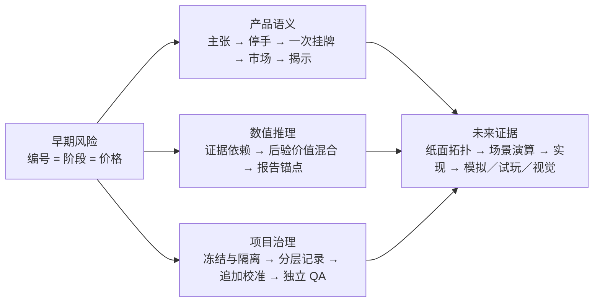

# 作品集过程资产候选：从阶段数字到证据与数值治理

> **身份：`Derived / Portfolio Process Candidate`。**
> 本文由 2026-08-14 的研究、Decision 与项目状态派生，只保存一个可供未来筛选的设计转折；它不属于迁入 V3 的六项原始证据哈希集合，也不是产品实现或最终作品集页面。

日期：2026-08-14

## 一句话转折

V3 今天没有增加一批玩法或画面，而是先把“系统能主张什么、玩家要承担什么、数值凭什么成立”拆清：鉴定、停手、报价和市场结果各负其责；任何暂定数字都保留来源、身份和后续重开路径。

## 三项升级

| 层次 | 先前风险 | 今天形成的变化 |
|---|---|---|
| 产品决策 | 把节点编号误当固定阶段，把阶段成果误当自动终点，或把估值与成交混成一条价格轴 | 中间节点改为可支持／削弱／反驳的鉴定主张；玩家手动停手并承担一次挂牌；系统估值、玩家报价和客观市场分轨 |
| 思考方式 | 用节点位置或阶段价格跳变解释进展，把现实资料中的数字直接搬成玩法常数 | 先处理证据依赖，再混合后验价值；阶段只改变系统报告锚点；现实研究只约束结构，具体数字保持 Experimental |
| 项目构建 | 设计来源、批准状态、实现和验证容易混写，参数修改可能只覆盖“当前值” | 冻结 V2、隔离 V3；分层保存原话／研究／Decision／Experimental／验证；参数集中登记并追加校准历史，由独立 QA 检查边界 |

## 1. 产品决策升级：把一次鉴定闭环拆成三种责任

- **鉴定主张取代编号阶段。** “节点 2／4”只保留为解释例子；正式中间节点是能被本局证据建立、质疑、反驳或降级的主张。
- **阶段成果不自动结束。** 主张成立只是一个可以平庸获胜的停手点；玩家可继续调查，也可回到仍稳定的较粗主张收手，但已消耗的机会和检测费用不退。
- **首切片取消器物物损。** 调查消耗机会，专业检测另付费用；调查按钮不改变器物品相。
- **停手后只挂牌一次。** 系统先冻结本局证据、主张、不确定性与证据估值；玩家再自行报一个固定价，每局只有一次挂牌和一次市场结算，不改价重试。
- **三轨互不改写。** 系统估值只为本局已取得的证据负责；玩家挂牌价表达自己的经济承诺；客观市场按固定真相、渠道规则与 seed 独立结算。赚钱不自动证明推理正确，未成交也不自动证明当时的证据判断错误。
- **结果后才完整揭示。** 成交或挂牌期满未成交后，才展示客观真相、作者完整拓扑与玩家路线；结果前不泄露市场价值带、隐藏答案或唯一最优路径。

这组语义由 [DEC-017](../../decisions/DEC-017-v3-stage-claims-stopping-and-fixed-price-listing.md) 固定；它目前是已决定、未实现、未通过玩家验证的产品边界。

## 2. 思考方式升级：阶段不是价格按钮

- **先问证据是否独立，再问支持度有多高。** 同源观察先进入推断单元或联合似然，同一观察只更新一次；全局“几条证据”不能修复重复计权。
- **价值来自后验混合。** 新证据既可以改变各真相包的权重，也可以改变同一真相包内部的品相、修复程度等价值分布；阶段没有 `stageMultiplier`。
- **阶段只改变报告锚点。** 跨越阶段时，系统改变主要标题、典型价值情景和强调层级；阶段未升级时，同阶段价值仍可移动，也可出现证据较弱但值得保留的高价值情景。
- **现实资料不冒充玩法常数。** `75%／50%` 进入与退出、`50%／80%` 价值摘要、`5%` 情景可见线和最多 `3` 个情景，都是为了首张纸模可演算而登记的 Experimental 默认，不是现实古董鉴定或市场规律。

完整来源、反例与 Adopt／Borrow／Reject／Unknown 分类见 [阶段阈值与估值映射研究](2026-08-14-stage-threshold-and-valuation-mapping-research.md)；当前可回退政策见 [DEC-018](../../decisions/DEC-018-v3-provisional-claim-thresholds-and-valuation-projection.md)。

## 3. 项目构建方式升级：先保存理由，再允许数字变化

- V2 保持冻结的可运行、可回放基线；V3 在独立 worktree 中只推进设计记录，没有借“启动新版”静默改写旧产品。
- 原始用户表达回答“当时怎样想”，研究回答“外部证据怎样修正”，Decision 回答“项目采用什么”，Experimental 回答“暂时怎样演算”，验证再回答“它是否成立或可玩”。
- 每个材料性参数后续都要分开登记来源主张与项目推断、决策／实现／校准状态、影响面与不影响面、验证指标、备用值和重开条件；同族内容参数集中治理，调整时追加旧值、新值、理由、证据和回退机制，不覆盖原始决定。
- 独立 QA 已用于检查研究归因、数学反例、记录一致性与责任边界；它不替代纸模、模拟、真人理解、趣味或视觉验收。

## 今天明确没有完成的内容

截至 2026-08-14：**没有产品代码改动，没有第一张完整纸面拓扑，没有确定性场景演算或数值模拟，没有真人试玩，也没有移动端界面或其他视觉成果。** 当前真实状态与后续检查点见 [Current State](../../02-CURRENT-STATE.md)。

因此，这份资产只能证明项目完成了一次可追溯的设计与数值治理升级；它不能证明玩法已经成立、平衡、易懂、有趣或适合作品集发布。

## 最终作品集怎样使用

如果未来实现与玩家证据成立，这个过程节点最多占**一页，或一个跨页中的一个转折片段**：用简短前后图说明“编号／阶段价格跳变”如何被改写成“证据依赖／后验价值／三轨经济闭环”，旁边必须配对同一切片的最终界面、真实玩家路径或盲测结论。

若缺少未来实现、模拟／试玩和视觉成果，这份文档继续留在私有过程证据中，不独立包装成已完成的作品集成果，也不与六项原始哈希证据混同。

## 派生依据

- [DEC-017：阶段主张、手动停手与单次一口价挂牌](../../decisions/DEC-017-v3-stage-claims-stopping-and-fixed-price-listing.md)
- [DEC-018：暂定阶段阈值、证据依赖与估值投影政策](../../decisions/DEC-018-v3-provisional-claim-thresholds-and-valuation-projection.md)
- [阶段阈值与估值映射研究](2026-08-14-stage-threshold-and-valuation-mapping-research.md)
- [Current State](../../02-CURRENT-STATE.md)
