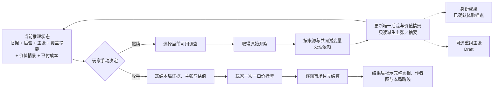
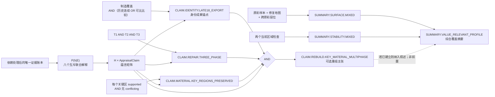
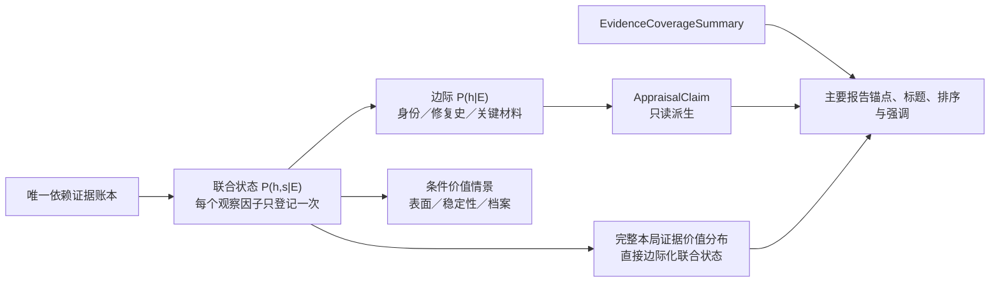

# 第一器物纸面证据拓扑 v0.1：先建立身份，再分解重组、原彩与稳定性

Status: Superseded Design Candidate / Structural Substrate Retained

日期：2026-08-15

## 这份纸模要解决什么

本文件把 DEC-021 已固定的“珠江商馆与帆船图外销瓷大碗”客观真相，第一次拆成可以逐项审查的作者侧证据拓扑。它曾把主要乐趣解释为：

> 玩家先依靠本局普通证据挣得“18 世纪末中国外销瓷基本成立”的稳定但不完整成果，再决定是否为重组、原彩、稳定性与价值继续补证；游戏不依赖局末真假反转制造高潮。

2026-08-16 的用户澄清证明这段解释过窄：第一切片需要三档清楚结果，结果 2 同时包含身份与显著重组／补绘基本成立，结果 3 是后段多证据链的较硬汇合；证据顺序仍然开放。故本文件的**阶段覆盖层已经由 DEC-022 替代**，不能再作为当前阶段规格或直接进入场景演算。事实分账、联合依赖后验、分轴、替代／回退、区域覆盖和经济终局等结构底稿继续保留，当前候选规格见 [第一器物三档作者模型 v0.2](2026-08-17-first-ceramic-three-result-author-model-v0-2.md)。

v0.1 已吸收两轮独立对抗复核：把身份、修复史、关键材料与表面／稳定性价值情景分轴；删除外来碎片真假题；补上时间、区域、层位、推断 Finding 和轴路由合同。它正确拒绝把证据取得顺序写成固定线性流程，却错误地进一步取消了第一切片所需的三档结果节奏；这一处由 DEC-022 纠正。原结构从未通过场景演算。

## 权威与状态边界

| 内容 | 当前身份 |
|---|---|
| 阶段主张语义、玩家手动停手、成本保留、无器物物损、一次挂牌、三轨经济、结果后揭示 | Approved / Active，来自 DEC-017 |
| 同器原片、多阶段修复、正向／负向／转向深挖以及游戏性优先作者边界 | Approved / Active，来自 DEC-021 |
| 75% 进入、50% 退出迟滞以及 50%／80% 估值投影等 | Experimental，来自 DEC-018；本文件只引用，不新增或校准 |
| 本文件的节点、边、主张命名、`proofRule`、行动开放关系、候选解释是否穷尽 | Draft，等待纸面演算与共同审查 |
| 似然、第一器物价格、检测费金额、调查机会数量、市场接受带、UI、代码 | Unknown / Not authorized |

现有研究在本决策问题上仍然匹配，未发现需要重新联网扩张证据门：

- **Adopt：** 从结论反向画作者 thought path；核心理解必须有普通可达与恢复路径；玩家侧只投影已知事实；
- **Borrow：** 分叉—汇合、替代证据、延迟回响、阶段落脚点与当前假设驱动下一行动；
- **Reject：** 把完整作者图给玩家、单项高级检测答案键、随机永久删除核心线索、同源观察重复计权；
- **Unknown：** 玩家知识图交互、精确数字显示、动作成本和似然校准、提示强度与趣味。

## v0.1 当时的人话版结构（阶段解释已废止）

v0.1 当时只保留一个身份成果锚点，再把历史／材料、表面和稳定性放成可交错的并列细化。这张循环图只说明“证据—判断—收手—经济终局”分账，**不再代表当前阶段节奏**。当前作者结构是“开放证据网＋三档结论门”，见 DEC-022；玩家仍始终可以手动停止。



玩家不必达到任何主张才能收手，任何主张也不会自动结束。这一条继续有效。图中“只有身份成果是体验锚点”的含义已经废止；第一陶瓷切片采用三档结果，但它们不规定证据取得顺序，也不是未来所有器物的全局固定阶段数。

## 分账：哪些东西不能画成同一种节点

| 类型 | 本纸模中的职责 | 结果前可见性 |
|---|---|---|
| `ObjectiveTruthFact` | DEC-021 固定的生平、空间材料、修复、原彩、稳定性与档案真相 | 隐藏；市场结果后揭示 |
| `HypothesisBundle` | 身份 × 修复史 × 关键材料状态的合法组合；互斥穷尽，不重复承载表面和稳定性 | 后台；前台粒度仍 Unknown |
| `ObservationFact` | 玩家实际取得的原始观察或文档内容；每项有唯一 `observationId` | 取得后可见 |
| `InferenceUnit` | 把共享痕迹、事件、文档原件或检测前提的观察联合计权 | 作者／规则侧；玩家最多看“同源”提示 |
| `InferenceFinding` | 从一组原始观察只读派生的匹配、连续、层位或相容结论；继承全部输入依赖，不生成第二个似然因子 | 可投影自然语言结论 |
| `AppraisalClaim` | 可被支持、削弱、争议或反驳的鉴定主张 | 可投影状态及自然语言理由 |
| `ProofRule` | 必要维度、AND、OR、阻断反证与逻辑反驳 | 作者侧隐藏 |
| `PosteriorState` | `P(h|E)`；阶段支持度的唯一概率权威 | 后台；普通玩家默认不见精确数值 |
| `EvidenceCoverageSummary` | 把已观察区域的正反两面合并叙述；不拥有概率、不授予真假阶段 | 可投影为“已覆盖／仍未知” |
| `ValueScenario` | 给定已含关键材料状态的 `h` 后，由表面、稳定性和档案条件组合成的互斥价值情景 | 系统证据估值的条件化投影 |
| `ActionOption` | 调查目的、获取前提、调查机会与是否另付专业费用 | 玩家可见目的与代价，不显示最佳动作排名 |
| `FrozenInferenceSnapshot` | 玩家收手时的证据、阶段主张、剩余不确定性与系统估值 | 收手后冻结 |
| `ListingPrice` / `MarketOutcome` | 玩家一次挂牌与客观市场结果 | 二者都不能反写推理账 |

推断主张与覆盖摘要都不是新证据，不得再次回灌后验或价值条件；玩家自己的标注若以后进入界面，也只能是独立表达层。

## 边语义

| 边 | 只表示 |
|---|---|
| `reveals` | 行动产生观察 |
| `acquisition-requires` | 某项调查需要先知道位置、问题或文档入口 |
| `member-of` | 观察属于依赖推断单元 |
| `supports` / `weakens` | 只解释某推断单元为何改变主张支持度；数值仍只能经 `P(h|E)` 投影 |
| `hard-counterevidence` | 主张叠加 `contested`，等待反证处理 |
| `logical-refutation` | 按作者规则令主张不可能继续成立 |
| `AND-required` / `OR-alternative` | 必要证明组或替代证明组 |
| `refines` / `fallback-parent` | 细主张包含粗主张，退出时回到最近仍成立的父级 |
| `updates-posterior` | 依赖处理后的观察更新真相包后验 |
| `updates-within-h-value` | 即使阶段未升级，证据仍可改变给定解释下的表面／稳定性价值情景；同一观察不得作为第二张独立票再次使用 |
| `informs-stop` | 当前证据、主张、价值情景与成本共同进入继续／收手判断 |

逻辑依赖不是取得顺序；取得前置不是证据支持；某种顺序更划算也不是固定拓扑边。

## 候选完整解释（Draft 假设空间）

客观真相仍只有 DEC-021 固定的一份。纸模不把“是否混入别器碎片”设为玩家需要排除的核心假设；DEC-021 的所有现存瓷片均属本器保持作者真相。为避免“看见真实修复史”在模型结构上自动证明“器物够老”，`HypothesisBundle` 是三个客观维度的合法组合：

- `Identity I ∈ {REPRODUCTION, LATE18_EXPORT}`；
- `RepairHistory R ∈ {NO_THREE_PHASE, THREE_PHASE}`；
- `KeyMaterial K ∈ {KEY_RECONSTRUCTED, KEY_MATERIAL_PRESERVED}`，与身份和修复史独立成轴。

`KeyMaterial` 不用修复百分比。每个预声明关键区只判一个二元谓词：是否有连续原始陶瓷基底同时承接该区主要几何边界与主要图像基底；窄缝填补和表面调色不使它失败。四区全部通过为 `KEY_MATERIAL_PRESERVED`；任一区失败即为 `KEY_RECONSTRUCTED`，因此二者互补且没有“原片仍占多数但也有重建”的重叠世界。

这得到八个互斥、在当前作者轴上穷尽的包：

| ID | `I / R / K` | 完整解释 |
|---|---|---|
| `H.REPRO.NO_THREE_KEY_RECONSTRUCTED` | `REPRODUCTION / NO_THREE_PHASE / KEY_RECONSTRUCTED` | 晚近仿制，未发生三阶段史；至少一个声明关键区主要依赖重建材料 |
| `H.REPRO.NO_THREE_KEY_MATERIAL_PRESERVED` | `REPRODUCTION / NO_THREE_PHASE / KEY_MATERIAL_PRESERVED` | 晚近仿制，未发生三阶段史；声明关键区保留其原始陶瓷基底 |
| `H.REPRO.THREE_PHASE_KEY_RECONSTRUCTED` | `REPRODUCTION / THREE_PHASE / KEY_RECONSTRUCTED` | 非晚 18 世纪器物，但仍真实经历相对三阶段处理；至少一个声明关键区主要依赖填料／重建成形 |
| `H.REPRO.THREE_PHASE_KEY_MATERIAL_PRESERVED` | `REPRODUCTION / THREE_PHASE / KEY_MATERIAL_PRESERVED` | 非晚 18 世纪器物，也真实经历相对三阶段处理；声明关键区仍由其原始陶瓷基底承担主要形体 |
| `H.OLD.NO_THREE_KEY_RECONSTRUCTED` | `LATE18_EXPORT / NO_THREE_PHASE / KEY_RECONSTRUCTED` | 老外销瓷，未发生三阶段史；至少一个声明关键区主要依赖重建材料 |
| `H.OLD.NO_THREE_KEY_MATERIAL_PRESERVED` | `LATE18_EXPORT / NO_THREE_PHASE / KEY_MATERIAL_PRESERVED` | 老外销瓷，未发生三阶段史；声明关键区保留原始陶瓷基底 |
| `H.OLD.THREE_PHASE_KEY_RECONSTRUCTED` | `LATE18_EXPORT / THREE_PHASE / KEY_RECONSTRUCTED` | 老外销瓷且三阶段重大重组成立；至少一个声明关键区主要依赖填料／重建成形 |
| `H.OLD.THREE_PHASE_KEY_MATERIAL_PRESERVED` | `LATE18_EXPORT / THREE_PHASE / KEY_MATERIAL_PRESERVED` | 老外销瓷且三阶段重大重组成立；所有声明关键区仍由连续原始陶瓷基底承担主要形体；这是 DEC-021 真相的对应包 |

原彩保留多少、后加表面多广、哪些接合稳定，不再复制成 `HypothesisBundle`。它们组成给定 `h` 后的 `ValueScenario` 轴；因此一般表面或稳定性坏消息可以改变 `p(V|h,E,M)`，但不会凭空创造额外的 `h` 包。

若后续观察无法落入这些作者轴，作者／调试校验进入 `MODEL_CONFLICT` 并阻止相关主张建立，要求重开 schema；它不是默认玩家运行时状态，也不得把剩余质量硬塞进最相近的包。

### `HypothesisBundle × AppraisalClaim` 蕴含矩阵

| `HypothesisBundle` | 晚 18 世纪身份 | 三阶段修复 | 关键区原始材料保存 | 可选重组主张 |
|---|---:|---:|---:|---:|
| `H.REPRO.NO_THREE_KEY_RECONSTRUCTED` | 否 | 否 | 否 | 否 |
| `H.REPRO.NO_THREE_KEY_MATERIAL_PRESERVED` | 否 | 否 | 是 | 否 |
| `H.REPRO.THREE_PHASE_KEY_RECONSTRUCTED` | 否 | 是 | 否 | 否 |
| `H.REPRO.THREE_PHASE_KEY_MATERIAL_PRESERVED` | 否 | 是 | 是 | 否 |
| `H.OLD.NO_THREE_KEY_RECONSTRUCTED` | 是 | 否 | 否 | 否 |
| `H.OLD.NO_THREE_KEY_MATERIAL_PRESERVED` | 是 | 否 | 是 | 否 |
| `H.OLD.THREE_PHASE_KEY_RECONSTRUCTED` | 是 | 是 | 否 | 否 |
| `H.OLD.THREE_PHASE_KEY_MATERIAL_PRESERVED` | 是 | 是 | 是 | 是 |

每项 `AppraisalClaim C` 的支持度只能是 `Σ P(h|E), h⇒C`。首次建立还必须同时满足 DEC-018 的 Experimental 进入线、本局 `proofRule` 和“无未解决阻断反证”；证明清单本身不能绕过后验。综合覆盖摘要不在矩阵中，因为它不是阶段主张。

因此，身份支持度为四个 `H.OLD.*` 的后验和；三阶段修复支持度为四个 `*.THREE_PHASE_*` 的后验和；关键材料保存支持度为四个 `*.KEY_MATERIAL_PRESERVED` 的后验和；可选重组主张只读取 `H.OLD.THREE_PHASE_KEY_MATERIAL_PRESERVED`。任一轴的证据都可以在另外两轴的两侧重新分配质量，不会仅凭缺失组合间接证明身份、修复史或材料状态。

### 条件价值情景 `s`（Draft）

`s` 不再是公式占位，而是三个互斥维度的元组。规则使用优先判定保证每个世界在每一维只落入一个状态；三维笛卡尔积形成 27 个互斥情景，暂不赋似然或价格：

| 维度 | 互斥状态 | 判定边界 |
|---|---|---|
| `Surface` | `KEY_IDENTITY_IMAGE_RECONSTRUCTED` / `MIXED_CROSS_OVERPAINT` / `ORIGINAL_SURFACE_PREDOMINANT` | 先判断是否至少一个预声明身份图像的可读内容主要来自后绘；若否，再判断是否存在广域跨原彩调色或主要非身份区重建；其余归入原表面占主导 |
| `Stability` | `SYSTEMIC_RISK` / `DISPLAYABLE_LOCAL_RISK` / `DISPLAYABLE_STABLE` | 先判断风险是否破坏静态陈列前提；若否但有具名受力接合风险，归局部风险；其余归静态稳定 |
| `Documentation` | `CONFLICTED_OR_UNMATCHED` / `COHERENT_PARTIAL` / `COHERENT_SUFFICIENT` | 先判断对象／事件记录是否冲突；若无冲突但仍有年代、范围或流转缺口，归部分连贯；其余归充分连贯 |

首案的判定集合也在演算前固定：

- `keyIdentityImageZones = {Z.FRONT_FACTORY_MAIN, Z.RIGHT_SHIP_WATER, Z.INNER_CENTER}`；任一区主要可读图像锚由后绘承担，即先落入 `KEY_IDENTITY_IMAGE_RECONSTRUCTED`；
- 若没有上述情况，但 `Z.BACK_RIVERBANK` 的主要形体／图像依赖重建，或至少两个不重叠具名区的 `IF.OVERPAINT.ON_ORIGINAL` 为正，则落入 `MIXED_CROSS_OVERPAINT`；否则为 `ORIGINAL_SURFACE_PREDOMINANT`；
- `primaryLoadPaths = {Z.LOWER_BODY_FOOT, Z.LEFT_NEARSHORE_RIM}`；任一路径不满足静态陈列前提即为 `SYSTEMIC_RISK`，否则有具名局部受力风险为 `DISPLAYABLE_LOCAL_RISK`，其余为 `DISPLAYABLE_STABLE`；
- `requiredDocumentationAnchors = {对象连续, T1, T2, T3}`；任一来源／对象／事件正面冲突为 `CONFLICTED_OR_UNMATCHED`，无冲突但缺任一锚或仍有流转缺口为 `COHERENT_PARTIAL`，全部覆盖才为 `COHERENT_SUFFICIENT`。

DEC-021 客观真相对应 `Surface=MIXED_CROSS_OVERPAINT`、`Stability=DISPLAYABLE_LOCAL_RISK`、`Documentation=COHERENT_PARTIAL`。这只是固定作者世界的标签；玩家系统仍只能从本局证据形成 `P(h,s|E)`。

### 推断轴路由合同

每个 `InferenceUnit` 必须登记 `affectsHypothesisAxes[] / affectsValueAxes[] / identityBlockingMeaning`。首案默认如下；未列出权限的轴不得被更新：

| 推断组 | `affectsHypothesisAxes[]` | `affectsValueAxes[]` | 允许的身份阻断语义 |
|---|---|---|---|
| `IU.CURRENT.MANUFACTURE`、`IU.MANUFACTURE.COMPARISON` | `[Identity]` | `[]` | 胎／釉／原始彩层或制造组合直接不相容 |
| `IU.OBJECT.CONTINUITY`、`IU.PROVENANCE.OBJECT_CORROBORATION` | `[Identity]` | `[Documentation]` | 稳定锚点明确错配、图像来源伪造 |
| `IU.PROVENANCE.DOCUMENTATION_GAP` | `[]` | `[Documentation]` | `none`；流转缺口对 `Identity` 的似然恒为 1 |
| `IU.T1.*`、`IU.T2.*`、`IU.T3.*` | `[RepairHistory]` | 必要时 `[Documentation]` | `none`；真实修复史本身不能证明身份 |
| `IU.KEY_MATERIAL.*` | `[KeyMaterial]` | `[]` | `none`；材料保存只通过 h 影响价值，不回写身份 |
| `IU.SURFACE.CURRENT_VS_BASELINE`、`IU.CURRENT.REPAIR_MAP`、`IU.SURFACE.*`、`IU.OVERPAINT.*` | `[]` | `[Surface]` | `none` |
| `IU.CONDITION.*` | `[]` | `[Stability]` | `none` |

同一档案、X 射线或材料观察若参与两个联合单元，只在统一账本登记一次因子，再在允许轴上联合更新。`F.PROV.AUCTION` 与 `F.PROV.GAP` 即使来自同一档案链，也必须先按共享来源折叠，再分别路由；其中 gap 分量满足 `P_new(Identity)=P_old(Identity)`，不能靠多次小幅下调绕过身份阻断反证合同。特别是紫外、原彩试窗、跨原彩调色和状态检查不得改变 `Identity / RepairHistory / KeyMaterial`；一般表面与稳定性坏消息因此不能机械击穿身份或可选重组主张。

## 调查动作

所有行动都消耗调查机会；只有专业检测／评估另付检测费用。具体机会数、费用金额和行动开放时点仍为 Unknown。为避免一项 provenance 行动包办全局，历史图像定位、同一器物核对和后续流转链核对在结构上拆成三个动作。

| ID | 玩家看到的调查目的 | 主要产出 | 获取前提（Draft） | 专业费用 | 明确不能回答 |
|---|---|---|---|---|---|
| `A.OBSERVE.WHOLE` | 记录胎釉、器形、装饰与可见修复的原始形态 | `F.CRAFT.BODY`、`F.CRAFT.DECOR`、`F.REPAIR.VISIBLE` | 开局可选 | 无 | 精确年代、隐藏填补全图、总修复量 |
| `A.OBSERVE.BASE` | 分开记录制造痕迹、身份锚点与内底表面 | `F.BASE.MANUFACTURE`、`F.BASE.IDENTITY_ANCHOR`、`F.INNER.CENTER_OBSERVATIONS` | 开局可选 | 无 | 整器身份、历史照片匹配或整器表面保存 |
| `A.COMPARE.CORPUS` | 与可靠同时期及后仿对照组比较制造与装饰语法 | `F.COMP.CORPUS_FEATURES`、`F.COMP.DECOR_BASELINE` | 已取得全器与底足原始观察 | 无 | 相似不能单独证明本器为真，也不能证明本器某区原彩 |
| `A.LOCATE.HISTORIC_IMAGE` | 找到并核验事故前历史图像的来源与可读特征 | `F.HISTORIC.IMAGE_FEATURES` | 开局可选 | 无 | 图中一定是本器 |
| `A.VERIFY.OBJECT_CONTINUITY` | 量取现器锚点与历史图像对应特征 | `F.HISTORIC.ANCHOR_MEASUREMENTS`；只读派生 `IF.OBJECT.CONTINUITY_MATCH` | 已有现器锚点与历史图像 | 无 | 完整流传链或具体修复范围 |
| `A.TRACE.PROVENANCE_CHAIN` | 核对后续图录、流转链与缺口 | `F.PROV.AUCTION`、`F.PROV.GAP` | 已完成同一器物核对 | 无 | 不能把文件份数当成多票 |
| `A.RESEARCH.ACCIDENT` | 核对重大事故与重组主张 | `F.ACCIDENT.FILE` | 开局可选 | 无 | 原片量、补绘边界与当前稳定性 |
| `A.RESEARCH.LATE_TREATMENT` | 核对后期保护究竟处理了哪里 | `F.LATE.REPORT` | 开局可选 | 无 | 未处理区域当前一定危险、整器修复全貌 |
| `A.MAP.REGION_CONTINUITY(regionId)` | 每次只量取一个具名区域的事故前后形体与基底边界 | 该区的 `F.REGION.CROSS_TIME_MEASUREMENTS`；只读派生跨时点 Finding | `IF.OBJECT.CONTINUITY_MATCH=supported`，且同时具有该区事故前图像、事故损坏／重组图像与现器观察 | 无；专家费 Unknown | 未检查区是否由原始陶瓷承担 |
| `A.OBSERVE.REGION_DECOR(regionId)` | 检查现器某区 required anchors 上的装饰、磨耗、轮廓与可见基底接续 | 该区的 `F.DECOR.REGION_FEATURES`；只读派生区域装饰 Finding | 当前能定位该区 `CoverageSpec`；不要求历史图像或必须存在接缝 | 无；专家费 Unknown | 隐藏陶瓷基底范围、事故年代或未检查区 |
| `A.SCREEN.UV` | 找出值得继续区分的表面响应异常区 | `F.UV.RESPONSE_MAP`；只读派生 `IF.UV.TREATMENT_CANDIDATE_MAP` | 无证据阶段锁；只需器物可安全成像。已见可疑表面或读到报告只提高目标性／信息价值 | 有 | 原彩是否消失、处理年代、价值升降 |
| `A.IMAGE.XRAY` | 取得隐藏接合、陶瓷与填补的射线读数 | `F.XRAY.READINGS`；只读派生 `IF.XRAY.STRUCTURE_MAP` | 无证据阶段锁；只需器物与设备可安全摆位。已见接缝或读到事故记录只提高目标性／信息价值 | 有 | 原始材料比例、补绘忠实度、修复意图与价值 |
| `A.INSPECT.WINDOWS` | 独立复检实物上既有微小试窗的层位；不是重读后期报告 | `F.WINDOW.LAYERING` | 紫外转向或报告提供位置入口 | 无新取样；专家费 Unknown | 不能从局部试窗外推全器 |
| `A.ASSESS.TREATED_ZONE` | 检查下腹／足部当前静态状态 | `F.CONDITION.LOWER` | 已知接缝或处理区 | 有 | 其他区域稳定性、修复年代或价值 |
| `A.ASSESS.UNTREATED_JOINT` | 检查左侧／口沿旧接合的当前受力状态 | `F.CONDITION.LEFT` | 已知旧接合位置 | 有 | 全器即时危险、瓷片身份或价值 |
| `A.ANALYZE.MATERIAL_PHASES(regionId)` | 每次区分一个具名区域的陶瓷基底、填料与处理层读数 | `F.MATERIAL.SUBSTRATE_READINGS`、`F.MATERIAL.LAYER_READINGS`；只读派生材料 Findings | 已见该区旧修、接合或事故记录 | 有 | 精确断代、修复质量或最终历史结论 |

核心观察不依赖随机命中。以后若加入 seed 变化，只能改变附加细节、效率或表现顺序，不得永久删除建立身份或恢复身份所需的事实。

当前意图是“可比路线较短，并为后续表面解释提供对照语法；历史路线较长，但为 T1 与跨时点区域核对保留期权”。这只是待场景演算的目标依赖取舍，不是已经证明两路非支配；若具体机会／费用使一条路线同时取得另一条的全部收益且代价不更高，纸模即判失败。

## 事实卡与依赖推断单元

| `ObservationFact` | 玩家取得的原始内容 | 主要 `InferenceUnit` | 依赖键示例 | 不能单独推出 |
|---|---|---|---|---|
| `F.CRAFT.BODY` | 胎色、厚薄、器壁曲线、成形与修坯痕迹的记录 | `IU.CURRENT.MANUFACTURE` | `physical.current/craft` | 年代或真伪 |
| `F.CRAFT.DECOR` | 彩层次序、笔触、磨耗与釉面关系的记录 | `IU.CURRENT.MANUFACTURE` | `physical.current/craft` | 排除高水平后仿 |
| `F.BASE.MANUFACTURE` | 足墙、修足、窑痕与磨耗形态的记录 | `IU.CURRENT.MANUFACTURE` | `physical.current/craft` | 历史照片匹配 |
| `F.BASE.IDENTITY_ANCHOR` | 可测量的独特烧成瑕疵、缺口和几何位置 | `IU.OBJECT.CONTINUITY` | `physical.current/object-anchor` | 制造年代或完整流传链 |
| `F.INNER.CENTER_OBSERVATIONS` | 内底指定区域的色层、磨耗、反射与边界测量，不先写成原彩／后加结论 | `IU.SURFACE.ORIGINAL_SAMPLES` | `sources:[physical.current]`、`latents:[surface-map]` | 原彩、后加层或整器表面保存 |
| `F.REPAIR.VISIBLE` | 指定区域锔痕、胶线、填补边界与色差地图 | `IU.CURRENT.REPAIR_MAP` | `physical.current/repair-map` | 器物很老、修复阶段或总修复量 |
| `F.COMP.CORPUS_FEATURES` | 同时期真品与后仿对照组在相同制造维度上的记录 | `IU.MANUFACTURE.COMPARISON` | `corpus.set-01` | 本器必然为真 |
| `F.COMP.DECOR_BASELINE` | 对照组中原始构图、笔序和常见后期重建偏差的比较基线 | 仅作 `IF.CURRENT_DECOR_VS_BASELINE` 输入 | `corpus.set-01` | 本器某区必为原彩、后绘或任何 Surface 更新 |
| `F.HISTORIC.IMAGE_FEATURES` | 经来源核验的事故前图像中构图、缺口、旧锔痕和足部特征 | `IU.OBJECT.CONTINUITY`、`IU.T1.PRE_ACCIDENT_OLD_REPAIR` | `archive.image-01` | 图中一定是本器 |
| `F.HISTORIC.ANCHOR_MEASUREMENTS` | 现器与历史图像多处锚点的坐标、尺度、角度和测量误差，不写“已匹配” | `IU.OBJECT.CONTINUITY` | `sources:[physical.current,archive.image-01]`、`latents:[object-match-01]` | 后续完整流传链或同一器物结论 |
| `F.PROV.AUCTION` | 后续图录中的可核对对象特征与流转记录 | `IU.PROVENANCE.OBJECT_CORROBORATION` | `archive.chain-01` | 第二份独立身份票数 |
| `F.PROV.GAP` | 早期出口到第一张可识别图像之间仍有缺口 | `IU.PROVENANCE.DOCUMENTATION_GAP` | `archive.chain-01` | 自动推断欺诈、伪造或任何身份概率变化 |
| `F.ACCIDENT.FILE` | 同一事故来源组中的日期、损坏照片、重组记录与票据内容 | `IU.T2.MAJOR_ACCIDENT_REASSEMBLY` | `event.accident-01` | 原片归属、补绘边界、当前稳定性 |
| `F.LATE.REPORT` | 带日期报告记录后期只处理下腹、足部与邻接区域 | `IU.T3.LATE_LOCAL_TREATMENT` | `archive.treatment-01` | 未处理区域当前一定危险 |
| `F.REGION.CROSS_TIME_MEASUREMENTS` | 单个 `regionId` 在事故前、事故后与现器的轮廓坐标、可见基底边界与装饰定位 | `IU.KEY_MATERIAL.CROSS_TIME` | `sources:[archive.image-01,event.accident-01,physical.current]`、`latents:[object-match-01,region-map/<regionId>]` | 区域连续或原始材料保存结论 |
| `F.DECOR.REGION_FEATURES` | 当前具名区 required anchors 上的线条端点、磨耗、色层、轮廓与可见基底测量 | `IU.KEY_MATERIAL.PHYSICAL` | `sources:[physical.current]`、`latents:[region-map/<regionId>,repair-map]` | 区域装饰连续或隐藏原始基底结论 |
| `F.UV.RESPONSE_MAP` | 具名区域的荧光／吸收响应与测量异常空间图，不先写成“后加层” | `IU.CURRENT.REPAIR_MAP`、`IU.OVERPAINT.ON_ORIGINAL` | `sources:[instrument.uv-01]`、`latents:[repair-map]` | 原彩是否消失、处理年代或价值 |
| `F.XRAY.READINGS` | 具名区域的射线密度、边界与几何读数 | `IU.CURRENT.REPAIR_MAP`、`IU.KEY_MATERIAL.PHYSICAL` | `sources:[instrument.xray-01]`、`latents:[repair-map,region-map/<regionId>]` | 陶瓷／填料结构地图、补绘忠实度或价值 |
| `F.WINDOW.LAYERING` | 独立实物复检在具名试窗记录原彩、调色与填补的层位关系 | `IU.SURFACE.ORIGINAL_SAMPLES`、`IU.OVERPAINT.ON_ORIGINAL` | `inspection.window-01` | 试窗之外的全器状态 |
| `F.CONDITION.LOWER` | 下腹／足部指定接合当前静态承载与活动记录 | `IU.CONDITION.TREATED_ZONE` | `assessment.condition-01` | 全器稳定或后期处理因果 |
| `F.CONDITION.LEFT` | 左侧／口沿旧接合当前脆化与受力记录 | `IU.CONDITION.UNTREATED_JOINT` | `assessment.condition-01` | 器物即时坍塌 |
| `F.MATERIAL.SUBSTRATE_READINGS` | 具名区域各采样／读取点的陶瓷、填料与重建材料响应 | `IU.KEY_MATERIAL.PHYSICAL` | `sources:[analysis.material/<regionId>]`、`latents:[material-method,region-map/<regionId>]` | 连续原始基底范围或未检查区域 |
| `F.MATERIAL.LAYER_READINGS` | 具名区各层的叠压顺序、材料响应与测量误差 | `IU.T3.MATERIAL_AFTER_REBUILD` | `sources:[analysis.material/<regionId>]`、`latents:[material-method,repair-map,region-map/<regionId>]` | T1／T2／T3 结论或精确日历断代 |

### 只读推断 Findings

下列 Findings 只保存输入、规则、结论、误差与未覆盖范围。它们继承全部 `inputObservationIds[] / sourceIds[] / sharedLatentIds[]`，不登记新的似然因子，也不作为新证据回灌：

| `InferenceFinding` | 必要输入 | 只读结论边界 |
|---|---|---|
| `IF.OBJECT.CONTINUITY_MATCH` | `F.BASE.IDENTITY_ANCHOR + F.HISTORIC.IMAGE_FEATURES + F.HISTORIC.ANCHOR_MEASUREMENTS` | 这些观测是否支持历史图像与现器为同一对象；不推出制造年代或完整流传链 |
| `IF.REGION.CROSS_TIME_CONTINUITY(regionId)` | 该区 `F.REGION.CROSS_TIME_MEASUREMENTS` 及其三个时点来源 | 该区事故前、事故后与现器的形体／基底是否连续；不外推别区 |
| `IF.REGION.CROSS_TIME_CHANGE(regionId)` | 该区同一组 `F.REGION.CROSS_TIME_MEASUREMENTS` 及其三个时点来源 | 事故时点前后是否出现达到作者定义的重大破损／重组变化；与连续性 Finding 共享输入，不生成第二因子 |
| `IF.DECOR.REGION_CONTINUITY(regionId)` | 该区 `F.DECOR.REGION_FEATURES` | required anchors 上装饰／可见基底是否连续；无接缝完整区也可形成；不单独推出隐藏原始陶瓷基底 |
| `IF.XRAY.STRUCTURE_MAP(regionId)` | 该区 `F.XRAY.READINGS` | 区分陶瓷与主要填料的结构边界；不推出原彩、年代或价值 |
| `IF.MATERIAL.SUBSTRATE_MAP(regionId)` | 该区 `F.MATERIAL.SUBSTRATE_READINGS` | 当前读取点如何支持连续陶瓷基底／填料边界；不外推未读点 |
| `IF.MATERIAL.SEQUENCE(regionId)` | 该区 `F.MATERIAL.LAYER_READINGS` | 层位相对先后；没有时间锚时不推出 T1／T2／T3 |
| `IF.UV.TREATMENT_CANDIDATE_MAP` | `F.UV.RESPONSE_MAP + F.REPAIR.VISIBLE` | 哪些异常区值得按后加表面继续核查；不证明原彩消失或处理年代 |
| `IF.OVERPAINT.ON_ORIGINAL(regionId)` | 同一区的 `F.UV.RESPONSE_MAP + F.WINDOW.LAYERING` | 后加调色是否在该试窗跨越原始彩层；不外推全器 |
| `IF.INNER.CENTER_ORIGINAL_REMAINS` | `F.INNER.CENTER_OBSERVATIONS` 与当前制造／表面基线 | 内底具名区是否保留原始彩层；不外推全器 |
| `IF.CURRENT_DECOR_VS_BASELINE(regionId)` | `F.COMP.DECOR_BASELINE` 与本器该区 `F.CRAFT.DECOR` 或 `F.DECOR.REGION_FEATURES` | 本器该区相对对照语法的偏差与待核查解释；继承 corpus 与 current 两侧依赖，不证明原彩／后绘 |

### 依赖处理不变量

- 每个观察都登记唯一 `observationId / sourceIds[] / sharedLatentIds[] / acquisitionActionId`；同一来源可靠性或共同潜变量只更新一次；
- `IU.CURRENT.MANUFACTURE` 的胎、装饰和底足是一次联合制造判断；`IU.MANUFACTURE.COMPARISON` 复用这些现器观察时，不再把它们当第二组独立票；
- `F.COMP.CORPUS_FEATURES` 与 `F.COMP.DECOR_BASELINE` 共享 `corpus.set-01` 的来源可靠性；它们可以分别服务身份轴与表面情景，但只能通过一次联合因子进入账本；
- `F.BASE.MANUFACTURE` 与 `F.BASE.IDENTITY_ANCHOR` 分属制造和对象连续问题。照片匹配使用后者，不借制造结论回灌；
- 历史原件、扫描、裁切和转录共享 `archive.image-01`；后续图录可覆盖不同 `proofRule`，但共同来源可靠性不按文件份数相乘；
- 事故照片、保险记录与修复票据共享 `event.accident-01`；当前试窗复检是独立的 `inspection.window-01`，不再与后期报告假装成两份独立档案；
- 可见、紫外和 X 射线逐步补全同一修复地图时，以联合单元重算；X 射线只提供结构，不能直接生成碎片归属结论；
- 两次状态检查可以覆盖两个不同区域，但共享同一评估会话的可靠性潜变量；不能当成两名独立专家投票；
- 每个 `InferenceFinding` 必须继承全部输入依赖；Finding 可以覆盖多个 `proofRule`，但没有独立似然、不能被当成第二张票；
- 一个观察可以覆盖多个 `proofRule`。若它同时影响 `HypothesisBundle` 与 `ValueScenario`，只在统一依赖账本登记一个似然因子，并从联合状态 `(h,s)` 派生边际；不得先更新 `P(h|E)` 后再把同一观察作为独立新证据乘入价值层；
- 轴路由采用边际保持更新。若一次证据只声明影响轴集合 `A`，则对所有未声明轴联合状态 `B` 必须满足 `P_new(B)=P_old(B)`；计算在每个 `B` 分层内更新 `P(A|B)` 再归一。Surface-only 证据必须保持全部 `P(h)`，K+Surface 证据必须保持 `P(Identity,RepairHistory)`。若现实语义确实跨轴，必须拆分观察或显式扩大 `affects*Axes[]` 并重新审查，不能靠既有相关性偷偷越轴；
- 后验不是按玩家取得顺序原地连乘。每次状态变化都从固定 prior、当前完整 evidence multiset、依赖折叠结果与 ruleset 重新求唯一投影；相同 `affects*Axes[]` 的因子先按稳定 ID 合并，全部边际约束同时求解。任何实现必须满足 `Posterior(prior,E,ruleset)` 对 E 的排列不变，增量缓存只能在与全量重算逐项一致时使用；若约束求解有多解、无解或依赖动作顺序，进入作者／调试 `MODEL_CONFLICT`。具体求解算法仍为实现前 Unknown，但排列不变与边际保持是验收合同；
- `proofRule` 只检查本局证据维度是否覆盖，永远不制造概率；主张和覆盖摘要不得作为新证据回灌。

## 主张、证明与恢复

所有 `AppraisalClaim` 共用同一状态合同：

```text
support(C) = Σ P(h|E)，其中 h 在蕴含矩阵中明确推出 C

Establish(C) 当且仅当：
1. support(C) 达到 DEC-018 的 Experimental 进入线；
2. proofRule(C) 通过；
3. unresolvedBlockingCounterevidence(C) 为空。

Retain(C) 当且仅当：
1. C 曾经 established；
2. support(C) 仍达到 Experimental 保留线；
3. 没有 logical-refutation。
```

`contested` 是叠加状态。更多支持证据不能清除未解决阻断反证；替代证明组只能修复“证明覆盖不足”，不能淹没冲突。

### `CLAIM.IDENTITY.LATE18_EXPORT` — 身份成果锚点（Approved experience anchor；具体 proofRule 为 Draft）

内容：**18 世纪末中国外销瓷基本成立。**

本局必要覆盖：

1. `IU.CURRENT.MANUFACTURE` 已取得胎／装饰／底足三个原始制造维度并形成联合判断；且
2. 完成以下一个替代证明组：
   - **历史连续组：** `IU.CURRENT.MANUFACTURE + IF.OBJECT.CONTINUITY_MATCH`；
   - **工艺比较组：** `IU.CURRENT.MANUFACTURE + IU.MANUFACTURE.COMPARISON`；
3. 没有未解决身份阻断反证；
4. DEC-018 的 Experimental 进入条件同时通过；开局先验不能代替本局证明。

不属于身份反证：修复很多、紫外反应很广、provenance 早期有缺口、票据写“恢复色彩”、左侧旧胶老化。

校验注入用的身份阻断反证包括：胎／釉／原始彩层直接不相容、仿配底足、历史图像与现器稳定特征冲突。客观首案不会产生这些结果，但作者图必须能处理：先进入 `contested`；若最终逻辑反驳或支持跌破退出线，落回较粗的“年代／身份仍待确认”。未使用的替代组只能补足证明覆盖；只有证明冲突观察无效、错配或被更直接事实解释，才能解除阻断。

### `CLAIM.REPAIR.THREE_PHASE` — 三阶段修复主张（Draft）

内容：至少存在早期局部旧修、后来重大重组和再后的局部保护。

`proofRule` 必须显式覆盖三个相对时间槽，任何替代都只能发生在槽内：

- **T1，重大事故前已存在旧修：** `IF.OBJECT.CONTINUITY_MATCH=supported`，且匹配后的 `F.HISTORIC.IMAGE_FEATURES` 明确显示旧锔／旧修；当前可见旧胶本身不够；
- **T2，后来的重大事故与重组：** `F.ACCIDENT.FILE` 的同事件联合单元，或至少一个 `IF.REGION.CROSS_TIME_CHANGE(regionId)` 明确记录事故前后达到作者定义的重大破损／重组变化；
- **T3，再后的局部保护：** `IU.T3.LATE_LOCAL_TREATMENT = F.LATE.REPORT + F.REPAIR.VISIBLE` 在具名处理区的空间对应；或 `IF.MATERIAL.SEQUENCE(regionId) + IU.T2.MAJOR_ACCIDENT_REASSEMBLY` 在同一区把被档案／跨时点证据锚定为 T2 的填补，与其上覆保护层连接起来。无 T2 事件锚的相对层序不完成 T3；
- 三槽全部通过、`support(C)` 达进入线，且没有未解决时间线冲突。

单张修复票据、多个胶线、材料族不同或一次无层位的材料分析都不能独立建立该主张。

### `CLAIM.MATERIAL.KEY_REGIONS_PRESERVED` — 关键区原始材料主张（Draft）

内容：**预先声明的身份／价值承载区，仍由连续原始陶瓷基底承担主要形体。**它不宣称全器原彩完整，也不否认背面中央缺失区依赖填料与重建。

首案 v0.1 在演算前固定四个关键区：`Z.FRONT_FACTORY_MAIN`、`Z.RIGHT_SHIP_WATER`、`Z.INNER_CENTER` 与 `Z.LOWER_BODY_FOOT`。每区分别保存 `supported / unresolved / conflicting`；作者不能在看完玩家路线后临时换区，也不得用一个足部锚点外推全器。

为避免“一次全器 X 射线＋既有档案”支配逐区材料调查，首案 Draft 预先固定可读性缺口；`unresolved` 是正常结果，不等于调查失败：

| 关键区 | 跨时点图像 | X 射线结构 | 材料／装饰 | 设计用途 |
|---|---|---|---|---|
| `Z.FRONT_FACTORY_MAIN` | 事故前主景可读，事故损坏图只覆盖局部 | 叠影使部分基底边界 `unresolved` | 表面可达，可形成材料—装饰 Finding | 材料路线恢复结构图缺口 |
| `Z.RIGHT_SHIP_WATER` | 事故前后均可读 | 接缝与基底边界可读 | 可读 | 保留真正可替代的交叉桥接区 |
| `Z.INNER_CENTER` | 历史／事故图像不覆盖 | 碗体叠影使中心层次 `unresolved` | 当前实物可读 | 强制说明全器扫描不是全器答案 |
| `Z.LOWER_BODY_FOOT` | 足部锚点与事故变化可读 | 结构边界可读 | 几何遮挡使材料／装饰路线 `unresolved` | 跨时点—结构路线恢复材料路径缺口 |

这些可读性是游戏性 Draft，不是已证实的仪器规律；后续领域复核若认为物理上不可信，必须重开该区证据设计，不能用调似然掩盖。

每个关键区在开局前还固定 `CoverageSpec(regionId) = {requiredShellSegments[], requiredImageAnchors[]}`。所有区域 Findings 必须返回 `coveredAnchorIds[] / unresolvedAnchorIds[] / conflictingAnchorIds[]`：

- 只有证明组的 Findings 联合覆盖该区全部 required IDs，且没有 `conflicting`，该区才为 `supported`；
- 任一主要形体段或主要图像锚未覆盖，该区只能是 `unresolved`；
- 任一 required shell segment 显示主要形体由填料／重建承担，该区为 `conflicting`；
- 边缘一个正向材料读取点或一段装饰连续，不能外推整个关键区。

每区至少通过一个证明组：

- **跨时点—结构组：** `IF.REGION.CROSS_TIME_CONTINUITY(regionId)` 与 `IF.XRAY.STRUCTURE_MAP(regionId)` 在同一区联合覆盖 `CoverageSpec`，支持现有形体由连续陶瓷基底承担；
- **材料—装饰组：** `IF.MATERIAL.SUBSTRATE_MAP(regionId)` 与 `IF.DECOR.REGION_CONTINUITY(regionId)` 在同一区联合覆盖 `CoverageSpec`，支持原始基底与装饰接续。

总体 `proofRule` 要求所有声明区均为 `supported`、没有 `conflicting` 区、`support(C)` 达进入线且无未解决材料阻断反证。X 射线只贡献结构地图；材料—装饰组提供不依赖 X 射线的恢复路径。任何关键区显示主要形体依赖填料／重建时进入 `contested`，增加同一图像副本不能淹没它。

### `CLAIM.REBUILD.KEY_MATERIAL_MULTIPHASE` — 可选重组主张（Draft）

内容：**T1／T2／T3 三阶段重组史基本成立，而且关键身份／价值承载区仍由本器原始陶瓷材料承担主要形体。**

`proofRule`：

- `CLAIM.IDENTITY.LATE18_EXPORT`；
- `CLAIM.REPAIR.THREE_PHASE`；
- `CLAIM.MATERIAL.KEY_REGIONS_PRESERVED`；
- `support(C) = P(H.OLD.THREE_PHASE_KEY_MATERIAL_PRESERVED|E)` 达进入线；
- 没有未解决的时间线或关键材料阻断反证。

它不要求表面保存和稳定性已经完整解决。若本主张退出，只回到仍成立的身份成果；一般补绘或稳定性坏消息不会使它退出。

### `SUMMARY.SURFACE.MIXED` — 表面证据覆盖摘要（Draft；不是阶段主张）

内容：在**具名已检查区域**中，关键原彩仍在与主要填补／后加表面并存；至少一个试窗位置存在后加调色跨越原始彩层的直接层位证据。它不外推未检查区域，也不直接说“价值更高／更低”。

必要的两面：

- **原彩样本覆盖：** `F.WINDOW.LAYERING`，并由 `IF.INNER.CENTER_ORIGINAL_REMAINS` 或另一个具名独立试窗提供第二空间位置，防止单点外推；
- **填补／后加表面覆盖：** `F.REPAIR.VISIBLE + IF.UV.TREATMENT_CANDIDATE_MAP`，必要区域可由 `IF.XRAY.STRUCTURE_MAP(regionId)` 约束填补边界；这些输入共同重算 `IU.CURRENT.REPAIR_MAP`，不是三票；
- **跨原彩层位：** `IF.OVERPAINT.ON_ORIGINAL(regionId)`；没有这项同区层位关系，只能写“存在广域后加表面处理”。

只有 `IF.CURRENT_DECOR_VS_BASELINE(regionId)` 才可以改变“哪些视觉偏差值得继续核查”的 Surface 情景与解释优先级；通用 `F.COMP.DECOR_BASELINE` 本身只提供比较输入，不能直接成为本器证据，也不能代替上述实物层位覆盖。

恢复关系：

- 广域紫外先使后加表面情景上升时，独立试窗＋内底可以恢复“具名关键区仍有原彩”，但不会抹去广域调色；
- 旧照片先造成“原作保存很好”的乐观解释时，背面填补图会校正它，但不会削弱器物身份；
- 紫外本身只负责转向“下面还有什么”，不直接完成摘要或决定价值。

### `SUMMARY.STABILITY.MIXED` — 稳定性证据覆盖摘要（Draft；不是阶段主张）

内容：当前区域检查支持下腹／足部指定接合适合静态陈列，同时左侧／口沿具名旧接合存在搬动与维护风险；未检查区域继续保持未知。

`proofRule`：

- `IU.CONDITION.TREATED_ZONE` 由 `F.CONDITION.LOWER` 当前检查派生；
- `IU.CONDITION.UNTREATED_JOINT` 由 `F.CONDITION.LEFT` 当前检查派生；
- 两个区域都覆盖，但共享评估会话可靠性，不作为两名独立专家；
- `F.LATE.REPORT` 只说明当年处理范围，不能替代当前检查，也不能单独证明保护“有效”。

### `SUMMARY.VALUE_RELEVANT_PROFILE` — 综合覆盖摘要（Draft；不是阶段主张或具名落脚点）

内容：**关键原彩、主要填补／后加表面，以及当前静态稳定与局部接合风险，都已有具名本局证据解释。**

`proofRule`：

- `SUMMARY.SURFACE.MIXED`；
- `SUMMARY.STABILITY.MIXED`；
- 明示仍未检查区域与文档缺口。

若可选重组主张已建立，摘要可以把该历史解释纳入；它不是摘要前置。摘要不拥有后验、进入／退出阈值或 `fallback-parent`，不自动结束，也不等于客观市场价值已经查清。现阶段不把它命名为第三落脚点；需先验证“表面已解释但稳定性未知”和相反状态是否已经各自构成有意义的停手。

## 作者侧主干图



这张作者图表达只读派生关系，不是玩家的固定游玩顺序。表面、结构、档案和状态分支可以交错取得；可选重组主张与综合覆盖摘要互不作为行动路由前置。

## 正向、负向与转向发现

| 类型 | 首案事实 | 对判断的作用 |
|---|---|---|
| 正向 | T1／T2／T3 时间链成立；关键承载区保留连续原始陶瓷基底；具名关键区原彩仍在；下腹／足部当前静态状态良好 | 前两项分别更新修复史与关键材料轴；后两项上移给定 `h` 下的表面／稳定价值情景 |
| 负向 | 校验分支中关键区主要依赖填料／重建；背面视觉完整依赖填补／重建；调色跨越原彩；左侧旧胶接脆化 | 第一项把后验移向关键材料重建包；后三项提高给定 `h` 下的表面／维护风险，不得影响身份轴 |
| 转向 | 广域紫外、简略修复票据、X 射线隐藏接合、provenance 缺口 | 只改变下一步值得问什么，不直接裁决真假或价值 |

右侧帆船区是交叉桥接点：同一空间一方面显示原片与关键水纹仍在，另一方面显示跨原彩调色较广。它不能被压成单一“好／坏修复分”。

## 停手、继续与回退

玩家原则上始终可以手动收手；以下只是可能形成理性停止的证据状态，不是必须逐个经过的关卡。

### 身份成果锚点

- 已建立：`CLAIM.IDENTITY.LATE18_EXPORT`；
- 仍并存：修复史（未形成三阶段／三阶段）与关键材料（关键区主要依赖重建材料／关键区原始材料保存）交叉形成的四种老器解释，以及多个表面／稳定性／档案价值情景；
- 收手理由：已经取得“平庸胜利”，后续专业调查可能不值得；
- 继续理由：原片、补绘与稳定性会显著改变同身份价值；
- 继续后若只得到广域紫外或简略票据：不建立更高主张；身份成果保留；价值分布可以移动或变宽；已花机会与费用不退。

### 可选重组主张形成后的停手状态（Draft）

- 已建立：身份、T1／T2／T3 三阶段修复，以及声明主要重组区与本器连续；
- 仍未知：关键原彩到底保留多少，背面重建多重，哪些接合真正危险；
- 收手理由：最重要的材料归属风险已经下降；
- 继续理由：下一步既可能发现原彩比预期好，也可能发现重建或结构风险更重；
- 继续后只得到表面／稳定性的单边正向或负向结果：只要修复史与关键材料轴未收到针对性反证，可选重组主张保留；系统估值照证据移动，不授予“努力奖励”或阶段倍率。

### 表面／稳定性覆盖后的停手状态（Draft Summary；不是阶段）

- 具名原彩样本、填补／后加表面，以及已处理／未处理结构区都得到解释；
- 剩余未知主要是无法完全复原的历史细节与尚未校准的市场权重；
- 它可以在可选重组主张之前或之后形成；继续仍允许。摘要本身暂不命名为落脚点，是否真的产生额外停止张力仍需纸面演算和无答案玩家验证。

玩家不必达到任何主张或摘要才能收手。只有直接针对身份轴的硬反证才可能使身份锚点争议或退出；表面、填补和旧胶坏消息只移动相应价值轴。可选重组主张退出时，身份成果仍可保留；覆盖摘要不存在概率退出。已花机会与费用一律不退。

## 估值连接

本纸模只固定结构，不新增价格或似然：



为了把 h 与价值情景 s 分账但不重复用证据，纸模采用等价展开：

`p(V|E,M)=Σ_h Σ_s p(V|h,s,M)P(h,s|E)`，且 `P(h|E)=Σ_s P(h,s|E)`。

作者界面可以分别显示 h 和 s，但计算只读取一个依赖账本；同一紫外、X 射线、档案或材料观察不能分别在两层独立相乘。

- 证据本身照常改变联合后验与价值分布；身份或可选重组主张**跨过显示阈值这一事件本身**只改变系统愿意承担的主要报告锚点，不额外乘阶段系数；综合覆盖只是摘要；
- 阶段未升级时，试窗正向发现可以让较高价值情景上探；广域补绘或稳定性风险也可以向下移动；
- 可选重组主张建立后，主要问题可以切换为“关键区原始材料保存的多阶段重组，其表面／稳定性如何”；但玩家也可以不先建立该主张而直接补表面或稳定性；
- 调查机会与检测费用另账，不从器物估值扣除；
- 系统估值不读取客观真相、玩家挂牌或未来市场；市场也不读取系统估值；
- DEC-018 的 Experimental 摘要和阈值只在后续场景演算中复用，不在本文件重新解释成现实规律。

## 玩家侧投影合同

本文件不决定玩家知识图采用自动、手动还是混合交互，只固定三种方案都必须遵守的可见性边界。

> 2026-08-16 边界说明：本节只保留未来玩家侧不得越过的可见性护栏，不是当前开发责任区，也不代表玩家界面已经设计。

结果前可以显示：

- 已取得的事实及来源／部位／时间关系；
- 当前阶段主张及支持、削弱、冲突的自然语言理由；
- “仍需区分原彩还是调色层”“当前结构风险尚未覆盖全器”这类开放问题；
- 当前已知的调查方向、各自检验什么，以及是否消耗专业费用；
- 冻结前的系统证据估值与分离价值情景。

结果前必须隐藏：

- 完整客观真相、隐藏节点数量和准确轮廓；
- 尚未发现的具名事实槽；
- 真实 AND／OR 门、Bayes factor、似然与边权；
- 系统认定的唯一最优行动；
- 客观市场接受带、预测成交秒段和实际真相对应的候选解释。

## 经济终局与局末揭示

顺序保持不变：

```text
玩家手动收手
→ 冻结 FrozenInferenceSnapshot
→ 展示系统本局证据估值
→ 玩家提交唯一一次一口价
→ 客观市场独立结算
→ 成交或挂牌期满未成交
→ 揭示完整客观真相、作者拓扑与玩家本局路线
```

市场结果后，路线叠图至少显示：

- 七个客观空间区域的原片、填补、补绘与稳定性；
- 所有事实卡及其 `inferenceUnitId / sourceId / sharedLatentId`，把扫描／转录／引用和共享前提折叠为同源；
- 玩家已取得、错过和主动放弃的调查；
- 各主张何时建立、保留、争议、退出或未能升级；
- 正向、负向和转向发现对候选解释与价值情景的实际作用；
- 可行替代证明与恢复关系，但不标唯一最优路线；
- 冻结系统估值、玩家挂牌和客观市场结果分栏展示。

## v0.1 旧确定性场景演算清单（暂停）

以下是旧单锚点覆盖曾准备接受的手工检查输入，不代表已经通过。DEC-022 已重开阶段覆盖；[三档作者模型 v0.2](2026-08-17-first-ceramic-three-result-author-model-v0-2.md)已经补齐 G1、G2 粗粒度重大重组、G3 多证据汇合、12 个核心候选解释包与局部成果，但仍须先通过独立结构复核，再重写演算清单。当前不得直接执行本清单并据此宣布三档成立。

1. **普通身份／历史路线：** 全器＋底足原始观察 → 定位历史图像 → 多锚点核对 → 身份成果 → 收手；
2. **普通身份／可比路线：** 全器＋底足原始观察 → 真品／后仿对照组联合比较 → 身份成果 → 收手；
3. **旧修误归因：** 先见锔痕和事故票据，不授予身份；补足制造事实和任一替代证明组后才建立；
4. **转向后回退：** 身份成立 → 紫外只显示广域处理 → 未升级 → 回身份成果收手，成本保留；
5. **阶段内正向上探：** 身份成立 → 紫外 → 独立实物试窗／内底 → 原彩情景上升，但主要区连续性与稳定性未解；
6. **重组主张／实际混合路线：** 身份成立 → T1／T2／T3 → 右侧与足部用跨时点—结构，正面与内底用材料—当前装饰 → 四个关键区覆盖 → 可选重组主张；
7. **局部恢复而非全图替代：** 右侧帆船区分别用两组证明得到相同区域状态；正面／内底的结构图缺口由材料—装饰恢复，足部的材料可读性缺口由跨时点—结构恢复；任一家族单独不能完成全区；
8. **覆盖摘要不依赖重组主张：** 身份成立 → 原彩正向＋背面填补／跨原彩调色负向 → 下腹静态稳定且左侧脆化 → 形成覆盖摘要，修复史／关键材料仍可未知；
9. **非单调继续：** 身份锚点、可选重组主张或任意单维摘要后继续，只获得坏消息或转向结果 → 未被对应轴反证的旧锚点保留、价值移动、成本不退，玩家仍手动决定收手；
10. **同源与恢复压力：** 原件、扫描、裁切、转录和报告引用只更新一次；同一观察跨 h／s 只登记一个因子；校验注入身份冲突后只能直接解决冲突。

场景演算还必须检查：跳过 provenance、先做高级检测、只查表面、只查结构、继续后放弃、已有阶段被一般坏消息错误击穿，以及是否存在一项明显支配行动。还要双向验证非支配性：历史路线先建立身份后，可比研究仍能改变表面解释；可比路线先建立身份后，历史调查仍能改变修复年代与档案可信度。

可选重组主张还必须接受两个删除测试：一是玩家只覆盖部分关键区就收手时，是否已经拥有诚实而有意义的材料判断；二是删除该复合主张、只保留 T1／T2／T3 与逐区材料状态后，调查选择、报告锚点和停手是否实际不变。若不变，它只是完成徽章，应删除而不是调低门槛。

## 本文件已经做到与仍未做到

已经形成：

- 两条无需单项高级检测的普通身份 `proofRule` 覆盖路线，并把历史图像定位／对象核对／后续流转拆开；后验是否真能进入、两路是否非支配仍待演算；
- 正向、负向、转向发现以及右侧帆船交叉桥接；
- 八个互斥联合解释、`H × AppraisalClaim` 矩阵、27 个条件价值情景、推断轴路由、同源／共同潜变量归组，以及 AND／OR／反证／回退合同；
- 当时形成了一个身份锚点、一个可选重组主张和非概率覆盖摘要；这套旧阶段覆盖已被 DEC-022 替代，只保留为问题诊断与结构迁移证据；
- 手动停手、成本保留、冻结推理、一次挂牌、独立市场与结果后揭示的完整连接；
- 不新增似然、价格、成本或行动点数，不修改产品代码。

仍未验证：

- 八个 `HypothesisBundle` 是否足够覆盖首案当前作者轴，是否会触发 `MODEL_CONFLICT`；
- 可选重组主张是否值得成为阶段主张，单维／综合覆盖摘要是否形成理性停手；
- 各 `proofRule` 是否过松、过严或让某一路线支配；
- DEC-018 的 Experimental 阈值与估值投影在本案例中的节奏；
- 具体调查机会、检测费、似然、价值情景、市场参数与舍入；
- 陶瓷保护、外销瓷图像与市场因果的专家准确性；
- 玩家能否理解紫外／X 射线的受限语义，是否觉得自己在推理，以及关卡是否好玩。

## 重新打开或否决本 Draft 的触发条件

- 普通路线不能在高级检测前建立身份成果；
- provenance 或可比对象任何一路明显无条件支配另一条；
- 紫外、X 射线、单份报告或材料分析成为答案键；
- 表面／稳定性坏消息自动击穿身份，或继续调查变成单调升价／降价；
- 同源观察仍被重复计权，或事实／推断／主张／价值／市场重新混账；
- 可选重组主张或综合覆盖摘要删除后不改变调查、停手或价值解释；
- 后续领域复核推翻材料组合、检测边界或价值因果；
- 用户认为本 Draft 把主要乐趣重新变成清单收集或最后真假反转。

## 相关记录

- [DEC-017：阶段主张、手动停手与单次一口价挂牌](../../decisions/DEC-017-v3-stage-claims-stopping-and-fixed-price-listing.md)
- [DEC-018：暂定阶段阈值、证据依赖与估值投影政策](../../decisions/DEC-018-v3-provisional-claim-thresholds-and-valuation-projection.md)
- [DEC-020：第一器物与核心争议](../../decisions/DEC-020-v3-first-ceramic-object-and-core-dispute.md)
- [DEC-021：第一器物客观真相包与游戏性优先作者边界](../../decisions/DEC-021-v3-first-ceramic-objective-truth-package-and-gameplay-first-authorship.md)
- [物品真相拓扑研究](2026-08-13-object-truth-topology-research.md)
- [玩家引导与认知脚手架研究](2026-08-13-player-guidance-and-cognitive-scaffolding-research.md)
- [第一外销瓷真相包与关卡创作／自动化边界研究](2026-08-15-first-ceramic-truth-package-and-authoring-boundary-research.md)
