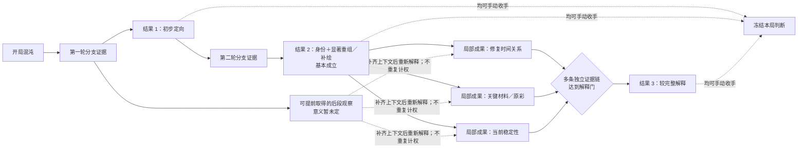

# 第一器物三档作者覆盖层 v0.1：开放证据网如何汇合成三档结果

Status: Superseded Design Candidate / Direction Retained

日期：2026-08-16

> 2026-08-17 更新：本文保留“开放证据网＋三档结论门”的方向纠偏过程；其中修复史三态、12 个核心候选解释包、联合支持、证明组、允许未知和局部成果已由[三档作者模型 v0.2](2026-08-17-first-ceramic-three-result-author-model-v0-2.md)具体化。本文不再作为当前作者规格入口。

## 这份覆盖层做什么

本文只修正**作者侧真相／证据拓扑的阶段节奏**。它不设计玩家界面，也不把“黑地图”“注意力引导”或完整作者图直接交给玩家。

它叠加在 [第一器物纸面证据拓扑 v0.1](2026-08-15-first-ceramic-paper-evidence-topology-v0.md) 的结构底稿上：保留事实分账、联合依赖后验、分轴、替代／回退与经济终局；用 DEC-022 替代旧纸模中“只有一个身份锚点、后段只是并列深挖”的阶段解释。

当前目标不是证明三档已经好玩，而是先让作者图能够无矛盾地表达：

> 多种证据顺序进入同一组阶段结果；结果 2 已经是一局平庸但完整的胜利；玩家继续后可以逐步取得局部成果，只有多条证据链共同汇合才建立结果 3。

## 权威与状态边界

| 内容 | 当前身份 |
|---|---|
| 第一切片采用三档结果、结果 2／3 的核心含义、门禁不是行动锁、后段证据可提前取得 | Approved / Active，来自 DEC-022 |
| 结果 1 精确内容、局部成果清单、主张命名、`proofRule`、假设空间修订 | Draft；本文提出作者工作模型 |
| 手动停手、成本保留、无物损、一次挂牌、三轨经济、结果后揭示 | Approved / Active，来自 DEC-017 |
| 同器原片、多阶段修复与正向／负向／转向真相 | Approved / Active，来自 DEC-021 |
| 阈值、似然、价格、费用、行动点数、UI、代码 | Experimental 或 Unknown；本文不新增 |

## 两层而不是二选一

底层证据网回答“玩家可以从哪里调查、事实怎样互证”；三档结果回答“作者系统何时可以负责地说出怎样的话”。前者允许多路线，后者提供汇合节拍，两者不冲突。

## 三档作者结果的工作语义

### `STAGE_RESULT.G1.ORIENTED_CASE` — 初步定向（精确内容 Draft）

工作句：

> 这是一件与中国外销瓷大碗／珠江商馆题材相容、并存在值得解释的历史修复异常的对象；精确年代、是否为同一历史器以及修复关系仍不确定。

作者作用：

- 把开局的“什么都有可能”压缩成一个可信问题框架；
- 暴露至少两种合理的下一调查方向，而不是只开唯一通道；
- 不授予晚 18 世纪身份，也不把“看见旧修”当成老器证明；
- 它可以由不同普通观察组合抵达，精确替代组待修订。

### `STAGE_RESULT.G2.IDENTITY_AND_MAJOR_REPAIR` — 平庸但完整的胜利

固定核心句：

> 晚 18 世纪中国外销瓷身份与显著重组／补绘基本成立；修复程度、关键原片／原彩、当前稳定性与价值仍不清楚。

作者作用：

- 至少汇合“身份可信”与“显著历史重组／补绘确实存在”两个不同判断；
- 不要求三阶段修复史已经还原，不要求关键区材料、表面和稳定性已经解决；
- 是一次完整而平庸的胜利，玩家可以合理收手；
- 若继续，只得到转向发现或因成本停下，仍可在没有针对性反证时回到这里，但费用与机会不退。

v0.1 的 `CLAIM.IDENTITY.LATE18_EXPORT` 只能承担 G2 的一半。下一版至少需要一个不把修复精细程度提前说满的粗主张，工作名为 `CLAIM.REPAIR.MAJOR_REASSEMBLY`。它必须与身份轴分账，不能因为修复真实就反向证明年代。

当前 Draft 工作模型把 `RepairHistory` 从二态补成三态：

- `NO_MAJOR_REASSEMBLY`；
- `MAJOR_REASSEMBLY_NOT_THREE_PHASE`；
- `THREE_PHASE`。

这三个都是互斥的**客观修复史状态**：“阶段尚未查清”不是第四个状态，而是本局后验仍分布在后两态之间的认知状态。G2 读取后两态的后验和；G3 的三阶段局部成果只读取 `THREE_PHASE`。身份、修复史和关键材料仍各自举证；`Identity × RepairHistory × KeyMaterial` 因此暂由 8 包扩为 12 包。这个扩展是为补齐客观的重大重组替代解释，不是新增玩家阶段，也仍须做互斥／穷尽与 `MODEL_CONFLICT` 检查。

### `STAGE_RESULT.G3.COHERENT_OBJECT_EXPLANATION` — 较完整解释（精确门禁 Draft）

固定核心句：

> 多条相互独立的本局证据链，已经把这件器物为何既保留重要原片／原彩、又具有显著重组／补绘与局部状态风险，解释成一幅相互兼容的整体图景；仍有被明确圈定的未知。

作者作用：

- 它是结果 2 以后较硬的多证据汇合，不是任意一个高级检测、单份档案或单个局部摘要；
- 它不要求 100% 覆盖所有区域，也不要求客观价值已经被系统读出；
- 它应组合修复时间关系、关键材料／原彩和当前状态中足以改变判断的局部成果，并明确哪些未知被留下；
- 精确必要项、替代项和允许缺项要在场景演算前固定，不能用“证据很多”代替 `proofRule`。

## 结果 2 到结果 3 的局部成果

以下是从 v0.1 结构中保留并重新定位的作者候选。它们不必按表中顺序形成，也不自动等于结果 3：

| 候选局部成果 | 回答什么 | 明确不回答什么 |
|---|---|---|
| `CLAIM.REPAIR.THREE_PHASE` | 当前证据是否支持相对三阶段处理关系 | 关键区是否保留原片／原彩、当前是否稳定 |
| `CLAIM.MATERIAL.KEY_REGIONS_PRESERVED` | 已具名关键区是否由连续原始陶瓷基底承担主要形体 | 表面有多少跨原彩调色、未检查区域怎样 |
| `SUMMARY.SURFACE.MIXED` | 具名检查区中原彩与主要后加表面怎样并存 | 全器百分比、最终价值高低 |
| `SUMMARY.STABILITY.MIXED` | 已处理区静态可陈列与未处理旧接合风险怎样并存 | 未检查区、修复年代、完整结构寿命 |
| Documentation 局部边界（待命名） | 哪些对象连续／事故／处理时点已有本局文档支持，哪里仍有缺口 | 文件数量不是独立票，缺口不自动推翻身份 |

`CLAIM.REBUILD.KEY_MATERIAL_MULTIPHASE` 暂不直接作为 G3。它可以被保留为“修复史＋关键材料”局部汇合，也可以在删除测试中证明只是完成徽章后被取消。G3 必须比它更接近完整解释，同时又允许明确未探索区存在。

## 早拿证据、晚懂意义的作者合同

每一项观察至少经历以下状态，而不是被阶段锁住：

1. `acquired`：原始内容已取得，进入唯一证据账本；
2. `unresolved`：内容真实可见，但缺少对象匹配、空间定位、时间点或比较基线，作者不能安全解释；
3. `contextualized`：新证据补齐依赖后，只读 Finding 可以把旧观察接入一条解释链；
4. `claim-relevant`：该联合推断单元现在可以支持、削弱或反驳某个主张；
5. `counted-once`：无论它后来连接多少报告或摘要，似然因子仍只登记一次。

例如，玩家可以很早取得右侧异常紫外响应。作者层先只记录“具名区域存在异常响应”；在对象连续、修复区定位或层位试窗补齐前，它不能被写成“原彩被覆盖”或“三阶段修复成立”。后续上下文到达后，旧观察获得解释连接，但不是重新获得一张新证据。

G1／G2／G3 是逻辑包含关系，不是必须逐次播放的作者时钟。若玩家已经提前取得足够深层证据，一次完整重算可以让相邻两档同时或紧邻成立；作者模型不得为制造停顿而偷偷增加行动锁、等待回合或重复取证。是否在前台合并、停顿或分段表现，留给后续玩家侧设计。

## v0.1 需要先修的作者模型缺口

在开始旧清单里的确定性场景演算前，需要完成以下修订：

1. **补齐 G1。** v0.1 从身份路线直接起步，没有开局混沌到初步定向的作者汇合；
2. **扩展 G2。** 先按上述 Draft 三态修复史轴把联合解释扩为 12 包，再把 `CLAIM.IDENTITY.LATE18_EXPORT` 与 `CLAIM.REPAIR.MAJOR_REASSEMBLY` 合成零似然的只读阶段结果，同时保持两个轴独立举证；
3. **重做 G3。** 不再把综合覆盖摘要声明为“非落脚点”，也不直接把旧复合主张升级；先定义多证据汇合必须回答的价值相关问题与允许保留的未知；
4. **标出局部成果。** 让结果 2 到结果 3 之间持续出现真实收束，而不是只在最后发奖；
5. **审查行动硬前置。** 把非物理必要的 `acquisition-requires` 改成信息价值／精度／成本上的软优势；
6. **检查早期后段证据。** 至少演算两条“先取得、后解释”路线，并验证没有丢弃、重抽或重复计权；
7. **再进入场景演算。** 三档主张、假设空间和门禁能表达后，才检查可达、非支配、回退、节奏与停手张力。

三档 `STAGE_RESULT` 本身不拥有后验、不给证据增加权重，也不回灌账本；它们只把既有 `AppraisalClaim`、Finding 和覆盖边界组合成系统当前愿意负责的综合表述。相同先验、完整证据多重集与规则集必须得到相同结果状态，不得因取得顺序不同而改变。

## 当前明确不做

- 不决定玩家面对什么面板、拓扑怎么展开、黑区如何显示或系统怎样提示下一步；
- 不把作者图直接变成玩家界面；
- 不新增或校准后验、价格、费用、行动点、市场或时长数值；
- 不修改产品代码，不批量做五件器物，不尝试程序化生成；
- 不把这份覆盖层称为已演算、已验证、已批准实现规格。

## 下一次作者侧检查的通过含义

下一步不是试玩 UI，而是把三个 `STAGE_RESULT` 映射回可穷尽假设、局部主张和依赖组。通过只表示：作者规则能在多种证据顺序下得到相同的合法结论，早拿证据不会失效或重复计权，G2 与 G3 各自存在至少两种非等价可达路线。它仍不能证明节奏好玩、提示自然、玩家能理解或数值平衡。

## 相关记录

- [DEC-017：阶段主张、手动停手与单次挂牌](../../decisions/DEC-017-v3-stage-claims-stopping-and-fixed-price-listing.md)
- [DEC-018：暂定数值、证据依赖与估值投影](../../decisions/DEC-018-v3-provisional-claim-thresholds-and-valuation-projection.md)
- [DEC-021：第一器物客观真相包](../../decisions/DEC-021-v3-first-ceramic-objective-truth-package-and-gameplay-first-authorship.md)
- [DEC-022：第一陶瓷切片三档结果与开放证据网](../../decisions/DEC-022-v3-first-ceramic-three-result-gates-over-branching-evidence.md)
- [第一器物纸面证据拓扑 v0.1（结构底稿）](2026-08-15-first-ceramic-paper-evidence-topology-v0.md)
