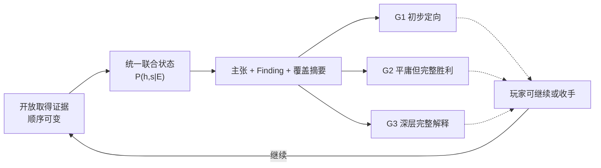

# 第一器物三档作者模型 v0.2：12 个核心候选解释包与结论门

Status: Design Candidate / Awaiting Independent Structural Review

日期：2026-08-17

## 这份模型解决什么

这份 v0.2 把 DEC-022 已批准的体验方向——**开放证据网汇合成三档清楚成果，门禁约束系统能说什么而不锁玩家先查什么**——落实成可检查的作者侧模型。它回答五个问题：

1. 本局后验究竟在哪些相互排斥的核心解释之间移动；
2. G1、G2、G3 各自需要哪些联合判断和证明组；
3. 为什么结果 2 可以成立，而三阶段史、关键材料、表面、稳定性和价值仍然不清楚；
4. 玩家提前取得深层证据时，怎样做到“先拿到、后理解、只计一次”；
5. 一次探测得到新信息、独立印证、重复信息或反向结果时，怎样诚实更新而不把证据做成票数加减。

它不定义玩家界面，不规定正式概率阈值、似然、费用或价格，也不实现代码。这里的 G1／G2／G3 只适用于第一陶瓷切片，不是未来所有器物必须套用的全局三阶段模板。

## 权威与状态边界

| 内容 | 当前身份 |
|---|---|
| 开放调查、三档成果、手动停手、结果门不锁行动 | Approved / Active，来自 DEC-017 与 DEC-022 |
| 第一器物固定客观真相 | Approved / Active，来自 DEC-021 |
| 12 个核心候选解释包、联合支持计算、G1／G2／G3 `proofRule`、允许未知与局部成果 | Design Candidate，本文件首次完整枚举，等待独立结构复核与场景演算 |
| 阶段进入／退出数字和估值投影 | Experimental，来自 DEC-018；本文件不新增或校准数值 |
| 玩家 UI、引导强度、调查费用、市场价格、路线平衡、代码与可玩性 | Unknown / Not authorized |

## 先把“12 个包”说清楚

### 核心候选解释包不是 12 个完整世界

`HypothesisBundle h` 只组合三个必须共同推断的核心客观轴：

- `Identity I`：器物身份；
- `RepairHistory R`：重大重组史；
- `KeyMaterial K`：声明关键区是否主要由本器连续原始陶瓷基底承担。

因此：

> **核心候选解释包**是把几个相互独立的客观不确定轴组合成一个可比较的候选解释；它是后验账本中的核心假设单位，不等于完整真相、玩家路线、关卡、结局或玩家可见节点。

表面、稳定性与档案条件仍在 `ValueScenario s` 中分别表达：

- `Surface ∈ {KEY_IDENTITY_IMAGE_RECONSTRUCTED, MIXED_CROSS_OVERPAINT, ORIGINAL_SURFACE_PREDOMINANT}`；
- `Stability ∈ {SYSTEMIC_RISK, DISPLAYABLE_LOCAL_RISK, DISPLAYABLE_STABLE}`；
- `Documentation ∈ {CONFLICTED_OR_UNMATCHED, COHERENT_PARTIAL, COHERENT_SUFFICIENT}`。

所以系统只有一份联合推理账本 `P(h,s|E)`。形式上存在 `12 × 27 = 324` 个联合格，但作者不手写 324 条故事，也不能把 `h` 与 `s` 拆成互不相干的两套后验。所有阶段主张和估值都从这份联合状态只读投影。

## 三个核心客观轴

### `Identity`

| 状态 | 客观含义 |
|---|---|
| `REPRODUCTION` | 不是晚 18 世纪中国外销瓷；即使后来真实受损、修复或保存，也不能因此反证成老器 |
| `LATE18_EXPORT` | 是晚 18 世纪中国外销瓷 |

### `RepairHistory`

| 状态 | 客观含义 |
|---|---|
| `NO_MAJOR_REASSEMBLY` | 可以有局部修补，但没有发生足以要求大范围重组与视觉再整合的重大损伤—重组事件 |
| `MAJOR_REASSEMBLY_NOT_THREE_PHASE` | 至少发生一次重大损伤—重组，但客观历史不同时满足 T1／T2／T3 三阶段关系 |
| `THREE_PHASE` | T1 重大事故前旧修、T2 重大事故与重组、T3 更晚的局部保护三者及先后关系都客观成立 |

`THREE_PHASE ⇒ MAJOR_REASSEMBLY` 是模型不变量。“三阶段还没查清”不是第四个客观状态，而是本局后验仍分布在后两种重大重组解释之间。

### `KeyMaterial`

| 状态 | 客观含义 |
|---|---|
| `KEY_RECONSTRUCTED` | 至少一个预先声明、会改变结论或价值的关键区，主要形体或图像基底依赖重建材料 |
| `KEY_MATERIAL_PRESERVED` | 所有声明关键区都主要由本器连续原始陶瓷基底承担；窄缝填补和表面调色不使该状态失败 |

在 `REPRODUCTION` 包中，“原始”只表示相对于这件仿制器自身的原始材料，不偷换成 18 世纪原料。

## 12 个核心候选解释包

`2 × 3 × 2 = 12` 个包互斥，并在当前三个核心轴上穷尽：

| ID | `I / R / K` | 作者侧简述 |
|---|---|---|
| `H.REPRO.NO_MAJOR.KEY_RECONSTRUCTED` | `REPRODUCTION / NO_MAJOR_REASSEMBLY / KEY_RECONSTRUCTED` | 晚近仿制；没有重大重组；至少一个关键区主要依赖重建 |
| `H.REPRO.NO_MAJOR.KEY_PRESERVED` | `REPRODUCTION / NO_MAJOR_REASSEMBLY / KEY_MATERIAL_PRESERVED` | 晚近仿制；没有重大重组；关键区保留这件仿制器自身的原始基底 |
| `H.REPRO.MAJOR_OTHER.KEY_RECONSTRUCTED` | `REPRODUCTION / MAJOR_REASSEMBLY_NOT_THREE_PHASE / KEY_RECONSTRUCTED` | 晚近仿制也真实经历重大重组，但不是完整三阶段史；关键区有重建 |
| `H.REPRO.MAJOR_OTHER.KEY_PRESERVED` | `REPRODUCTION / MAJOR_REASSEMBLY_NOT_THREE_PHASE / KEY_MATERIAL_PRESERVED` | 晚近仿制也真实经历重大重组，但不是完整三阶段史；关键区基底仍保存 |
| `H.REPRO.THREE_PHASE.KEY_RECONSTRUCTED` | `REPRODUCTION / THREE_PHASE / KEY_RECONSTRUCTED` | 非晚 18 世纪器物也可能真实经历三阶段处理；关键区有重建 |
| `H.REPRO.THREE_PHASE.KEY_PRESERVED` | `REPRODUCTION / THREE_PHASE / KEY_MATERIAL_PRESERVED` | 非晚 18 世纪器物也可能真实经历三阶段处理；关键区基底仍保存 |
| `H.OLD.NO_MAJOR.KEY_RECONSTRUCTED` | `LATE18_EXPORT / NO_MAJOR_REASSEMBLY / KEY_RECONSTRUCTED` | 晚 18 世纪外销瓷；没有重大重组；关键区有重建 |
| `H.OLD.NO_MAJOR.KEY_PRESERVED` | `LATE18_EXPORT / NO_MAJOR_REASSEMBLY / KEY_MATERIAL_PRESERVED` | 晚 18 世纪外销瓷；没有重大重组；关键区基底仍保存 |
| `H.OLD.MAJOR_OTHER.KEY_RECONSTRUCTED` | `LATE18_EXPORT / MAJOR_REASSEMBLY_NOT_THREE_PHASE / KEY_RECONSTRUCTED` | 老外销瓷且重大重组成立，但并非完整三阶段史；关键区有重建 |
| `H.OLD.MAJOR_OTHER.KEY_PRESERVED` | `LATE18_EXPORT / MAJOR_REASSEMBLY_NOT_THREE_PHASE / KEY_MATERIAL_PRESERVED` | 老外销瓷且重大重组成立，但并非完整三阶段史；关键区基底仍保存 |
| `H.OLD.THREE_PHASE.KEY_RECONSTRUCTED` | `LATE18_EXPORT / THREE_PHASE / KEY_RECONSTRUCTED` | 老外销瓷且完整三阶段史成立；关键区有重建 |
| `H.OLD.THREE_PHASE.KEY_PRESERVED` | `LATE18_EXPORT / THREE_PHASE / KEY_MATERIAL_PRESERVED` | 老外销瓷、完整三阶段史和关键材料保存同时成立；这是 DEC-021 固定真相对应的核心包 |

第一器物固定作者真相对应：

```text
h* = H.OLD.THREE_PHASE.KEY_PRESERVED
s* = MIXED_CROSS_OVERPAINT / DISPLAYABLE_LOCAL_RISK / COHERENT_PARTIAL
```

这份真相在开局不直接提供给玩家；系统只能根据本局已取得证据更新 `P(h,s|E)`。

## 包—主张—结果蕴含矩阵

| `HypothesisBundle` | 晚 18 世纪 | 重大重组 | 三阶段 | 关键材料保存 | `G2 core` | `G3 h-core` |
|---|---:|---:|---:|---:|---:|---:|
| `H.REPRO.NO_MAJOR.KEY_RECONSTRUCTED` | 否 | 否 | 否 | 否 | 否 | 否 |
| `H.REPRO.NO_MAJOR.KEY_PRESERVED` | 否 | 否 | 否 | 是 | 否 | 否 |
| `H.REPRO.MAJOR_OTHER.KEY_RECONSTRUCTED` | 否 | 是 | 否 | 否 | 否 | 否 |
| `H.REPRO.MAJOR_OTHER.KEY_PRESERVED` | 否 | 是 | 否 | 是 | 否 | 否 |
| `H.REPRO.THREE_PHASE.KEY_RECONSTRUCTED` | 否 | 是 | 是 | 否 | 否 | 否 |
| `H.REPRO.THREE_PHASE.KEY_PRESERVED` | 否 | 是 | 是 | 是 | 否 | 否 |
| `H.OLD.NO_MAJOR.KEY_RECONSTRUCTED` | 是 | 否 | 否 | 否 | 否 | 否 |
| `H.OLD.NO_MAJOR.KEY_PRESERVED` | 是 | 否 | 否 | 是 | 否 | 否 |
| `H.OLD.MAJOR_OTHER.KEY_RECONSTRUCTED` | 是 | 是 | 否 | 否 | 是 | 否 |
| `H.OLD.MAJOR_OTHER.KEY_PRESERVED` | 是 | 是 | 否 | 是 | 是 | 否 |
| `H.OLD.THREE_PHASE.KEY_RECONSTRUCTED` | 是 | 是 | 是 | 否 | 是 | 是 |
| `H.OLD.THREE_PHASE.KEY_PRESERVED` | 是 | 是 | 是 | 是 | 是 | 是 |

任一主张 `C` 的后验支持度只来自真正蕴含它的联合包：

```text
support(C | E) = Σ_h P(h | E) · 1[h ⇒ C]
```

G2 的核心联合支持为：

```text
support(G2Core | E)
= Σ_h P(h | E) · 1[
    Identity = LATE18_EXPORT
    ∧ RepairHistory ∈ {MAJOR_REASSEMBLY_NOT_THREE_PHASE, THREE_PHASE}
  ]
```

这条联合条件很重要：身份边际“很像老器”和重大重组边际“很像发生过”即使分别很高，也可能分别落在不同包里。若没有足够质量同时落在“老器且重大重组”的四个包上，系统不能拼接出一个虚假的 G2。

## 三档结果不是三个动作节点



三档结果是同一证据网的只读综合表述。它们：

- 不产生新的似然；
- 不回灌证据；
- 不解锁或封锁调查行动；
- 不要求玩家先看见 G1 再看见 G2；
- 不自动结束游戏；
- 不给估值乘阶段系数。

如果玩家提前拿齐足够证据，同一次或相邻两次重算可以连续建立相邻结果。阶段节奏来自证据联合收敛，不来自隐藏等待时间。

## G1：有方向的案件

`STAGE_RESULT.G1.ORIENTED_CASE` 是**零似然的框架性投影**，不是第 13 个真相包。其工作表述是：

> 这件器物与中国外销瓷／十三行图像方向相容，并且存在值得继续查明的历史干预问题；具体年代、对象连续性和修复史仍未成立。

### G1 `proofRule` 骨架

必须同时满足：

1. **当前器物覆盖：** `F.CRAFT.BODY`，加上 `F.CRAFT.DECOR / F.BASE.MANUFACTURE` 至少一项；不得只靠历史图像或一处修复痕迹进入 G1；
2. **问题存在：** 至少一项具名修复、表面异常或结构异常观察；
3. **方向来源，二选一：**
   - 可靠语料／类别比较产生“与外销瓷方向相容”的只读 Finding；或
   - 找到经过来源核验的历史候选图像，足以提出继续核对的问题，但尚不主张它就是本器；
4. 没有尚未处理的直接框架反证，例如制造组合与该大类明确不相容、来源图像被证伪。

G1 不要求对象连续、晚 18 世纪身份或重大重组已经成立。它的作用是把“完全混沌”变成有问题意识的调查，而不是提前奖励真假判断。

## G2：身份与重大重组基本成立

`STAGE_RESULT.G2.IDENTITY_AND_MAJOR_REASSEMBLY` 的工作表述是：

> 这件器物作为晚 18 世纪中国外销瓷基本成立，并且显著损伤后的重大重组／视觉再整合基本成立；但究竟是不是完整三阶段史、关键区保留多少原始材料、补绘范围、稳定性和价值仍不清楚。

这就是本局“平庸但完整的胜利”。玩家此时收手，不是输掉深挖内容，而是接受已经建立的可靠成果和仍未解决的价值不确定性。

### G2 `proofRule`

G2 必须同时满足四组条件：

#### 1. 身份证明组

- 当前制造覆盖至少同时包含 `F.CRAFT.BODY + F.BASE.MANUFACTURE`；并且
- 以下至少一条路径成立：
  - **对象连续路径：** 历史对象与现器的多个稳定锚点联合匹配；
  - **差异比较路径：** 可靠同时期语料与后仿对照，使制造／装饰组合能够排除关键替代解释；
- `CLAIM.IDENTITY.LATE18_EXPORT` 的边际支持越过当前 Experimental 进入线；
- 没有尚未处理的身份阻断反证。

#### 2. 重大重组证明组

以下至少一条路径成立：

- **有档案路径 `MAJOR_DOCUMENTED`：** T2 重大事故／重组来源组，加上现器具名修复图或跨时点对应；
- **物理路径 `MAJOR_PHYSICAL`：** 预声明主要区域的跨时点形体、结构或材料连续证据，加上现器具名修复图，能够排除只发生局部小修的解释。

同时：

- `CLAIM.REPAIR.MAJOR_REASSEMBLY` 的边际支持越过当前 Experimental 进入线；
- 没有尚未处理的重大重组阻断反证；
- 单张修复单、肉眼一处胶线、单次 X 射线或单个仪器结果都不能独立满足本组。

G2 表述中的“视觉再整合”只承诺：上述重大重组证据中，至少还有一项当前可见或同事件档案观察表明修复曾试图恢复外观，例如填补承接图像、跨接缝调色或“恢复色彩”的同事件记录。它不承诺补绘范围、原彩保存或表面价值已经解决；若连这一项都没有，系统只能建立“重大重组”子主张，不能使用完整 G2 表述。

#### 3. 联合支持组

`support(G2Core | E)` 越过当前 Experimental 进入线。两个边际分别过线而联合支持不足时，G2 仍不得建立。

#### 4. G2 不要求的内容

G2 不要求：T1、T3、三阶段关系、关键材料保存、原彩比例、表面分类、稳定性分类、完整 provenance、全图覆盖或市场价值已经确定。

这条边界保证 G2 既是一项足够硬的完整成果，又不会吞掉后半局的解释空间。

## G3：决策关键事实形成一致解释

`STAGE_RESULT.G3.COHERENT_DECISION_PROFILE` 不是“发现器物比预想更好”，而是：

> 对身份、三阶段修复关系、关键材料、价值关键表面和当前稳定性已经形成一套彼此相容、可承担出售判断的解释；剩余未知已被明确限定在不改变这套核心解释的范围内。

因此，G3 可以围绕好消息、坏消息或混合消息形成。它奖励的是解释完整度，不是奖励玩家找到高价答案。

### G3 `proofRule`

必须同时满足：

1. G2 已建立；
2. `CLAIM.REPAIR.THREE_PHASE` 建立：T1、T2、T3 各有独立来源组或物理证据组支撑，先后关系成立且无未解冲突；
3. 预声明决策关键区的 `KeyMaterial` 已解析；实际作者真相中应收敛到 `KEY_MATERIAL_PRESERVED`，但规则也允许证据诚实收敛到 `KEY_RECONSTRUCTED`；
4. `Surface` 已通过原始样本、修复边界和补绘层位／覆盖解析到一个互斥状态；
5. `Stability` 已通过声明受力路径与当前状态检查解析到一个互斥状态；
6. `Documentation` 没有未处理的正面冲突，缺口的边界已经说清；
7. 从 `P(h,s|E)` 直接计算的某个一致决策剖面联合支持越过当前 Experimental 进入线；不能把分别来自不相容世界的高边际拼成 G3；
8. 没有会推翻上述核心解释的未处理阻断反证。

第一器物真实剖面是：

```text
LATE18_EXPORT
∧ THREE_PHASE
∧ KEY_MATERIAL_PRESERVED
∧ MIXED_CROSS_OVERPAINT
∧ DISPLAYABLE_LOCAL_RISK
∧ COHERENT_PARTIAL
```

### G3 可以保留的未知

- 未被声明为决策关键的局部区域；
- 档案没有留下的修复材料精确配方；
- 无需为了结论虚构的原片／填料精确百分比；
- 不改变 T1／T2／T3 关系的次要年代细节；
- 尚未检查、但不位于关键材料区或主要受力路径的次要区域；
- 正式市场价格、数值权重和玩家最终挂牌选择。

### G3 不能保留的未知

- 身份到底是不是晚 18 世纪外销瓷；
- 是否发生重大重组，以及 T1／T2／T3 关系是否成立；
- 声明关键材料区主要由原片还是重建承担；
- 会改变价值解释的原彩／补绘关系；
- 声明受力路径的当前稳定性；
- 会让历史对象或事件互相冲突的正面档案矛盾。

G3 不要求清空整张地图，也不会自动结束。玩家仍可以为非关键未知继续调查，并承担继续调查的机会与费用。

本首案的 G3 明确要求 `THREE_PHASE`，因为这是 DEC-021 固定真相与本案后段关卡的解释目标。前文所谓 G3 可以围绕“另一种一致剖面”形成，只表示关键材料、表面、稳定性或档案状态可能不同，不表示 `NO_MAJOR_REASSEMBLY` 或 `MAJOR_REASSEMBLY_NOT_THREE_PHASE` 也能套用本案同一个 G3。未来真相不同的器物必须另写自己的结论门，不能把本案 G3 当成全局模板。

## G2 到 G3 之间的局部成果

这些成果是 `InferenceFinding` 或 `EvidenceCoverageSummary`，不是第四、第五阶段，也不产生自己的概率：

| 局部成果 | 对玩家判断的意义 | 仍不能单独推出 |
|---|---|---|
| `FINDING.REPAIR.PRE_MAJOR_OLD_INTERVENTION` | T1 事故前旧修获得支持 | 完整三阶段史、器物身份 |
| `FINDING.REPAIR.LATER_LOCAL_CONSERVATION` | T3 晚期局部保护及其范围获得支持 | 未处理区的状态、完整三阶段史 |
| `COVERAGE.KEY_MATERIAL.BY_REGION` | 已检查关键区分别标明原片连续或重建依赖 | 未检查区、整器比例 |
| `FINDING.SURFACE.ORIGINAL_UNDER_OVERPAINT` | 某关键区补绘下仍有原彩／原始基底 | 整器表面占比、市场价值 |
| `FINDING.SURFACE.RECONSTRUCTION_DEPENDENT_ZONE` | 某区主要可读形体或图像依赖重建 | 其他关键区也相同 |
| `COVERAGE.STABILITY.TREATED_VS_UNTREATED` | 已处理区可陈列，而具名旧接合仍有局部风险 | 整器系统性危险或完全稳定 |

这些局部成果让后半局不是一段漫长的“G2 未升级”，而是一串可以改变估值、下一步问题和停手判断的阶段性收获。

## 提前取得证据的生命周期

深层证据可以在 G1 或 G2 之前取得。它的生命周期是：

```text
acquired → unresolved → contextualized → claim-relevant → counted-once
```

- `acquired`：观察已经进入证据账本；
- `unresolved`：缺少参照或关系，系统只能诚实说“这是什么”，还不能说“它意味着什么”；
- `contextualized`：后来获得的对象连续、区域定位或时间锚使其意义变清；
- `claim-relevant`：只读 Finding／主张开始引用它；
- `counted-once`：原观察因子只在统一联合账本登记一次，不能因“后来懂了”重新加票。

因此，紫外异常、历史照片中的缺口或某段接合影像可以先被玩家发现；等中间证据补齐后，它们自然成为“夹逼”关系中的另一端，而不是要求玩家重做同一检查。

## 探测回报与反证语义

### 每次有效探测都有局部回报，但不保证推进结论

专业成像和其他调查不因尚未形成 G1／G2 而“沉睡”。只要行动满足真实的安全、样本、覆盖和可达条件，系统就必须返回该方法在具名区域实际观察到了什么，以及这次观察当前能否区分候选解释。有效回报分为四类：

| 回报类型 | 作者侧含义 | 是否必然推进阶段 |
|---|---|---|
| `novel-discriminating` | 新观察使一组相容解释相对另一组获得区分 | 否；可能只形成局部成果 |
| `independent-corroboration` | 与已有结论同向，但来自可单独成立的来源、区域或方法 | 否；可提高稳健性，但须先做依赖折叠 |
| `redundant-or-nondiscriminating` | 与已有信息同源、重复，或同样相容于当前主要替代解释 | 否；观察被保留，但不能重复加票 |
| `counter-or-turning` | 削弱、限定、阻断或反驳某个措辞明确的主张，并可能把注意力转向更好的解释 | 否；它可以产生重要进展，也可以只留下冲突 |

这里的“每次探测有用”只承诺**有可解释的局部反馈**，不承诺每次都得到新证据、提高可信度或更接近 G3。玩家可能付出成本后确认一条已知关系，也可能得到对当前主要候选没有区分力的重复信息；这两种结果都不能伪造为正向推进。

### “未发现”与“证明不存在”必须分开

负向结果先检查方法是否真的有能力回答该问题：目标是否正确、区域覆盖是否足够、灵敏度是否足够、材料或保存条件是否允许该信号出现。由此区分：

- `no-signal / unresolved`：本次没有发现目标迹象，但方法或覆盖不足以证明目标不存在；只保留为未决或至多轻微削弱；
- `absence-supported`：在声明范围内，正确方法以足够覆盖和辨识力支持“该现象在这里不存在”或“原始连续关系在这里存在”；它才可以限定或反驳相关主张。

例如，紫外无异常反应通常不能单独证明某区没有重修；有定位的层位／装饰连续观察若可靠显示原始彩层连续且没有后加界面，则可以支持该具名区域“未被重建／重绘”的范围结论。X 射线显示连续陶瓷基底可以反驳该局部“主要依赖填料”的说法，却不能越权证明其表面没有补绘。

### 反证只作用于它真正命中的主张范围

反向观察不删除已经确认的局部事实，也不使用“三票对一票”。系统必须先读取被检验主张的对象、区域、时间、材料层和量词，再选择处理关系：

| 关系 | 作用 |
|---|---|
| `weakens` | 新观察在替代解释下更常见，降低当前主张支持，但不阻止它继续成立 |
| `bounds / refines` | 核心判断仍成立，只把过宽表述收窄为具名区域、非连续范围或混合状态 |
| `hard-counterevidence` | 命中证明组的必要条件，使主张叠加 `contested`；更多同向证据不能自动淹没冲突 |
| `logical-refutation` | 与作者规则中的全称、连续性或必要关系不能同时为真，使该强主张不可能继续 established |

因此，当一个具名范围的可靠反向事实与其他已经确认的局部事实并存时，系统必须先区分主张的量词与覆盖范围：

- 存在性主张只要仍有可靠命中事实，就不能被未命中范围的反向事实删除；
- 允许混合或非连续范围的主张，可以被收窄、重述或重新排列价值情景；
- 要求全称覆盖、连续覆盖或某必要区域必须成立的强主张，可以被命中该必要条件的可靠反向事实阻断或逻辑反驳；
- 未命中身份与重大重组证明组的表面反向事实，不会无关地击穿 G2，但可以改变表面解释、价值情景和下一步问题。

证据力量由诊断性、独立性、覆盖代表性和是否命中必要条件共同决定，而不是由正反观察数量决定。多条同源反应仍可能只折叠成一个依赖单元；一条命中全称主张必要条件的可靠反向事实，也可能比若干非关键同向观察更有决定性。

## 调查前置与软优势

只有真实的物理或信息可达性才使用硬 `acquisition-requires`：

- 仪器确实需要可接触样本、目标区域或安全摆位；
- 跨时点区域对应确实需要至少两个可比时间点和可定位锚；
- 文档核对确实需要先找到具体档案入口或对象标识。

以下不能伪装成硬前置：

- 先做某项检查会更省钱；
- 先知道某个方向会提高精度；
- 某条路线通常信息价值更高；
- 系统希望玩家按设计者预想的顺序行动。

这些只应作为成本、精度、信息价值或自然语言提示的软优势。结果门本身永远不是调查前置。

## 必须保持的模型不变量

1. 12 个包 ID 唯一，且覆盖 `2 × 3 × 2` 全组合；
2. 所有 `THREE_PHASE` 包都蕴含重大重组；
3. DEC-021 固定真相只对应一个核心包；
4. 晚 18 世纪身份包为 6 个，重大重组包为 8 个，三阶段包为 4 个，关键材料保存包为 6 个；
5. `G2 core` 只包含“老器且重大重组”的 4 个包；`G3 h-core` 只包含“老器且三阶段”的 2 个包；
6. 两个边际主张分别过线但联合支持不足时，不建立 G2；
7. 单项高级检测或单份文档不能成为 G2／G3 答案键；
8. 相同证据多重集在不同合法取得顺序下，产生相同后验、主张和结果；
9. 证据提前取得后可延迟解释，但不能失效、重取或重复计权；
10. 每次满足真实可达条件的探测都返回可解释的局部观察，但可以是重复、同源或对当前替代解释无区分力的信息，不保证阶段推进；
11. `no-signal / unresolved` 不能偷换成 `absence-supported`；负向结果只按方法能力、声明覆盖和主张范围生效；
12. 反证不按票数抵消观察；它只能削弱、限定、阻断或逻辑反驳真正被命中的主张，未被反驳的局部事实继续保留；
13. G2 建立后，表面或稳定性坏消息可以移动价值情景，却不能无关地击穿已经充分建立的身份与重大重组；直接身份／修复反证仍可令相应主张争议或回退；
14. G3 允许非决策关键地图仍暗，不要求 100% 覆盖；
15. G1／G2／G3 不改变客观真相、似然、价格、行动开放或手动停手权。

## 进入下一步前的结构场景

独立结构复核至少应对抗以下情况：

- 重大重组支持高、身份支持低：不得建立 G2；
- 身份支持高、重大重组支持低：不得建立 G2；
- 两个边际各自高，但质量落在互不相容的包：不得建立 G2；
- G2 已成立后发现广域补绘或局部风险：G2 可以保留，价值剖面改变；
- 玩家很早取得紫外／X 射线／历史图像证据：随后只被重新解释，不重新计权；
- 玩家在另一处得到与现有结论同源或无区分力的重复信息：保留观察与成本，但不重复提高后验或阶段；
- 某区域紫外未见异常但方法不能排除不响应材料：该区保持未决，不能写成“证明没有重修”；
- 局部反向事实与其他已确认区域事实并存：保留未被击中的局部事实，只对其真正命中的全称、连续性或必要关系作限定、争议或逻辑反驳；
- 玩家不按作者预想顺序调查：相同证据集产生相同结果；
- 单份事故档案、单次 X 射线或一处胶线：不得直接建立阶段结果；
- G3 建立时仍有非关键区域未查：若未知边界诚实且不改变核心剖面，允许成立；
- 新的直接反证击中身份或修复主张：相应结果进入争议或回退，而不是因“阶段已解锁”永久锁定。

这些只是结构验收场景，不是已执行的数值演算，也不是可玩性证据。

## 当前完成度

**已落实到文档：** 三态客观修复史、12 个核心候选解释包、蕴含矩阵、联合 G2 支持、G1／G2／G3 证明骨架、G3 允许未知、G2—G3 局部成果、早拿后懂／只计一次合同、探测回报分类、负向证据能力门、按主张范围生效的反证层级与结构不变量。

**尚未验证：** 独立结构复核、确定性场景演算、阈值与似然校准、路线非支配、玩家理解、停手张力、趣味、玩家 UI、价格系统和产品实现。

通过本文件的静态一致性检查，只能证明“作者模型没有已知结构矛盾”，不能证明它已经好玩、平衡、真实可实现或获得玩家批准。

## 继承与替代关系

- [DEC-022](../../decisions/DEC-022-v3-first-ceramic-three-result-gates-over-branching-evidence.md) 继续拥有三档结果与开放证据网的 Active 决定；本文件不扩大其批准范围；
- [第一器物纸面证据拓扑 v0.1](2026-08-15-first-ceramic-paper-evidence-topology-v0.md) 继续提供事实／观察／Finding／主张／价值分账、联合依赖、轴路由、区域覆盖和经济终局底稿；
- [第一器物三档作者覆盖层 v0.1](2026-08-16-first-ceramic-three-result-gate-author-overlay-v0.md) 保留为方向纠偏的历史证据，其三态与三档草案由本文件具体化并替代；
- 本文件不替代 DEC-021 的固定客观真相，也不替代 DEC-018 的 Experimental 数值政策。
