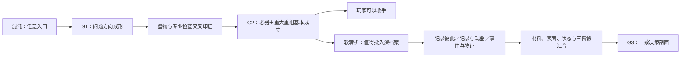

# 第一器物具体一局 v0.1：G2 软转折后的档案关系重建

Status: Design Candidate / Supersedes the illustrative route in v0

日期：2026-08-21

## 边界

本文修订[具体一局 v0](2026-08-20-first-ceramic-concrete-session-and-owner-structural-review-v0.md)的演示路线。它不是唯一调查顺序，不批准行动点、价格、似然、费用、玩家 UI 或提示文案。旧文的作者对抗复核史仍保留；本文件只替代其中“事故档案直接让系统进入 G2”和未收窄的检测拍点。

## 一局的作者侧节奏

G2 以前并非不能查档案；只是系统不会把深档案常驻渲染成唯一主线。玩家若很早拿到候选记录，仍会得到局部内容、冲突和下一步方向。首案的演示主线让器物本身承担 G2，使“是否值得继续为一件已经证明确有分量的器物查深档案”成为真实选择。

## 一条具体但非唯一的路线

| 拍点 | 玩家实际取得什么 | 系统此时怎样更新 | 停手与下一步 |
|---|---|---|---|
| 0. 接手 | 可旋转观察的外销瓷大碗；可见旧锔痕、接缝、色差和局部填补 | 尚无结论；器物、公开背景、专业检查和浅层记录入口均可用 | 玩家可以凭直觉直接继续或收手，没有阶段锁 |
| 1. 全器与底足 | 胎釉、器形、修足、烧成瑕疵、自然磨耗和具名修复区分开记录 | 老器方向与后仿方向仍并存；确认“确有历史干预” | 形成制造、身份和修复范围三类开放问题 |
| 2. 语料比较 | 同期真品和后仿对照给出制造／装饰组合的差异 | **G1：**晚 18 世纪外销瓷成为可信方向，修复问题值得继续查 | 这是第一档清楚成果，不要求固定下一步 |
| 3. 专业成像可提前 | 玩家可此时或更早做多角度 X 射线；各具名区域分别得到可读、不可读或局部读数 | 隐藏接合、填料候选和连续瓷片边界进入账本；不负责断代、对象归属或表面补绘 | 即使上下文不足，读数仍保留，后来只重释不重计 |
| 4. 历史对象候选 | 一张早期照片出现相似器形、制造瑕疵和旧锔痕 | 先显示“可能相关的对象候选”；通用构图相似不算身份票 | 玩家可核对稳定的非构图锚点，也可转查器物结构 |
| 5. 对象连续 | 足部瑕疵、几何比例、口沿缺口和稳定磨耗点联合对应 | 历史照片与现器对象连续获得支持；T1 旧修候选开始有意义 | 身份更稳，但重大重组及价值仍未闭合 |
| 6. 现器修复图与跨时点物证 | 当前具名修复图、多角度逐区结构读数和损坏／早期时点的重大变化形成独立组合；装饰观察显示修复曾恢复外观 | **G2：**晚 18 世纪外销瓷＋重大重组／最低外观再整合基本成立；三阶段、关键材料、补绘和状态仍不清楚 | 玩家可把它当平庸但完整的胜利并冻结；继续调查的成本不会返还 |
| 7. G2 软转折 | 系统说明：器物的重要性与不确定价值已足以支持定向深档案投入，同时列出无需档案也能继续的物理方向 | 档案研究成为高信息价值建议，而不是新解锁的按钮 | 玩家决定承担成本继续，或接受 G2 收手 |
| 8. 候选 T2 记录组 | 损坏照片、保险记录、票据或修复图纸被组织为候选组；系统明确它们目前只是“记录声称” | `recordCoherence` 更新；记录可提示事故范围、处理词汇和下一步锚点，并影响后验，但尚不归到本器 | 玩家可以信、疑、忽略或继续核对；没有“档案检查通过” |
| 9. T2 对象归属 | 对象编号／所有权链与现器稳定非构图锚点产生支持或冲突 | `objectAttribution` 可能从未决到提示、成立或争议 | 即使争议，记录内容和成本仍保留，不被系统删除 |
| 10. T2 事件—物证印证 | 候选记录的具名损坏／修复范围与现器修复图或合法跨时点物证逐区比较 | `eventCorroboration` 更新；三个问题足够成立时，系统才说 T2 记录属于本器历史 | 这不是新阶段，只是 G2—G3 的局部成果与年代锚 |
| 11. 表面点位与区域综合 | 多个真实试窗／暴露界面先给点位层序，再与修复边界和空间分布综合 | 关键原彩与后加调色可以并存；点位结果不直接外推整器 | 正向与负向成果共同重排价值情景，G2 不因表面坏消息自动坍塌 |
| 12. 材料与关键区 | 点位基底识别和真实层间界面／横截面层序分别取得；跨时点关键区核对说明哪些区域由连续原片承担 | 关键材料逐区收束，不生成“原片百分比” | 玩家取得可用于价值判断的局部成果，非关键区仍可未知 |
| 13. 候选 T3 记录组 | 后期报告、处理图和照片先作为另一候选记录组出现 | T3 的记录内部关系、对象归属和事件—现器区域对应分别更新 | T2 与 T3 不共享一个“总档案正确”状态 |
| 14. 当前状态 | 在明确放置姿态、底托、搬动限制和检查覆盖下，处理区与未处理旧接合分别检查 | 报告只说明当时做过什么；当前检查形成“该静态陈列条件下可陈列，但具名局部仍有风险” | 条件变化或搬动会触发重新检查，不宣称永久安全 |
| 15. G3 汇合 | T1 对象连续、T2／T3 关系、关键材料、混合表面、条件化稳定性和档案缺口形成一致剖面 | **G3：**系统可以负责地给出三阶段与价值关键解释；非关键区域、精确配方和市场权重仍可未知 | 玩家仍手动决定继续或冻结，没有自动结束 |
| 16. 挂牌与揭示 | 玩家冻结本局证据和系统估值，自填一次一口价；市场结束后揭示客观真相与完整拓扑 | 市场不读取系统估值，也不反写推理 | 局末展示候选档案哪些真实、部分相关或误归属，以及玩家主动放弃的暗区 |

## 四条换序仍然成立

| 换序 | 立即回报 | 暂时不能说 | 后来怎样接上 |
|---|---|---|---|
| 开局先拿候选事故记录 | 知道记录声称的损坏、处理和区域；发现记录之间是否相容 | 不能说属于本器，也不能建立 G2 | 后续对象归属和事件—物证关系使其进入系统主张，或暴露误归属 |
| 开局先做 X 射线 | 取得逐区结构读数与不可读区 | 不能断代、证明对象归属或补绘 | 当前修复图、历史时点和档案关系后来解释其时间意义 |
| 先查 T3 报告 | 知道某次局部处理被记录 | 不能说报告属于本器，也不能证明当前仍稳定 | 对象锚、处理区对应和当前条件化检查分别补齐 |
| 先做表面点位 | 知道一个点的层间先后 | 不能外推整个区域或整器 | 多点、修复边界和区域综合把点位纳入表面剖面 |

## 本次替代了什么

- 撤回旧路线“拿到事故档案便直接形成 G2”的演示；
- 采用纯物证／对象连续主线先形成 G2，深档案主要负责 G2—G3 的年代、归属、范围和价值边界；
- 保留档案早查的开放性，并明确早查有局部价值；
- 将唯一正确档案匹配题替换为多记录、多阶段、可部分相关或误归属的关系重建；
- 将 X 射线、试窗、材料分析和静态陈列改成覆盖受限、条件化的观察。

这份路线只能证明作者规则能讲成一局，不证明玩家会理解、路线成本不支配或游戏好玩。
