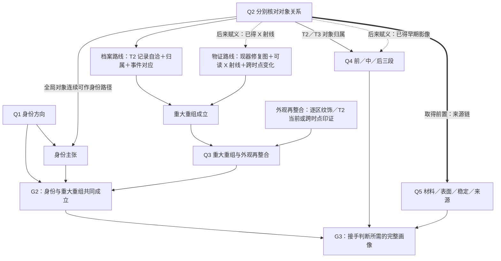

# 第一器物玩家推理骨架 v0：五个长期问题与 22 个手段归位

Status: **Design Candidate / authorized to draft / pending user review**

日期：2026-09-04

## 授权与窄问题

用户批准先做一张真实内容骨架，再决定是否改界面。本文只回答一个问题：

> 能否不改冻结作者真相、22 个动作的行为与 G1／G2／G3 语义，把首案整理成少数长期问题，让玩家看见一条清楚的论证主线？

本文不是新 DEC，也不批准 UI 实现、动作删减、新前置、Finding 新机制或正式内容裁剪。22 个手段保留当前工作台里的可见性和既有 `availability()` 规则；下文“披露层”只控制解释在何时醒目，不新增或移除动作门槛。

## 主推荐

把首案的玩家理解收束成五个长期问题。它们是**论证层级，不是操作时序**；玩家可以在当前 `availability()` 允许的范围内自由选择，能够提前取得的证据照旧保留，等关系条件具备后再获得意义。

| 长期问题 | 玩家最终应能说出的核心句 | 与现有阶段／主张的关系 | 必须保留的边界 |
|---|---|---|---|
| Q1　它大概是什么？ | “整体、底足与对照把它收窄到一个可信方向。” | 组织 G1 与身份主张的制造／年代方向，但不等于完整身份判决 | 罕见不等于假；方向不是结论 |
| Q2　这些材料说的是眼前这只吗？ | “这份影像／这批 T2 记录／这批 T3 记录能否归到眼前这一件，要分别核对。” | 是跨问题桥梁，不是独立阶段 | 全局对象连续、T2 归属、T3 归属是三种不同关系，不能合成一个布尔总闸 |
| Q3　它是否经历了重大重组并被重新整合成现在的样子？ | “档案关系或纯物证至少有一条走通，而且外观再整合也有依据。” | 组织重大重组主张；与 Q1／Q2 及 `appearanceRestore` 共同形成 G2 | 两路在重大重组的布尔证明上都可单独充分，但当前成本不同；重大重组成立本身不自动等于 G2 |
| Q4　这些变化怎样排成前、中、后三段？ | “早期状态、T2 大修与 T3 后期处理能分别归属并互相划界。” | 对应 `threePhase` | 材料微观层序不进入当前 `threePhase` 门，不能因为名字像时间线就混进来 |
| Q5　改动到了什么程度，证据是否足以形成接手判断所需的完整画像？ | “材料、表面、稳定性与来源边界都说清到各自允许的范围。” | Q5 组织 G3 的四个后段正向证据面，并与 G2、Q4 汇合；这不是冻结求解器的完整等式 | G3 还受阈值、阻断未知、争议与逻辑阻断影响；也不等于系统替玩家决定买不买 |

建议的玩家阅读形状是“小入口—并行调查—局部汇合—整体判断”。这借用 Ron Gilbert 依赖图的钻石形原则：开头少量入口，中段并行展开，末端汇合；不借用固定解题顺序。若后续获批实现，五问只在一个尚待裁决位置的薄导航层保留短标题，当前有材料可谈的问题才展开；它们不应冒充知识地图里的已取得内容，也不应替换决策面原有四类状态。

## 两条 G2 路线在五问中的位置

Q3 必须保留两条真实的证明路线。它们对“重大重组是否成立”都是充分的 OR 路径，但不是同成本：当前档案路线较便宜，物证路线较贵。

图中普通实线表示论证依赖，虚线表示“内容可以先取得、关系后来让它有意义”，粗线表示“不满足前置就不能取得”；三者都不表示固定点击时序。阈值和允许保留的未知项仍由冻结求解器处理，没有在这张玩家层骨架里展开。Q3、Q4、Q5 不是串行关卡：G2、三阶段与四个后段证据面是在最终完整画像处汇合的并行分支。Q2 也不是一个统一动作：它是一种反复出现的玩家问题，分别作用于历史对象、T2 档案和 T3 档案。

## 角色与披露词义

“角色”描述一个手段在玩家推理中的主要用途，可以重叠，不改求解器权重：

- **主线：**直接参与现有阶段／完整剖面的闭合；不表示每条路线都必须做。
- **桥梁：**把影像或记录安全地归到对象上，使别处取得的内容可解释。
- **替代：**构成另一条合法证明路线，绝不是低价值或可删内容。
- **教学：**主要暴露“重复不加权”“阴性不等于没有”等认知规则；若当前机制仍允许它推进主张，会明确写出。

“披露”只控制解释层级：

- **起点可读：**无需先学新术语，也能看懂一句短说明。
- **问题聚焦：**点击对应地点或长期问题时，再展开为什么有关。
- **关系出现：**只有相关证据／关系已经出现，右栏才主动提及；动作本身仍可在工作台找到，绝不是新增门槛。

## 22 个手段逐项归位

| # | 手段与当前输出 | 主问／兼问 | 玩家角色 | 披露 | 归位依据与不能说错的地方 |
|---:|---|---|---|---|---|
| 1 | `A.OBSERVE.WHOLE` 看整体形制与胎釉 → `obs.current.whole` | Q1／Q3 | 主线 | 起点可读 | 同时提供 G1 的整体方向与物证路线的现器修复图；不能只放在 Q1 |
| 2 | `A.OBSERVE.BASE` 看底足与修足 → `obs.current.base` | Q1；Q2 前置 | 主线 | 起点可读 | 提供制造痕迹，也是同期比对和身份主张的真实前提；它自己不证明“同一只” |
| 3 | `A.OBSERVE.REGION_DECOR` 逐区看纹饰与色差 → `obs.appearance.restore` | Q3 | 主线／外观补足 | 问题聚焦 | 提供 G2 另需的 `appearanceRestore`；其他动作也可能给出同一事实，但它自身不是另一条重大重组证明路线，也不是 G3 的正式 Surface 槽 |
| 4 | `A.COMPARE.CORPUS` 拿同期真品比一比 → `obs.corpus.identity` | Q1 | 主线 | 关系出现 | 提供 G1 方向和身份排除；需整体＋底足，但只给方向，不给最终身份 |
| 5 | `A.COMPARE.CORPUS.RECHECK` 换一批真品再比一次 → `obs.corpus.identity.repeat` | Q1 | 替代＋教学 | 关系出现 | 同依赖、重复不加权；但当前规则允许它替代第一次比对形成方向，不能写成“纯教学、完全不推进” |
| 6 | `A.VERIFY.OBJECT_CONTINUITY` 核对那些没被改动过的特征 → `obs.object.continuity` | Q2；兼 Q1／Q3／Q4／Q5 | 桥梁 | 关系出现 | 它让已经先取得的早期影像和 X 射线读数后来获得意义；对来源链则是真实的取得前置，未满足时来源链不可执行。这两类关系必须用不同箭头表示；它也不是 T2／T3 档案的统一总闸 |
| 7 | `A.IMAGE.XRAY` X 射线多角度逐区成像 → `obs.structure.xray.early` | Q3 | 替代 | 问题聚焦 | 是物证路线结构图；刚取得时可能只是原始读数，不能立刻画成“已经证明重大重组” |
| 8 | `A.SCREEN.UV` 紫外筛查补绘 → `obs.surface.no-signal.unresolved` | Q5 表面旁支 | 教学 | 问题聚焦 | 当前事件固定为未闭合阴性，只教学“没查到不等于没有”，不填 G3 的 Surface 槽 |
| 9 | `A.RESEARCH.ACCIDENT` 查有没有出过事的记录 → `obs.accident.major` | Q3／Q4 | 主线 | 起点可读 | 只证明 T2 记录组内部自洽和声称过大修，不证明记录属于本器 |
| 10 | `A.RELATE.ARCHIVE.T2_TO_OBJECT` 看事故记录说的是不是这只碗 → `obs.archive.t2.object-attribution` | Q2；兼 Q3／Q4 | 桥梁 | 关系出现 | 是 T2 自己的对象归属关系，可独立于全局对象连续性成立 |
| 11 | `A.CORROBORATE.ARCHIVE.T2_CURRENT` 拿事故记录去对这只碗 → `obs.archive.t2.current-corroboration` | Q3／Q4 | 主线 | 关系出现 | 是 T2 事件—现器对应，不是“是不是同一只”；也可提供 `appearanceRestore` |
| 12 | `A.LOCATE.HISTORIC_IMAGE` 找更早的影像 → `obs.phase.t1` | Q4 | 主线 | 问题聚焦 | 先得到早期读数，再由全局对象连续性使其成为 T1；保留“早拿后懂” |
| 13 | `A.MAP.REGION_CONTINUITY` 把两个时候一块一块对比 → 两种 observation | Q3；档案分支条件性兼 Q4 | 替代／分支 | 关系出现 | 有可读 X 射线时走纯物证跨时点；否则可走 T2 档案跨时点，并以 T2 的事件印证参与 `threePhase`。两边都具备时当前实现优先物证，不能预先写死成单一结果，也不能把整个动作固定归入 Q4 |
| 14 | `A.RESEARCH.LATE_TREATMENT` 查后来还有没有人动过 → `obs.phase.t3` | Q4 | 主线 | 问题聚焦 | 只先建立 T3 记录内部关系，还没有归到这只碗 |
| 15 | `A.RELATE.ARCHIVE.T3_TO_OBJECT` 看后期记录说的是不是这只碗 → `obs.archive.t3.object-attribution` | Q2／Q4 | 桥梁 | 关系出现 | 是 T3 独立对象归属，不能与全局连续性或 T2 归属合并 |
| 16 | `A.CORROBORATE.ARCHIVE.T3_CURRENT` 拿后期记录去对这只碗 → `obs.archive.t3.current-corroboration` | Q4 | 主线 | 关系出现 | 负责 T3 事件—现器对应及划定后期处理范围，不是身份归属 |
| 17 | `A.ANALYZE.MATERIAL.SUBSTRATE` 化验要紧几处的底子 → `obs.key-material.substrate-readings` | Q5 | 主线 | 问题聚焦 | 回答关键点位是什么材料；严格限于取样点 |
| 18 | `A.INSPECT.MATERIAL.LAYER_SEQUENCE` 查各层的先后顺序 → `obs.key-material.layer-sequence` | Q5 | 主线 | 问题聚焦 | 填关键材料的微观层序；虽然名字含“先后”，当前规则不填 Q4 的三阶段主张 |
| 19 | `A.INSPECT.WINDOWS` 在表面开几个小窗看层次 → `obs.surface.point-layering` | Q5 | 主线 | 问题聚焦 | 填表面点位层序，不可外推整区 |
| 20 | `A.SYNTHESIZE.SURFACE_REGIONS` 把开过的小窗连成片 → `obs.surface.resolved` | Q5 | 主线 | 关系出现 | 填表面区域覆盖；当前运行规则没有“先开窗”的硬前置，不能把呈现顺序伪装成行动锁 |
| 21 | `A.ASSESS.TREATED_AND_UNTREATED` 看它结不结实、能不能摆出来 → `obs.stability.resolved` | Q5 | 主线 | 问题聚焦 | 只在声明的承力路径、姿态和静态陈列条件下成立 |
| 22 | `A.TRACE.PROVENANCE_CHAIN` 追它经手过谁 → `obs.documentation.resolved` | Q5；受 Q2 前置 | 主线 | 关系出现 | 填来源边界与记录无冲突；需要全局对象连续性，但来源链本身不证明身份 |

22 个玩家动作与 22 份 `ACTION_SEMANTICS` 一一对应。冻结争议合同／事件另有 `A.RELATE.PHASE.CHRONOLOGY`，但当前 `scenarios` 没有引用，它也未进入玩家动作与语义表，因此不计作遗漏的第 23 个手段。

## 首层如何减负，而不改规则

### 1. 五问是索引，不是五张同时展开的大卡

候选方案是在知识地图与决策面之外设置一层很薄的跨栏聚焦索引，保留五个一行标题，防止渐进披露被读成线性解锁；具体位置仍待 UI 方案裁决。只有已经取得相关材料、正在被玩家聚焦或当前真的形成缺口的问题展开。知识地图仍只显示已取得内容，决策面仍只装“意义未定／差一件／打架／孤立小簇”四类状态；五问只给它们提供共同索引，不进入或替换这两个既有容器。

### 2. 重复的档案方法只教一次

T2 和 T3 都有“记录是否自洽—是否属于本器—所述事件能否在现器上对应”三层。玩家第一次遇到时完整解释，第二次复用同一图示语法和短标签；底层仍是两套独立状态，绝不合并成“档案正确”总开关。

### 3. 一个结果首层只承担两句话

- **现在看到了什么。**
- **它目前还不能说明什么。**

方法原理、限定领域知识、覆盖范围细节与为什么值得花钱进入按需层。这样保留古董鉴定的具体性，却不要求玩家先读完一段方法论才知道它与哪一问有关。

### 4. 替代与教学手段不抢占主线篇幅

- 整体观察提供的现器修复图、X 射线与跨时点对比共同组成完整物证路线；它在重大重组布尔证明上与档案路线同为充分路径，但成本更高，只在玩家聚焦 Q3 时展开路线说明。
- 紫外阴性默认只留一句“没照出来，但还不能说没有”，随后把相关的其他表面证据放到聚焦层。它们可以另行完成 Surface 画像，却不会把这条紫外阴性改写成已解决结论。
- 语料复查的规则作用不能被悄悄降级；但“同方法重复不加权”的完整教学只在它实际发生后出现。

## 不能在本轮顺手解决的语义冲突

1. 当前玩家文字把全局对象连续性称作“所有档案证据的总闸”，但冻结规则里 T2／T3 对象归属并不依赖它。这句话需要后续修正，不能拿来定义五问。
2. “换一批真品再比一次”当前可以先于第一次比对执行并替代它推进方向；名字和教学承诺与规则不完全一致。
3. “把开过的小窗连成片”当前没有先做试窗的硬前置。改名、加门或调整冻结件仍须另行裁决。
4. Q5 承载材料、表面、稳定性和来源四个面，仍可能过重；是真人对照中最需要观察的 Unknown。
5. 真正局部 Finding 如何生成不由本文决定。五问只为它提供应回答的玩家问题，不提供第二套真相谓词。

## 与既有决定的关系

DEC-032 曾判断“领域知识不是要抹平的税，修法是补语义而不是简化掉”。2026-09-04 用户的新反馈是当前古董内容仍然过重，需要减少概念并拉直长线推理。本文采用的可逆解释是：**先减少首层同时要求理解的概念，保留底层证据与按需领域内容**。它不静默删掉领域知识；若下一步要实际删除动作、证据或作者内容，必须另行获得用户批准并重新处理与 DEC-032 的关系。

## 研究取舍

- **Adopt：**采用五个长期问题作为下一轮玩家投影的 Design Candidate；采用一套重复可学的“自洽—归属—事件对应”档案语法。
- **Borrow：**借 Ron Gilbert 图的“少量入口—并行展开—末端汇合”和删冗余原则，但不用固定谜题流程，也不把设计图原样端给玩家。
- **Reject：**不把 22 个动作硬删成五个按钮；不借披露层新增 availability 门；不把三种对象关系合成一个总开关。
- **Unknown：**五问是否仍太多、Q5 是否过载、玩家能否从它们形成自己的长线解释，只能由真实内容试玩判断。

## 推荐的下一次最小实验

若用户认可这份骨架，下一份独立入口只验证一条链：点击左侧“紫外筛查补绘”，三栏同时聚焦 Q5 的表面问题、已有紫外阴性观察和右栏“还不能说没有”的缺口。它不提前泄露未取得结果，不改地图布局，不同时实现 Finding 新机制。通过后再把共享聚焦扩到其余问题。

## 依据

- 冻结作者合同：`validation/first-ceramic-author-scenarios-v0/fixtures.mjs`；
- 冻结求解条件：`validation/first-ceramic-author-scenarios-v0/solver.mjs`；
- 当前 22 个玩家动作：`validation/knowledge-map-slice-v0/case.mjs`；
- 当前玩家语义：`validation/evidence-semantics-v0/semantics.mjs`；
- [第一器物具体一局 v0.1](2026-08-21-first-ceramic-concrete-session-v0-1.md)；
- [DEC-032](../../decisions/DEC-032-v3-workbench-map-separation-and-guidance-division.md)；
- Ron Gilbert, [More Maps and Puzzles](https://blog.thimbleweedpark.com/maps_and_puzzles2.html) 与 [Taming the Design](https://blog.thimbleweedpark.com/taming_the_design.html)。

本文完成的是可审阅映射，不证明五问好玩、易懂或适合最终产品。
