# 当前第一只碗：局部逻辑逐张展开

2026-09-07 · **现状说明，不是改版方案**。

用户澄清：此前是在询问对依赖关系的质疑是否成立，并未授权把讨论直接转成下一步调整。本次只展示当前第一只碗的规则。基准是 fusion v0 使用的动作表与冻结求解器；刚做的 X 射线／旧照片小示意属于独立候选，不作为此图册的规则来源。

前 13 图覆盖当前 22 个调查动作；14—19 是判断与阶段；20 单独说明地图中的追问关系。箭头上的“取得”“才能执行”“共同支持”分别照实际含义标出，不能混读。菱形中的中文只是解释条件组合，不是新的界面方案。

图中的 0.75、0.5 是当前实验求解器门槛，不是已批准的玩家概率。以下正常 22 动作均是当前固定结果；压力测试里的额外反证事件不画成这局可执行的调查。阈值、冲突与未知限制仍按原规则注明。

## 01 直接观察：整体、底足、纹饰

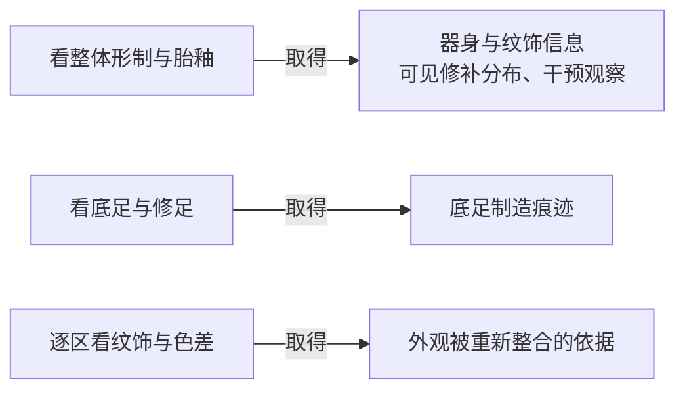

三项均可直接做，没有互相前置；可见修补或外观整合本身不等于重大重组成立。

## 02 同期真品比较与换批复查

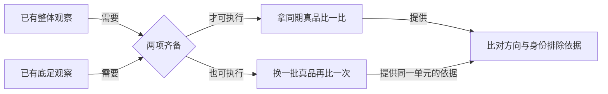

实际规则没有“先第一次比较，才能换批”的门。两动作共用同一证据单元，不能当成两份独立证据累加。

## 03 对象连续性核验

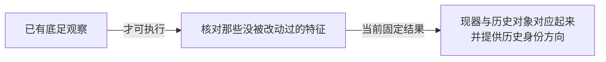

当前规则只要求底足观察，**不要求先做“找更早的影像”**。核验事件自带档案影像来源；这与最新小示意的获取约束不同，不能混用。

## 04 X 射线：先取得，后获得解释

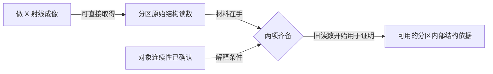

这是旧融合版当前实际规则。它不是小示意里“拍完即用”的候选；这一组合也不直接推出重大重组。

## 05 早期影像：先取得，后归入此碗历史

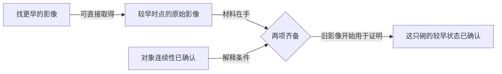

在当前冻结规则中，核验报告可以先于这份早期影像取得，所以不能按小示意的状态约束直接化简。

## 06 跨时点对照：同一个手段的两种结果

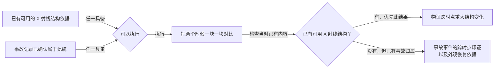

它不要求先拿早期影像，也不是“X 射线加旧照片”共同解锁。两项入口都满足时，当前代码优先物证结果；一次执行不同时给两种结果。

## 07 事故记录：三个分别核实的关系

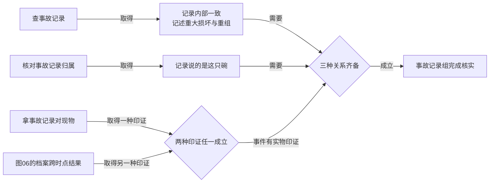

当前事故记录、归属报告和直接印证报告都没有获取前置，报告可以先到；图中没有把它们画成必须依次执行。核实归属不会自动核实事件。

## 08 后期处理记录：同样分别核实三种关系

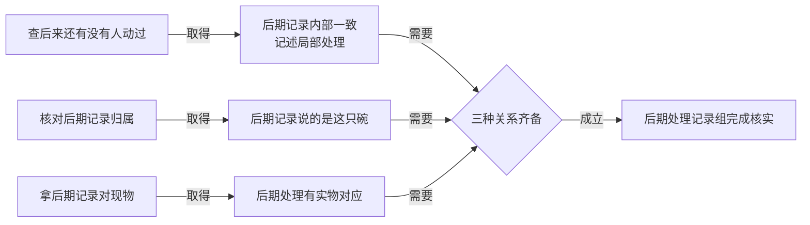

这三种调查也没有相互获取前置。当前后期记录只接直接现物印证，没有事故记录那条跨时点替代路线。

## 09 紫外筛查：能力边界

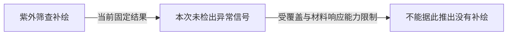

这不是一份等待对象核验后就自动生效的材料。后续调查不会把这次检测固有的能力字段改成充分；阴性记录保留。

## 10 表面：点位与区域

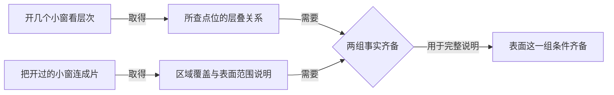

当前代码允许先做区域综合，**没有“试窗解锁综合”的门**。综合事件自带点集来源，却不会补发点位事实，所以完整说明仍需要两项调查。这里的“条件齐备”只用于拆解 G3，不新增局部判断。

## 11 材料：底材与层序

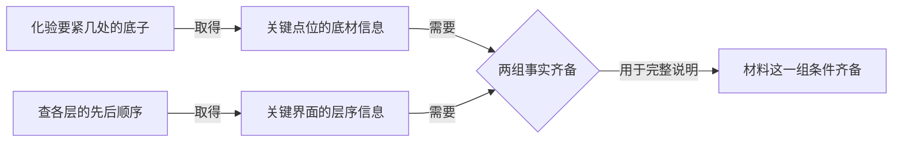

两种调查可各自取得，没有互相获取或解释前置；也不互相证明。它们共同满足后面的材料要求。

## 12 稳定性：一次评估，带条件的结果

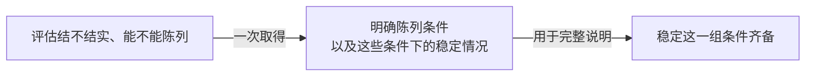

无获取前置。结果限于声明的承力路径及支撑下静态陈列；不能读成任何用途都安全，也不是两项独立调查。

## 13 来路：核验是获取前置

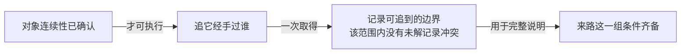

这里缺核验时不能执行调查，区别于图04、05“材料可以先拿到”。

## 14 年代与类别判断

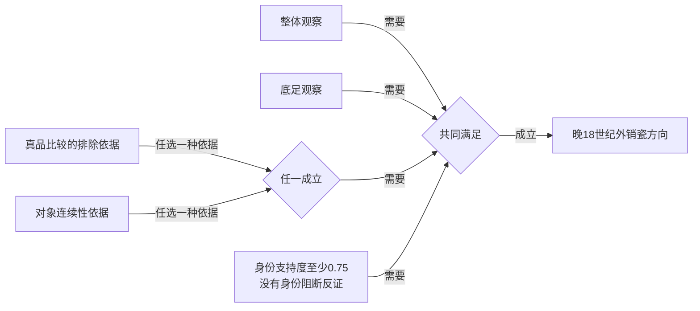

这是原求解器的证明条件展开，不表示这些都是相互独立的任务；底足等已被部分调查的获取前置包含。这里先照原规则列出，不替用户化简。

## 15 重大重组：两条完整证明路线

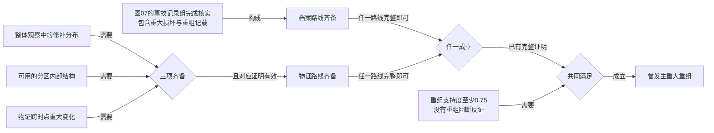

不能把两条各缺一部分的路线拼成一条完整证明。物证跨时点结果的取得也包含了结构读数前置；图中按原证明槽位保留，不冒充完全并行的调查。

## 16 三阶段修复史

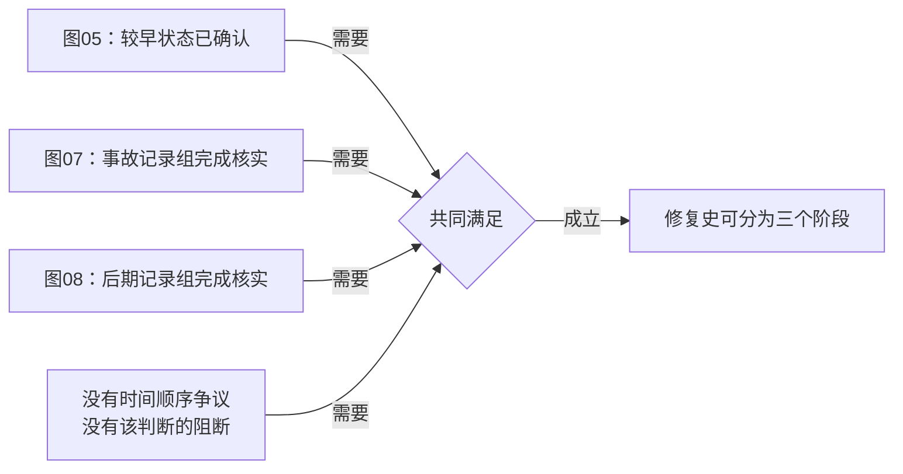

拿到三份原始材料还不够，各组关系必须已核实。这个判断不要求年代判断、G1 或 G2 先成立。

## 17 G1：开始有调查方向

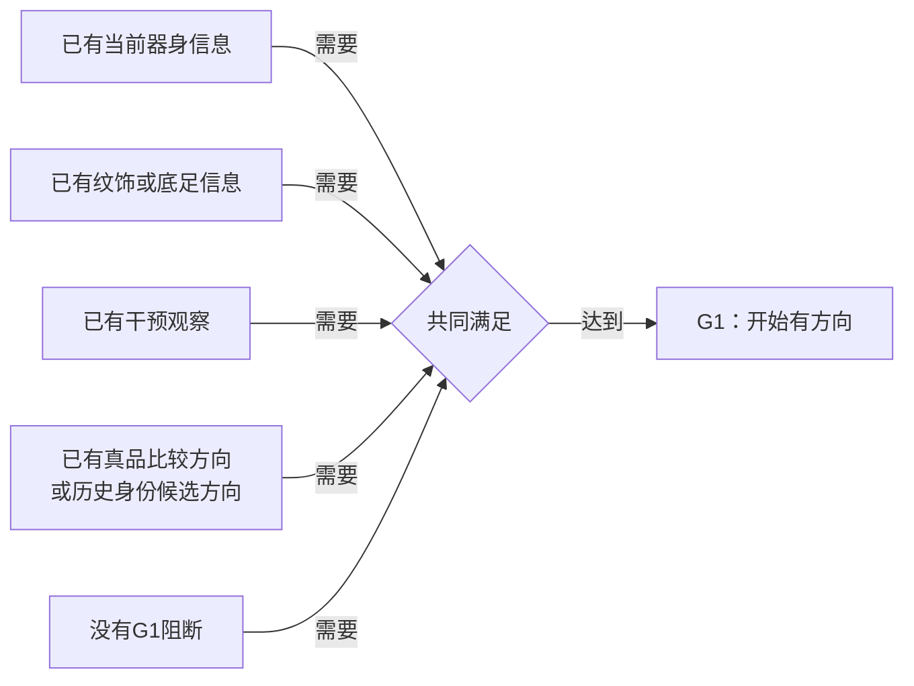

本案整体观察一次提供前三项所需内容。正常22动作中，G1 与年代判断常同时成立，但这不是程序把两者定义为同一个判断。

## 18 G2：身份与重大重组站得住

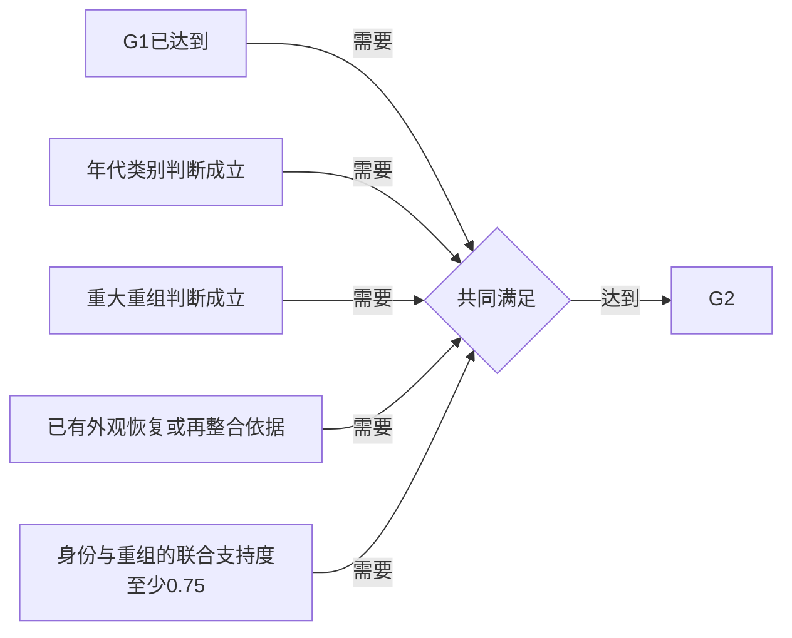

外观依据可来自纹饰色差观察、事故现物印证或档案分支的跨时点印证。仅身份与重大重组成立，不足以覆盖所有情况下的 G2 条件。

## 19 连贯说明／G3

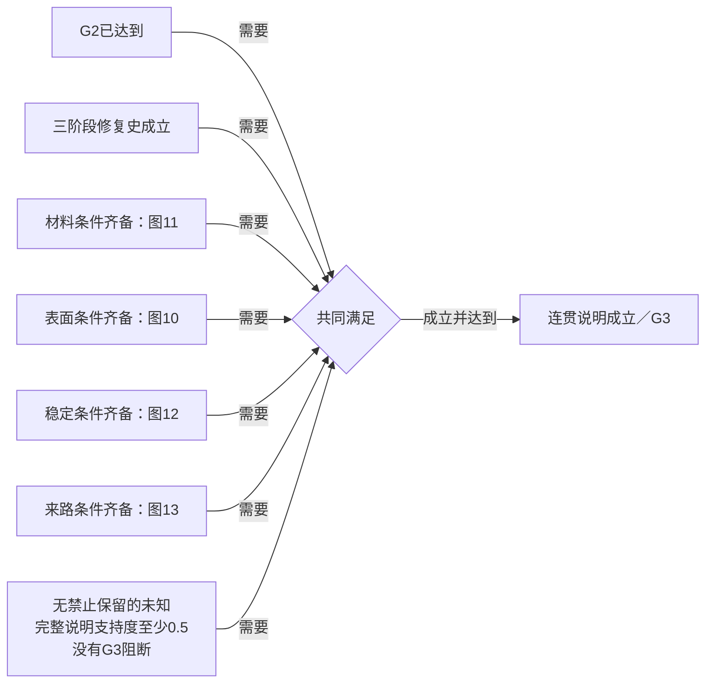

连贯说明在当前代码里直接等于 G3，并非额外的一条判断路线。完整说明不要求紫外调查必做，也不要求所有未知清零。当前正常会话没有额外传入禁止保留的未知清单。

## 20 由已知提出疑问：这不是证明公式

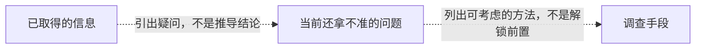

当前正常地图中的这类关系包括：

| 已知内容 | 提出的问题 | 关联的调查 |
| --- | --- | --- |
| 未解释的 X 射线／早期影像 | 能否归到同一对象 | 对象核验 |
| 事故或后期记录 | 内部是否一致、是否属于此碗、事件是否有物证 | 相应三种核验；没有独立“补内部一致”动作 |
| 先到的关系核验报告 | 报告所指的原始记录是什么 | 对应记录检索 |
| 整体制造特征 | 放进历史参照会怎样 | 同期真品比较 |
| 可见修补 | 涉及哪些层面 | 纹饰、X 射线、事故记录 |
| 外观整合痕迹 | 变化压在哪一层 | 紫外、试窗 |
| 未检出紫外信号 | 能否说明没有补绘 | 试窗；不承诺补齐原检测能力 |
| 试窗点位信息 | 能说明多大范围 | 区域综合 |
| 底材或层序的一方 | 另一方还不知道什么 | 另一种材料调查 |
| 可读 X 射线结构 | 从另一个时点到现在变了什么 | 跨时点对照 |
| 重大重组已有依据 | 改动发生在什么时点 | 早期影像、后期记录 |

这些追问的出现并不建立事实，也不能反过来作为执行前置。它们与前19图的取得／解释／证明逻辑应分别阅读。一般夹具还有冲突、允许保留的未知等追问；正常22动作中没有对应的额外调查事件，不虚构到这局行动表中。

## 独立候选的边界

`xray-photo-logic-study-v0` 小示意把 X 射线改成直接可用，并要求先有照片才能演示核验。这两条与图03—05的现有游戏规则不同。用户表示该示意可以理解，但随后关于时序与逻辑与的提问只是质疑，不是批准采用改法。本图册不把该候选混入现状。

## 来源与核对

- [动作表及可执行条件](validation/knowledge-map-slice-v0/case.mjs:43)：22动作、5个获取门、跨时对照分支。
- [事件及能力边界](validation/first-ceramic-author-scenarios-v0/fixtures.mjs:583)：两项解释门、分区／点位／材料／陈列／记录事实。
- [档案关系判定](validation/first-ceramic-author-scenarios-v0/solver.mjs:1254)：三种关系分开成立。
- [判断与阶段](validation/first-ceramic-author-scenarios-v0/solver.mjs:1325)：证明包、支持阈值、阶段与阻断。
- [地图追问投影](validation/workbench-map-atlas-v0/graph.mjs:187)、[融合版关系拆分](validation/workbench-map-fusion-v0/graph.mjs:48)：仅关联的问题与真正成立条件分开。

主执行者核对了现有代码；两个只读 Agent 分别完整核对22动作与判断／阶段，并复用实际会话重放确认某些判断可以先成立而阶段仍为NONE。本次没有修改规则、页面、数值、原测试或求解器。此图册说明现状，不证明现状合理，也不替用户作下一步设计决定。
