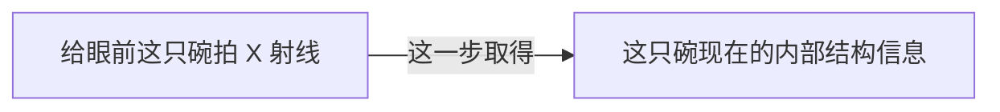
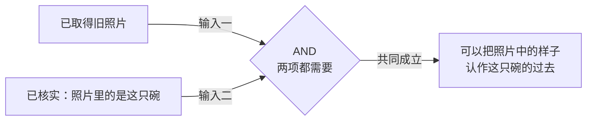

# 第一小步：今天的 X 射线，与一张旧照片

2026-09-07 · **局部逻辑方案，待评价**。用户已允许同时重审图形与这处前置；下面是候选关系，尚未修改游戏规则，也不是新一轮整页原型。

只回答一个问题：**为什么一份调查结果可以立即使用，另一份需要补一项条件？**

## 今天拍的片子

玩家给眼前这只碗拍 X 射线。候选规则让这一步直接提供这只碗当前的结构信息；不再要求先证明它与旧照片里的对象相同。

这一步不直接给出“曾发生重大重组”。具体照片呈现与可读观察尚需由已定器物真相支撑；不能只把“结构读数”换一个名称，也不能临时编造裂缝形状或位置充当证据。

## 找到一张旧照片

旧照片确实在手，但照片里的器物是否就是眼前这一只，还需核验。这里等待的是一项明确的共同条件。

**缺口就放在输入二的位置。** 未核实时，只把这一处画成未接通的道路，旁注“还没核实是不是同一只”；不把两份材料都染成一种需要查图例的“意义未定”类别，也不画成旧照片与 X 射线一起推出对象相同。

核验要让玩家看见用来对照的对象和参照。若动作自带档案参照，参照必须在结果中显式交代；若没有参照，就不能用后台未交代的材料静默完成核验。这一来源安排要在局部内容稿中落实。

## 同一段图的三个时刻

| 玩家做到哪里 | 图中应看得见什么 | 玩家应能说出什么 |
| --- | --- | --- |
| 只做 X 射线 | 一份直接来自眼前器物的结构信息 | “这是它现在的情况。” |
| 又找到旧照片 | 照片保留；将它用于这只碗历史的推理有一处条件缺口 | “照片有了，但还没核实是不是这一只。” |
| 核验同一对象完成 | 同一缺口补通；照片不消失、不重复发放 | “现在我可以把照片里的样子算作它的过去。” |

这次只确立这些关系。结构与照片是否足以比较某个具体变化，要看二者覆盖了什么；普通外观照片不能被默认当成另一张内部结构片。本方案不自动接出“重大重组”或“三阶段修复”等更远结论。

## 这一页采用的图形规则

证据项只表示已取得内容；AND 汇流口表示必须共同在场的输入；缺口对应某个尚未成立的必要条件；输出明确写出这些输入允许作出的判断。作者讨论图展示了完整局部关系，游戏呈现仍须按已知逐步显露，不能把未取得的答案预先摊开。

关系未接通用黄色虚线，已成立的支持用绿色实线，共同条件保留菱形。选中反馈单独使用中性外框，不再占用表示缺项的黄色。本轮不引入新的状态颜色或紫色解释线。

## 如何决定是否扩展

先只评价上面的三行：不听颜色词典，是否能指出“哪项已在手、哪项条件尚缺、补上以后允许判断什么”。这页可读之后，再做相同范围的可点击呈现；当具体观察与操作也可读后，才扩展到整张地图。

未验证：这页是否已经对用户足够直观；具体证据内容与参照资产；候选规则对现有路线／最短步数的影响。旧冻结模型、旧 HTML 及旧验证结果保持原样，不能把这份方案标成游戏实现或规则验收通过。
