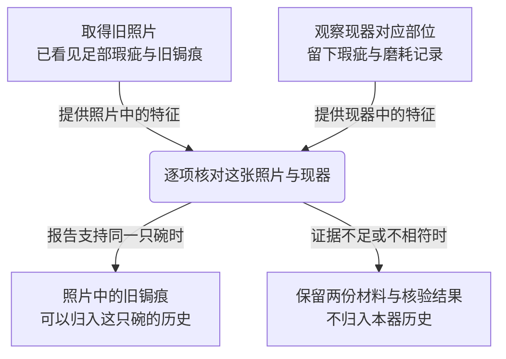
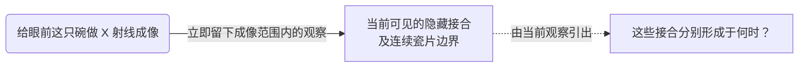
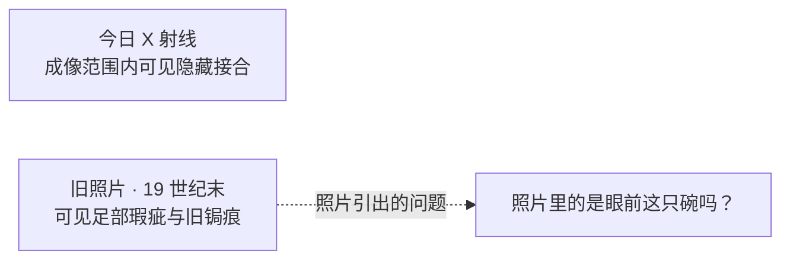
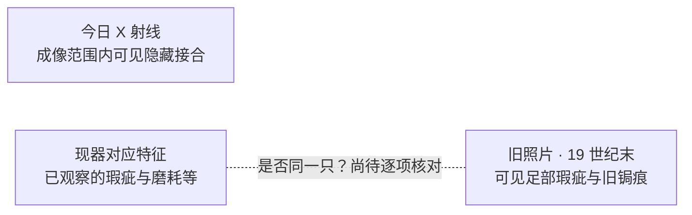
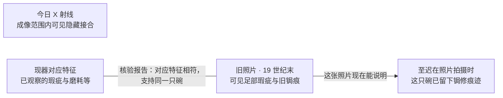
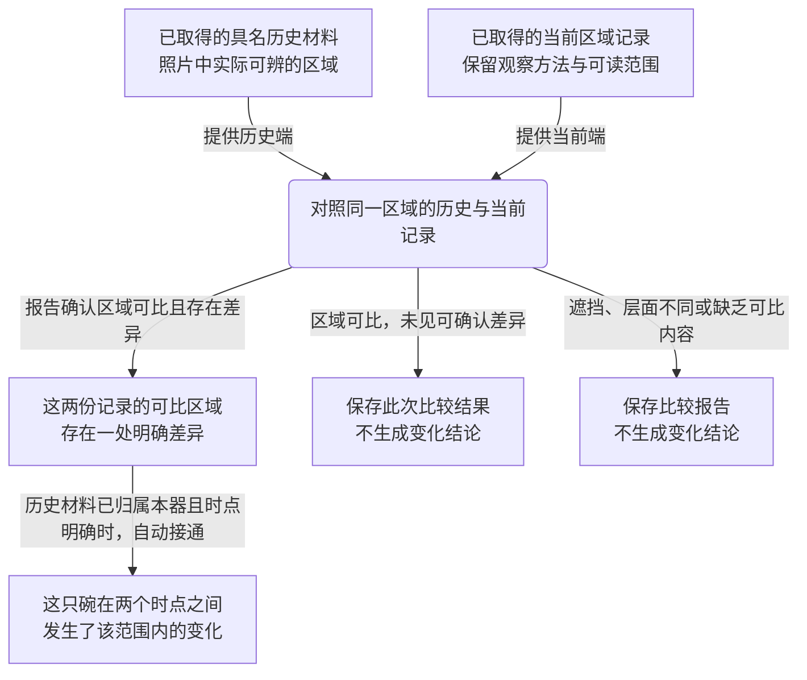

# 旧照片、对象核验与 X 射线：局部修订提案 v1

2026-09-07 · Design proposal / Experimental / 待用户评价

用户批准制作图 03—06 的“现状—建议—调查后变化”对照。批准的是本提案与讨论图，不是把下面的候选规则写入冻结求解器、整张地图或已有小示意。

## 首选方案

**观察先留下具体内容；核验建立两份材料之间的关系；新的关系让旧内容能回答一个更具体的问题。**

今天的 X 射线立即提供成像覆盖内的当前结构。旧照片立即提供照片中的可见内容。核验针对“这张照片与眼前这只碗”，需要实际拿到照片与现器对应特征，返回可回查的逐项核对报告。报告支持同一对象后，照片中早已看见的旧锔痕才能归入这只碗的历史。

这段样板的具体收获是：**至迟在这张 19 世纪末照片拍摄时，这只碗已留下锔修痕迹。**它不等于当前所有接缝都形成于当时，也不单独建立重大重组、三阶段修复史或 G2。

## 现状与建议对照

| 局部 | 当前运行规则 | 本轮首选建议 | 改动性质与理由 |
|---|---|---|---|
| 03 对象核验 | 只需底足观察；事件自带 `source.archive.image`，不要求取得早期影像 | 这段核验明确指向已取得的那张旧照片。照片和现器对应特征都有后可以执行；报告按实际对应程度给出结果 | **候选获取条件变化。**核验前，玩家应当已经能看见要比的两份材料。拥有两份材料只允许比较，不保证比较相符 |
| 04 X 射线 | 原始读数可以先取得；对象连续性成立后，当前结构依据才生效 | 成像后立即留下覆盖内的隐藏接合、填料候选和连续瓷片边界；历史意义另由后续关系承担 | **候选解释条件变化。**当前结构与其历史原因分别负责，不把整份观察挂在历史核验之后 |
| 05 早期影像 | 原始影像与全局连续性共同给出早期状态 | 旧照片从取得时就可读；与现器核验通过后，原照片新增“可归入本器历史”的关系和一条有范围的历史表述 | **关系与呈现候选。**不把“照片在手”和“针对这张照片的核验成功”再画成两条独立获取路线；保留来源回查 |
| 06 跨时点对照 | 可读 X 射线或 T2 归属任一满足即可执行；历史端在结果事件里隐含提供，两者都满足时优先物证分支 | 先明确选用哪份已取得的历史材料、哪份当前记录；报告写出实际可比区域和差异。归属未定时可保留候选比较，核验后才把差异用于此碗历史 | **候选输入与结果选择变化。**同一动作不因后台优先级悄悄换成另一种比较；可尝试比较与能否证明本器发生变化分开 |

这些建议会影响后续依赖与可能的步数。本轮未重算或宣称仍是原来的 16 步；22 动作、费用与阶段门也没有因此在当前游戏里改变。

## 材料具体是什么

| 材料 | 有来源的内容骨架 | 可显示的提案文案 | 仍需制作的内容 |
|---|---|---|---|
| 旧照片 | DEC-021 已设定 19 世纪末室内照片，含商馆构图、足部烧成瑕疵与旧锔痕 | “旧照片 · 19 世纪末；可见足部瑕疵与旧锔痕” | 照片图像、可见视角、来源说明、可辨识部位；不凭空设定瑕疵数量与坐标 |
| 现器特征记录 | 底足烧成瑕疵、稳定磨耗；核验还可使用有对应观察的几何比例和口沿缺口 | “现器足部 · 烧成瑕疵与磨耗记录” | 与照片一一对应的近景和特征值；几何或口沿若未实际观察，不由核验按钮凭空补发 |
| X 射线记录 | 多角度逐区的隐藏接合、填料候选、连续瓷片边界，可读与不可读范围分开 | “当前结构 · 成像范围内可见隐藏接合；未读清处保留” | 投照角度、具名可读区域、实际可辨识的结构图。背面河岸填补是作者真相，不能未经可读性依据直接塞进这次结果 |
| 核验报告 | 稳定非构图特征逐项对应；不是“花一次机会即获得同一只”的开关 | “照片与现器的对应特征相符；支持为同一只碗” | 在报告中列出具体两端、对应点及不足；这一成功表述用于当前正向案例的条件示意 |
| 跨时点报告 | 早期／损坏时点的照片与当前区域记录做对应 | “这份历史材料与当前记录在这些可比区域存在／未见可确认的差异” | 历史端、当前端、区域映射及可支持的具体差异。当前尚无足够内容可填入某条确定的新接缝年代 |

这里的文案是基于已有作者设定的呈现草案，不是声称当前 HTML 已经提供了这些图片与测量。现有事件主要存事实标签、来源 ID 和抽象覆盖。尤其 `source.archive.image`、`source.archive.pre-accident`、`source.archive.major-region-pre` 目前没有明确的原件对应表；不能因为名字类似就当作同一份材料。

**本候选明确选择：早期照片本身就是这一项照片归属核验的参照。**这是建议建立的来源映射，不是对现有三个 ID 同源的认定。它也不让这张照片自动充当所有跨时点比较的历史端；其他历史记录仍各自核验。

## 操作过程：两份材料可分别取得，核验发生在其后

这张是解释动作输入输出的过程图；不建议把动作框直接搬进玩家知识地图。

两份材料取得的顺序自由。核验报告不是看到两份材料便自动成立，也不由 X 射线替代。这里的失败出口是提案对结果使用的限制，不宣称当前正向案例已实现了额外的反证调查事件。

若只有底足记录，仍可继续其他调查；若只有照片，照片里的内容仍然可读。核验关系只针对这张照片，不替事故档案或后期处理报告作归属证明。

## X 射线：立即知道当前结构，时间问题保持开放

缺少历史资料时，未通的是对年代、事件或来源的解释道路。现有结构不会被染成“整份不可用”。这里也不由隐藏接合直接推出关键原片归属、补绘忠实度或重大重组。

## 玩家地图的三个状态

三个状态使用同一批信息身份：`photo`、`current-features`、`xray`。照片被使用时仍是同一份材料，来源与取得时间不变；`photo-era-repair` 是对既有早期状态的限定表述，不是新增计分 Finding。

Mermaid 用于本轮逻辑讨论，不验证最终节点坐标。下面的“原位”是后续地图布局要求：旧照片、X 射线与现器记录各自位置固定，核验只补关系，历史表述向照片外侧接续。

### 状态一：已经做了 X 射线，也找到了旧照片

两份材料都是已知。此时不出现尚未观察的现器特征，也不预先放出“本器已经锔修”的答案格。X 射线和照片之间没有相互证明的连线。

### 状态二：观察了现器对应部位，尚未完成核验

现在两端都在手，问题从照片的短路移到两份材料之间。虚线表达待核对的关系，不是已成立的证明，也不保证核验一定相符。相关方法仍在工作台或按需详情里。

### 状态三：核验报告支持同一对象

这一刻新增的是照片与现器的成立关系，以及照片中旧锔痕对本器历史的用途。点击实线可回查原始核验报告。照片不重新取得，X 射线不重新取得，当前结构也不被自动标成同一时期的修复。

成立后的历史表述需要照片中实际可辨的锔痕、照片的有效时间说明和通过的本照片归属报告。图中照片至历史表述的出路，由这些依据共同约束；不是只要存在一张照片就成立。

## 跨时点道路怎样继续延伸

**当前结构、早期外观、事故照片记录的是不同层面的东西。先确定两端可以比较什么，再谈变化。**

上图的差异结果是**条件示意**。本轮没有虚构“旧照片里没有某条内部接缝”或“某片瓷在两时点间换过位置”。要画出具体变化节点，需要实际作者化的两端材料与对应报告。

首选建议允许先做候选区域比较、后完成对象核验。归属未定时，报告只能说明两份记录之间有差异，不能把不同对象之间的差异叫作同一只碗的变化。若差异报告先取得，后来的核验可以在时点明确时把已有差异归入此碗历史，原报告不用再购买或重做。反过来，先核验后比对，也得到相同的范围限定关系。这才是这条路的“早拿后懂”。未见可确认差异与根本不可比较分开保留；它们都不保证调查会推进阶段。

需保留三条区别：

1. **旧外观照片没显示内部接缝，不等于当时没有接缝。**跨时点不能把不可见当作不存在，也不能假定存在一张旧 X 射线。
2. **确认同一只，不等于已经确认变化。**历史归属与差异报告各司其职，缺少可比内容时道路保持开放。
3. **一处变化不等于重大重组。**完整物证路线仍需现器修复分布、有效结构依据及足够范围的重大变化证明；档案替代路线仍需它自己的记录、归属与事件印证。是否如何迁移这些证明角色留给后续实现审查。

两条原有跨时点用途保留为明确的参照选择：历史照片与现器做物证比较，T2 记录与现器做事件印证。后者不由本照片核验代替 T2 归属。可开始比较的条件是实际材料在手；本器肯定表述还须各自归属与对应依据。不会因为玩家同时拥有两类材料而暗中选另一种报告。菜单、费用与动作身份在本轮未改写。

## 几种顺序下应该发生什么

| 顺序 | 当下留下什么 | 后来接通什么 |
|---|---|---|
| 先成像，未找旧照 | 当前结构观察；时间解释仍开放 | 以后出现适用历史材料时才可能增加历史关系 |
| 先旧照，未观察现器特征 | 照片与其中可见的锔痕；照片归属疑问 | 现器对应记录到手后才能执行这一张照片的核验 |
| 先现器特征，后旧照 | 现器记录保留；照片到手后出现两端关系缺口 | 同样可以核验，不要求先拍 X 射线 |
| 两端都到手，但未核验 | 两份已知内容、待核对关系 | 不自动成为“这只碗的过去” |
| 核验支持同一只 | 原照片取得时间不变；旧锔痕可归入本器历史 | 不自动把当前所有接合归到照片年代 |
| 先比较两份记录，后核验历史归属 | 可比范围内的候选差异报告 | 核验后自动增加本器历史用途，不重计原报告 |
| 历史照片遮挡了所问区域 | 已有材料与不充分的比较报告 | 核验成功也不能填补这个观察盲区 |
| 只有 X 射线与旧照片，没有对应核验依据 | 两份材料仍各有内容 | 不能由二者的“同时拥有”推出同一对象或重大重组 |

## 对现有规则的影响与接入边界

- 需要把“当前结构可用”从 `identityObjectContinuity` 的解释门中拆出；这只是本轮建议，冻结事件未改。
- 本照片核验的取得门拟加入真实照片输入；底足记录必须提供实际可对照的特征。核验未观察的部位需要先有相应观察，不能自动补发。
- 本局部的同一对象关系拟绑定明确照片与现器，而非一个适用于全部历史记录的总开关。现有连续性还参与年代方向、来路调查与其他证明；接入前必须逐个迁移，不能直接删掉旧字段或放开所有消费者。
- 历史照片、核验参照和物证跨时点参照必须建立原件来源映射。原件相同则复用，不重新计权；原件不同则各自标明，不由字符串相似猜测。
- 跨时点报告拟由明确的材料对决定，不继续采用“有 X 射线就优先返回物证结果”的隐式分支。具体可见差异尚待内容作者化；本提案不把示意节点变成新真相。
- 这是局部规则与表达提案。三阶段、重大重组阈值、G1／G2／G3、费用、16 步路线与其他 18 个动作均未改动，也没有声称未来接入仍保持相同最短路线。

## 核对证据与未验证内容

负责人阅读当前记录、动作与来源语义；只读 Agent 独立核对了四类事件、历史来源和 DEC-021／08-21 作者材料。确认当前实现与早先作者叙事在 X 射线即时回报上存在差异，并确认当前没有已实现的照片特征值或旧内部成像。

本次只改提案与当前入口记录。未运行产品构建或游戏回归：没有改游戏代码，构建也不能验证这些候选设计是否合理。Markdown 内容、来源路径、图块与工作区差异另作静态检查。图形阅读是否自然、内容是否足以让玩家推理，仍待用户评价；尚无固定坐标原型、真实照片配对或真人试玩结论。

### 完成证据（保存在文档内）

- Implemented: 局部设计提案、当前／建议对照、三种知识地图状态、跨时点条件图与内容来源说明。
- Executed: 当前 Git 状态与差异检查；四类事件和作者材料交叉核对；文档静态检查；独立只读复核（结果见下方追加记录）。
- Scenarios covered: 上述八种顺序／不足情形的规则推演，非运行中的新游戏行为。
- Observed result: 当前来源 ID 不足以提供玩家可比对内容；首选提案把当前观察、照片归属、跨时点差异分开负责。
- Evidence provenance: 负责人文档与规则核对；独立源码探索 Agent；后续独立提案复核。
- Not verified: 真实图像、核验特征值、跨时点实际差异、固定坐标布局、候选玩法、步数与平衡、真人理解。
- Residual risks: 照片视角可能不足以核验或比较目标区域；局部关系替换全局连续性会波及其他消费者；具体内容补齐后才知道该示意是否可玩。
- Exact completion claim supported: 已形成可审阅的局部修订提案；不是规则实现、玩家验收或全图修订完成。

### 本轮检查结果

- 文档静态检查：`mermaidBlocks: 6`、`localLinks: 7`、`missingLinks: []`、`utf8ReplacementCharacters: false`，退出码 0。仅检查图块、链接与编码，不是 Mermaid 引擎解析或视觉验收。
- `git diff --check`：退出码 0，无输出。
- 对冻结场景求解器、动作会话目录、v0／focus／atlas／fusion 旧原型执行 `git diff --exit-code -- <上述目录>`：退出码 0，无输出；这些 tracked 文件无本轮改动。
- 独立提案初查：限定 Fail，指出归属核验前不应称为本器“变化”，以及漏了“可比但未见差异”出口。
- 负责人修正：核验前只称两份记录的差异；归属成立且时点明确后才归入本器变化；补齐无差异出口。
- 同一只读复核者重新读取最新提案与三个入口：限定 Pass，无剩余阻断项；只覆盖语义、来源与授权边界，未增加素材、游戏运行、图形渲染或真人体验证据。

### 触发式审查

`review required`：本轮形成了获取条件、解释条件、来源绑定与分支选择的新建议，涉及原先未明确的设计细节，尚未成为用户采纳的规则。独立 Agent 的只读检查只检查提案是否自洽、是否正确引用现状；不代用户裁决，也不等于项目的独立审查会话已通过。未触碰冻结求解器、旧页面或测试／基线。

## 来源

- [DEC-021：具名器物与固定历史](../../decisions/DEC-021-v3-first-ceramic-objective-truth-package-and-gameplay-first-authorship.md:71)：区域真相；足部与旧照对应；19 世纪末照片与事故材料；检测能力边界。
- [具体一局 v0.1](2026-08-21-first-ceramic-concrete-session-v0-1.md:34)：即时结构回报、旧照内容、核验锚点、跨时点组合及材料归属边界。
- [作者模型 v0.3](2026-08-21-first-ceramic-three-result-author-model-v0-3.md:68)：完整物证路线、档案替代路线与覆盖约束。
- [限定领域复核闭环](2026-08-21-first-ceramic-limited-domain-review-closure-v0.md:44)：实际射线可读矩阵仍未验证。
- [现有动作](validation/knowledge-map-slice-v0/case.mjs:43)：当前取得前置与跨时点分支。
- [现有事件](validation/first-ceramic-author-scenarios-v0/fixtures.mjs:605)：对象核验；730 行起为 X 射线、跨时点和早期影像。
- [现状图册](2026-09-07-first-case-local-logic-diagrams.md)：原规则完整拆图；本提案不覆盖它。
