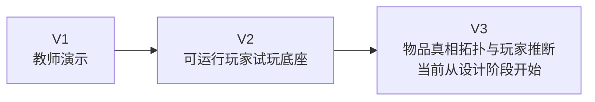

# Start Here

> 这是面向人的简化投影，不是新的项目权威或活动账本。若本摘要与权威项目记录或现场证据冲突，以权威记录和现场证据为准。

最后更新：2026-08-14（V2 终态）

## 项目是什么

《掌眼》是一款手机竖屏的古玩判断游戏。玩家通过调查一件器物，在有限成本下逐步形成判断，并为继续调查、相信什么和何时收手承担后果。

## 现在在哪里

V2 的产品范围到此结束；冻结身份由 Git 现场中的 `v2.0.0-player-prototype-freeze` 确认。它已经是一套能运行、能回放、能展示核心调查与交易流程的玩家试玩底座，但还不是我们刚刚构思的“物品真相拓扑游戏”。

最简单的前后关系是：

## V2 做成了什么

- 一套确定性、可回放、单一数值权威的规则底座；
- 三案例与稳定局号，玩家能调查、估值、提交判断、交易并看到双轨复盘；
- 一个独立玩家 HTML，以及漆器第一批手机人物／器物同屏展示壳；
- 完整保存的系统边界转折、调查门和轻量作品集过程证据。

## V2 没做成什么

- 没有真正的串联、并联、汇合、互证或恢复型证据拓扑；
- 没有玩家可读的推理工作台、中间判断和温和导航；
- 没有完整的双方人物认知、连续 NPC、D20 洞察或受控误导；
- 没有证明数值平衡、文化准确性、真人趣味、视觉完成或发布可用。

## 当前只做什么

V3 从 V2 冻结标签独立开始。第一步不是写代码，而是把已有原话、研究和批注作为带来源的 `Draft / Evidence` 迁入，然后逐项决定哪些设计真正采用。

## 暂时不做什么

暂不修改产品代码，不把 NPC 深层系统、D20、议价重构或五种拓扑同时塞进 V3 首批实现，也不把 Draft 当作已完成作品。

需要记住三件事：

1. V2 是稳定底座，不是假装完成了拓扑的半成品；
2. V3 当前只是设计阶段，提交草稿不等于批准或实现；
3. 先把物品真相、价值和玩家决策讲清，再谈 NPC、D20 与议价扩展。

详细权威记录：[项目罗盘](../00-PROJECT-COMPASS.md) · [当前状态](../02-CURRENT-STATE.md) · [V2 终态行动](../03-NEXT-ACTIONS.md) · [冻结决定](../decisions/DEC-015-v2-freeze-and-v3-bootstrap.md)
