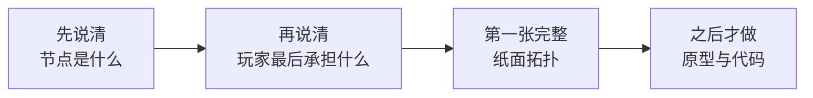

# Start Here

> 这是面向人的简化投影，不是新的项目权威或活动账本。若本摘要与权威项目记录或现场证据冲突，以权威记录和现场证据为准。

最后更新：2026-08-14

## 项目是什么

《掌眼》现在先专注做一件事：让玩家真正通过调查理解一件古董，而不是看几个平铺线索后猜真假。

器物从开局就有固定真相和价值。玩家不断获得事实、形成中间判断、比较多个可能解释，并决定下一步查什么、花多少代价、什么时候已经知道得“七七八八”而可以停手。

## 现在在哪里

- V2 已冻结：它提供能运行、能回放的玩家试玩与数值底座；
- V3 已启动，但当前只是 **设计阶段**；
- 过去的用户原话、研究和过程资产已经带哈希迁入，不会再靠上下文记忆；
- 没有产品代码改动，也没有一张已批准的正式拓扑。

## 当前只做什么

现在只把两个根问题讲清：

1. 图中间的节点到底是什么？推荐答案是“可以被证据支持或反驳的鉴定主张”，但需要和用户确认；
2. 一局最后玩家要为哪种选择承担后果？只有终局明确，才能知道一次调查是否值得。

## 暂时不做什么

- 不同时设计五种拓扑；
- 不修改产品代码或概率公式；
- 不启动 NPC 深层认知、D20、说谎、议价或人物生成；
- 不做正式美术和最终作品集 PDF；
- 不把研究材料当成已经做成的成果。

## 需要记住的三件事

1. 真相不移动，移动的是玩家掌握的证据和相信程度；
2. 事实、鉴定主张、候选真相和经济结果不是同一种节点；
3. 先做成一张完整、可玩的简单拓扑，再谈五种拓扑和美术。

详细权威记录：[项目罗盘](../00-PROJECT-COMPASS.md) · [当前状态](../02-CURRENT-STATE.md) · [下一行动](../03-NEXT-ACTIONS.md) · [V3 设计证据包](../evidence/v3-design/README.md)
