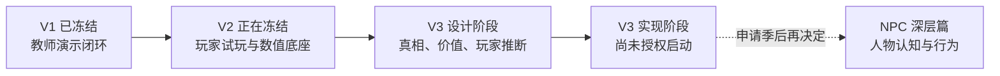

# Roadmap

> 这是面向人的简化投影，不是新的项目权威或活动账本。若本摘要与权威项目记录或现场证据冲突，以权威记录和现场证据为准。

最后更新：2026-08-14（V2 终态）

## 总路线

## V2 在路线中的作用

V2 解决“游戏能不能稳定地跑、记录、回放和结算”。它留下的不是最终玩法答案，而是一块可以安全重构的底板。

## V3 为什么仍从器物开始

玩家和 NPC 后续都要围绕同一件器物理解、合作与博弈。如果器物的客观真相、证据关系和价值后果还没有画清，双方认知与人物行为就没有可靠承载物。

V3 的依赖顺序仍是：

## 当前阶段

- V2：不再新增产品工程，只保留复验与必要维护；
- V3：先迁入设计证据，再决定节点语义、经济终局和第一种最简单拓扑；
- NPC 深层系统：不是删除，而是带触发条件停放；
- 五种拓扑、完成日期和产品实现仍需在 V3 形成可验证规格，不在这张路线图中假装已经批准。

权威来源：[V2 Current State](../02-CURRENT-STATE.md) · [V2 Next Actions](../03-NEXT-ACTIONS.md) · [DEC-015](../decisions/DEC-015-v2-freeze-and-v3-bootstrap.md)
