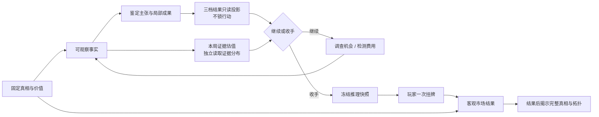

# Roadmap

> 这是面向人的简化投影，不是新的项目权威或活动账本。若本摘要与权威项目记录或现场证据冲突，以权威记录和现场证据为准。

最后更新：2026-08-21

## 总路线

## 当前阶段

当前位置是 **V3 Design / 玩家知识工作台微循环低保真设计**。

不是在决定器物身世，也不是在写正式产品代码、正式界面或美术。DEC-021 已固定客观真相；DEC-022 已确认第一切片让开放证据网汇合成三档结果，门禁只控制系统主张。限定领域复核触发的 v0.3 已把档案归属展开为关系推理并收窄检测能力，首轮独立 Fail 修复后取得独立 Pass；DEC-024 又记录用户批准它成为玩家微循环输入。现在只比较同一段内容的两至三个低保真表达分支。DEC-023 固定的真人测试、数值、整局、V2 审查与代码开工门全部保持。首案完整手工制作，程序化生成不构成当前承诺。

## 为什么仍不能直接画五种拓扑

语义与器物结构决定都不等于玩法成立。若未先固定客观真相，证据图就会反过来创造它想证明的答案；即使真相包固定，暂定阈值仍可能让阶段建立太早或太晚，多峰价值仍可能让玩家只追高值尾部。先用一件器物把这些问题逐层暴露出来，才能知道拓扑复杂度带来的是选择还是只有图面复杂度。

## 第一切片闭环

## 停放区

- 第二到第五种拓扑；
- 玩家知识图、迷雾／提示、面板与移动端交互的**正式执行**；当前只制作与产品实现隔离的微循环低保真表达分支；
- 程序化器物真相／证据语义／完整拓扑；只有不同手工案例和玩家证据出现后才可另批受约束实验；
- 正式美术、面向发布的文化／市场文案终校、最终 PDF；限定领域复核属于当前代码前主线，不在此停放；
- 公开托管、依赖安全升级和微信内实机。

## V3 外边界

- V2 的 NPC 认知、画像、关系状态、连续对话、D20、议价、人物评分和行为仲裁不进入 V3；
- V2 漆木盒内容、固定三真相、旧热点、似然、价格和卖家规则不作为第一器物默认。

权威来源：[当前状态](../02-CURRENT-STATE.md) · [下一行动](../03-NEXT-ACTIONS.md) · [DEC-017](../decisions/DEC-017-v3-stage-claims-stopping-and-fixed-price-listing.md) · [DEC-018](../decisions/DEC-018-v3-provisional-claim-thresholds-and-valuation-projection.md) · [DEC-019](../decisions/DEC-019-v3-evidence-rich-first-object-and-legacy-npc-exclusion.md) · [DEC-020](../decisions/DEC-020-v3-first-ceramic-object-and-core-dispute.md) · [DEC-021](../decisions/DEC-021-v3-first-ceramic-objective-truth-package-and-gameplay-first-authorship.md) · [DEC-022](../decisions/DEC-022-v3-first-ceramic-three-result-gates-over-branching-evidence.md) · [DEC-023](../decisions/DEC-023-v3-pre-product-validation-and-player-projection-boundary.md) · [DEC-024](../decisions/DEC-024-v3-first-ceramic-author-spec-approval-and-player-microcycle-entry.md) · [三档作者模型 v0.3](../evidence/v3-design/2026-08-21-first-ceramic-three-result-author-model-v0-3.md) · [确定性演算 v1](../evidence/v3-design/2026-08-21-first-ceramic-deterministic-author-scenarios-v1.md)
