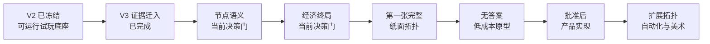
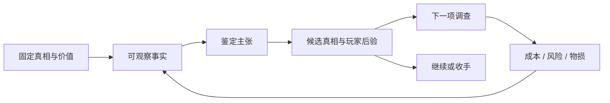

# Roadmap

> 这是面向人的简化投影，不是新的项目权威或活动账本。若本摘要与权威项目记录或现场证据冲突，以权威记录和现场证据为准。

最后更新：2026-08-14

## 总路线

## 当前阶段

当前位置是 **V3 Design / 节点语义与经济终局之前**。

不是在做代码，也不是在选美术。我们先确认：中间判断怎样连接事实与候选真相；玩家最后为什么需要在意继续调查还是收手。

## 为什么不能直接画五种拓扑

如果不知道节点代表什么，五张图只是五种线条；如果不知道局末要做什么，就无法判断哪条调查路径更有价值。先做一个完整问题，才能知道拓扑复杂度是否真的带来玩法，而不是只带来图面复杂度。

## 物品侧依赖

## 停放区

- NPC 深层认知、画像、连续对话、D20 和新议价；
- 第二到第五种拓扑；
- 正式美术、文化专家校订、最终 PDF；
- 公开托管、依赖安全升级和微信内实机。

权威来源：[当前状态](../02-CURRENT-STATE.md) · [下一行动](../03-NEXT-ACTIONS.md) · [DEC-016](../decisions/DEC-016-v3-design-stage-bootstrap.md)
