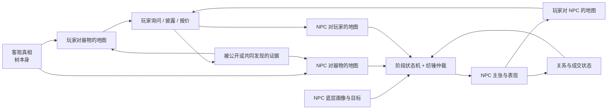

# Mental Model

> 这是面向人的简化投影，不是新的项目权威或活动账本。若本摘要与权威项目记录或现场证据冲突，以权威记录和现场证据为准。

最后更新：2026-08-14（V2 冻结时的领域模型）

## 核心比喻

把物品客观真相想成一棵真实存在的树。

- 玩家站在一侧，只能根据自己看到的剪影画地图；
- NPC 站在另一侧，开局可能已经看见某些枝干，也可能记错；
- 双方各有两张地图：怎样理解这棵树，也怎样理解站在树另一边的人；
- 双方可以共享一块剪影，但仍可能用不同方式解释它；公开这块剪影也可能暴露自己的专业度或意图；
- NPC 的性格和目标不改变树，却会改变它怎样理解玩家、愿意说什么以及下一步怎样行动。

## 五个方面

这里的“五个方面”是按因果依赖划分的开发责任区，不是五套孤立引擎。

| 责任区 | 人话解释 | 当前实现距离目标还有什么 |
|---|---|---|
| 1. 物品客观真相 | 树本身：真正发生过的事实 | 目前是三种真相和若干平铺线索，还不是证据拓扑 |
| 2. 玩家认知 | 玩家怎样理解器物，也怎样理解 NPC | 已有器物后验；人物表现与玩家明确提交尚未形成完整账本 |
| 3. NPC 认知 | NPC 怎样理解器物，也怎样理解玩家 | 已有器物后验；还没有命题知识账本或对玩家的结构化判断 |
| 4. NPC 底层画像 | NPC 相对稳定的能力、目标、风险态度与处境 | 只部分生效，且认知、性格和经济参数仍混在一起 |
| 5. NPC 局内状态与行为 | 此刻的关系、成交意愿、宏观阶段与具体回应 | 四状态和候选仲裁只是既有局部机制，不等于人物模型完成；连续人物因果仍较浅 |

五个责任区不是五套孤立引擎。它们可以共用证据格式、更新工具、置信表达、回放和审计；但每一方能看到什么、相信什么和最终怎样行动必须分开。

## 三个容易混用的词

- **器物双后验：** 玩家与 NPC 分别更新自己对器物的概率判断；
- **双向人物认知：** 玩家判断 NPC，NPC 也判断玩家；
- **双重双后验：** “双方都在辨物，也都在识人”的简称，不要求建立四台自动概率引擎。

双方结构并不完全对称：真人玩家的内心由玩家自己拥有，游戏只提供人物线索并记录玩家明确提交；NPC 是模拟角色，因此系统必须真正维护它对玩家的可错判断。

这张地图在 V2 只完成了边界澄清，没有全部写入产品。V3 将先处理树本身、证据路径和玩家怎样形成判断；NPC 深层认知与行为继续停放，直到器物侧形成完整可玩成果后再决定重开。

## 信息怎样流动

证据和对话是连接责任区的**信息通道**。客观真相不会直接跳进任何人的脑中；人物认知、信任或成交意愿也不能反过来修改客观真相。

## 容易混淆的地方

- NPC 的表现只能帮助玩家判断“这个人此刻可能怎样”，不能直接成为器物真假的暗号；
- “急着卖”是一种当前处境，不等于“性格急躁”；
- “更信任玩家”不等于“认为器物更便宜”，也不等于“现在更愿意成交”；
- 分享证据不等于双方自动达成一致；
- NPC 只能判断玩家已经表现出来的专业度、成交认真度和沟通策略，不能拥有一份系统定义的“玩家真实人格”；
- 纺锤负责在当前情境中选具体回应，不是把所有人物参数排列成一张巨大状态机。

统一词义见 [领域语境](../../../CONTEXT.md)。技术细节只在需要时继续阅读：[系统图](../01-SYSTEM-MAP.md) · [现行数值自然语言地图](../evidence/EXP-026-current-numeric-system-atlas.md)
