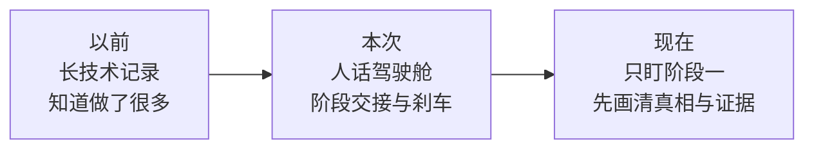
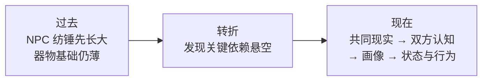

# Milestones

> 这是面向人的简化投影，不是新的项目权威或活动账本。若本摘要与权威项目记录或现场证据冲突，以权威记录和现场证据为准。

## 记录规则

- 只在阶段转换或方向发生实质变化时追加一张阶段卡；
- 不记录逐文件施工日志、测试明细、待办清单或当前工作负责人；
- 活动工作只写入 [当前状态](../02-CURRENT-STATE.md)，详细验证只写入 `evidence/`。

## 阶段卡

### 2026-08-12 · 从“看见大量数值问题”转为“沿五个方面逐层解决”

- **为什么做：** 现有技术记录能够证明做过什么，却不能让非开发者快速理解前后变化，也无法阻止讨论在许多有趣问题之间来回跳转。
- **之前：** 统一数值权威、玩家试玩版和自然语言数值盘点已经完成，但主线散落在长文档中；用户难以仅凭这些记录说明“现在到底在解决哪一层”。
- **现在：** Project Co-leader V2 采用人话优先、阶段交接和直接但可覆盖的追兔子刹车；掌眼有了四份宏观投影，当前唯一方向标记为“阶段一：漆器客观真相与证据拓扑”。
- **没有改变／尚未验证：** 本次没有修改产品代码、案例数值或玩家 HTML；漆器证据拓扑尚未设计或实现；自动前向测试只能检查 Skill 是否触发沟通协议，不能替代用户本人长期使用后的判断。
- **下一道交接门：** 在进入产品实施前，用简单语言和一张图说明“客观事实结构、可观察证据、证据之间的推理依赖”；如果没有讲清，就换比喻或实例继续解释，不把它做成对用户的考试。

### 2026-08-13 · 从“先丰富 NPC”转为“先建立共同现实，再逐层建立认知”

- **为什么做：** 围绕纺锤、说谎、洞察和议价的想法越来越丰富，但承载它们的器物真相、证据依赖与信息可见性仍是平铺结构；继续叠加人物参数会让系统悬空。
- **之前：** 主要从 NPC 如何发散、筛选和收敛回应理解游戏，容易把器物估值、人物认识、关系和成交意愿挤进同一条轴。
- **现在：** 五项被明确为依赖有序的开发责任区；玩家和 NPC 各有器物与人物两张地图；NPC 采用“小型阶段状态机＋连续状态＋认知／画像＋纺锤仲裁”的混合结构。产品影响决定以后先检查本地、原始来源和真实实践，再进入建议或规格。
- **没有改变／尚未验证：** 产品代码、案例数值和玩家 HTML 没有变化；漆器证据拓扑、双方人物认知、D20 和程序化 NPC 尚未实现；外部相邻架构只支持分类，不证明玩法有效。
- **下一道交接门：** 由于作品集文书内部目标是 `2026-10-20`，下一轮先讨论如何把完整游戏收敛为两个可完成部分；这张卡不提前规定拆分答案。

### 2026-08-14 · V2 停在稳定底座，V3 从物品真相设计重新起步

- **为什么做：** 作品集更需要一个边界清楚、能真正完成的项目，而不是把许多尚未落地的概念都堆进同一版本。
- **之前：** V2 同时背负玩家试玩、NPC 深层系统、证据拓扑、D20、议价和平衡等未来方向，容易把“讨论过”误读成“已经做成”。
- **现在：** V2 只认领已经运行和验证过的玩家试玩底座；真正的物品真相拓扑、玩家推断工作台和后期风险决策进入独立 V3 设计阶段，NPC 深层内容带触发条件停放。
- **没有改变／尚未验证：** 本次不改产品代码；V3 具体节点、经济终局、五种拓扑和 `2026-08-26` 完成定义仍未批准或实现；V2 自动验证不证明趣味、文化或视觉完成。
- **下一道交接门：** V3 先把迁入材料分成原话、研究、候选和决定，再共同确认“一个节点到底是什么、玩家最终承诺什么、第一种拓扑怎样构成完整一局”。

