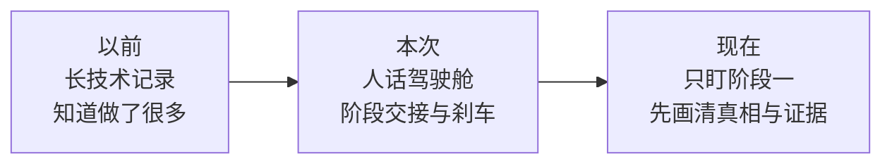
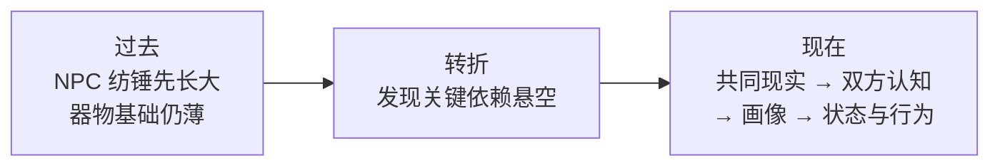
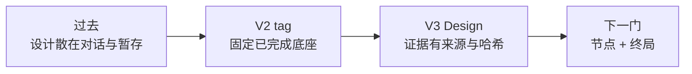
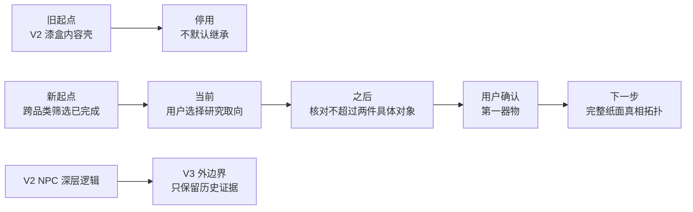
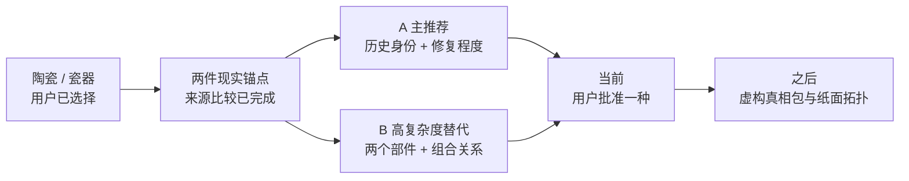
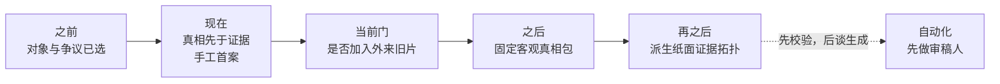
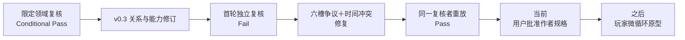

# Milestones

> 这是面向人的简化投影，不是新的项目权威或活动账本。若本摘要与权威项目记录或现场证据冲突，以权威记录和现场证据为准。

## 记录规则

- 只在阶段转换或方向发生实质变化时追加一张阶段卡；
- 不记录逐文件施工日志、测试明细、待办清单或当前工作负责人；
- 活动工作只写入 [当前状态](../02-CURRENT-STATE.md)，详细验证只写入 `../evidence/`。

## 阶段卡

### 2026-08-12 · 从“看见大量数值问题”转为“沿五个方面逐层解决”

- **为什么做：** 现有技术记录能够证明做过什么，却不能让非开发者快速理解前后变化，也无法阻止讨论在许多有趣问题之间来回跳转。
- **之前：** 统一数值权威、玩家试玩版和自然语言数值盘点已经完成，但主线散落在长文档中；用户难以仅凭这些记录说明“现在到底在解决哪一层”。
- **现在：** Project Co-leader V2 采用人话优先、阶段交接和直接但可覆盖的追兔子刹车；掌眼有了四份宏观投影，当前唯一方向标记为“阶段一：漆器客观真相与证据拓扑”。
- **没有改变／尚未验证：** 本次没有修改产品代码、案例数值或玩家 HTML；漆器证据拓扑尚未设计或实现；自动前向测试只能检查 Skill 是否触发沟通协议，不能替代用户本人长期使用后的判断。
- **下一道交接门：** 在进入产品实施前，用简单语言和一张图说明“客观事实结构、可观察证据、证据之间的推理依赖”；如果没有讲清，就换比喻或实例继续解释，不把它做成对用户的考试。

### 2026-08-13 · 从“先丰富 NPC”转为“先建立共同现实，再逐层建立认知”

- **为什么做：** 围绕纺锤、说谎、洞察和议价的想法越来越丰富，但承载它们的器物真相、证据依赖与信息可见性仍是平铺结构；继续叠加人物参数会让系统悬空。
- **之前：** 主要从 NPC 如何发散、筛选和收敛回应理解游戏，容易把器物估值、人物认识、关系和成交意愿挤进同一条轴。
- **现在：** 五项被明确为依赖有序的开发责任区；玩家和 NPC 各有器物与人物两张地图；NPC 采用“小型阶段状态机＋连续状态＋认知／画像＋纺锤仲裁”的混合结构。产品影响决定以后先检查本地、原始来源和真实实践，再进入建议或规格。
- **没有改变／尚未验证：** 产品代码、案例数值和玩家 HTML 没有变化；漆器证据拓扑、双方人物认知、D20 和程序化 NPC 尚未实现；外部相邻架构只支持分类，不证明玩法有效。
- **下一道交接门：** 由于作品集文书内部目标是 `2026-10-20`，下一轮先讨论如何把完整游戏收敛为两个可完成部分；这张卡不提前规定拆分答案。

### 2026-08-14 · V2 停在稳定底座，V3 从物品真相设计重新起步

- **为什么做：** 作品集更需要一个边界清楚、能真正完成的项目，而不是把许多尚未落地的概念都堆进同一版本。
- **之前：** V2 同时背负玩家试玩、NPC 深层系统、证据拓扑、D20、议价和平衡等未来方向，容易把“讨论过”误读成“已经做成”。
- **现在：** V2 只认领已经运行和验证过的玩家试玩底座；真正的物品真相拓扑、玩家推断工作台和后期风险决策进入独立 V3 设计阶段，NPC 深层内容带触发条件停放。
- **没有改变／尚未验证：** 本次不改产品代码；V3 具体节点、经济终局、五种拓扑和 `2026-08-26` 完成定义仍未批准或实现；V2 自动验证不证明趣味、文化或视觉完成。
- **下一道交接门：** V3 先把迁入材料分成原话、研究、候选和决定，再共同确认“一个节点到底是什么、玩家最终承诺什么、第一种拓扑怎样构成完整一局”。

### 2026-08-14 · V2 正式冻结，V3 从设计证据而不是上下文记忆起步

- **为什么做：** 具体设计已经超过 V2 的实现边界，继续放在聊天或外部暂存会混淆版本，也可能把研究草稿误当成完成成果。
- **之前：** V2 既承载已经跑通的试玩底座，也承载尚未实现的证据拓扑、玩家图、停止决策和 NPC 未来方向。
- **现在：** V2 由 commit＋annotated tag 精确冻结；V3 独立工作树只迁入原话、研究、批注图和新的项目权威记录，当前明确是 Design。
- **没有改变／尚未验证：** 产品代码为零差异；节点语义、经济终局、第一拓扑、UI、五种拓扑、自动化、美术、排期和玩家体验均未批准或实现。
- **下一道交接门：** 先用一个漆器例子讲清“事实—鉴定主张—候选真相”，再共同决定第一切片的经济终局；理解一致后才写第一纸面规格。

### 2026-08-14 · 从根语义讨论转入第一张完整纸面拓扑

- **为什么做：** 中间节点、停手和经济终局如果一直停留在例子里，无法判断概率、估值和调查成本能否共同形成完整一局；反过来直接写数值又会把项目默认误装成现实鉴定标准。
- **之前：** “节点 2／4”只是解释例子；鉴定主张是否正式采用、阶段成立是否结束、玩家怎样出售、系统估值和市场是否同一件事都未写成稳定决定。
- **现在：** DEC-017 固定鉴定主张、手动停手、冻结推理快照、玩家一次一口价挂牌、客观市场独立结算和结果后完整揭示；DEC-018 把证据依赖、阶段迟滞、后验价值混合和多峰投影登记为可回退 Experimental 默认，并明确拒绝阶段价格倍率。
- **保持不变／尚未验证：** 客观真相仍从开局固定，V2 产品代码没有修改，NPC 深层系统继续停放；具体阈值、价值摘要、情景可见线、挂牌节奏、趣味、公平和玩家理解均未通过第一拓扑、模拟或真人测试。
- **下一道交接门：** 用一件器物写出真相包、价值、依赖证据、阶段主张、替代／恢复、调查成本、停手和挂牌闭环，先做确定性场景演算，再由用户审查纸面规格；没有通过这道门就不批量画五种拓扑、不进入产品实现。

### 2026-08-14 · 从“默认拿第一漆器承载 V3”转为“跨品类选择第一器物”

- **为什么做：** 第一件器物不是题材包装，而是整套证据拓扑的承重结构；如果先继承 V2 的漆盒和人物壳，再往里塞节点，设计会继续被旧内容牵着走。
- **之前：** “第一漆器”仍是默认工作对象，V2 漆木首饰盒内容可能被误当成可直接复刻的起点，NPC 深层系统则以“暂时停放、以后再开”的方式留在 V3 边缘。
- **现在：** 第一器物改为跨品类筛选，以可形成多少个有依赖关系的检查域、阶段主张、替代／恢复路径、停手点和价值分支为主要标准；家族研究已留下陶瓷／瓷器、钱币和有条件的历史机械表三个下一轮方向。V2 漆盒内容壳和 NPC 认知、画像、关系、对话、D20、议价、评分与行为逻辑明确不进入 V3；漆器保持 Unknown，没有继承优先级。
- **保持不变／尚未验证：** DEC-017 的阶段主张、手动停手与经济终局，以及 DEC-018 的 Experimental 推理／估值政策没有改变；目前尚未选定第一器物，也没有写第一拓扑、改产品代码或验证可玩性。
- **下一道交接门：** 由用户先选择陶瓷／瓷器、钱币或历史机械表这一层研究取向；项目随后只核对不超过两件具体对象，再请用户确认最终器物及核心争议。通过后才进入完整纸面真相包。

### 2026-08-15 · 从“选择器物家族”转为“两种陶瓷证据结构二选一”

- **为什么做：** “陶瓷／瓷器资料很多”仍不能证明某一件器物能承载阶段成果、替代路线和同身份价值分叉；同时 V2 已经存在一只未做文化验证、与 NPC 和固定数值耦合的青花碗，必须避免旧案例借品类选择回流。
- **之前：** 家族筛选留下陶瓷／瓷器、钱币和有条件的历史机械表，具体对象、核心争议与素材条件全部 Unknown。
- **现在：** 用户选择陶瓷／瓷器；来源研究把候选限制为两种虚构类比结构。主推荐借 Smithsonian Hong Bowl 的公开修复史承载“老外销瓷基本成立、重组／补绘程度与价值未知”；高复杂度替代借 The Met Burghley House 双耳碗承载“晚明瓷体与早期银饰分别成立、组合关系未知”。馆藏品本身不被质疑，V2 青花碗内容与 NPC 逻辑继续 Reject。
- **保持不变／尚未验证：** DEC-017／018 的阶段、停手、三轨经济与 Experimental 数值政策没有改变；用户尚未批准最终器物或核心争议，也没有真相包、正式拓扑、价格／概率／成本、产品代码、专家复核或玩家验证。
- **下一道交接门：** 用户在 A 与 B 之间确认一种；项目随后只为所选虚构对象写第一张完整纸面规格，不再扩张第三件候选。

### 2026-08-15 · 从“两种陶瓷结构二选一”转为“固定第一器物真相包”

- **为什么做：** 对象结构决定证据链要围绕什么争议工作，但它还没有回答这只虚构器物客观上经历了什么；如果现在直接排调查节点，证据图会反过来创造它想证明的答案。
- **之前：** A 的多阶段修复史类比与 B 的复合器装配史类比都已有来源支持，研究推荐 A，但最终对象结构与核心争议仍由用户拥有。
- **现在：** 用户通过 DEC-020 选择 A，第一器物成为一件明确虚构的私人流通外销瓷大碗；核心争议固定为“18 世纪末中国外销瓷基本成立，但重组／补绘程度与价值仍不清楚”。Smithsonian Hong Bowl 只作对象史、证据域与开放素材锚点，馆藏品本身不被质疑。
- **保持不变／尚未验证：** “节点 2”仍只是解释例子；具体器物生平、原片、修复、补绘、来源、客观价值、事实卡、节点／边、概率、价格、成本、UI 和产品代码都未批准。DEC-017／018 的阶段、停手、三轨经济与 Experimental 数值边界没有改变；文化与玩法也未验证。
- **下一道交接门：** 先共同确认“客观真相包先于玩家证据路线”的顺序；确认后只固定虚构器物客观经历与价值成分，再从中派生第一张纸面证据拓扑。

### 2026-08-15 · 从“对象与争议已经选定”转为“手工打磨第一份客观真相包”

- **为什么做：** 真相拓扑不只是数据结构，也是游戏关卡；若为了未来自动化提前套用固定槽位，可能得到可生成但同质、浅薄或文化失真的案件。
- **之前：** 第一器物结构与核心争议已经批准，但“客观真相先于证据路线”的交接仍待确认，具体修复真相和自动化边界都未形成来源约束。
- **现在：** 用户确认先固定客观真相与价值成分，再派生玩家证据；首案作为手工关卡制作，自动化先做 schema、依赖、可达、反证／恢复、回放与路径审查，程序化真相／拓扑生成保持后期 `Unknown`。保护与市场研究已把真相拆成身份／制造、空间材料图、损伤／修复、装饰／补绘、稳定性、两条文档链与固定市场情景，并推荐“多阶段修复、无外来旧片”的首案候选。
- **保持不变／尚未验证：** 核心争议、手动停手、三轨经济与结果后揭示不变；具体虚构事实、证据拓扑、数值、产品代码、领域专家复核、趣味和玩家理解均未批准或验证。自动检查以后也只能证明限定结构性质，不能证明好玩。
- **下一道交接门：** 用户只决定首案是否混入来自另一只老器物的旧瓷片；关闭该分叉后，再逐项固定真相包，不提前画玩家路线。

### 2026-08-15 · 从“让用户选择器物个性”转为“作者以游戏性完成首案真相包”

- **为什么做：** 外来旧片、事故年代、修复材料与区域分布只有在改变玩家体验时才值得成为共同决策；把普通器物个性逐项交给用户，会把关卡作者责任误变成考据问卷。
- **之前：** 来源研究已经证明多阶段修复可以成立，但首案是否加入外来旧片仍待用户选择，客观真相包也只是候选。
- **现在：** 用户采用“无外来旧片”推荐，并明确现实可信只作护栏、器物个性由项目按游戏性处理。DEC-021 固定同器原片、多阶段修复以及正向／负向／转向发现并存的作者真相；高级检测不成为答案按钮。
- **保持不变／尚未验证：** 核心争议、阶段成果、手动停手、三轨经济、无 NPC 与程序化生成后期 Unknown 均不变；正式证据拓扑、成本、数值、路线、趣味、专家准确性和玩家理解仍未验证。
- **下一道交接门：** 确认下一张纸面拓扑主要验证“身份阶段成果之后是否值得继续补证”，而不是以最终真假反转制造高潮；确认后进入证据关系设计。

### 2026-08-15 · 从“固定器物真相”转为“第一张可审查的作者证据拓扑”

- **为什么做：** 真相包只说明客观发生了什么，还不能证明玩家能用普通证据先取得阶段成果、再对重组／原彩／稳定性作有代价的选择。
- **之前：** 同器原片、多阶段修复和正负向深挖已经固定，但正式事实卡、同源归组、主张证明、替代／恢复、行动与停手关系仍不存在。
- **当时记录：** 项目把“先挣得稳定但不完整的身份成果，再决定是否继续补证”进一步误解释成“只有身份成果是体验锚点，其余方向并列且不形成第二／第三档结果”，并据此形成 v0.1 Design Candidate；用户从未批准这个缩窄推论。
- **保持不变／尚未验证：** 没有产品代码、似然、价格、调查机会或检测费数值；拓扑尚未共同批准，路线非支配、阈值节奏、趣味、玩家理解和领域准确性都未验证。
- **后续纠正：** 这张卡记录的是 2026-08-15 当时的阶段解释；用户在 2026-08-16 明确指出“只有一个身份锚点＋后段并列深挖”过窄。该解释和直接进入场景演算的交接已由 DEC-022 替代，v0.1 只保留结构底稿。

### 2026-08-16 · 从“单身份锚点＋后段并列深挖”转为“开放证据网＋三档结论门”

- **为什么做：** 旧纸模把从混沌到平庸完整胜利压得过短，却把结果 2 之后的内容铺成漫长、缺少持续收束的深挖轴；它的客观假设也不能把“无重大重组”与“有重大重组但不是这组三阶段史”分开，因而无法形成“重大重组已成立、具体阶段仍未收敛”的 G2 认知状态。
- **之前：** v0.1 的事实分账、依赖处理与分轴已经较完整，但阶段层只有身份锚点；项目误把“拒绝固定调查顺序”推成“取消第一切片三档结果”，并准备直接进入场景演算。
- **现在：** DEC-022 固定第一陶瓷切片由开放证据网汇合成三档结果。结果 2 是身份与显著重组／补绘基本成立的平庸完整胜利；结果 3 需要多条证据链较硬汇合；早期后段证据可以先取得、后解释，门禁不锁行动。当前只修作者侧，玩家界面后续另开。
- **保持不变／尚未验证：** v0.1 的事实／Finding／主张／价值分账、联合后验、轴路由、替代／回退、手动停手和经济终局保留；三态修复史、12 包、三档 `proofRule`、局部成果、可达性、节奏、数值、玩家理解、UI 与代码仍是 Draft 或未验证。
- **下一道交接门：** 先把三档作者结果映射回可穷尽假设、主张和局部成果并通过独立结构复核；随后重写确定性场景演算。作者规格稳定后才开始玩家知识图与界面。

### 2026-08-20 · 从“作者候选直接接玩家侧”转为“代码前分层证据门”

- **为什么做：** 项目曾把用户用于解释概念的反证举例误写成固定案例；同时，作者结构、领域可信、玩家理解、数值与技术继承若直接混进产品实现，会让不同问题互相遮蔽。
- **之前：** v0.2 和负责人复核已经形成，但举例授权边界未被项目指令保护；独立复核之后只粗略写成“演算—共同审查—玩家侧—实现”，玩家图由谁整理、概率怎样露出、何时必须真人测试也未成为稳定方向。
- **现在：** 固定反证举例已从作者模型、复核记录、领域词义和状态投影撤回，只保留按对象、区域、时间、材料层和量词生效的抽象规则；`AGENTS.md` 明确“比如／比方说／举例”只有解释权，除非用户明确采用或授权写入。DEC-023 把正式产品代码前的顺序固定为独立结构复核、确定性演算、限定领域复核、用户批准作者规格、玩家微循环／真人测试、数值模拟、整局原型／真人测试、V2 技术审查和明确开工批准；玩家首轮投影采用系统整理、玩家确认，文字首层、粗数按需，常驻方向、提示按需加深。
- **保持不变／尚未验证：** 客观真相、12 包、G1—G3、手动停手、三轨经济、局末揭示、H5 路线和无 NPC 边界不变；独立结构、场景后果、领域准确性、玩家理解、趣味、Experimental 数值和技术继承都尚未通过对应证据门。隔离验证代码被允许，但不等于产品实现。
- **下一道交接门：** 临时只读复核者已经给出独立静态规格 Pass，唯一 Minor 文案漂移也由同一复核者复查关闭；当前冻结精确输入清单并执行确定性场景。没有场景证据不进入限定领域复核。

### 2026-08-20 · 从“静态规格成立、执行后果未知”转为“固定输入的结构后果独立 Pass”

- **为什么做：** 静态结构复核只能确认合同写得自洽，不能证明求解器在换序、恢复、反证和既往攻击路径下真的给出同一组预期后果。
- **之前：** 作者模型已经取得独立静态规格 Pass，但固定输入怎样执行、档案替代恢复是否被静默收紧、物理路线是否意外放宽仍属未知。
- **现在：** 确定性作者侧场景演算已经由同一只读复核任务独立重放并给出 Pass；固定夹具保持档案替代恢复，未放宽物理路线，并关闭既往攻击路径。
- **保持不变／尚未验证：** 这只证明固定夹具按批准合同产生预期结构后果；领域正确性、成本与路线非支配、玩家理解、趣味、平衡、UI、正式数值、架构和产品代码都没有因此成立，作者规格也尚未获得用户批准。
- **下一道交接门：** 限定领域复核是下一门，但尚未启动；先等待用户用自己的理解确认本阶段改变了什么、哪些面仍然没动。

### 2026-08-21 · 从“档案像隐藏归属键”转为“六槽关系推理通过独立复查”

- **为什么做：** 限定领域复核发现，记录内容真实并不等于记录属于当前器物；如果系统先替玩家筛掉归属问题，档案会变成剧透答案卡，检测能力也会越过区域、点位、材料层和陈列条件。
- **之前：** v0.2 的开放证据网与三档骨架已经成立，但档案对象连续性、T2／T3 多记录关系和四类领域能力仍写得过于粗；领域复核只能给 Conditional Pass。
- **现在：** v0.3 把 T2／T3 分别拆成记录内部、记录—现器、事件—物证六个关系槽；候选档案可以早拿并产生局部价值，G2 只是深档案注意力的软转折。关系状态只限制系统能否负责地下主张，不锁玩家行动、直觉、报价或停手。首轮独立复核发现五槽没有真正实现争议状态并给出 Fail；修复后同一只读复核者独立重算哈希、重跑 `40/40`，确认六槽冲突优先、时间冲突使 G3 回到 G2且纯物证 G2 不变，最终 Verdict 为 Pass。
- **保持不变／尚未验证：** 12 个核心对象包、G1—G3 含义、开放顺序、早拿后懂、手动停手、三轨经济、无 NPC 和局末揭示不变。独立 Pass 只验证冻结作者合同的结构后果；具名专家、实物可达性、成本／路线非支配、玩家理解、趣味、平衡、UI、正式数值、架构和产品代码仍未成立。
- **下一道交接门：** 用户批准这份作者侧完整体验与边界；未批准前不进入玩家知识工作台微循环。

### 2026-08-21 · 作者规格获批，责任区切换到玩家知识工作台微循环

- **为什么做：** 作者合同已经分别通过结构、确定性和限定领域检查；继续扩写作者侧不会回答玩家是否看得懂、是否仍在亲自判断，以及提示是否泄题。
- **之前：** v0.3 与具体一局已经取得独立 `40/40` Pass，但仍停在用户作者规格批准门，玩家侧只能保留方向，不能开始原型比较。
- **现在：** 用户通过 [DEC-024](../decisions/DEC-024-v3-first-ceramic-author-spec-approval-and-player-microcycle-entry.md) 批准当前冻结作者规格作为玩家微循环输入。当前用同一段内容制作两至三个低保真表达分支，比较事实、当前解释、开放问题、调查方向和按需粗概率怎样组织。
- **保持不变／尚未验证：** 冻结作者文件和哈希不改；这次批准不证明玩家理解、趣味、平衡、具体 UI、粗概率形式、真人测试合同、正式数值、架构或产品代码。
- **下一道交接门：** 先对齐微循环的真实玩家责任，再形成表达分支；只有分支清楚后才提交无答案真人测试合同。

### 2026-08-22—23 · 从“文字工作台”转为“渐进显影玩家地图”

- **为什么做：** 三个旧分支虽然线路可运行，却把事实、解释和行动堆成文字面板与 TODO 清单；玩家看不见自己走过的路径、证据怎样连接、哪里仍未知，也无法获得探索地图逐步清晰的体验。
- **之前：** DEC-025 已固定快照、焦点和最终判断责任，但具体表达仍沿用更新流、三域台和摘要＋关系图；“最强提示给问题、行动类别还是单项行动”没有决定。
- **现在：** 旧原型已删除并保留失败证据；项目级 UI／UX Skills 已按固定来源安装、核验并建立可退出 Git 检查点。用户逐项确认地点／两态道路／地标／足迹／罗盘、纯黑与显影、竞争路线、问题级探索前沿和逐级帮助；DEC-026 又确认最强按需层点名基于本局已知信息与成本计算的当前最优调查，而不读取隐藏真相或保证结果。
- **保持不变／尚未验证：** 作者完整图、G1—G3、开放调查、DEC-025 玩家责任、手动停手、三轨经济和产品代码开工门不变；新版低保真表达、粗概率、行动排序权重／并列规则、玩家理解、趣味、正式 UI 与代码都尚未成立。
- **下一道交接门：** 先对齐阶段地标成立时地图怎样汇合与重排，再制作隔离的新版地图微循环；原型清楚后才提交无答案真人测试合同。

