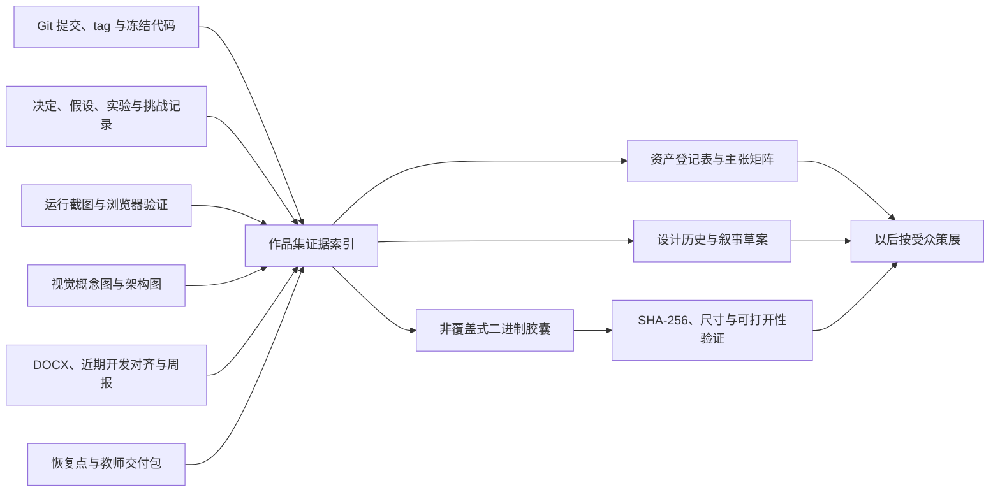
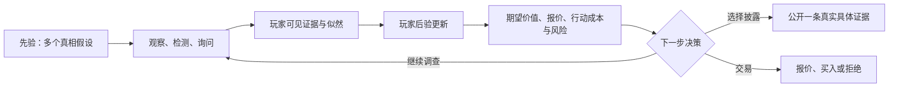
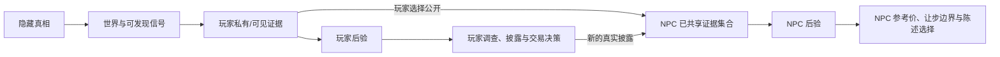

# 《掌眼》V1 基线与作品集原始证据保全设计

日期：2026-08-04

状态：Approved（2026-08-04 用户明确批准进入实施计划；同时增加“轻量保全、最终 PDF 成果导向”约束；尚未授权复制或打包）

工作流：`V2-PORTFOLIO-001`

## 1. 如何解释本次授权

本工作流位于 V2 第一项核心产品工程“统一数值权威源”之前。它不是开始制作最终作品集，也不是重做 V1，而是先保存未来作品集可能需要、且可能在 V2 重构后失去上下文的原始证据：

1. V1 冻结代码、正式运行界面、测试与交付基线；
2. 从低保真到高保真的设计与系统架构迭代；
3. 图片、流程图、设计稿、文字记录、恢复点和交付包；
4. 玩家后验、NPC 纺锤结构、NPC 后验、选择性披露、客观得失与判断质量分离等核心设计思想；
5. 每份材料能够支持什么主张、不能支持什么主张，以及来源、隐私、许可和当前权威身份。

只有用户明确批准本书面规格后，才编写可逐步执行的保全计划；计划形成后仍需用户明确批准计划或明确授权执行，才能复制、打包或生成衍生截图/预览。获批后的保全过程也只做非覆盖式复制、索引、哈希和可打开性验证，不修改产品代码，不移动 V1 Git 引用，不清理原工作区，也不公开发布任何材料。

## 2. 为什么必须在 V2 重构前做

V2 将统一生产数值权威并清理历史复制实现。即使重构正确，也可能使以下作品集证据变得难以理解：

- 旧字段、旧 UI 和旧架构为什么曾经存在；
- 玩家与 NPC 从共享或静态判断演化为各自更新后验的原因；
- 早期视觉方向如何被高保真教师演示取代；
- 数值实验、生产规则、调试投影和正式结算之间原本如何分工；
- 某张截图、某个流程图和某个决定属于哪个阶段。

因此当前先冻结“证据与语境”，不是冻结未来叙事。最终作品集仍需以后根据申请方向、受众和发布许可另行策展。

## 3. `history` 的实际含义

当前项目没有一个由 `project-co-leader-v2` 自动生成、可以替代 Git 的单一 `history` 文件夹。可用的历史由以下层共同组成：

- Git 提交、tag 与文件历史：实现演化和可追溯基线；
- `docs/project/decisions/`：为什么改变系统边界；
- `docs/project/hypotheses/`：当时尚未证实的设计假设；
- `docs/project/evidence/`：实验、实现和验证证据；
- `docs/project/challenges/`：被提出并解决的结构性问题；
- `docs/project/archive/`：被替代的项目记忆记录，不应直接承担全部作品集素材；
- 仓库外恢复点、交付包、原始文档和浏览器截图：二进制与交付实证。

本工作流会在这些来源之上建立作品集证据索引，但不会把索引误称为新的产品权威。

## 4. 备选保全方案

### A. 仅指针清单

只记录原文件路径、Git commit 和简短说明，不复制二进制资产。

优点是轻量、不会增加仓库体积；缺点是路径移动、同盘故障或后续清理都会令材料失效，也无法证明文件自登记后未变化。

### B. 可移植证据胶囊（推荐）

建立一个版本化的仓库内索引，再在仓库外建立非覆盖式二进制胶囊。索引保存历史、主张和权威关系；胶囊保存选定原件、源路径、哈希、打开验证和目录清单。

优点是兼顾可读性、可移植性和原件保护，能够在以后策展时追溯每项素材；缺点是需要进行来源/许可分类，并且当前若仍位于 `D:`，只能防止工作树变动，不能充当真正异盘容灾。

### C. 全量取证镜像

镜像所有掌眼相关目录、31 项原工作区资产、缓存、构建物和文档。

优点是理论上最完整；缺点是重复多、噪声大、隐私与许可风险高，且会把历史、缓存、实验与当前权威混在一起。它不适合作为首轮作品集证据保全。

### 已批准选择

采用轻量化 B：仓库内保存文本索引，仓库外只复制唯一、不可重建且高价值的原件与少量成果/验证图片。方案 A 不足以保护孤立二进制证据，方案 C 又会制造新的权威混乱。已有 Git bundle、正式交付包、恢复点和字节重复截图只登记并验证 master，不再次复制。是否再复制到真正独立于 `D:` 的位置，留作执行前的用户拥有字段；在该字段未解决时，保全结果必须标注“同盘副本，不是灾难恢复”。

## 5. 目标证据架构



仓库内拟保存可审阅的文本索引与历史；大体积原始二进制拟保存在仓库外胶囊。二者通过稳定资产 ID 与 SHA-256 相连。

## 6. 资产身份与登记字段

每项进入候选清单的材料必须先赋予身份，不能因为“看起来有用”就默认为可公开作品集资产。

### 6.1 身份类型

| 类型 | 含义 | 典型例子 |
|---|---|---|
| 冻结基线 | V1 最终事实与可运行基线 | `v1.0.0-teacher-handoff`、canonical 高保真 HTML |
| 当前生产证据 | 能证明 V1 当前规则或界面行为 | 规则代码、现行测试、最终浏览器截图 |
| 历史实现 | 曾可运行但已被替代 | 低保真 standalone、旧字段和旧结算 |
| 设计实验 | 用于回答假设，不能当作最终玩法 | 数值实验台、披露 framing 实验 |
| 过程证据 | 证明思考、取舍和开发演化 | 决定、假设、挑战、周报、近期开发对齐 |
| 视觉概念 | 表达方向，不证明已经实现 | 明亮新中式、暗色鉴定桌概念图 |
| 架构概念 | 描述当时模型，未必等于最终运行时 | 完整游玩流程 `.drawio` |
| 交付/验证证据 | 证明某个版本实际被检查或交付 | 浏览器截图、哈希清单、教师提交包 |
| 待分类材料 | 来源、许可、隐私或版本身份未知 | 原工作区 31 项中的未分类文件 |

### 6.2 资产登记表字段

每条记录至少包含：

- 稳定资产 ID；
- 原始绝对路径与相对来源；
- Git commit/tag 或文件时间，仅作为来源信息而非单独真实性证明；
- 文件名、类型、大小、尺寸/页数、SHA-256；
- 身份类型、所属迭代阶段与当前权威状态；
- 能支持的作品集主张；
- 不能支持或容易误读的主张；
- 生成者/来源、第三方素材、许可状态；
- 个人信息、内部信息与教师信息风险；
- 保全目的地、复制验证和可打开性结果；
- 一个存储终态：`private-master-copied`、`private-recovery-master-verified-in-place`、`duplicate-reference`、`rebuildable` 或 `withheld-in-place-risk-accepted`；
- 一个独立的使用状态：`private-only`、`portfolio-candidate`、`public-redacted` 或 `withheld`。

存储终态回答“材料丢失风险如何处置”，使用状态回答“材料可以如何展示”，两者不能混成一个字段。`portfolio-candidate` 表示值得以后策展，`public-redacted` 只指另建且通过脱敏/视觉检查的发布副本，`withheld` 表示许可、隐私或权威身份尚未通过。只有来源、许可、隐私和主张边界都通过的材料，未来才可以生成 `public-redacted`。本工作流不自动作出该提升。

### 6.3 逐项终态门

第 7 节枚举的每个来源面、原工作区全部 31 项资产，以及后续盘点新增的每项材料，都必须在关闭工作流前得到唯一存储终态和一个独立使用状态；不能只因“不进入公开作品集”而省略保全风险：

| 终态 | 可关闭条件 |
|---|---|
| `private-master-copied` | 非覆盖副本已写入批准目的地，源/目标哈希一致且可打开性通过 |
| `private-recovery-master-verified-in-place` | 已存在的私有恢复主件通过清单与恢复性检查；若仍仅在同一磁盘，残余风险被明确报告 |
| `duplicate-reference` | 与选定 master 的字节哈希一致，登记双方路径，不制造第二个 canonical |
| `rebuildable` | 有明确再生成来源与命令，且丢失不会破坏历史主张；缓存不能冒充 master |
| `withheld-in-place-risk-accepted` | 无法或不应复制时，记录原因、唯一位置和丢失风险，并获得用户对该具体风险的明确接受 |

`portfolio-candidate`、`public-redacted` 和 `withheld` 都只是使用状态，不能替代存储终态。任何条目没有上述终态，或只存在于未提交工作区且没有已验证 master，`V2-PORTFOLIO-001` 都不得关闭。

## 7. 需要保全的来源面

### 7.1 仓库与 Git

- V1 tag `v1.0.0-teacher-handoff` 与提交 `f0b20b8`；
- V2 起点 `d4ca037`，用于证明 V2 只增加治理表面、产品树仍与 V1 相同；
- 关键设计提交序列：初始低保真、规则切片、整合低保真、数值实验、双后验、二次实验、高保真对齐、高保真实现、判断质量修正、V1 教师封存；
- `docs/project/decisions/`、`hypotheses/`、`evidence/`、`challenges/`；
- V1 canonical 高保真、生产规则与测试；
- 历史低保真、数值实验台和生成链，只以历史/实验身份进入。

### 7.2 仓库内视觉与架构资产

- `.superpowers/sdd/2026-07-31-judgment-quality-scoring/` 中的桌面与移动端实际运行截图；
- `references/视觉方向_明亮新中式.png` 与 `references/视觉方向_暗色鉴定桌.png`；
- `references/掌眼_完整游玩流程.drawio`；
- 与这些资产相邻的 manifest、设计规格和实现证据。

两张视觉方向图属于早期概念，当前来源/许可尚未闭合；在许可明确前只能保全和内部比较，不能直接公开。`.drawio` 能证明架构思考，但其字段与链路需要按历史阶段解释，不能冒充最终运行时契约。

### 7.3 `D:\实习工作` 的仓库外来源

只读盘点至少覆盖：

- `D:\实习工作\掌眼\近期开发对齐\`；
- `D:\实习工作\掌眼\周报\` 下模板和各周材料；
- `D:\实习工作\掌眼_恢复点\2026-08-03-v1-preflight\`；
- `D:\实习工作\掌眼_交付包\2026-08-03-v1.0.0-teacher-handoff\`；
- `D:\实习工作\掌眼_交付包 - 副本\`；
- `D:\实习工作\掌眼_Codex启动包_v2.zip`；
- `D:\实习工作\掌眼_古玩小游戏初步策划说明.docx`；
- `D:\实习工作\第一次汇报7.15.docx`；
- `D:\实习工作\program\《掌眼》流程图.drawio`、对应 SVG 和内嵌可编辑源的 PNG；
- `D:\实习工作\周报\` 下与项目内成品不完全相同的第一周早期草稿；
- 原工作区 31 项未提交资产：不默认吸收为生产或公开作品集权威，但必须逐项绑定现有恢复 master 或在获批目的地建立 private master，并通过第 6.3 节终态门。

DOCX 只有在后续逐页提取并渲染核验后，才能承担具体内容主张；文件存在本身只能证明它是候选原始材料。现有 DOCX 已发现可见姓名、作者/修改者 metadata，以及部分 WPS `custom.xml` 中的设备或用户标识，因此原始 DOCX 和空白模板默认 `withheld`；未来只能在明确需要、完成脱敏、重新渲染并核验后生成单独发布副本，不能修改原件来“清理”。

`D:\实习工作\掌眼_交付包 - 副本\` 不是第二个 canonical 版本。其核心 bundle、源码包和教师包与正式交付包相同，但改名后的内层路径使原校验清单出现缺失，外层 ZIP 也不在正式清单中。它只能登记为重命名副本，不能被作品集叙述成新的发布版本或独立验证。

祖先目录盘点还确认了三个优先级很高、尚未进入外部旁置哈希清单的起源资产：早期策划 DOCX、第一次汇报 DOCX、`program` 中较晚的《掌眼》流程图可编辑源及导出。`掌眼_Codex启动包_v2.zip` 内部 manifest 当前 `27/27` 匹配，但 ZIP 自身尚无旁置哈希；它应作为“项目起始基线”，而不是当前实现副本。

正式 canonical 交付仍是 `D:\实习工作\掌眼_交付包\2026-08-03-v1.0.0-teacher-handoff`；本轮现场复核其清单 `8/8` 匹配。恢复点的最终制品 `26/26`、原工作区/overlay `31/31`、浏览器复制清单 `42/42` 也均无 mismatch。这些结果证明当前磁盘材料与既有清单一致，不等于已经建立新的作品集胶囊或异盘备份。

恢复点中的 `all-preserved-refs.bundle`、Git 管理原始 ZIP、未提交工作树 overlay ZIP、tracked patch、31 项清单和浏览器原始证据属于 `private-recovery-master` 层。它们不得进入公开附件，但必须在资产登记中保留路径、哈希、覆盖范围和恢复验证结果；“不公开”不等于“从保全范围排除”。Chrome QA profile、缓存和可再生成展开目录可以标为 `rebuildable` 或内部取证材料，但也需要明确终态。

## 8. 作品集叙事骨架

本工作流保存叙事原料，不把以下章节直接当作最终作品集文案。

### 8.1 要解决的问题

《掌眼》的核心问题不是让玩家猜 NPC 表情或做一次真假二选一，而是让玩家在行动成本、信息不对称和交易压力下，把模糊故事逐步转化为可核验的证据，并基于不断更新的不确定性采取行动。

候选主张需要由 Project Compass、早期策划、决定记录和实际运行证据共同支持。不能仅凭后来的总结倒推早期意图。

### 8.2 玩家如何在更新的后验中决策



作品集需要说明：后验不是装饰性百分比，而是玩家比较继续调查、公开证据、议价、买入或拒绝的共同状态。代码、测试和实验记录分别证明算法、信息边界与交互结果；任何一类证据都不能单独证明玩法已经完成长期平衡。

当前生产算法更准确的称呼是“三个有限假设上的朴素离散 Bayes-like 更新”：从各 `1/3` 的先验出发，对已去重的物证似然和结构化陈述置信度做乘积并归一。玩家后验的谨慎分位、报价、检测费和安全垫共同生成参考，不替玩家自动决策。它不是用真实古玩样本校准的完整贝叶斯网络，作品集不得声称参数具有统计学外部效度。

### 8.3 NPC 状态的“纺锤”结构


这套结构的设计价值是：输入可以丰富，规则核心仍保持有限、可复现；输出可以有表现力，却不会让 UI 文案直接决定 NPC 结果。最终 V1 把输入归并为 `pressure / trust / dealIntent / control` 四状态变化，再从 `cooperate / deflect / partial-admit / counter / refuse / exit` 六类有限候选中做硬条件过滤、分项评分和可复现 seed 近分扰动，最后收敛为有限回应、一次性 Storylet 和结构化陈述信号。

保全时必须同时保存早期流程图、状态模型文档、整合低保真实现与最终规则代码，以展示“发散—归并—再发散—收敛”的迭代，而不是只保存最终截图。边界也要诚实：V1 的 Storylet 仍是围绕对话主题硬编码的一次性机制，不是已经完成的通用数据驱动 Storylet 引擎。

### 8.4 为什么物品真相、玩家认知和 NPC 认知必须分层

早期系统若让 NPC 直接读取隐藏真相，NPC 报价就会泄露答案；若让玩家与 NPC 共用一个知识集合，玩家的私下调查会不合逻辑地立刻改变卖家判断。

最终边界应被叙述为：

- 隐藏真相决定真实世界，不直接成为玩家或 NPC 的可见知识；
- 玩家只用自己已发现的信号更新玩家后验；
- NPC 只用已经公开给它的证据更新 NPC 后验；
- 两者可以面对同一物品形成不同判断，并因此产生可解释的交易张力。

### 8.5 为什么 NPC 也升级为动态后验

静态 `beliefTruth` 只能表达“NPC 一开始相信什么”，不能表达玩家拿出新证据后 NPC 如何重新判断、重新报价以及为什么收敛。动态 NPC 后验把公开证据变成可检验的状态转移：同一组公开证据应得到同一分布，重复披露不得重复计权，私有证据不得影响 NPC。



最终生产实现从 NPC 私有信号与共享证据出发，根据 NPC 置信度和专业度更新后验；定价再读取分位数、期望值、风险厌恶、急迫度、外部选项和四状态派生立场。只有后验、主导假设、中位数或立场跨过事件门槛才正式重估，避免每个微小情绪变化都让报价抖动。

当前限制是 V1 只有一个生产 NPC；部分人格参数尚未全面进入行为解析。多人物对同一披露产生差异化反应，仍属于实验启发而非最终 V1 已证明能力。

### 8.6 选择性披露如何“说真话但引导真相方向”

最终 V1 不允许玩家捏造事实，也没有保留抽象的“正向/中性/负向 framing”按钮。玩家的策略空间来自：在已经发现的多条真实具体证据中，选择公开哪一条、何时公开、暂时保留哪一条。

因此影响链是：

1. 被选中的真实证据进入 NPC 的共享证据集合；
2. NPC 只基于该集合更新后验，而不是读取玩家仍保留的证据；
3. 不同的真实证据选择可以把 NPC 的注意力和概率质量推向不同解释；
4. NPC 后验变化进一步影响参考价、让步和陈述；
5. 选择与时机会形成策略，但玩家仍受“不撒谎”的硬边界约束。

历史实验中曾存在只改变关系、不改变事实或后验的 framing 分支。它可以作为被测试并收缩的设计路线保留，但作品集必须清楚标注：最终 V1 用“选择具体证据”替代了抽象 framing，不能把旧实验按钮写成当前功能。

最终实现实际有两条并行因果通道：事实通道把首次公开的证据 ID 写入共享账本，推动 NPC 后验与估值；行为通道把证据强度/相关性、语气和交互历史映射为四状态变化，再影响候选回应、承认、拒绝或离场。这样“说什么事实”和“以什么行为方式交涉”相关但不混成一个按钮。

“不故意说谎”目前由有限动作和内容模板保证，不是一个能验证任意未来自然语言真伪的通用语义检查器。保全材料不能把这个设计约束夸大成已实现的开放式事实核查系统。

### 8.7 客观结果与判断质量为什么分开

实际成交收益取决于隐藏真相、真实价值、价格和行动成本；判断质量则必须只读取玩家当时可见的信息，评价其决策是否合理、后验是否收束、证据链是否稳健。两者分开后，玩家可能因运气获得好结果但推理较差，也可能在不利世界中作出合理判断却没有盈利。

移动端结算截图中“客观净收益”与“判断质量/议价表现”并列，是该理念的视觉证据；判断质量规格、决定记录和测试是规则证据。作品集不得把综合等级表述成客观利润的简单同义词。

最终判断质量保留四个可解释分量：`D` 评价在当时可见后验下的选择合理性，`C` 评价后验熵带来的确定性，`R` 评价独立来源与推理维度覆盖，`J` 对前三者加权；证据结构上限防止一条普通强证据直接获得 SSS。隐藏真相只进入客观经营结果，不得反向污染判断质量。

## 9. 设计与实现迭代时间线

以下是拟固定的第一版骨架，执行时需要为每一节点补齐 commit、文件、截图和可支持主张：


时间线用于解释演化，不暗示每一步都是线性完成。若 Git、文档与截图对同一节点的时间或功能范围不一致，登记表应保留冲突而不是强行统一。

### 9.1 需要绑定的提交节点

| 提交 | 证据身份 | 作品集中的准确含义 |
|---|---|---|
| `60925ea` | 初始设计/低保真 | 把鉴宝从表情猜测转向证据与有成本承诺；当时边界尚未收敛到最终“不故意说谎” |
| `694eeeb` | 最小生产切片 | 确定性 `PlayerAction → ActionResult`、固定 seed、玩家/调试分离；尚非完整纺锤 |
| `4afd29a` | 整合低保真 | 从线性流程改成交叉调查，建立玩家离散后验、静态 NPC 认知隔离、完整纺锤和双层结算 |
| `bdd777b` | 数值实验 | 五档重尾价值、稳健分位报价与有限议价；实验参数不等于最终生产三假设 |
| `5fa3cab` | 设计决定 | 提出真相、玩家认知、NPC 认知、共享信息四层；该提交没有产品实现 |
| `f4e689d` | 双后验实验 | 自动代理与 NPC 重估；实验通过不等于真实玩家已经理解 |
| `ad32cd8` | 反馈/对齐记录 | 记录用户指出抽象 framing 不可读并推动收缩；部分记录的事件日期早于实际提交日期 |
| `61ef25d` / `318e4d6` | 生产规则/高保真 | 双后验、共享具体证据和动态定价进入规则与玩家界面 |
| `0fcbb89` → `f0b20b8` | 评分修正/冻结 | D/C/R/J、证据结构上限、最终教师验证和 V1 tag |

事件发生日期和记录进入 Git 的日期必须分别登记；不能为了制造顺滑时间线而把后补记录伪装成当日提交。

### 9.2 叙事主张与最小证据锚点

| 叙事主张 | 最小设计/实验记录 | 最小生产/验证锚点 | 不能据此声称 |
|---|---|---|---|
| 有限证据下的风险判断 | [Project Compass](../../project/00-PROJECT-COMPASS.md)、初始 kickoff | [EXP-002](../../project/evidence/EXP-002-minimum-rule-slice.md) | 一般玩家已经理解或玩法已经平衡 |
| NPC 纺锤 | 历史 `docs/02_NPC_STATE_MODEL.md` | [EXP-005](../../project/evidence/EXP-005-integrated-loop-and-debug-report.md)、V1 `resolve-action.ts` 与 rules tests | 已有通用 Storylet 引擎 |
| 真相与认知分层 | [DEC-005](../../project/decisions/DEC-005-separate-object-truth-and-npc-belief.md) | 私有调查不改变 NPC 的规则测试 | NPC 知道真实答案 |
| 玩家/NPC 双后验 | [DEC-007](../../project/decisions/DEC-007-dual-belief-and-strategic-disclosure.md)、[HYP-004](../../project/hypotheses/HYP-004-dual-posterior-disclosure.md) | [EXP-007](../../project/evidence/EXP-007-dual-posterior-disclosure-lab.md)、V1 后验与同可见历史测试 | 似然已经由真实数据校准 |
| 具体证据选择性披露 | [CH-002](../../project/challenges/resolved/CH-002-settlement-bargaining-and-disclosure-alignment.md)、[EXP-009](../../project/evidence/EXP-009-first-player-alignment-review.md) | [EXP-012](../../project/evidence/EXP-012-high-fidelity-teacher-demo.md)、最终 action 不含 `disclosureFrame` 的规则测试 | V1 仍有抽象 framing 按钮或开放式谎言识别 |
| 客观结果与判断质量分离 | [DEC-004](../../project/decisions/DEC-004-objective-outcome-and-judgment.md)、判断质量规格 | [EXP-013](../../project/evidence/EXP-013-judgment-quality-scoring.md)、结算截图 | 综合评分等于利润，或权重已长期平衡 |
| V1 冻结与教师演示 | V1 handoff 规格/计划 | [EXP-015](../../project/evidence/EXP-015-v1-teacher-handoff.md)、tag、正式交付清单 | 已公开部署、微信/Safari/所有视口已验证 |

上述生产锚点必须在登记时绑定 `f0b20b8` 或更早明确提交；V2 后续代码不能静默替换 V1 证据。`81/81` 是 `EXP-015` 的冻结前历史门禁，本轮没有重跑，也不应被写成作品集保全的当前测试结果。

## 10. 图片与视觉证据策略

### 10.1 当前最强的运行证据

- 判断质量实验桌面图：`.superpowers/sdd/2026-07-31-judgment-quality-scoring/desktop-single-evidence-review.png`，能同时展示单证据 `B` 结果和开发诊断 `D=100 / C=32 / R=50 / J=73`；只能标注为开发/诊断视图；
- 同一实验移动端图：`.superpowers/sdd/2026-07-31-judgment-quality-scoring/mobile-single-evidence-review.png`，不显示开发诊断栏，适合与桌面图组成“玩家信息边界”对照；
- V1 最终桌面交易状态：恢复点浏览器证据 `page-2026-08-03T10-52-22-136Z.png`，展示 `50 → 58` 还价、剩余议价容量和买下/拒绝动作；
- V1 最终移动端交易状态：`page-2026-08-03T10-55-27-470Z.png`，与桌面状态对应；
- V1 最终桌面结算：`page-2026-08-03T10-53-05-257Z.png`，展示价值 `65`、购入 `58`、净收益 `+7`、结果 `A` 与开发分项；
- V1 最终移动端结算：`page-2026-08-03T10-55-57-760Z.png`，展示相同终局但不泄露桌面开发信息。

这六张分别预留稳定 ID `IMG-DIAG-DESKTOP-01`、`IMG-DIAG-MOBILE-01`、`IMG-TRADE-DESKTOP-01`、`IMG-TRADE-MOBILE-01`、`IMG-RESULT-DESKTOP-01`、`IMG-RESULT-MOBILE-01`，构成第一批必检图片；实施计划只能补充，不能静默删减。每张都要记录尺寸、哈希、人工查看结果、支持主张和失败原因。

“必检”只代表私有证据必须能被确认，不代表六张都进入最终 PDF。默认 PDF 候选是四张最终高保真交易/结算图；两张诊断图只在需要证明判断质量模型或玩家/开发信息隔离时择一使用。

恢复点共有 20 个 PNG 文件，但分为两套字节相同的副本；实际只有 9 个不同视觉哈希。执行时使用顶层最终交付证据作为主副本，`original-playwright-cli` 只登记为重复来源，不在胶囊中制造第二份“独立证据”。截图本身不能证明控制台、溢出测量或交互可达性，这些主张仍需绑定 `EXP-015`。

### 10.2 方向探索证据

明亮新中式与暗色鉴定桌图适合展示视觉分支探索，不适合证明最终实现。未来若来源与许可无法确认，可以保留内部比较和文字总结，但不把图片放入公开作品集。

两图内嵌内容凭证声明它们由 OpenAI `gpt-image` 2.0 生成，但本次只读审查没有独立完成签名校验；仓库也没有记录生成账号、提示词、目标院校 AI 政策或发布许可。未来若使用，必须标注为“AI 辅助视觉方向探索”，不得表述为本人手绘、真实古玩/票据照片、已实现 UI 或经过文化真实性验证的最终视觉。

当前项目范围内也没有足以覆盖公开再分发的根级 `LICENSE`、`NOTICE`、`CREDITS` 或第三方资产表。文件存在于个人磁盘或 Git 中不构成公开许可；公开源码或完整资产包需另做许可审计，本工作流只保全私有证据。

### 10.3 架构证据

`.drawio` 应保留原始可编辑文件、静态导出图和文本化节点摘要。原文件是过程证据；未来为了作品集重绘的清晰图是衍生展示资产，两者必须分别登记，不能用重绘图覆盖原件。

该文件有“单局游玩流程”和“长期留存与成长循环”两页，并包含 Storylet、长期成长和留存等超出 V1 已实现范围的探索。它适合证明早期系统思考，但不能被标注为已发布架构。

### 10.4 当前视觉证据缺口

现有文件中没有历史低保真原型和数值实验台的独立截图。若以后要构成连续的“低保真 → 数值实验 → 高保真”视觉叙事，需要从冻结源进行不改变源文件的捕获，但捕获会创建衍生图片，因此只有实施计划与执行得到明确授权后才能进行，并要记录 commit、seed、场景和视口；在捕获完成前，规格不得声称这两类图片已经存在。

经学校官方作品集要求核实，本次轻量保全不把新增低保真/数值实验台截图列为完成条件。Git commit、冻结源码、实验记录和一张系统演化图足以保存其历史身份；只有未来某个具体 PDF 页面必须用视觉对照证明关键取舍时，才另行批准捕获。

### 10.5 最终学校 PDF 的策展边界

[EXP-017](../../project/evidence/EXP-017-portfolio-curation-guidance-review.md) 核实了 PolyU BA 2026/27、PolyU MDes 2027、UAL 与 RISD 的当前官方指导。共同结论是：最终提交应精选最佳/最成熟的成果，以少量过程证明概念发展、问题求解和个人能力，而不是把完整开发日志排进 PDF。

因此掌眼的最终 Figma→PDF 默认采用成果导向结构：

1. 最终高保真核心循环与结算成果作为视觉锚点；
2. 问题定义与个人角色；
3. 一张系统演化图说明 NPC 纺锤与双后验；
4. 选择 2—3 个真正改变方案的设计/实现决定；
5. 最终验证、局限与反思。

原始 debug、连续中间切片、周报和恢复材料默认不进入正文。它们只有在能够证明关键失败如何收敛、独特实现能力或个人贡献时，才从私有索引中择一提升。最终页数、语言、文件大小和项目数量仍必须等待目标院校/项目/年份确认后重新核实。

## 11. 拟议胶囊结构

实际目录只在用户明确批准书面规格、随后明确批准实施计划或授权执行后创建。建议使用四层轻量结构：

```text
v1-portfolio-evidence-capsule/
  00-README.md
  index/
  selected-originals/
  selected-visuals/
  checksums/
```

`index/` 保存资产登记、主张矩阵、设计历史、策展建议与验证报告；`selected-originals/` 只保存缺少等价已验证 master 的高价值孤立原件；`selected-visuals/` 只保存六张必检图片及经计划明确批准的少量展示导出；`checksums/` 保存新胶囊清单。已有恢复点、bundle、教师交付包、仓库内 AI 概念图、已有恢复 master 的周报副本和重复浏览器截图不再镜像，只在 index 中指向已验证 master。`D:\实习工作\周报` 下三份没有等价恢复 master、彼此非字节重复的早期稿可以作为小型私有原件保全，但保持 `withheld`，不自动成为 PDF 候选。

这里的文本树只是目录提案，不承担复杂关系说明。同名文件不覆盖，而是通过稳定 ID 或来源后缀区分。

仓库内建议以后新增 `docs/portfolio/v1-evidence/`，只保存小型文本登记、历史索引和可审阅叙事；是否把二进制复制进 Git 需在实施计划中按体积和许可逐项判断。

## 12. 非覆盖式执行与验证

### 12.1 执行规则

- 没有用户对实施计划或执行的明确授权，不运行任何复制、打包、截图、预览或外部写入命令；
- 先登记源路径与源哈希，再复制；
- 目标目录必须是新目录，若已存在则停止，不做覆盖式合并；
- 不修改、移动、重命名或清理任何源文件；
- 不执行会重写 `public`、`dist` 或 standalone 的生成命令；
- 原工作区 31 项不进入生产权威，但必须逐项完成第 6.3 节的私有保全终态；
- 不把恢复点、交付包副本数量当作独立容灾证明；
- 不把含姓名、作者、WPS 设备或用户标识的原始 DOCX 放入公开候选目录；
- 不把恢复点中的 Chrome QA profile、缓存、`.git`、bundle、patch 或完整内部历史放入公开作品集附件；bundle、patch、overlay 和清单仍属于必须登记和验证的私有恢复层；
- 不上传、推送、部署或发送外部平台。

### 12.2 完成证据

本节是 `V2-PORTFOLIO-001` 唯一 canonical 完成标准；`03-NEXT-ACTIONS.md` 只引用本节，不另设较短版本。保全执行完成至少需要：

1. **覆盖与终态**：第 7 节每个来源、原工作区全部 31 项、实施中新发现的每项材料都进入登记表，具有稳定 ID、master、阶段、主张边界和第 6.3 节唯一终态；未处置条目数必须为 0；
2. **复制一致性**：所有 `private-master-copied` 的源/目标逐文件 SHA-256 一致，文件总数、总字节数、重复关系与失败清单可复核；
3. **重复与既有 master**：所有 `duplicate-reference` 指向字节相同的唯一 master；所有 `private-recovery-master-verified-in-place` 记录覆盖范围和同盘残余风险；
4. **图片必检集**：第 10.1 节六个稳定 ID、两张 AI 视觉方向图，以及所有新增 `portfolio-candidate` 图片均能读取尺寸并逐张人工打开；每张有 `PASS / FAIL / WITHHELD`、观察内容、主张限制和审查人，任一无法打开不得静默跳过；
5. **架构必检集**：旧 `references/掌眼_完整游玩流程.drawio` 与较晚的 `program/《掌眼》流程图.drawio` 分别登记为 `ARCH-EARLY-01`、`ARCH-LATE-01`；两者 XML 必须可解析并记录页数/节点摘要。`ARCH-LATE-01` 复用其现有 SVG 与内嵌可编辑源的 PNG 逐张人工查看；`ARCH-EARLY-01` 当前只承担历史结构主张，不把新生成预览列为本轮完成门。只有未来具体 PDF 页面选中该早期架构时，才另行批准制作并检查不覆盖原件的展示级衍生图；`.bkp` 仅能是重复引用；
6. **文档必检集**：早期策划 `DOC-PITCH-01`、第一次汇报 `DOC-REPORT-01`，以及每份非字节重复的周报/总结均有独立 ID；任何被用于具体内容主张的 DOCX/PDF 必须记录渲染器与版本、源页数、PNG 输出页数，要求页数大于 0 且二者相等，并逐页记录 `PASS / FAIL / WITHHELD`。`PAGES 0`、乱码、缺页或只执行命令未查看页面一律失败；原始含隐私 DOCX 继续是 private master，公开只能另建并复核脱敏副本；
7. **HTML 身份与打开性**：V1 canonical、历史低保真和数值实验台均绑定明确 commit/tag 与身份；在不重建源文件的前提下离线打开并记录结果。只有真实交互复跑才能支持行为主张，单纯打开不能替代流程验证；
8. **Git 与归档恢复性**：重新核对 commit、annotated tag、产品 tree；对保全 Git bundle 执行 `git bundle verify`；对 ZIP/归档执行 CRC/完整列举检查；把未提交 overlay 在新建的临时目录中非破坏性展开并按清单复核全部 31 项。哈希正确但不能列举、验证或恢复时不得声称可恢复；
9. **许可与隐私**：许可、隐私、AI 来源或版本身份未知的材料保持 `withheld`/private；任何 `public-redacted` 都有单独来源/许可记录、脱敏 diff 和视觉/逐页复核；
10. **保留表面**：产品代码、V1 tag/worktree、原工作区 31 项源文件、正式交付包和恢复点均无改动；
11. **项目检查**：`git diff --check`、相对链接检查与项目记忆结构检查通过，并保存实际命令、退出码和执行时间；
12. **失败诚实性**：所有失败、未知与未验证面保留在登记和交接中；不得删项、改基线或降低标准来取得通过。

仅有“复制命令退出 0”不能算完成。工作流可支持两种不同声明：

- 若只有经验证的同盘胶囊：只能声明“V1 作品集语境与本地抗工作树变动保全完成”，并明确 `D:` 单盘故障仍会同时丢失源与副本；
- 只有真正独立于 `D:` 的第二位置也完成逐项哈希/打开性验证，才可以声明“独立恢复副本完成”。

若用户选择不提供独立位置，可在接受残余风险后关闭作品集语境保全，但不得声称异盘容灾完成。

## 13. 明确非目标

- 不制作最终作品集页面、Figma 文件、PPT 或申请文案；
- 不决定最终申请项目、受众、篇幅或视觉皮肤；
- 不修改 V1 产品、数值、界面、测试或构建；
- 不修复历史低保真生成器；
- 不把旧设计包装成最终实现；
- 不替来源不明的图片补造许可；
- 不处理长期玩法平衡；
- 不启动已经获批的统一数值权威源工程。

## 14. 延后但必须保留的验证问题

用户要求记录但近期不处理：**在自动测试中衡量玩家实际客观收益与结算页面评分之间的关系，并寻找一个既不把评分退化为利润、又不让两者完全脱节的平衡点。**

触发条件：统一数值权威源完成，结算模型与评分维度稳定之后；进入 V2 正式数值平衡或下一次对外发布之前。

到触发时，这将是 Critical 级游戏平衡验证，需另行披露并确认：

- 玩家实际客观收益的定义与随机种子范围；
- 结算页各分项和综合评分的版本；
- 允许相关、期望相关与必须独立的维度；
- 固定案例、批量随机样本、阈值与漂移规则；
- 何种“高收益低评分”或“低收益高评分”是设计允许，何种是系统失真；
- 自动测试看不到的理解、乐趣与公平性感受。

在这些字段得到用户批准前，不预设相关系数、权重或通过阈值，也不把现有 `81/81` 测试当作平衡证据。

## 15. 已解决与仍未解决

### 已解决

- 本轮先保全 V1 证据，再开始 V2 数值工程；
- 规格已获批准，采用“轻量文本索引 + 少量高价值原件/成果图”的非覆盖式胶囊；
- 私有证据保全与最终学校 PDF 分开，最终 PDF 采用成果导向、关键过程精选的策展原则；
- 原始证据、历史实验、当前事实和未来公开素材必须分层；
- 选择性披露按最终 V1 的“选择具体真实证据”叙述，旧 framing 只作为历史实验；
- 客观收益与结算评分关系被登记为延后验证，不在近期实施。

### 仍需用户或后续证据解决

- 胶囊的最终绝对路径，以及是否提供真正独立于 `D:` 的第二位置；
- 视觉概念图和外部文档的作者、许可与隐私边界；
- 原工作区 31 项中哪些材料除私有恢复 master 外还值得提升为 `portfolio-candidate`；
- 最终作品集的受众、叙事重点、展示媒介和公开范围。

这些未决项不会阻止实施计划编写；其中“目的地”、逐项处置表和任何外部写入都必须在计划中明确，并在执行前获得用户明确授权。

## 16. 审阅后的下一步

1. 根据已批准规格与轻量策展约束，用 `writing-plans` 编写逐步实施计划；
2. 用户明确批准实施计划或明确授权执行后，先建登记与哈希基线，再做非覆盖式复制或生成衍生文件；
3. 按第 12.2 节完成逐项终态、视觉、文档、归档恢复性、哈希和 Git 身份验证，形成可审计交接；
4. 只有未处置项为 0、完成声明与同盘/异盘证据相符时才能关闭 `V2-PORTFOLIO-001`；
5. 关闭后先完成已登记的同类框架/社区方案只读调研，再为已经获批的 V2 第一项核心产品工程“统一数值权威源”选择实施架构。
