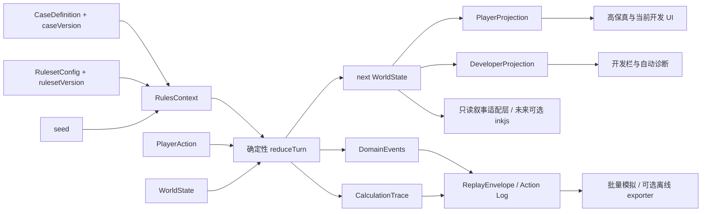

# 《掌眼》V2 统一数值权威源设计

日期：2026-08-10

状态：Approved（2026-08-10 用户明确批准本书面规格；尚未授权修改产品代码）

工作流：`V2-NUMERIC-AUTHORITY-DESIGN-001`

## 1. 本次授权如何解释

用户已经批准基于 `EXP-019` 的推荐方向继续：保留现有确定性规则骨架，采用“内部确定性规则核 + 可替换适配层”，第一阶段不引入新的游戏、叙事、AI 或概率框架依赖。

本规格把该方向固化为可审阅的系统边界。它不代表产品重构已经开始，也不代表任何参数已经平衡。只有用户复核并批准本书面规格后，才编写逐任务实施计划；实施计划再次获准后，才能修改产品代码、测试或生成物。

本轮不执行 `generate-standalone.mjs`、构建、完整测试或任何会改写 `public/`、`dist/` 的命令，不安装依赖，不修改 V1 tag/worktree，不 stage、commit、push 或部署。

## 2. 要解决的问题

当前首案已经拥有可运行的双后验、NPC 纺锤仲裁、议价、结算和回放，但同一概念仍散落在不同身份的表面：

- `content/lacquer-box.ts` 保存首案生产配置；
- `game/resolve-action.ts` 同时承担随机、后验、NPC 状态、行为仲裁、Storylet、定价、动作合法性和结算编排；
- `negotiation.ts`、`judgment-quality.ts`、`outcome-grades.ts` 已经是局部权威模块；
- `hifi/presentation.ts` 是玩家显示投影，但 `HighFidelityApp.tsx` 仍复制等级顺序等值；
- 数值实验台使用独立实验模型，概念与生产规则相似但公式有意不同；
- 低保真 standalone 是历史复制实现，仍包含过期字段；
- 高保真单文件是生成产物，但尚未记录规则版本；
- 测试同时混有一致性契约、固定设计例证、实验模型和发布产物检查。

目标不是把所有数字塞进一个巨型配置文件，而是让每个数字和每条公式只有一个明确的生产拥有者，并让其他表面通过接口读取、投影、实验或验证。

## 3. 不改变的产品决定

本工程必须保持以下已经批准的规则语义：

1. 调查检测、询问、引用证据与对质共享只减不增的调查行动点；正式议价使用独立容量。
2. 物品客观真相、玩家认知、NPC 认知和共享信息彼此分层。
3. 物品真相只生成证据与局末客观结算；NPC 行为和接受条件不得读取隐藏真相。
4. 玩家与 NPC 都可以有限认知、真诚误判和选择性披露，但不能制造虚假物证。
5. 玩家通过选择公开哪条已持有的真实证据形成主要披露策略；表达方式只能影响注意、信任、关系或行为效用，不能改写证据似然或直接指定 NPC 结论。
6. 客观得失与判断质量分层；综合等级不能取代两者，也不能被既有回归测试误称为已平衡。
7. 固定 seed、行动日志、计算轨迹和回放必须继续可用。
8. UI、叙事和生成物不得成为规则结算权威。

## 4. 范围与非目标

### 本工程范围

- 建立规则集身份、版本和可序列化契约；
- 明确生产、显示、实验、调试、历史、测试和生成物的类型边界；
- 按职责拆分 `resolve-action.ts`，同时保留现有公共入口的兼容外观；
- 把后验、NPC 仲裁、披露/Storylet、议价、结算、随机与回放纳入单一规则核；
- 让 UI 只读取玩家投影或开发投影，不复制核心公式；
- 让高保真生成物可追溯到规则版本和源提交；
- 冻结危险的历史低保真生成路径；
- 建立分层测试证据和逐批回滚门。

### 明确不做

- 不调平所有参数，不证明游戏好玩；
- 不新增第二案件、长期经济、低中高级场或正式美术资产；
- 不接入 inkjs、boardgame.io、Yuka、OpenSpiel、LLM 或生产 API；
- 不把数值实验台直接提升为生产运行时；
- 不重写为事件溯源系统，不新增第二状态机；
- 不改变 V1 教师交付、V1 canonical HTML 或作品集证据胶囊；
- 不提前执行“客观收益与结算评分关系”的 Critical 平衡验证；
- 不部署或公开发布 H5。

## 5. 权威身份分类

任何数值、公式或派生结果必须属于且只属于下列身份之一：

| 身份 | 能做什么 | 不能做什么 | 当前/目标例子 |
|---|---|---|---|
| 生产规则权威 | 决定合法动作、状态转换、后验、NPC 行为、价格、资源和结算 | 从 UI、实验或历史文件反向读取规则 | `game/*` 规则模块与版本化 `RulesetConfig` |
| 案件内容权威 | 声明真相变体、证据、NPC 档案、Storylet 内容与首案参数 | 自行实现通用公式 | `content/lacquer-box.ts` |
| 显示投影 | 把规则状态投影为玩家可见或开发可见信息 | 修改状态、复制阈值公式、读取玩家无权看到的数据 | `hifi/presentation.ts` 与开发投影 |
| 实验模型 | 在隔离环境中探索参数、近似模型和策略 | 被生产 UI 或结算直接读取；被称为正式玩法 | 数值实验台 |
| 调试/计算轨迹 | 解释一次生产计算的输入、分项与输出 | 反向参与下一次计算，或在玩家区泄露隐藏真相 | `TurnRecord`、候选分项、公式日志 |
| 历史资产 | 保存旧实现与演化证据 | 继续生成、覆盖当前产物或被误认成生产权威 | 低保真 standalone 与 V1 canonical |
| 测试例证/夹具 | 固定输入输出，检测漂移、边界和不变量 | 反向决定生产参数；证明平衡或趣味 | 回放基线、固定数字例证 |
| 生成产物 | 可离线运行的编译/内联结果 | 手工维护规则；成为无法追溯的第二源码 | 高保真单文件、`dist/client` 副本 |

判定规则是：生产代码可以被测试和投影读取；实验、投影、历史、夹具和生成物均不得被生产规则读取。

## 6. 目标架构



`WorldState` 仍是当前局面的生产状态；`DomainEvents` 和 `CalculationTrace` 是一次转换的可审计输出。本工程不要求把状态改造成由事件日志即时重建的事件溯源系统。

### 6.1 规则身份与上下文

目标契约：

```ts
type RulesetIdentity = {
  rulesetId: "zhangyan-core";
  rulesetVersion: string;
  caseSchemaVersion: number;
};

type RulesContext = {
  identity: RulesetIdentity;
  rules: RulesetConfig;
  caseDefinition: CaseDefinition;
};
```

第一版规则版本采用明确的预发布版本字符串，例如 `2.0.0-alpha.1`。版本值不是玩法平衡结论，只用于拒绝无声漂移和追踪生成物。

`CaseDefinition` 增加稳定 `caseVersion`。保存/回放必须同时记录 `caseId`、`caseVersion`、`rulesetId`、`rulesetVersion`、`seed` 和动作列表。未知或不匹配的版本默认失败，不静默套用当前规则。

### 6.2 规则模块职责

最终边界采用少量有明确职责的模块，不追求“一函数一文件”：

| 目标模块 | 唯一职责 | 主要现有来源 |
|---|---|---|
| `game/ruleset.ts` | 规则身份、生产参数配置和默认规则集 | `resolve-action.ts` 顶层常量、已有规则模块参数 |
| `game/random.ts` | 仅由 seed、turn 和稳定 key 产生确定性扰动 | `seededUnit`、`jitter` |
| `game/belief.ts` | 证据似然、先验、玩家/NPC 后验、归一化与期望值 | `calculatePosterior`、`calculateNpcPosterior` |
| `game/disclosure.ts` | 披露合法性、共享证据、同源去重与 framing 社会效果 | 对话/证据动作处理 |
| `game/npc-decision.ts` | 候选生成、硬过滤、效用分项、稳定近分裁决和纺锤轨迹 | `BehaviorCandidate`、`SpindleTrace` 相关逻辑 |
| `game/storylets.ts` | 前置、效果、重复规则和结构化陈述信号 | 当前对话与触发 Storylet 逻辑 |
| `game/negotiation.ts` | 调查/议价分账、容量、报价历史和接受条件 | 已有模块与 `resolve-action.ts` 定价/交易片段 |
| `game/settlement.ts` | 客观收益、判断质量、等级组合的单一编排 | 已有判断/等级模块与结算组合 |
| `game/reducer.ts` | 校验动作、按固定顺序组合领域模块并返回转换结果 | `resolveTurn` 主流程 |
| `game/replay.ts` | 版本化回放信封、重放和确定性比较 | `replayActions` |
| `game/resolve-action.ts` | 迁移期兼容外观；不再持有独立公式 | 现有公共 API |

`types.ts` 在迁移期保留，避免一次性破坏所有消费者。只有当模块契约稳定后，才把规则输入、状态、事件、投影等类型按职责拆分；禁止为了目录整洁先做大范围类型搬家。

### 6.3 稳定公共入口

迁移期间保留以下外部行为：

- `createInitialWorldState(caseDefinition, seed?, truthVariantId?)`；
- `resolveTurn(caseDefinition, state, action)`；
- `replayActions(caseDefinition, seed, truthVariantId, actions)`；
- `WorldState`、`PlayerAction`、`PosteriorEntry`、`BehaviorCandidate`、`SpindleTrace`、`SettlementResult`。

内部新增 `reduceTurn(context, state, action): TransitionResult`，兼容入口负责绑定默认规则集。迁移完成前，不要求 UI 一次性改用新入口；完成后兼容入口仍可保留为薄外观，避免不必要的调用方震荡。

## 7. 关键领域语义

### 7.1 后验更新

- 玩家后验只读取玩家已发现的私有证据、共享证据和合法陈述信号。
- NPC 后验只读取 NPC 初始认知、NPC 私有事实、共享证据和合法信号。
- 隐藏 `truthVariantId` 不得进入 NPC 后验、NPC 定价、候选评分或判断质量。
- 似然必须为有限非负数；归一化总和必须在容差内等于 1。
- 同一 `sourceId` 重复出现时只计权一次；同一次回应的结构化信号与证据卡不能重复计权。
- 证据顺序不应改变同一集合的最终后验，除非规则明确声明时序效应；首阶段不引入该例外。

### 7.2 选择性披露与 framing

一次披露分成四条可审计通道：

1. `EvidencePayload`：不可改写的证据身份、来源、事实和似然；
2. `DisclosureSelection`：玩家从自己持有的证据中选择公开哪一条；
3. `FramingEffect`：表达方式对信任、压力、控制感、注意或候选效用的独立影响；
4. `NpcObservation -> NpcPosterior -> NpcDecision`：NPC 先根据实际可见信息更新认知，再生成和裁决行为。

非法披露包括：公开未持有证据、改写证据似然、让 framing 直接修改真相概率、让 NPC 读取未共享私有证据。它们必须失败关闭，不能只在 UI 隐藏。

### 7.3 NPC 纺锤结构

“发散”阶段只生成候选和分项，不选择结果；“收敛”阶段按固定顺序执行：

1. 生成候选；
2. 应用硬约束与资格过滤；
3. 计算后验、人物偏好、四状态、交易条件、历史与 seed 扰动分项；
4. 用稳定排序和明确近分规则选择；
5. 输出候选、过滤原因、分项、扰动、最终选择和收敛说明。

硬约束不能被高效用或随机扰动推翻。相同上下文、seed、turn 和稳定 key 必须得到同一选择。

### 7.4 定价、议价与结算

- NPC 主观估值来自其后验；关系状态主要影响让步、风险承担和接受条件，不改写物品事实。
- 调查 AP 与议价容量分别记账；报价不倒扣调查 AP。
- 价格历史和公开原因是规则输出，不由 UI 拼装公式。
- 客观收益读取隐藏真相、真实价值、支付与成本；判断质量只读取决策时可见信息。
- `D—SSS` 等级顺序、上限与组合规则由生产模块导出，UI 不再自建 `gradeOrder`。
- 参数依然可以是“工作参数”，但每项必须标记来源：已批准决定、暂定生产参数或待验证假设。

## 8. 投影、叙事与实验边界

### 玩家投影

只返回玩家当下有权看到的证据、定性 NPC 氛围、公开价格变化、可用动作和结算信息。局末前不得包含隐藏真相、精确 NPC 四状态或调试公式。

### 开发投影

可以读取完整状态和轨迹，但只能展示、导出或诊断，不能参与下一次规则结算。开发投影不是独立状态副本。

### 叙事适配

结构化 Storylet 结果先由规则核产生，文本层把它渲染成台词。未来即使引入 inkjs，也只能消费只读结构化输入并返回文本/内容引用；价格、后验、AP、状态和结算仍由规则核持有。

### 数值实验台

继续作为隔离实验资产，并在界面、代码注释和测试名称中标明“实验模型，不是生产规则”。如果以后需要比较生产规则，使用只读导出/适配器调用生产 API；不得复制生产公式到实验台后声称一致。

## 9. 生成物与历史资产

### 高保真单文件

高保真 HTML 继续由 TypeScript/React 构建和内联生成。V2 生成物必须嵌入机器可读但不影响玩家界面的 provenance：

- `rulesetId` 与 `rulesetVersion`；
- `caseId` 与 `caseVersion`；
- 源提交 SHA；
- 构建时间是否记录需保证可复现：默认不把实时钟写入需字节稳定的产物，若记录则进入外部 manifest。

生成物只能由构建生成，不手工修补核心逻辑。V1 canonical 和其已冻结哈希保持不变；V2 使用新的发布身份，不能覆盖 V1 交付契约。

### 低保真 standalone

现有 HTML 与 `standalone/client.js` 作为历史快照按字节保留。Phase 0 把 `generate-standalone.mjs` 改为失败关闭的归档入口：默认执行必须在写文件前终止，并解释它引用了不兼容的历史字段。若未来决定迁移低保真，只能通过另一个经批准的 V2 计划创建新生成链，不能原地恢复旧脚本为生产入口。

## 10. 分阶段迁移

### Phase 0：治理和身份门

1. 把产品子目录 `AGENTS.md` 的“低保真 UI 阶段”明确为历史说明，指向 V2 当前 ledger；保留有效产品约束。
2. 冻结低保真生成器，证明默认运行不会写入历史 HTML。
3. 写入权威身份说明和依赖方向约束。
4. 建立测试分类与当前规则行为基线夹具，但不改变运行结果。

停止条件：无法证明 V1/历史产物未变，或权威分类仍允许实验/历史反向进入生产。

### Phase 1：版本、契约与字符化基线

1. 增加规则集、案件和回放版本契约。
2. 建立覆盖三个真相变体、多个 seed、调查/披露/议价/买下/拒绝路径的基线语料。
3. 固定不变量：真相隔离、后验归一、同源幂等、AP/议价分账、seed 复现、结算分层。
4. 让现有公共 API 绑定默认规则集，行为保持一致。

停止条件：新增身份字段迫使旧回放静默改变，或无法解释基线差异。

### Phase 2：确定性基础与 belief

1. 提取随机工具，保持所有 key 和扰动结果不变。
2. 提取玩家/NPC 后验、似然和期望值。
3. 每一步用现有实现与新模块的差分/回放证据收口。

停止条件：任一批准路径的后验、价格或行为发生非预期漂移。

### Phase 3：披露、Storylet 与 NPC 仲裁

1. 明确 `EvidencePayload`、`DisclosureSelection`、`FramingEffect` 和 `NpcObservation`。
2. 提取 Storylet 前置/效果/重复与陈述信号。
3. 提取候选生成、硬过滤、分项效用和稳定裁决。
4. 保持现有 `SpindleTrace` 可解释输出。

停止条件：NPC 能读取隐藏真相/私有证据，framing 能直接改后验，或硬过滤可被分数推翻。

### Phase 4：定价、议价与结算编排

1. 合并 `resolve-action.ts` 与现有 `negotiation.ts` 的职责边界，不复制公式。
2. 把定价、报价、接受条件、价格历史与公开原因集中到生产模块。
3. 建立 `settlement.ts`，组合客观收益、判断质量和成果等级。
4. UI 改为导入生产等级顺序和只读投影，删除建议报价等无来源硬编码。

停止条件：客观收益与判断质量发生串线、UI 仍可改变规则、或交易终局出现死局。

### Phase 5：回放、投影和生成溯源

1. 完成版本化 `ReplayEnvelope` 与不匹配拒绝策略。
2. 分离玩家投影和开发投影。
3. 给 V2 高保真生成物增加 provenance，并建立 V2 发布身份。
4. 确认 V1 canonical、tag、教师五文件 allowlist 和胶囊哈希均未变化。

停止条件：相同信封不能稳定回放、玩家投影泄露隐藏信息，或 V1 产物被改写。

### Phase 6：收口与后续门

1. `resolve-action.ts` 只剩兼容编排或明确公共外观，不再持有孤立公式。
2. 删除迁移期重复实现，不删除历史证据。
3. 完成代码一致性验证和独立审查。
4. 另行决定是否进入参数平衡、真人试玩、inkjs 叙事 spike 或 OpenSpiel 离线建模。

Phase 6 完成只证明权威源统一与现有行为受控迁移，不证明平衡、趣味或一般玩家理解。

## 11. 验证证据分层

| 层级 | 回答的问题 | 典型证据 | 不能证明 |
|---|---|---|---|
| 代码一致性 | 重构是否保持契约、版本、回放和边界 | 单元、不变量、差分、回放、类型、lint、生成物 provenance | 数值平衡、好玩 |
| 设计例证 | 指定案例是否表达已批准规则 | 固定路径、固定 seed、三真相隔离、披露因果例证 | 普遍策略质量 |
| 批量平衡 | 多 seed/策略下是否有支配策略、死局或漂移 | 隔离模拟、分布、敏感性和反例 | 玩家能否理解、是否有趣 |
| 真人体验 | 玩家是否理解、能决策并感到反馈可信 | 任务观察、访谈、错误恢复、体验阈值 | 全量统计平衡 |

既有 `81/81` 只属于 V1 当时的代码与路径契约证据，不能自动升级为 V2 新鲜验证，也不能作为平衡结论。

Material 验证在计划中必须提前披露场景、基线、阈值、通过含义和盲点。后续“客观收益与结算评分关系”属于 Critical 平衡验证，等统一权威源和结算模型稳定后再由用户确认收益定义、评分版本、样本/种子、阈值、漂移规则和允许反例。

## 12. 回滚策略

- V1 代码级最终回滚点始终是 annotated tag `v1.0.0-teacher-handoff`；不移动、不重打、不覆盖。
- 每个 Phase 必须先记录起点 SHA、工作树状态、changed surface、preserved surface 和预期测试。
- 每个提取批次保持旧公共入口，先让新模块在相同输入下通过差分，再删除对应旧内部实现。
- 基线夹具属于测试证据，不是生产权威；只有已批准的有意行为变化才能更新，并要记录旧值、原因和批准来源。
- 未经用户明确授权不创建 Git commit；若后续获准提交，每个 Phase 使用独立、可回退提交，不混入原工作区或作品集资产。
- 回滚只撤销当前 Phase 的 V2 变更，不触碰 V1 worktree、原工作区 31 项、教师交付包或作品集 capsule。

## 13. 失败处理与不变量

规则核必须失败关闭并保持输入状态不变：

- 未知动作、非法证据引用、AP/议价容量不足、终局后继续行动；
- 非有限数值、负概率、无法归一化后验；
- 未知 `caseVersion` / `rulesetVersion` 或回放身份不匹配；
- Storylet 重复规则冲突；
- 投影请求超出玩家可见边界；
- 生成器 provenance 缺失或 V1/V2 发布身份冲突。

规则核不得依赖 `Date.now()`、`Math.random()`、DOM、网络、组件状态或全局可变单例。所有允许的随机性必须显式来自 seed、turn 和稳定 key。

## 14. 依赖策略

第一阶段依赖结论固定如下：

- 不安装 boardgame.io；借鉴纯 move、可序列化状态和日志回放原则。
- 不安装 Yuka；借鉴候选 evaluator、硬过滤和效用仲裁结构。
- 不安装 inkjs；只在规则接口稳定后作为只读叙事适配候选。
- 不把 OpenSpiel 嵌入 H5；只在后续独立离线平衡研究中考虑 exporter/spike。

若实施中发现内部规则核不能满足完成标准，必须停止并以新证据重开依赖决定，不能在某个 Phase 内顺手引入框架。

## 15. 完成标准

统一数值权威源只有在以下条件同时满足时才可声称“已实现”：

1. 每个生产数值与公式有唯一模块和来源身份；
2. UI、实验、历史、测试和生成物不再反向持有生产权威；
3. `resolveTurn/replayActions` 兼容骨架、seed、日志、轨迹和版本可复现；
4. 玩家/NPC 后验、选择性披露和 NPC 纺锤边界通过不变量与差分证据；
5. 定价、议价、客观收益、判断质量和等级没有职责串线；
6. 高保真 V2 生成物可追溯，历史低保真生成器失败关闭；
7. 代码一致性、设计例证、批量平衡和真人体验被明确分开；
8. V1 tag、canonical 教师演示、教师五文件发布契约、原工作区 31 项与作品集 capsule 保持不变；
9. 独立审查没有发现隐藏的第二权威源或未经批准的边界变化。

“已验证”的范围必须逐项写明。即使上述工程完成，也仍应把具体数值平衡、一般玩家理解、真实微信环境和最终作品集美学验收标记为未验证，直到各自证据门完成。

## 16. 实施计划必须回答的事项

用户批准本规格后，逐步实施计划必须进一步给出：

- 每个任务的精确文件、接口、测试名称和命令；
- Phase 0 三道门的红灯—绿灯顺序；
- 基线语料的具体路径、场景、seed 和快照字段；
- 每批模块提取的差分方法、回滚点和停止条件；
- 哪些测试命令会重写生成物，如何在执行前保护和比较 V1；
- 哪些提交仅在用户另行授权 Git 后才执行；
- 每个里程碑的作品集增量整理与备份提醒点。

## 17. 当前未决但不阻塞规格复核的事项

- V2 规则版本字符串的最终命名；
- `DomainEvents` 与现有 `TurnRecord` 是长期并存还是最终合并；
- V2 高保真发布 manifest 的文件名与公开托管白名单；
- 低保真历史生成器是长期保留失败关闭入口，还是以后移入明确 archive；
- 统一权威完成后先做真人任务流验证、批量平衡，还是叙事适配 spike。

这些字段不会改变当前核心架构。实施计划可以给出默认值和明确重开点；若其中任何选择会改变发布、依赖或产品体验边界，仍需用户单独批准。
